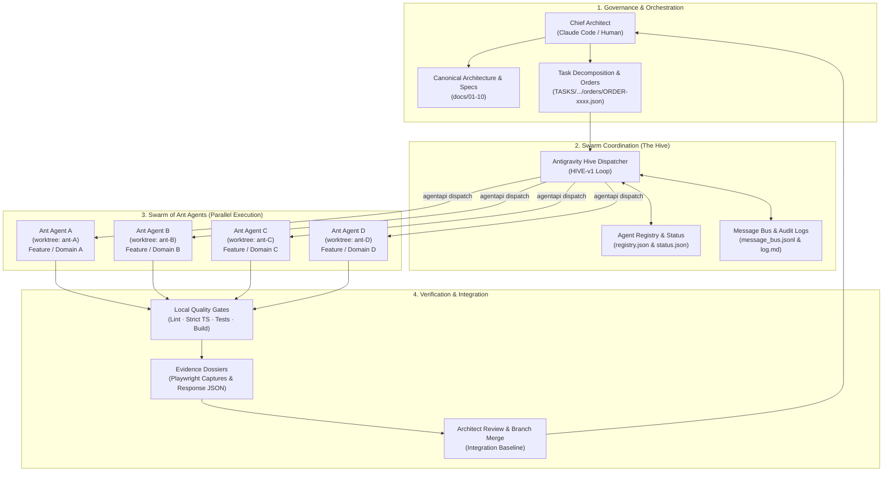

# MahaSkills — Labour-Market Intelligence & Curriculum Alignment Platform

**Government of Maharashtra**  
Department of Skills, Employment, Entrepreneurship and Innovation (DSEEI) / Maharashtra State Innovation Society (MSInS)  
**Problem Statement ID:** 26134  

---

## 1. Project Overview

MahaSkills creates an empirical feedback loop between live industrial demand and vocational curriculum design across Maharashtra's 36 districts and 417+ ITIs. The platform automatically aggregates multi-source labour market signals, algorithmically identifies localized skill-demand deficits, generates actionable curriculum revision proposals with evidence dossiers, and empowers prospective candidates with verified placement statistics.

* **Documentation Index:** [`docs/README.md`](docs/README.md)
* **Product Requirements:** [`docs/01-product/PRD.md`](docs/01-product/PRD.md)
* **Traceability Matrix:** [`docs/01-product/REQUIREMENTS_TRACEABILITY.md`](docs/01-product/REQUIREMENTS_TRACEABILITY.md)
* **API Specification:** [`docs/03-api/API_SPECIFICATION.md`](docs/03-api/API_SPECIFICATION.md) & [`docs/03-api/openapi.yaml`](docs/03-api/openapi.yaml)
* **Database Schema:** [`docs/02-architecture/DATABASE_SCHEMA.md`](docs/02-architecture/DATABASE_SCHEMA.md)
* **Agent Delivery Model:** [`docs/11-agent-delivery/README.md`](docs/11-agent-delivery/README.md) & [`AGENTS.md`](AGENTS.md)

---

## 2. Monorepo Structure

```text
.
├── docs/               # Canonical 10-domain connected documentation system
├── frontend/           # React 18 + TypeScript + Vite + Tailwind CSS + shadcn/ui
├── backend/            # Python 3.11 + FastAPI + SQLAlchemy 2.0 Async + Celery
├── pipelines/          # Apache Airflow Ingestion DAGs
├── scripts/            # Database initialization & taxonomy seeding scripts
├── TASKS/              # Autonomous task orchestration, order registries & audit trails
├── docker-compose.yml  # Local multi-container development environment
├── AGENTS.md           # Agent contract: rules, protocols, and golden path commands
└── .antigravity/       # Antigravity workspace rules, knowledge base & handoff workflow
```

---

## 3. Autonomous Delivery Model — Chief Architect & Swarm of Ant Agents

MahaSkills is engineered using an autonomous multi-agent engineering swarm. Architectural governance and quality gates are directed by a **Chief Architect**, while parallel implementation is executed by a **Swarm of Ant Agents** (Google Antigravity worker instances) operating concurrently in isolated Git worktrees.

### 3.1 Swarm Architecture & Topology



### 3.2 How the Ant Swarm Works

1. **Architectural Decomposition (Chief Architect)**  
   The Chief Architect translates canonical requirements from `docs/` into atomic, verifiable engineering tasks (`P00x`, `S00x`) and bundles them into structured orders (`ORDER-xxxx.json`). Each prompt declares explicit file boundaries, inputs, acceptance criteria, and expected verification evidence.

2. **Hive Dispatcher (`HIVE-v1`)**  
   The Antigravity Hive Dispatcher continuously monitors task orders, spawns subagent conversations via `agentapi`, manages concurrency caps (up to 4–6 parallel ants), tracks agent lifecycles in `registry.json`, and records immutable event streams in `log.md` and `message_bus.jsonl`.

3. **Isolated Parallel Worktrees (`_SWARM-v1`)**  
   To prevent Git lock contention and conflicting edits, each ant agent operates in a dedicated **Git worktree** (e.g., `mahaskills-ants/ant-B`) on an isolated branch (e.g., `ant/TASK-*-B`). Ants never edit the central working tree or another ant's folder.

4. **Conflict-Prevention Rules**  
   Parallel ants respect strict modularity boundaries:
   * **No Root Dependency Edits:** `package.json` and lockfiles are managed centrally.
   * **Isolated Localization Namespaces:** Each ant writes exclusively to its assigned i18n namespace file (`frontend/public/locales/{mr,hi,en}/<namespace>.json`) rather than touching shared translation files.
   * **Feature Route Fragments:** Routes are exported as modular route objects from feature directories (`features/<feature>/routes.tsx`) and integrated centrally.
   * **Dedicated Query Keys:** Server cache keys live within feature scopes (`features/<feature>/queryKeys.ts`).

5. **Local Quality Gates & Evidence Dossiers**  
   Before completing a task, every ant must execute and pass four mandatory local verification gates:
   * **Lint Gate:** `npm run lint` (ESLint)
   * **Typecheck Gate:** `npm run typecheck` (`tsc --noEmit` in strict mode)
   * **Test Gate:** `npm test` (Unit and contract test suite)
   * **Build Gate:** `npm run build` (Vite production bundle verification)
   * **Visual Proof:** Playwright browser captures and UI snapshot evidence.
   
   Results are compiled into a structured response JSON dossier. The Chief Architect inspects the evidence, runs regression suites, and merges the verified worktree branch into `main`.

---

## 4. Quickstart & Local Development

### Prerequisites
* Docker & Docker Compose
* Node.js $\ge 20$ & npm
* Python $\ge 3.11$

### Running with Docker Compose
```bash
# 1. Clone the repository and configure environment variables
cp .env.example .env

# 2. Start PostgreSQL, Redis, Backend API, and Frontend Web Client
docker compose up --build -d

# 3. Access applications:
# - Frontend Web:    http://localhost:3000
# - Backend API:     http://localhost:8000/docs (Swagger UI)
# - PostgreSQL:      localhost:5432 (Database: mahaskills)
```

### Golden Path Validation Commands
```bash
# Full stack local startup
docker compose up --build -d

# Backend quality gates (from backend/)
ruff check . && black --check .        # Lint & formatting gate
pytest -q                             # Backend unit/contract test gate
uvicorn app.main:app --reload         # Local API server

# Frontend quality gates (from frontend/)
npm run lint && npm run typecheck     # ESLint + strict TypeScript gate
npm test                              # Frontend unit & contract tests
npm run build                         # Production bundle build gate
npm run dev                           # Vite local dev server

# API contract linting (from repo root)
npx @stoplight/spectral-cli lint docs/03-api/openapi.yaml
```

---

## 5. Agent Contract & Governance

All autonomous coding agents and human contributors adhere to the canonical rules, non-negotiables, and protocols defined in:
* [`AGENTS.md`](AGENTS.md) — Master agent contract, non-negotiables (contract-first, DPDP Act 2023, strict types), and handoff protocol.
* [`docs/11-agent-delivery/README.md`](docs/11-agent-delivery/README.md) — Specification distillation, DoD, and handoff execution.
* [`docs/11-agent-delivery/DEFINITION_OF_DONE.md`](docs/11-agent-delivery/DEFINITION_OF_DONE.md) — Strict merge criteria and verification gates.
* [`docs/11-agent-delivery/GUARDRAILS.md`](docs/11-agent-delivery/GUARDRAILS.md) — Autonomous limits, security constraints, and forbidden operations.

