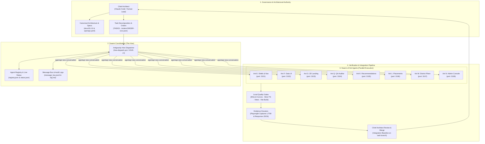

# MahaSkills — Labour-Market Intelligence & Curriculum Alignment Platform

**Government of Maharashtra**  
Department of Skills, Employment, Entrepreneurship and Innovation (DSEEI) / Maharashtra State Innovation Society (MSInS)  
**Problem Statement ID:** 26134  

> 🐜 **Autonomous Engineering Swarm:** Engineered and continuously delivered via an autonomous colony of **Google Antigravity Ant Agents** directed by a **Claude Code Chief Architect** — achieving contract-first delivery, zero-merge-conflict parallel execution across isolated Git worktrees, and automated multi-viewport verification.

---

## 1. Project Overview

MahaSkills creates an empirical feedback loop between live industrial demand and vocational curriculum design across Maharashtra's 36 districts and 417+ ITIs. The platform automatically aggregates multi-source labour market signals, algorithmically identifies localized skill-demand deficits, generates actionable curriculum revision proposals with evidence dossiers, and empowers prospective candidates with verified placement statistics.

* **Documentation Index:** [`docs/README.md`](docs/README.md)
* **Product Requirements:** [`docs/01-product/PRD.md`](docs/01-product/PRD.md)
* **Traceability Matrix:** [`docs/01-product/REQUIREMENTS_TRACEABILITY.md`](docs/01-product/REQUIREMENTS_TRACEABILITY.md)
* **API Specification:** [`docs/03-api/API_SPECIFICATION.md`](docs/03-api/API_SPECIFICATION.md) & [`docs/03-api/openapi.yaml`](docs/03-api/openapi.yaml)
* **Database Schema:** [`docs/02-architecture/DATABASE_SCHEMA.md`](docs/02-architecture/DATABASE_SCHEMA.md)
* **Agent Delivery Model:** [`docs/11-agent-delivery/README.md`](docs/11-agent-delivery/README.md) & [`AGENTS.md`](AGENTS.md)

---

## 2. Monorepo Structure

```text
.
├── docs/               # Canonical 10-domain connected documentation system
├── frontend/           # React 18 + TypeScript + Vite + Tailwind CSS + shadcn/ui
├── backend/            # Python 3.11 + FastAPI + SQLAlchemy 2.0 Async + Celery
├── pipelines/          # Apache Airflow Ingestion DAGs
├── scripts/            # Database initialization & taxonomy seeding scripts
├── TASKS/              # Autonomous task orchestration, order registries & audit trails
├── docker-compose.yml  # Local multi-container development environment
├── AGENTS.md           # Agent contract: rules, protocols, and golden path commands
└── .antigravity/       # Antigravity workspace rules, knowledge base & handoff workflow
```

---

## 3. Autonomous Delivery Model — Chief Architect & Swarm of Ant Agents

MahaSkills is engineered using an autonomous multi-agent software engineering swarm. Architectural governance, task decomposition, and integration quality gates are directed by the **Chief Architect** (Claude Code), while parallel feature implementation is performed by a **Swarm of Ant Agents** (Google Antigravity worker instances) operating concurrently in isolated Git worktrees.

### 3.1 Swarm Architecture & Topology



### 3.2 Swarm Roles & Specialization Matrix

Each Ant Agent operates within a dedicated worktree and focuses on a specialized domain with strict boundary encapsulation:

| Ant Agent | Specialized Domain | Core Deliverables & Scope | Isolation Boundary |
|:---|:---|:---|:---|
| **Ant A** *(Lead)* | Foundation & Design System | Token architecture, dark mode switcher, self-hosted `@fontsource` typography, `NUM-01..08` formatters, 25 Radix UI primitives, `/__ui` gallery. | Base tokens, primitives |
| **Ant B** | Labour Market Gap Scoring | 3-tier severity scoring engine, React Query hooks, telemetry metadata mocks. | `features/gap-scoring/` |
| **Ant C** | Deterministic Matching Engine | Explainable course matching algorithm, confidence scoring, pathway calculators. | `features/candidates/matching.ts` |
| **Ant D** | URL State & Data Logic | Bidirectional URL state synchronization (`useUrlState`), pagination, multi-sort, facet filter logic. | `components/data/logic/**` |
| **Ant E** | Shells, Navigation & RBAC | Role-based navigation layout, responsive public/app shells, mobile drawer, access boundary enforcement, DevPersona switcher. | `components/layout/**`, `app/routes.tsx` |
| **Ant F** | Data Exploration Components | Enterprise Data Table, filter bars, trend charts, explainability popovers, UI component gallery extensions. | `components/data/**`, `UiGalleryPage.tsx` |
| **Ant G** | Landing Page & 3D Interactive Hero | Modern responsive landing page, Three.js procedural logo visualizer, automated WebGL hardware probe, low-power fallback. | `features/landing/**`, fallback assets |
| **Ant Q** | Autonomous QA & Accessibility Auditor | Multi-viewport screenshot captures (1366px, 768px, 360px), multi-theme verification, trilingual locale verification (`mr`/`hi`/`en`), axe-core WCAG 2.1 AA audits. | Read-only audit under `temp/ux-evidence/` |
| **Ant K** | Curriculum Recommendations | Recommendation review workflows, evidence dossiers, stakeholder sign-off tracking. | `features/recommendations/**` |
| **Ant L** | High-Throughput Placement Parser | Placement return CSV batch validator (RFC 4180 compliant, parses 50,000 rows in < 70ms), schema enforcement. | `features/placements/**` |
| **Ant M** | District Training Plans | District-level skill demand forecasting, quota planning, schema validations. | `features/district-plans/**` |
| **Ant N** | Employer Portal & Admin Operations | Live job posting intake, apprenticeship demand signals, system telemetry console. | `features/employers/**`, `features/admin/**` |
| **Ant Y** | WCAG AA Contrast Remediation | High-contrast token tuning for badges, metric deltas, and accessible dark-mode surfaces. | Token contrast adjustments |

### 3.3 How the Swarm Executes (The Colony Model)

1. **Contract-First Decomposition (Chief Architect)**  
   The Chief Architect translates canonical requirements from `docs/` and `openapi.yaml` into atomic, verifiable task prompts (`P001`–`P010`, `S1`–`S4`). Tasks are packaged into structured JSON orders (`ORDER-xxxx.json`) with strict file ownership declarations.

2. **Autonomous Hive Dispatcher (`hive-dispatch.ps1`)**  
   The Hive Dispatcher runs continuously inside Google Antigravity, polling the orders directory:
   * Spawns worker conversations concurrently using `agentapi new-conversation`.
   * Enforces concurrency throttling (e.g. max 4–6 parallel ants) and staggered starts ( $\ge 20$ seconds apart).
   * Maintains real-time state in `registry.json` and records immutable event streams in `log.md`.

3. **Isolated Parallel Worktrees (`_SWARM-v1`)**  
   To prevent Git lock contention, each ant agent operates in a dedicated **Git worktree** (e.g., `mahaskills-ants/ant-E`) on its own branch (e.g., `ant/TASK-*-E`) with a unique dev server port (3101–3108).

4. **Zero-Conflict Boundary Rules**  
   Parallel ants respect strict modularity boundaries:
   * **Centrally Managed Dependencies:** Root `package.json` and lockfiles are managed centrally; ants run `npm ci` without altering shared package manifests.
   * **Partitioned i18n Namespaces:** Each ant writes exclusively to its assigned namespace file (`locales/{mr,hi,en}/<ns>.json`), preventing merge collisions across Marathi, Hindi, and English locales.
   * **Modular Route Fragments:** Routes are exported as self-contained arrays (`features/<feature>/routes.tsx`) and composed into the central router.
   * **Feature-Scoped Query Keys:** Server cache keys live within feature scopes (`features/<feature>/queryKeys.ts`).

5. **Mandatory Quality Gates & Evidence Dossiers**  
   Before claiming task completion, every ant must execute and pass four mandatory local verification gates:
   * **Lint Gate:** `npm run lint` (ESLint: 0 errors)
   * **Typecheck Gate:** `npm run typecheck` (`tsc --noEmit` in strict mode: 0 errors)
   * **Test Gate:** `npm test` (Vitest unit and contract test suite: 100% green)
   * **Build Gate:** `npm run build` (Vite production bundle verification)
   * **Visual Proof:** Playwright browser captures and UI snapshot evidence across viewports.

6. **Architect Review & Integration**  
   Results are compiled into a structured response JSON dossier (`communication/responses/MSG-xxxx.json`). The Chief Architect inspects the evidence, runs regression checks, and merges the verified branch into the main task integration line.

### 3.4 Live Quality & Verification Baseline

| Verification Gate | Command | Baseline Status | Coverage & Scope |
|:---|:---|:---|:---|
| **Unit & Contract Tests** | `npm test` | **369 / 369 passed (100%)** | 28 test suites covering gap scoring, matching, URL state, CSV parser, admin, district plans |
| **Static Type Safety** | `npm run typecheck` | **0 errors (clean)** | TypeScript strict mode, zero implicit `any` |
| **Code Style & Linting** | `npm run lint` | **0 errors** | ESLint with React Hooks and accessibility rules |
| **Production Build** | `npm run build` | **Built in ~7.2s** | Vite minification, code-split chunks, CSS bundle |
| **A11y & Visual Proof** | Playwright + Axe-core | **Verified** | Viewport matrix (1366px, 768px, 360px), Light/Dark themes, Marathi/Hindi/English |

---

## 4. Quickstart & Local Development

### Prerequisites
* Docker & Docker Compose
* Node.js $\ge 20$ & npm
* Python $\ge 3.11$

### Running with Docker Compose
```bash
# 1. Clone the repository and configure environment variables
cp .env.example .env

# 2. Start PostgreSQL, Redis, Backend API, and Frontend Web Client
docker compose up --build -d

# 3. Access applications:
# - Frontend Web:    http://localhost:3000
# - Backend API:     http://localhost:8000/docs (Swagger UI)
# - PostgreSQL:      localhost:5432 (Database: mahaskills)
```

### Golden Path Validation Commands
```bash
# Full stack local startup
docker compose up --build -d

# Backend quality gates (from backend/)
ruff check . && black --check .        # Lint & formatting gate
pytest -q                             # Backend unit/contract test gate
uvicorn app.main:app --reload         # Local API server

# Frontend quality gates (from frontend/)
npm run lint && npm run typecheck     # ESLint + strict TypeScript gate
npm test                              # Frontend unit & contract tests
npm run build                         # Production bundle build gate
npm run dev                           # Vite local dev server

# API contract linting (from repo root)
npx @stoplight/spectral-cli lint docs/03-api/openapi.yaml
```

---

## 5. Agent Contract & Governance

All autonomous coding agents and human contributors adhere to the canonical rules, non-negotiables, and protocols defined in:
* [`AGENTS.md`](AGENTS.md) — Master agent contract, non-negotiables (contract-first, DPDP Act 2023, strict types), and handoff protocol.
* [`docs/11-agent-delivery/README.md`](docs/11-agent-delivery/README.md) — Specification distillation, DoD, and handoff execution.
* [`docs/11-agent-delivery/DEFINITION_OF_DONE.md`](docs/11-agent-delivery/DEFINITION_OF_DONE.md) — Strict merge criteria and verification gates.
* [`docs/11-agent-delivery/GUARDRAILS.md`](docs/11-agent-delivery/GUARDRAILS.md) — Autonomous limits, security constraints, and forbidden operations.

