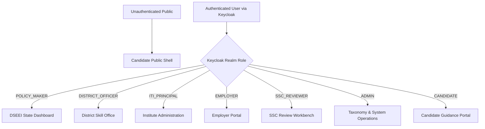
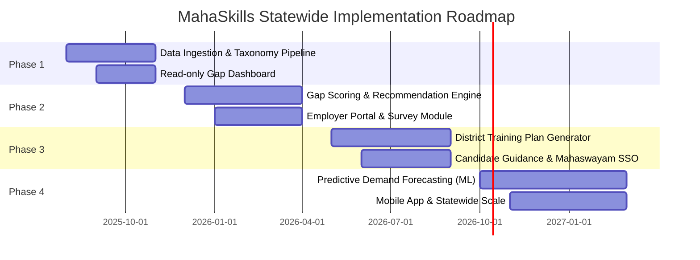

# MahaSkills — Product Requirements Document (PRD)

**Platform:** MahaSkills — Labour-Market Intelligence & Curriculum Alignment Platform  
**Owner:** Government of Maharashtra · Department of Skills, Employment, Entrepreneurship and Innovation (DSEEI) / Maharashtra State Innovation Society (MSInS)  
**Problem Statement ID:** 26134  
**Version:** 1.0  
**Status:** Approved for Implementation  
**Last Updated:** July 2025  

---

## 1. Executive Summary

Maharashtra's skill development ecosystem trains over 5 lakh candidates annually across Industrial Training Institutes (ITIs), polytechnics, and government-approved private training providers. Despite substantial public investment, average post-training placement rates hover around 38%, and industrial employers consistently report severe qualification mismatches between curriculum outcomes and active workplace requirements.

**MahaSkills** bridges this systemic misalignment by establishing a continuous, evidence-backed feedback loop between real-time industry demand and vocational curriculum design. The platform continuously ingests labour market signals (job postings, employer surveys, placement returns, industrial investment data), cross-references them with the National Skills Qualification Framework (NSQF) and Sector Skill Council (SSC) occupational profiles, and algorithmically generates:

1. **Prioritized curriculum update recommendations** with verifiable market evidence packages.
2. **Dynamic district-level training plans** calibrated against local industrial clusters and ITI equipment capacities.
3. **Transparent, personalized candidate guidance** highlighting true placement outcomes and median post-training earnings.

Delivered across four phased milestones over 20 months, MahaSkills aims to lift average statewide vocational placement rates to 62%+ and compress curriculum revision cycles from 3–5 years down to under 12 months.

---

## 2. Problem Statement & Regional Context

### 2.1 Core Systemic Deficiencies
* **Static, Outdated Curricula:** Vocational curricula reflect historical job descriptions rather than contemporary industrial processes (e.g., Electrician trades focusing on legacy domestic fuse boxes rather than industrial PLC/SCADA or EV battery assembly).
* **Extended Revision Latency:** Sector Skill Council (SSC) and National Council for Vocational Education and Training (NCVET) curriculum reviews occur at 3–5 year intervals, failing to keep pace with rapid industrial modernization.
* **Fragmented, Siloed Placement Records:** Graduate outcomes are tracked independently at the institute level on paper or isolated spreadsheets, preventing statewide benchmarking, outcome verification, or trend analysis.
* **Information Asymmetry:** Candidates lack visibility into actual employer demand and salary baselines, while employers cannot communicate emerging competency needs directly to training administrators.

### 2.2 Priority Industrial Districts & Focus Sectors
| District / Cluster | Dominant Industrial Sectors | Target Transformation Focus |
|:---|:---|:---|
| **Pune & Pimpri-Chinchwad** | Automotive, Electric Vehicles (EV), IT/ITeS, Pharmaceuticals | Automation, EV battery diagnostics, software validation |
| **Nashik** | Auto ancillaries, Agro-processing, Wine & Beverage production | Modern CNC operations, automated packaging, quality assurance |
| **Chhatrapati Sambhajinagar** | Automotive manufacturing, MSME engineering, Defence components | Precision tooling, robotics maintenance, metallurgy |
| **Nagpur (MIHAN SEZ)** | Logistics & Warehousing, Aviation maintenance, Mining machinery | Automated inventory systems, avionics servicing, heavy equipment |
| **Kolhapur** | Foundry & Casting, Textiles, Agricultural machinery | CAD/CAM casting design, sustainable processing, hydraulic systems |
| **Konkan / Ratnagiri** | Marine processing, Fisheries, Agri-tech, Eco-tourism | Cold chain logistics, marine bio-processing, hospitality tech |

---

## 3. Product Goals & Key Performance Indicators (KPIs)

| Metric Code | Goal Description | Baseline | Target (Year 2) | Responsible Stakeholder |
|:---|:---|:---|:---|:---|
| **KPI-01** | Statewide ITI Placement Rate | 38% | $\ge 62\%$ | District Officers & ITI Principals |
| **KPI-02** | Employer Satisfaction Score | Unmeasured | $\ge 3.8\ /\ 5.0$ | DSEEI & Industry Liaisons |
| **KPI-03** | Curriculum Revision Latency | 36–60 months | $\le 12$ months | SSC Technical Committees & DSEEI |
| **KPI-04** | Annual Skill Gap Closure Rate | Unmeasured | $\ge 40\%$ | Labour Market Intelligence Engine |
| **KPI-05** | Annual Trainer Upskilling Coverage | ~20% | $\ge 60\%$ | Directorate of Vocational Education & Training |
| **KPI-06** | Automated ITI Equipment Gap Flagging | Manual / None | 100% of ITIs | DSEEI Asset Audit Division |
| **KPI-07** | Candidate Career Decision Clarity | Unmeasured | $\ge 4.0\ /\ 5.0$ | Candidate Portal & Guidance Team |

---

## 4. User Personas & Role Matrix

MahaSkills defines seven distinct authenticated roles plus unauthenticated public access:

| Role Key | Role Title | Access Scope | Core Responsibilities |
|:---|:---|:---|:---|
| `POLICY_MAKER` | Policy Maker (DSEEI / MSInS) | Statewide (All 36 Districts) | Review macroeconomic gap heatmaps, sanction district budget allocations, approve published curriculum modifications. |
| `DISTRICT_OFFICER` | District Skill Officer (DSEEGC) | Single Assigned District | Formulate annual District Training Plans, monitor ITI placement compliance, manage operational alerts. |
| `ITI_PRINCIPAL` | ITI / Polytechnic Principal | Single Assigned Institute | Submit monthly validated placement returns, track institutional skill gap alignment, monitor trainer qualifications. |
| `EMPLOYER` | Industry Partner / HR | Registered Enterprise | Submit structured skill needs, participate in pulse gap surveys, validate proposed curriculum drafts. |
| `SSC_REVIEWER` | Sector Skill Council Reviewer | Assigned Sector(s) | Review automated curriculum recommendation dossiers, perform technical validation, issue approval/revision decisions. |
| `ADMIN` | System Administrator / Data Steward | System-Wide | Manage skill taxonomy, monitor Airflow ingestion DAGs, review security audit logs, manage user provisioning. |
| `CANDIDATE` | Trainee / Prospective Student | Individual Profile | Explore verified course placement statistics, complete career pathway assessment, initiate Mahaswayam SSO enrollment. |

---

## 5. System Architecture & External Integrations

### 5.1 Three-Tier Architecture Overview
* **Presentation Tier:** Modern React 18 single-page application with TypeScript, Tailwind CSS, and shadcn/ui. Fully localized into Marathi (primary), Hindi, and English.
* **Application & Intelligence Tier:** RESTful microservices built using Python FastAPI and Node.js behind a unified API Gateway. Python scikit-learn analytics engine for gap scoring and recommendation heuristics.
* **Data Tier:** PostgreSQL 16 relational database for transactional integrity, Elasticsearch 8 for full-text taxonomy search and job role matching, Redis 7 for distributed caching and rate-limiting, and S3-compatible object storage for CSV uploads and PDF dossiers.
* **Data Pipeline Tier:** Apache Airflow 2.8 orchestrating automated nightly scrapers, monthly placement validation routines, and weekly gap recalculation pipelines.

### 5.2 External System Integrations
1. **Mahaswayam (DSEEI Portal):** Bi-directional REST API integration and Keycloak OIDC Single Sign-On (SSO) for direct enrollment handoff and candidate record reconciliation.
2. **National Career Service (NCS) Open API:** Scheduled ingestion of government-verified job opportunities and employer postings.
3. **MahaDBT:** Verification interface for government scholarship and post-matric training stipend distributions.
4. **NSDC / NCVET Portals:** Quarterly synchronization of National Qualification Register (NQR) entries and National Occupational Standards (NOS).
5. **Commercial Job Portals:** Nightly compliant ingestion of public postings from Naukri (licensed API), LinkedIn, and Indeed RSS feeds.

---

## 6. Phased Implementation Roadmap

### Phase 1: Foundation & Data Flow (Months 0–4)
* Establish Apache Airflow ingestion pipelines for job postings and placement CSVs.
* Seed the core PostgreSQL taxonomy with ~2,200 NSQF-aligned job roles across 33 sectors.
* Deliver read-only executive gap dashboards for DSEEI policy makers and pilot District Officers across 5 focus districts.
* **Exit Gate:** Uninterrupted daily ingestion feeds active; $\ge 10$ ITIs uploading monthly placement returns; pilot gap heatmap operational.

### Phase 2: Intelligence & Recommendation Engine (Months 4–9)
* Implement the algorithmic Gap Scoring Engine operating across district, sector, and NSQF levels.
* Deploy the Curriculum Recommendation Engine with multi-stage approval workflows (`Draft` $\rightarrow$ `SSC Review` $\rightarrow$ `DSEEI Approval` $\rightarrow$ `Published`).
* Release Employer Portal MVP featuring Aadhaar/GSTIN-verified onboarding, skill needs submissions, and micro-surveys.
* **Exit Gate:** Gap scores calculated for all 36 districts; $\ge 20$ validated curriculum recommendations reviewed by SSCs; $\ge 50$ enterprise employers onboarded.

### Phase 3: District Planning & Candidate Guidance (Months 9–14)
* Launch automated District Training Plan generation with institutional equipment gap analysis and budget scoring.
* Deploy Candidate Portal featuring verified course placement metrics (median salary, time-to-placement) and 5-step Pathway Quiz.
* Integrate automated SMS and email alerting for placement thresholds and curriculum publication events.
* **Exit Gate:** Annual training plans generated for all 36 districts; Mahaswayam SSO enrollment operational; $\ge 500$ candidates guided in initial month.

### Phase 4: Prediction & Statewide Scale (Months 14–20)
* Deploy ARIMA/Prophet predictive forecasting models projecting 12-month forward skill demand based on macroeconomic trends and PLI announcements.
* Launch offline-first candidate mobile application (React Native) for low-bandwidth rural talukas.
* Onboard 100% of government ITIs and polytechnics across Maharashtra, backed by an active network of 500+ verified employers.
* **Exit Gate:** Predictive demand module active statewide; 36-district coverage operational; revision latency demonstrably under 12 months.

---

## 7. Detailed Feature Specifications

### 7.1 Data Ingestion & Ingestion Validation
* **Job Market Signals:** Ingest posting title, required skills, experience bounds, location coordinates, salary indicators, and publication date.
* **Placement Returns:** Structured CSV upload for ITIs containing anonymized candidate hashes, course IDs, batch completion year, placement verification flag, hiring enterprise name, job title, starting salary, and months elapsed to placement.
* **Validation Engine:** Strict schema validation with instant cell-level error flagging, header verification, and atomic batch isolation.

### 7.2 Skill Taxonomy Management
* Standardized representation of 33 economic sectors, 36 Sector Skill Councils, ~2,200 Job Roles, and discrete Skills.
* Natural Language Processing (NLP) tokenization and entity extraction to map unstructured job ad terminology onto formal NSQF taxonomy nodes.
* Dynamic staging repository for "Emerging Skills" pending formal SSC qualification standardization.

### 7.3 Gap Scoring Engine
* **Mathematical Model:**
  $$\text{Gap Score} = \min\left(100, \max\left(0, \frac{\text{Demand Count} \times \text{Trend Factor} - \text{Trained Capacity} \times \text{Placement Rate}}{\text{Normalisation Constant}} \times 100\right)\right)$$
* **Oversupply Detection:** Automatically flag courses where placement rate $< 25\%$ AND demand falls below the 20th percentile for $\ge 2$ consecutive quarters.
* **Aggregation Granularity:** Computations refreshed weekly at District $\times$ Sector $\times$ Job Role $\times$ NSQF level.

### 7.4 Curriculum Recommendation & Review Workflow
* **Trigger Threshold:** Sustained skill gap score $> 60$ over an 8-week observation window with zero aligned local course offerings.
* **Recommendation Typology:**
  1. *Add Elective Module:* Augment existing trade course with emerging skill module.
  2. *Revise Unit of Competency:* Modernize outdated syllabus components.
  3. *Formulate New Qualification:* Initiate NCVET development for net-new job roles.
  4. *Consolidate / Decommission Course:* Phased phase-out of structurally oversupplied trades.
* **Dossier Package:** Auto-compiled evidence dossier containing 12-month demand trajectory, hiring employer listings, interstate course benchmarks, and projected placement uplift.
* **Workflow SLA:** SSC Review: 14 business days; DSEEI Final Approval: 7 business days.

### 7.5 District Training Plan Synthesis
* Compiles recommended course matrices, target intake quotas, trainer upskilling mandates, and capital equipment requirements for every district.
* Evaluates course syllabus equipment specifications against uploaded ITI asset inventories to generate priced infrastructure deficiency reports.

### 7.6 Candidate Career Decision Engine
* Course directory exposing real-world placement metrics: verified median starting salary, 50th percentile time-to-hire, and active hiring employers.
* 5-question adaptive Pathway Quiz evaluating educational qualification, geographic constraints, sector interest, language preference, and relocation mobility to recommend the top 3 optimal vocational pathways.

---

## 8. Governance & Administrative Authority

* **Platform Stewardship:** Maharashtra State Innovation Society (MSInS) under the administrative oversight of DSEEI.
* **PMO Operations:** Dedicated 4-person Project Management Office directing vendor execution, data MoUs, and inter-departmental protocols.
* **Statutory Bodies Integrated:**
  * 36 Sector Skill Councils (SSCs)
  * National Council for Vocational Education and Training (NCVET)
  * Directorate of Vocational Education and Training (DVET), Maharashtra
  * Maharashtra State Council for Vocational Training (MSCVT)
  * Industry Chambers: MCCIA, CII Maharashtra, MSSIA

---

## 9. Non-Functional Requirements (NFRs)

* **Availability & Resilience:** 99.5% operational uptime with High Availability multi-AZ deployment in AWS Mumbai / GovCloud.
* **Latency & Performance:** API response p95 $< 300\text{ms}$; complex analytical dashboard rendering $< 2.0\text{s}$; gap calculation pipeline batch run $< 45\text{min}$.
* **Localization:** 100% externalized strings supporting Marathi (primary), Hindi, and English with dynamic runtime locale switching.
* **Accessibility:** Full compliance with WCAG 2.1 AA and Government of India Guidelines for Indian Government Websites (GIGW 3.0).
* **Data Retention & Privacy:** Comply with Digital Personal Data Protection (DPDP) Act 2023. Raw job postings retained for 2 years; placement records retained for 7 years; candidate records strictly pseudonymized.
