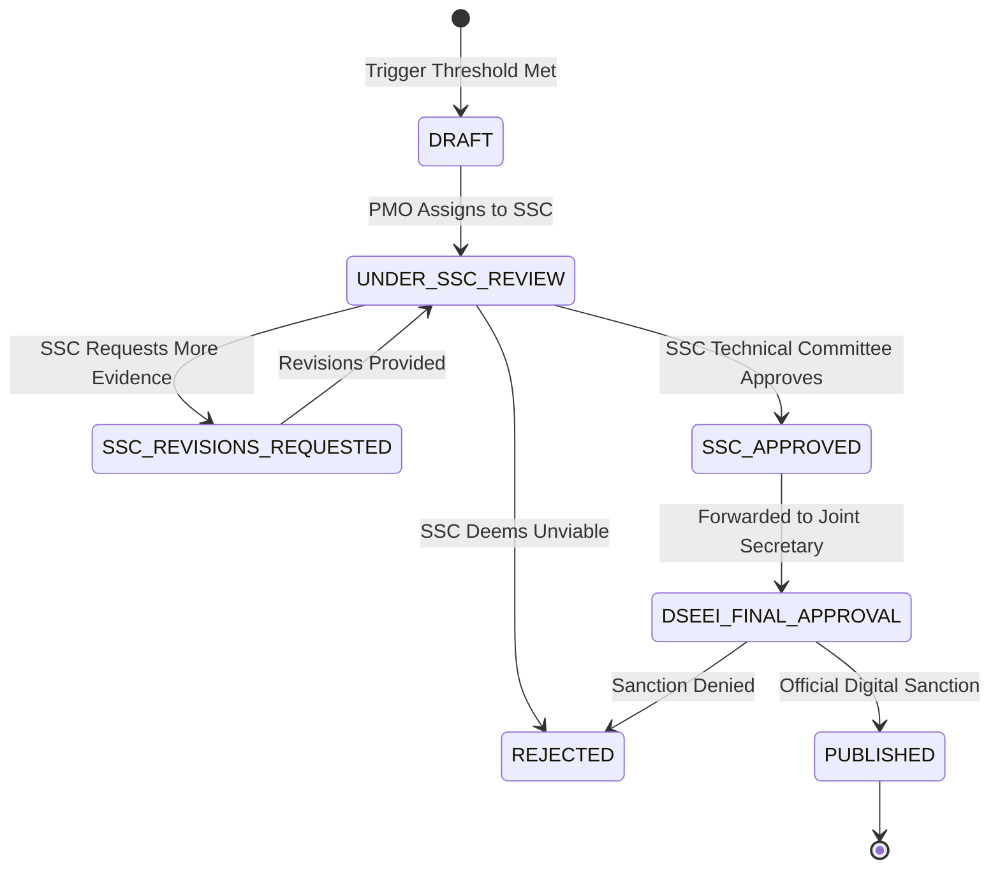

# MahaSkills — Backend Architecture Specification

**Platform:** MahaSkills · Government of Maharashtra (DSEEI / MSInS)  
**Problem Statement ID:** 26134  
**Version:** 1.0  
**Status:** Canonical Backend Architecture Baseline  

---

## 1. Architectural Style & Tech Stack

MahaSkills implements a high-performance **modular monolith** evolving into domain-isolated microservices. The backend combines the asynchronous high-concurrency capabilities of **Python FastAPI** (for the core API, ML analytics, and recommendation workflows) with **Apache Airflow** and **Celery** (for asynchronous data pipelines and background tasks).

```text
               ┌────────────────────────────────────────────────────────┐
               │              API Gateway (Kong / Nginx)                │
               └───────────────────────────┬────────────────────────────┘
                                           │
 ┌─────────────────────────────────────────┼─────────────────────────────────────────┐
 │                                         ▼                                         │
 │                      FastAPI Modular Application Server                           │
 │  ┌─────────────────────────────────────────────────────────────────────────────┐  │
 │  │ Domain Routers: /v1/auth, /v1/lmi, /v1/gap-scores, /v1/recommendations, ...  │  │
 │  └──────────────────────────────────────┬──────────────────────────────────────┘  │
 │                                         ▼                                         │
 │  ┌─────────────────────────────────────────────────────────────────────────────┐  │
 │  │ Cross-Cutting Middleware: Keycloak JWT, TenantScope, RateLimiter, AuditLog  │  │
 │  └──────────────────────────────────────┬──────────────────────────────────────┘  │
 │                                         ▼                                         │
 │  ┌─────────────────────────────────────────────────────────────────────────────┐  │
 │  │ Service Domain Layer:                                                       │  │
 │  │  • AuthService        • TaxonomyService   • LmiAnalyticsService             │  │
 │  │  • GapScoringService  • WorkflowService   • DistrictPlanService             │  │
 │  │  • PlacementService   • EmployerService   • CandidateGuidanceService        │  │
 │  └──────────────────────────────────────┬──────────────────────────────────────┘  │
 │                                         ▼                                         │
 │  ┌─────────────────────────────────────────────────────────────────────────────┐  │
 │  │ Persistence Layer (SQLAlchemy 2.0 Async + asyncpg connection pool)          │  │
 │  └─────────────────────────────────────────────────────────────────────────────┘  │
 └─────────────────────────────────────────┬─────────────────────────────────────────┘
                                           │
 ┌─────────────────────────────────────────┴─────────────────────────────────────────┐
 │ Asynchronous Worker Fleet (Celery 5.3 + Redis 7 Broker + Apache Airflow 2.8)      │
 │  • nightly_job_scraper_dag      • validate_placement_batch_task                   │
 │  • weekly_gap_recalculation_dag • compile_recommendation_dossier_task             │
 └───────────────────────────────────────────────────────────────────────────────────┘
```

---

## 2. Domain Services & Responsibilities

### 2.1 Identity & Scoping Service (`app.services.auth`)
* **Keycloak Integration:** Decodes and validates RS256 JWT tokens against Keycloak JWKS (`/auth/realms/mahaskills/protocol/openid-connect/certs`).
* **Tenant Scoping Guard:** Injects security context into request dependency injection:
  ```python
  class SecurityContext:
      user_id: UUID
      roles: list[str]
      district_id: Optional[int]    # Set for DISTRICT_OFFICER, ITI_PRINCIPAL
      institute_id: Optional[UUID]   # Set for ITI_PRINCIPAL
      sector_ids: list[int]          # Set for SSC_REVIEWER
  ```

### 2.2 Skill Taxonomy Service (`app.services.taxonomy`)
* Maintains standardized hierarchies across 33 sectors, 36 SSCs, ~2,200 NSQF-aligned job roles, and over 15,000 discrete skills.
* Integrates spaCy/Transformers entity extraction pipeline to parse raw job posting strings into standardized skill nodes.
* Manages an "Emerging Skills" staging pool for novel market technologies not yet codified into official NCVET qualifications.

### 2.3 Algorithmic Gap Scoring Engine (`app.services.gap_scoring`)

The Gap Scoring Engine executes the core business logic defining labour-market misalignment:

#### Mathematical Formulation
For any given tuple $(\text{District } d, \text{Sector } s, \text{Job Role } r, \text{NSQF Level } l)$:

$$\text{Gross Demand} = \sum_{p \in \text{Postings}} w(p.\text{date}) \cdot p.\text{vacancies} + \sum_{n \in \text{SkillNeeds}} n.\text{headcount} \cdot u(n.\text{urgency})$$

where $w(t) = e^{-\lambda t}$ represents temporal decay and $u(\text{urgency}) \in \{1.5 \text{ (immediate)}, 1.0 \text{ (quarterly)}, 0.5 \text{ (future)}\}$.

$$\text{Effective Supply} = \sum_{c \in \text{Courses}(r, d)} c.\text{intake\_capacity} \cdot \bar{P}_{c}$$

where $\bar{P}_c$ represents the 3-year historical average placement rate for course $c$.

$$\text{Raw Gap} = \text{Gross Demand} - \text{Effective Supply}$$

$$\text{Normalized Gap Score} = \min\left(100, \max\left(0, \frac{\text{Raw Gap}}{\text{ScalingFactor}(s)} \times 100\right)\right)$$

#### Oversupply Flagging Algorithm
A course $c$ is automatically flagged as **Structurally Oversupplied** when:
$$\bar{P}_{c} < 0.25 \quad \text{AND} \quad \text{Percentile}_{\text{district}}(\text{Gross Demand}) < 20$$
sustained across $\ge 2$ consecutive quarterly reporting cycles.

---

### 2.4 Curriculum Recommendation & Dossier Compiler (`app.services.recommendation`)

#### Recommendation Trigger Condition
A formal recommendation proposal is generated automatically when:
$$\text{Gap Score}(d, s, r) \ge 60 \quad \text{sustained for } \ge 8 \text{ consecutive weekly calculations}$$
AND no existing active course syllabus in district $d$ covers the required emerging skills.

#### Automated Dossier Compilation
When triggered, a Celery worker compiles an immutable evidence package comprising:
1. **Demand Trajectory:** 12-month historical job vacancy counts and quarterly growth vectors.
2. **Key Hiring Employers:** Top 5 industrial employers hiring for the skill profile within a 150 km radius.
3. **Interstate Syllabus Benchmarks:** Cross-references with curricula from Karnataka, Tamil Nadu, and Gujarat state skill councils.
4. **Projected Impact:** Estimated placement uplift ($\Delta \ge 24\%$) based on unfilled vacancy counts.

#### Workflow State Machine


---

### 2.5 Placement Ingestion & Validation Pipeline (`app.services.placement`)

Handles high-volume monthly placement returns from ITI principals:
1. **Streaming Parsing:** Uses Python `ijson` / streaming CSV reader to process files up to 100MB without memory exhaustion.
2. **Validation Rules:**
   * Valid `candidate_hash` format (SHA-256 hex string).
   * `course_id` exists in institute's active sanctioned courses.
   * `salary` $\ge \text{Minimum Wage (Maharashtra Zone 1/2)}$ and $\le ₹2,00,000/\text{month}$.
   * `batch_year` within valid reporting windows ($T-2$ to $T$).
3. **Atomic Commit:** Validation errors are captured line-by-line. If error count exceeds 0, the batch is set to `REJECTED`, error entries are written to `placement_validation_errors`, and zero raw placement records are committed.

---

## 3. Asynchronous Pipeline Schedules (Apache Airflow)

| DAG ID | Schedule | Trigger / Input | Target Output | SLA |
|:---|:---|:---|:---|:---|
| `lmi_nightly_job_scraping` | `0 2 * * *` (02:00 IST) | Naukri, LinkedIn, Indeed, NCS | `raw_job_postings`, `clean_job_postings` | $\le 120\text{ mins}$ |
| `taxonomy_nlp_enrichment` | `0 4 * * *` (04:00 IST) | New unmapped job posting skills | `skill_synonyms`, `emerging_skills` | $\le 60\text{ mins}$ |
| `weekly_gap_score_computation`| `0 1 * * 0` (Sun 01:00) | 7-day LMI + Placement returns | `gap_scores`, `gap_score_history` | $\le 45\text{ mins}$ |
| `recommendation_trigger_audit`| `0 3 * * 0` (Sun 03:00) | Updated gap score tables | `recommendations` (status=DRAFT) | $\le 15\text{ mins}$ |
| `quarterly_oversupply_audit` | `0 0 1 1,4,7,10 *` | 2-quarter placement & demand | `oversupply_alerts` | $\le 30\text{ mins}$ |

---

## 4. Database Connection & Transaction Management

* **Connection Pool:** SQLAlchemy 2.0 async engine powered by `asyncpg` with:
  * `pool_size = 25` per API worker.
  * `max_overflow = 15`.
  * `pool_recycle = 1800` (recycle connections every 30 minutes).
  * `pool_pre_ping = True` (health-check connections before checkout).
* **Transaction Isolation:** Read Committed (Postgres default) for analytical queries; Repeatable Read for financial/budget allocations and multi-step curriculum signoff transitions.
