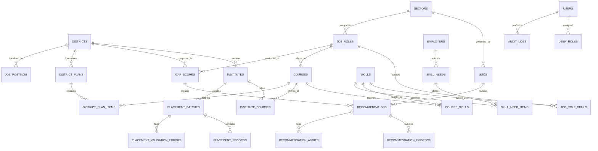

# MahaSkills — Database Schema & DDL Specification

**Platform:** MahaSkills · Government of Maharashtra (DSEEI / MSInS)  
**Database Engine:** PostgreSQL 16  
**Problem Statement ID:** 26134  
**Version:** 1.0  
**Status:** Canonical Database Schema Baseline  

---

## 1. Entity-Relationship Diagram (ERD)



---

## 2. Core Relational Tables & PostgreSQL DDL

### 2.1 Geographic & Administrative Foundations

```sql
-- 36 Administrative Districts of Maharashtra
CREATE TABLE districts (
    id SERIAL PRIMARY KEY,
    code VARCHAR(10) UNIQUE NOT NULL,              -- e.g. "MH-PU", "MH-NS"
    name_en VARCHAR(100) NOT NULL,
    name_mr VARCHAR(100) NOT NULL,
    division VARCHAR(50) NOT NULL,                 -- Pune, Nashik, Konkan, etc.
    latitude NUMERIC(9, 6) NOT NULL,
    longitude NUMERIC(9, 6) NOT NULL,
    is_active BOOLEAN DEFAULT TRUE NOT NULL,
    created_at TIMESTAMPTZ DEFAULT CURRENT_TIMESTAMP NOT NULL,
    updated_at TIMESTAMPTZ DEFAULT CURRENT_TIMESTAMP NOT NULL
);

CREATE INDEX idx_districts_division ON districts(division);
```

---

### 2.2 Taxonomy: Sectors, SSCs, Job Roles & Skills

```sql
-- 33 Economic Sectors
CREATE TABLE sectors (
    id SERIAL PRIMARY KEY,
    code VARCHAR(20) UNIQUE NOT NULL,              -- e.g. "AUTO", "IT_ITES"
    name_en VARCHAR(150) NOT NULL,
    name_mr VARCHAR(150) NOT NULL,
    description TEXT,
    is_active BOOLEAN DEFAULT TRUE NOT NULL,
    created_at TIMESTAMPTZ DEFAULT CURRENT_TIMESTAMP NOT NULL,
    updated_at TIMESTAMPTZ DEFAULT CURRENT_TIMESTAMP NOT NULL
);

-- 36 Sector Skill Councils (SSCs)
CREATE TABLE sscs (
    id SERIAL PRIMARY KEY,
    code VARCHAR(30) UNIQUE NOT NULL,              -- e.g. "ASDC", "NASSCOM"
    name VARCHAR(200) NOT NULL,
    sector_id INT NOT NULL REFERENCES sectors(id) ON DELETE RESTRICT,
    contact_email VARCHAR(255) NOT NULL,
    portal_url VARCHAR(255),
    is_active BOOLEAN DEFAULT TRUE NOT NULL,
    created_at TIMESTAMPTZ DEFAULT CURRENT_TIMESTAMP NOT NULL,
    updated_at TIMESTAMPTZ DEFAULT CURRENT_TIMESTAMP NOT NULL
);

-- ~2,200 NSQF-Aligned Job Roles
CREATE TABLE job_roles (
    id UUID PRIMARY KEY DEFAULT gen_random_uuid(),
    sector_id INT NOT NULL REFERENCES sectors(id) ON DELETE RESTRICT,
    ssc_id INT REFERENCES sscs(id) ON DELETE SET NULL,
    qp_code VARCHAR(50) UNIQUE NOT NULL,           -- Qualification Pack Code e.g. "ASC/Q1402"
    title_en VARCHAR(200) NOT NULL,
    title_mr VARCHAR(200) NOT NULL,
    nsqf_level INT NOT NULL CHECK (nsqf_level BETWEEN 1 AND 10),
    description TEXT,
    version VARCHAR(20) DEFAULT '1.0' NOT NULL,
    is_active BOOLEAN DEFAULT TRUE NOT NULL,
    created_at TIMESTAMPTZ DEFAULT CURRENT_TIMESTAMP NOT NULL,
    updated_at TIMESTAMPTZ DEFAULT CURRENT_TIMESTAMP NOT NULL
);

CREATE INDEX idx_job_roles_sector_nsqf ON job_roles(sector_id, nsqf_level);

-- Competency Skills
CREATE TABLE skills (
    id UUID PRIMARY KEY DEFAULT gen_random_uuid(),
    sector_id INT NOT NULL REFERENCES sectors(id) ON DELETE RESTRICT,
    name_en VARCHAR(150) NOT NULL,
    name_mr VARCHAR(150) NOT NULL,
    skill_type VARCHAR(50) NOT NULL,               -- 'TECHNICAL', 'OPERATIONAL', 'SOFT'
    is_emerging BOOLEAN DEFAULT FALSE NOT NULL,
    created_at TIMESTAMPTZ DEFAULT CURRENT_TIMESTAMP NOT NULL,
    updated_at TIMESTAMPTZ DEFAULT CURRENT_TIMESTAMP NOT NULL
);

CREATE UNIQUE INDEX uq_skills_name_sector ON skills(lower(name_en), sector_id);

-- Job Role ↔ Skill Mapping
CREATE TABLE job_role_skills (
    job_role_id UUID NOT NULL REFERENCES job_roles(id) ON DELETE CASCADE,
    skill_id UUID NOT NULL REFERENCES skills(id) ON DELETE CASCADE,
    is_mandatory BOOLEAN DEFAULT TRUE NOT NULL,
    proficiency_level VARCHAR(30) DEFAULT 'INTERMEDIATE' NOT NULL,
    PRIMARY KEY (job_role_id, skill_id)
);
```

---

### 2.3 Training Institutes & Vocational Courses

```sql
-- ITIs & Polytechnics across Maharashtra
CREATE TABLE institutes (
    id UUID PRIMARY KEY DEFAULT gen_random_uuid(),
    mis_code VARCHAR(50) UNIQUE NOT NULL,          -- Government MIS Registration Code
    name VARCHAR(255) NOT NULL,
    district_id INT NOT NULL REFERENCES districts(id) ON DELETE RESTRICT,
    taluka VARCHAR(100) NOT NULL,
    institute_type VARCHAR(50) NOT NULL,           -- 'GOVT_ITI', 'PVT_ITI', 'POLYTECHNIC'
    address TEXT NOT NULL,
    pincode VARCHAR(6) NOT NULL,
    principal_name VARCHAR(150) NOT NULL,
    principal_email VARCHAR(255) NOT NULL,
    principal_phone VARCHAR(20) NOT NULL,
    is_active BOOLEAN DEFAULT TRUE NOT NULL,
    created_at TIMESTAMPTZ DEFAULT CURRENT_TIMESTAMP NOT NULL,
    updated_at TIMESTAMPTZ DEFAULT CURRENT_TIMESTAMP NOT NULL
);

CREATE INDEX idx_institutes_district ON institutes(district_id);

-- Vocational Courses (Trades)
CREATE TABLE courses (
    id UUID PRIMARY KEY DEFAULT gen_random_uuid(),
    job_role_id UUID NOT NULL REFERENCES job_roles(id) ON DELETE RESTRICT,
    course_code VARCHAR(50) UNIQUE NOT NULL,       -- e.g. "CTS-ELE-01"
    title_en VARCHAR(200) NOT NULL,
    title_mr VARCHAR(200) NOT NULL,
    duration_months INT NOT NULL CHECK (duration_months > 0),
    nsqf_level INT NOT NULL CHECK (nsqf_level BETWEEN 1 AND 10),
    tuition_fee_inr NUMERIC(10, 2) DEFAULT 0.00 NOT NULL,
    curriculum_version VARCHAR(20) DEFAULT '1.0' NOT NULL,
    status VARCHAR(30) DEFAULT 'ACTIVE' NOT NULL,  -- 'ACTIVE', 'UNDER_REVIEW', 'RETIRED'
    created_at TIMESTAMPTZ DEFAULT CURRENT_TIMESTAMP NOT NULL,
    updated_at TIMESTAMPTZ DEFAULT CURRENT_TIMESTAMP NOT NULL
);

-- Institute Course Sanctions & Capacity
CREATE TABLE institute_courses (
    id UUID PRIMARY KEY DEFAULT gen_random_uuid(),
    institute_id UUID NOT NULL REFERENCES institutes(id) ON DELETE CASCADE,
    course_id UUID NOT NULL REFERENCES courses(id) ON DELETE RESTRICT,
    sanctioned_intake INT NOT NULL CHECK (sanctioned_intake > 0),
    enrolled_count INT DEFAULT 0 NOT NULL,
    academic_year VARCHAR(9) NOT NULL,             -- e.g. "2025-2026"
    is_active BOOLEAN DEFAULT TRUE NOT NULL,
    created_at TIMESTAMPTZ DEFAULT CURRENT_TIMESTAMP NOT NULL,
    updated_at TIMESTAMPTZ DEFAULT CURRENT_TIMESTAMP NOT NULL,
    UNIQUE(institute_id, course_id, academic_year)
);
```

---

### 2.4 Placement Ingestion & Outcomes (DPDP 2023 Compliant)

```sql
-- Monthly Placement Ingestion Batches
CREATE TABLE placement_batches (
    id UUID PRIMARY KEY DEFAULT gen_random_uuid(),
    institute_id UUID NOT NULL REFERENCES institutes(id) ON DELETE RESTRICT,
    academic_year VARCHAR(9) NOT NULL,
    batch_month INT NOT NULL CHECK (batch_month BETWEEN 1 AND 12),
    file_name VARCHAR(255) NOT NULL,
    s3_object_key VARCHAR(500) NOT NULL,
    total_records INT DEFAULT 0 NOT NULL,
    valid_records INT DEFAULT 0 NOT NULL,
    error_records INT DEFAULT 0 NOT NULL,
    status VARCHAR(30) DEFAULT 'PENDING' NOT NULL, -- 'PENDING', 'VALIDATING', 'COMPLETED', 'REJECTED'
    uploaded_by UUID NOT NULL,
    created_at TIMESTAMPTZ DEFAULT CURRENT_TIMESTAMP NOT NULL,
    updated_at TIMESTAMPTZ DEFAULT CURRENT_TIMESTAMP NOT NULL
);

-- Validated Placement Records (Partitioned by batch_year)
CREATE TABLE placement_records (
    id UUID DEFAULT gen_random_uuid(),
    batch_id UUID NOT NULL REFERENCES placement_batches(id) ON DELETE CASCADE,
    institute_id UUID NOT NULL REFERENCES institutes(id) ON DELETE RESTRICT,
    course_id UUID NOT NULL REFERENCES courses(id) ON DELETE RESTRICT,
    candidate_hash VARCHAR(64) NOT NULL,           -- HMAC-SHA256 Anonymized Candidate ID
    batch_year INT NOT NULL,
    is_placed BOOLEAN NOT NULL,
    employer_name VARCHAR(200),
    job_role_title VARCHAR(200),
    monthly_salary NUMERIC(10, 2),
    months_to_placement INT,
    created_at TIMESTAMPTZ DEFAULT CURRENT_TIMESTAMP NOT NULL,
    PRIMARY KEY (id, batch_year)
) PARTITION BY RANGE (batch_year);

-- Create initial partitions
CREATE TABLE placement_records_2024 PARTITION OF placement_records
    FOR VALUES FROM (2024) TO (2025);
CREATE TABLE placement_records_2025 PARTITION OF placement_records
    FOR VALUES FROM (2025) TO (2026);
CREATE TABLE placement_records_2026 PARTITION OF placement_records
    FOR VALUES FROM (2026) TO (2027);

CREATE INDEX idx_placement_lookup ON placement_records(institute_id, course_id, is_placed);

-- Row-Level Ingestion Validation Errors
CREATE TABLE placement_validation_errors (
    id UUID PRIMARY KEY DEFAULT gen_random_uuid(),
    batch_id UUID NOT NULL REFERENCES placement_batches(id) ON DELETE CASCADE,
    row_number INT NOT NULL,
    column_name VARCHAR(100) NOT NULL,
    rejected_value TEXT,
    error_code VARCHAR(50) NOT NULL,
    error_message_en TEXT NOT NULL,
    created_at TIMESTAMPTZ DEFAULT CURRENT_TIMESTAMP NOT NULL
);

CREATE INDEX idx_validation_batch ON placement_validation_errors(batch_id);
```

---

### 2.5 Labour Market Signals & Gap Scoring

```sql
-- Ingested Job Vacancies (Partitioned by created_at)
CREATE TABLE job_postings (
    id UUID DEFAULT gen_random_uuid(),
    source_portal VARCHAR(50) NOT NULL,            -- 'NAUKRI', 'LINKEDIN', 'INDEED', 'NCS'
    external_job_id VARCHAR(150) NOT NULL,
    title VARCHAR(255) NOT NULL,
    district_id INT REFERENCES districts(id) ON DELETE SET NULL,
    job_role_id UUID REFERENCES job_roles(id) ON DELETE SET NULL,
    company_name VARCHAR(255) NOT NULL,
    vacancies_count INT DEFAULT 1 NOT NULL,
    salary_min NUMERIC(10, 2),
    salary_max NUMERIC(10, 2),
    raw_skills_text TEXT,
    posted_date DATE NOT NULL,
    created_at TIMESTAMPTZ DEFAULT CURRENT_TIMESTAMP NOT NULL,
    PRIMARY KEY (id, created_at)
) PARTITION BY RANGE (created_at);

-- Gap Scores Computed Weekly
CREATE TABLE gap_scores (
    id UUID PRIMARY KEY DEFAULT gen_random_uuid(),
    district_id INT NOT NULL REFERENCES districts(id) ON DELETE CASCADE,
    sector_id INT NOT NULL REFERENCES sectors(id) ON DELETE CASCADE,
    job_role_id UUID NOT NULL REFERENCES job_roles(id) ON DELETE CASCADE,
    nsqf_level INT NOT NULL,
    demand_count INT NOT NULL,
    trained_capacity INT NOT NULL,
    placement_rate NUMERIC(5, 2) NOT NULL,
    gap_score NUMERIC(5, 2) NOT NULL CHECK (gap_score BETWEEN 0.00 AND 100.00),
    severity_level VARCHAR(30) NOT NULL,           -- 'LOW', 'MODERATE', 'HIGH', 'CRITICAL'
    calculation_date DATE NOT NULL,
    created_at TIMESTAMPTZ DEFAULT CURRENT_TIMESTAMP NOT NULL,
    UNIQUE(district_id, job_role_id, calculation_date)
);

CREATE INDEX idx_gap_heatmap ON gap_scores(district_id, sector_id, gap_score DESC);
```

---

### 2.6 Curriculum Recommendations & Governance

```sql
-- Curriculum Modification Recommendations
CREATE TABLE recommendations (
    id UUID PRIMARY KEY DEFAULT gen_random_uuid(),
    recommendation_code VARCHAR(30) UNIQUE NOT NULL, -- e.g. "REC-2026-0042"
    job_role_id UUID NOT NULL REFERENCES job_roles(id) ON DELETE RESTRICT,
    district_id INT NOT NULL REFERENCES districts(id) ON DELETE RESTRICT,
    recommendation_type VARCHAR(50) NOT NULL,        -- 'ADD_MODULE', 'UPDATE_UNIT', 'NEW_QUALIFICATION', 'RETIRE_COURSE'
    title_en VARCHAR(255) NOT NULL,
    rationale_en TEXT NOT NULL,
    status VARCHAR(50) DEFAULT 'DRAFT' NOT NULL,     -- 'DRAFT', 'UNDER_SSC_REVIEW', 'SSC_REVISIONS_REQUESTED', 'SSC_APPROVED', 'DSEEI_FINAL_APPROVAL', 'PUBLISHED', 'REJECTED'
    assigned_ssc_id INT REFERENCES sscs(id),
    current_assignee_id UUID,
    submitted_at TIMESTAMPTZ,
    published_at TIMESTAMPTZ,
    created_at TIMESTAMPTZ DEFAULT CURRENT_TIMESTAMP NOT NULL,
    updated_at TIMESTAMPTZ DEFAULT CURRENT_TIMESTAMP NOT NULL
);

CREATE INDEX idx_recommendations_status ON recommendations(status, assigned_ssc_id);

-- Recommendation Evidence Dossiers
CREATE TABLE recommendation_evidence (
    id UUID PRIMARY KEY DEFAULT gen_random_uuid(),
    recommendation_id UUID NOT NULL REFERENCES recommendations(id) ON DELETE CASCADE,
    evidence_type VARCHAR(50) NOT NULL,              -- 'DEMAND_TREND_SERIES', 'TOP_HIRING_EMPLOYERS', 'INTERSTATE_BENCHMARK'
    payload JSONB NOT NULL,
    dossier_pdf_s3_key VARCHAR(500),
    created_at TIMESTAMPTZ DEFAULT CURRENT_TIMESTAMP NOT NULL
);

-- Audit History for Curriculum Approvals
CREATE TABLE recommendation_audits (
    id UUID PRIMARY KEY DEFAULT gen_random_uuid(),
    recommendation_id UUID NOT NULL REFERENCES recommendations(id) ON DELETE CASCADE,
    from_status VARCHAR(50) NOT NULL,
    to_status VARCHAR(50) NOT NULL,
    performed_by UUID NOT NULL,
    comments TEXT,
    created_at TIMESTAMPTZ DEFAULT CURRENT_TIMESTAMP NOT NULL
);
```

---

### 2.7 District Training Plans & Infrastructure Audits

```sql
-- Annual & 3-Year District Training Plans
CREATE TABLE district_plans (
    id UUID PRIMARY KEY DEFAULT gen_random_uuid(),
    district_id INT NOT NULL REFERENCES districts(id) ON DELETE RESTRICT,
    fiscal_year VARCHAR(9) NOT NULL,                 -- e.g. "2026-2027"
    plan_type VARCHAR(30) DEFAULT 'ANNUAL' NOT NULL, -- 'ANNUAL', 'THREE_YEAR'
    status VARCHAR(30) DEFAULT 'DRAFT' NOT NULL,     -- 'DRAFT', 'SUBMITTED', 'APPROVED', 'SANCTIONED'
    total_target_intake INT DEFAULT 0 NOT NULL,
    total_projected_placements INT DEFAULT 0 NOT NULL,
    total_estimated_budget NUMERIC(14, 2) DEFAULT 0.00 NOT NULL,
    created_by UUID NOT NULL,
    created_at TIMESTAMPTZ DEFAULT CURRENT_TIMESTAMP NOT NULL,
    updated_at TIMESTAMPTZ DEFAULT CURRENT_TIMESTAMP NOT NULL,
    UNIQUE(district_id, fiscal_year, plan_type)
);

-- Course-Level Items in District Plan
CREATE TABLE district_plan_items (
    id UUID PRIMARY KEY DEFAULT gen_random_uuid(),
    plan_id UUID NOT NULL REFERENCES district_plans(id) ON DELETE CASCADE,
    course_id UUID NOT NULL REFERENCES courses(id) ON DELETE RESTRICT,
    target_intake INT NOT NULL CHECK (target_intake > 0),
    target_placement_rate NUMERIC(5, 2) NOT NULL,
    trainer_upskilling_quota INT DEFAULT 0 NOT NULL,
    equipment_capex_required NUMERIC(12, 2) DEFAULT 0.00 NOT NULL,
    created_at TIMESTAMPTZ DEFAULT CURRENT_TIMESTAMP NOT NULL
);
```

---

### 2.8 Users, Roles & Immutable System Audit Logs

```sql
-- Platform User Accounts (Synchronized with Keycloak sub)
CREATE TABLE users (
    id UUID PRIMARY KEY DEFAULT gen_random_uuid(),
    keycloak_sub VARCHAR(100) UNIQUE NOT NULL,       -- OIDC Subject Identifier
    email VARCHAR(255) UNIQUE NOT NULL,
    full_name VARCHAR(150) NOT NULL,
    phone_number VARCHAR(20),
    is_active BOOLEAN DEFAULT TRUE NOT NULL,
    created_at TIMESTAMPTZ DEFAULT CURRENT_TIMESTAMP NOT NULL,
    updated_at TIMESTAMPTZ DEFAULT CURRENT_TIMESTAMP NOT NULL
);

-- User Scope Scoping (District / Institute / Sector constraints)
CREATE TABLE user_scopes (
    id UUID PRIMARY KEY DEFAULT gen_random_uuid(),
    user_id UUID NOT NULL REFERENCES users(id) ON DELETE CASCADE,
    role_name VARCHAR(50) NOT NULL,                  -- 'POLICY_MAKER', 'DISTRICT_OFFICER', etc.
    district_id INT REFERENCES districts(id) ON DELETE CASCADE,
    institute_id UUID REFERENCES institutes(id) ON DELETE CASCADE,
    sector_id INT REFERENCES sectors(id) ON DELETE CASCADE,
    created_at TIMESTAMPTZ DEFAULT CURRENT_TIMESTAMP NOT NULL
);

-- Immutable Security & Operational Audit Log
CREATE TABLE audit_logs (
    id UUID PRIMARY KEY DEFAULT gen_random_uuid(),
    actor_id UUID REFERENCES users(id) ON DELETE SET NULL,
    actor_role VARCHAR(50) NOT NULL,
    ip_address INET,
    action VARCHAR(100) NOT NULL,                    -- e.g. "RECOMMENDATION_APPROVED", "BATCH_UPLOADED"
    resource_type VARCHAR(100) NOT NULL,             -- e.g. "recommendation", "placement_batch"
    resource_id VARCHAR(100) NOT NULL,
    old_values JSONB,
    new_values JSONB,
    created_at TIMESTAMPTZ DEFAULT CURRENT_TIMESTAMP NOT NULL
);

CREATE INDEX idx_audit_resource ON audit_logs(resource_type, resource_id, created_at DESC);
```
