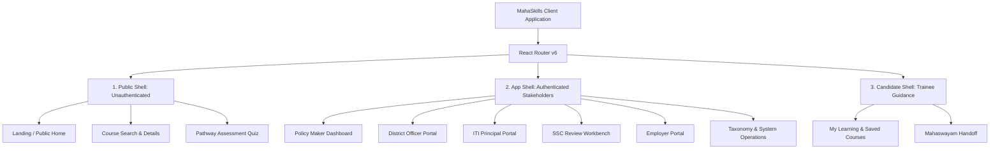

# MahaSkills — Frontend Architecture Specification

**Platform:** MahaSkills · Government of Maharashtra (DSEEI / MSInS)  
**Problem Statement ID:** 26134  
**Primary Tech Stack:** React 18, TypeScript, Vite, Tailwind CSS, shadcn/ui, TanStack Query v5, Zustand, `react-i18next`  
**Version:** 1.0  
**Status:** Canonical Frontend Architecture Baseline  

---

## 1. Architectural Principles & Shell Topology

The MahaSkills frontend is structured around **three distinct layout shells**, ensuring security isolation, accessibility, and clean user experience:



### 1.1 Shell Responsibilities
1. **`PublicShell`**: Anonymous public access. No authentication required. Fast initial load, SEO-optimized static assets, trilingual toggle (Marathi, Hindi, English).
2. **`AppShell`**: Role-gated administrative interface for Government Officials, ITI Principals, SSC Reviewers, and Employers. Enforces Keycloak session guards, persistent role sidebar, breadcrumb navigation, and jurisdictional scope selector.
3. **`CandidateShell`**: Mobile-optimized, distraction-free portal for registered candidates tracking personalized pathways and Mahaswayam course enrollments.

---

## 2. State Management Architecture

MahaSkills maintains strict separation of concerns across state layers:

```text
┌────────────────────────────────────────────────────────────────────────┐
│                        Server State (Async)                            │
│  • Handled exclusively by TanStack Query v5                           │
│  • Stale-while-revalidate caching, query key factories, deduplication   │
│  • Mutation hooks with optimistic updates and cache invalidation       │
└───────────────────────────────────┬────────────────────────────────────┘
                                    │
┌───────────────────────────────────┴────────────────────────────────────┐
│                          UI State (Client)                             │
│  • Handled by lightweight Zustand stores                               │
│  • Active language / locale (`i18nStore`)                              │
│  • Navigation collapse, theme, active drawer (`uiStore`)               │
│  • Course comparison tray (`comparisonStore`)                          │
└───────────────────────────────────┬────────────────────────────────────┘
                                    │
┌───────────────────────────────────┴────────────────────────────────────┐
│                         URL State (Parametric)                         │
│  • Controlled via React Router query parameters (`useSearchParams`)    │
│  • Faceted filters (district, sector, nsqf_level, search keyword)      │
│  • Pagination (`page=1&limit=20`), active tabs, drawer IDs             │
└────────────────────────────────────────────────────────────────────────┘
```

---

## 3. Directory & Component Hierarchy

```text
src/
├── app/                        # Application entry, router, providers
│   ├── routes.tsx              # Central declarative route configuration
│   ├── providers.tsx           # QueryClient, KeycloakAuthProvider, I18nProvider
│   └── App.tsx                 # Root component
├── components/
│   ├── ui/                     # shadcn/ui primitives (Button, Dialog, Table, etc.)
│   ├── common/                 # Reusable cross-module widgets
│   │   ├── LanguageSwitcher.tsx
│   │   ├── ScopeIndicator.tsx
│   │   ├── DataExportButton.tsx
│   │   └── StatusBadge.tsx
│   └── layout/                 # Shells and navigation
│       ├── PublicShell.tsx
│       ├── AppShell.tsx
│       ├── CandidateShell.tsx
│       └── Header.tsx
├── features/                   # Domain-driven vertical slices
│   ├── auth/                   # Keycloak hooks, guards, token refresh
│   ├── lmi/                    # Labour market heatmap, vacancy trends
│   ├── taxonomy/               # NSQF tree viewer, role details, skill picker
│   ├── gap-scoring/            # Gap score cards, oversupply alert tables
│   ├── recommendations/        # Recommendation stepper, dossier viewer, review form
│   ├── employers/              # Skill needs authoring, survey responder
│   ├── placements/             # CSV upload dropzone, validation error grid
│   ├── district-plans/         # Plan builder, intake targets, equipment audits
│   ├── candidates/             # Course finder, 5-question pathway quiz
│   └── admin/                  # Pipeline monitor, audit log table, user management
├── hooks/                      # Shared utility hooks (useDebounce, usePermission)
├── lib/                        # Client libraries (axios client, query-keys, utils)
├── locales/                    # Externalized i18n JSON bundles (en, mr, hi)
└── types/                      # TypeScript domain models generated from OpenAPI
```

---

## 4. Query Key Factory & API Data Integration

To ensure predictable cache invalidation, all queries use centralized query-key factories:

```typescript
export const queryKeys = {
  auth: {
    me: ['auth', 'me'] as const,
    permissions: ['auth', 'permissions'] as const,
  },
  lmi: {
    aggregates: (filters: Record<string, unknown>) => ['lmi', 'aggregates', filters] as const,
    trends: (sectorId?: number) => ['lmi', 'trends', sectorId] as const,
  },
  gapScores: {
    all: ['gap-scores'] as const,
    list: (filters: Record<string, unknown>) => ['gap-scores', 'list', filters] as const,
    detail: (id: string) => ['gap-scores', 'detail', id] as const,
    oversupply: (districtId?: number) => ['gap-scores', 'oversupply', districtId] as const,
  },
  recommendations: {
    all: ['recommendations'] as const,
    list: (status?: string, sscId?: number) => ['recommendations', 'list', { status, sscId }] as const,
    detail: (id: string) => ['recommendations', 'detail', id] as const,
    dossier: (id: string) => ['recommendations', 'dossier', id] as const,
  },
  placements: {
    batches: (instituteId: string) => ['placements', 'batches', instituteId] as const,
    errors: (batchId: string) => ['placements', 'errors', batchId] as const,
  },
  districtPlans: {
    annual: (districtId: number, fiscalYear: string) => ['district-plans', districtId, fiscalYear] as const,
    equipmentGaps: (planId: string) => ['district-plans', planId, 'equipment-gaps'] as const,
  },
};
```

---

## 5. Role-Based Navigation & Access Control

Frontend access is gated across four levels:

1. **Route Level (`RoleGuard.tsx`):** Unauthenticated users are redirected to Keycloak OIDC login. Authenticated users lacking required roles receive an HTTP 403 Access Denied screen.
2. **Scope Level (`TenantScopeGuard.tsx`):** District officers cannot view routes parameterized for other districts.
3. **Component Level (`<PermissionGate>`):** Elements such as "Approve Curriculum" or "Upload CSV" are hidden or disabled if the user lacks granular action permissions.
4. **Action Level:** All form submissions verify permissions before dispatching API mutations.

---

## 6. Trilingual Internationalization (i18n)

* **Primary Language:** Marathi (`mr`) — Default for regional and candidate interfaces.
* **Secondary Languages:** Hindi (`hi`), English (`en`).
* **Zero Hardcoded Strings:** Every visual label, tooltip, table header, and error message is fetched via `useTranslation()`.
* **Font Scaling:** The layout accommodates Devanagari typography with a $+15\%$ vertical line-height buffer and dynamic font-family switching (`Noto Sans Devanagari` / `Inter`).
