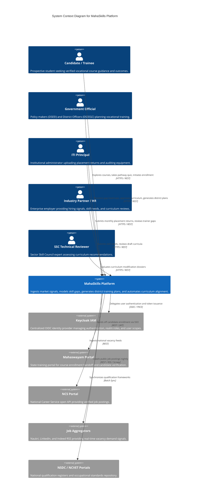
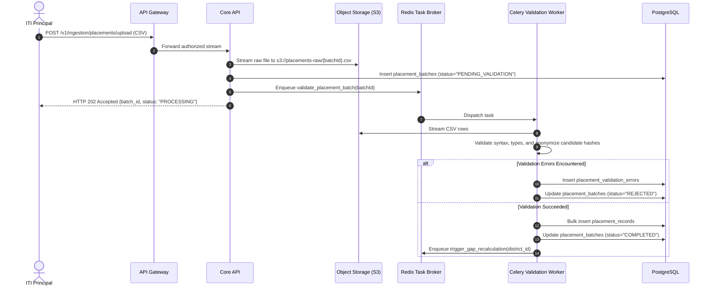

# MahaSkills — System Architecture Specification

**Platform:** MahaSkills · Government of Maharashtra (DSEEI / MSInS)  
**Problem Statement ID:** 26134  
**Version:** 1.0  
**Status:** Canonical Architectural Baseline  

---

## 1. Architectural Vision & Principles

MahaSkills is designed as an enterprise-grade, distributed, cloud-native intelligence platform. The architecture is engineered to satisfy the following foundational design principles:

1. **Traceable Evidence Loops:** Every curriculum update or budget allocation recommendation must be programmatically backed by verifiable market data trails.
2. **Strict Multi-Tenant Scoping:** Government officials, district officers, and institute principals operate within cryptographically enforced jurisdictional boundaries (`district_id`, `institute_id`).
3. **Privacy by Design (DPDP 2023):** Zero storage of unencrypted student Personally Identifiable Information (PII); placement data is anonymized at the ingestion perimeter.
4. **Resilient Asynchrony:** Intensive web crawling, NLP parsing, placement batch validation, and analytical gap recalculations are completely decoupled from user-facing synchronous API transactions.
5. **Contract-First Development:** Strict OpenAPI 3.1 contracts serve as the single source of truth for both backend service implementations and frontend client generation.

---

## 2. C4 Architecture Models

### 2.1 C4 Level 1: System Context Diagram

The System Context diagram illustrates MahaSkills in relation to external users, government systems, and data providers:



---

### 2.2 C4 Level 2: Container Diagram

The Container diagram decomposes MahaSkills into its high-level technical runtime environments:

```mermaid
C4Container
    title Container Diagram for MahaSkills Platform

    Person(user, "Platform User", "Authenticated official, employer, or candidate.")

    Container(frontend_app, "Single Page Application (SPA)", "React 18, TypeScript, Tailwind, shadcn/ui", "Delivers responsive, localized (MR/HI/EN) accessible interfaces across Public, App, and Candidate shells.")
    Container(api_gateway, "API Gateway / Reverse Proxy", "Kong / Nginx", "Handles TLS termination, rate limiting, request routing, and Keycloak JWT validation.")
    
    Container_Boundary(backend_services, "Application & Intelligence Services")
        Container(core_api, "Core Application API", "Python FastAPI / Node.js", "Manages CRUD, RBAC scope enforcement, district planning, and workflow state machines.")
        Container(analytics_engine, "Gap & Recommendation Engine", "Python, Celery, scikit-learn", "Asynchronously computes gap scores, oversupply alerts, and compiles curriculum evidence dossiers.")
        Container(ingestion_workers, "Data Ingestion & Scrapers", "Apache Airflow, Scrapy, Playwright", "Scheduled scraping of job boards, deduplication, and ITI placement CSV batch processing.")
    Container_Boundary_End()

    ContainerDb(relational_db, "Relational Database", "PostgreSQL 16", "Authoritative transactional data store for users, taxonomy, placements, gap scores, and audit trails.")
    ContainerDb(search_db, "Taxonomy & Job Search Index", "Elasticsearch 8", "High-speed full-text search, NLP synonym mapping, and fuzzy taxonomy role matching.")
    ContainerDb(cache_store, "Cache & Broker", "Redis 7", "Distributed session storage, query caching, API rate limit counters, and Celery task broker.")
    ContainerDb(object_store, "Object Storage", "MinIO / AWS S3", "Secure storage for raw placement CSVs, curriculum PDF dossiers, and evidence artifacts.")

    Rel(user, frontend_app, "Interacts via Web Browser", "HTTPS")
    Rel(frontend_app, api_gateway, "Makes authenticated REST calls", "HTTPS / JSON")
    Rel(api_gateway, core_api, "Proxies validated requests", "HTTP / JSON")
    Rel(core_api, relational_db, "Queries and updates transactional state", "TCP / PostgreSQL Wire Protocol")
    Rel(core_api, search_db, "Executes full-text taxonomy searches", "HTTP / JSON")
    Rel(core_api, cache_store, "Fetches cached stats and verifies sessions", "TCP / Redis Protocol")
    Rel(core_api, object_store, "Generates pre-signed upload/download URLs", "S3 API")
    Rel(core_api, cache_store, "Dispatches background tasks to Celery", "Redis Queue")

    Rel(analytics_engine, relational_db, "Reads aggregated data, writes gap scores", "SQL")
    Rel(analytics_engine, cache_store, "Pulls computation tasks and invalidates caches", "Redis")
    Rel(analytics_engine, object_store, "Persists generated PDF evidence dossiers", "S3 API")

    Rel(ingestion_workers, relational_db, "Persists validated postings and placement batches", "SQL")
    Rel(ingestion_workers, search_db, "Indexes new job vacancies and extracted skills", "HTTP")
    Rel(ingestion_workers, object_store, "Archives raw CSVs and scrape dumps", "S3 API")
```

---

## 3. Core Subsystems & Service Boundaries

MahaSkills partitions business responsibilities across clean domain modules:

```text
                               ┌─────────────────────────┐
                               │       API Gateway       │
                               └────────────┬────────────┘
                                            │
        ┌───────────────┬───────────────────┼───────────────────┬───────────────┐
        │               │                   │                   │               │
        ▼               ▼                   ▼                   ▼               ▼
┌──────────────┐ ┌──────────────┐    ┌──────────────┐    ┌──────────────┐ ┌──────────────┐
│ Auth & Scope │ │ Taxonomy &   │    │ Gap Scoring  │    │ Curriculum   │ │ District     │
│ Service      │ │ NLP Service  │    │ Engine       │    │ Review Flow  │ │ Plans & Asset│
└──────────────┘ └──────────────┘    └──────────────┘    └──────────────┘ └──────────────┘
        │               │                   │                   │               │
        ▼               ▼                   ▼                   ▼               ▼
┌──────────────┐ ┌──────────────┐    ┌──────────────┐    ┌──────────────┐ ┌──────────────┐
│ Ingestion &  │ │ Employer     │    │ Candidate    │    │ Audit Log &  │ │ Notification │
│ Placements   │ │ Engagement   │    │ Guidance     │    │ Observability│ │ Engine       │
└──────────────┘ └──────────────┘    └──────────────┘    └──────────────┘ └──────────────┘
```

### 3.1 Auth & Scope Service
* **Keycloak Integration:** Validates RS256 JWT access tokens, extracts realm roles (`POLICY_MAKER`, `DISTRICT_OFFICER`, etc.), and populates tenant context (`district_id`, `institute_id`, `sector_id`).
* **Enforcement:** Executes coarse-grained endpoint authorization and fine-grained row-level security (RLS) filters.

### 3.2 Skill Taxonomy & NLP Engine
* **Taxonomy Registry:** Maintains canonical hierarchy: 33 Sectors $\rightarrow$ 36 SSCs $\rightarrow$ 2,200 Job Roles $\rightarrow$ 15,000+ Skills.
* **NLP Pipeline:** Tokenizes raw job descriptions using spaCy/Transformers, extracts entity n-grams, and executes cosine similarity matching against taxonomy embeddings stored in Elasticsearch.

### 3.3 Gap Scoring & Oversupply Engine
* **Computation Worker:** Scheduled weekly batch execution computing standardized gap scores across all 36 districts and 33 sectors.
* **Oversupply Detector:** Continuously cross-references 4-quarter placement trends against local demand percentiles to generate decommission flags.

### 3.4 Curriculum Recommendation & Evidence Workflow
* **Proposal Engine:** Evaluates persistent gap scores ($> 60$ for $\ge 8$ weeks) and synthesizes actionable recommendations.
* **Evidence Compiler:** Automatically bundles 12-month demand graphs, hiring enterprise lists, and interstate syllabus comparisons into an immutable evidence dossier.
* **State Machine:** Governs transitions: `Draft` $\rightarrow$ `Under SSC Review` $\rightarrow$ `SSC Approved / Revisions Requested` $\rightarrow$ `DSEEI Final Approval` $\rightarrow$ `Published`.

### 3.5 Ingestion & Placement Processing
* **Scraper Fleet:** Multi-threaded scrapers with rotating proxy pools ingesting job vacancies nightly.
* **CSV Validation Engine:** Streaming parser handling 50,000-row placement CSVs with sub-second header checks, cell validation, and student PII pseudonymization.

### 3.6 District Training Plan & Asset Audit
* **Plan Synthesizer:** Aggregates macroeconomic gap projections, historical training throughput, and local industrial needs into unified district annual plans.
* **Asset Auditor:** Performs automated diffs between NCVET syllabus mandatory tool registers and ITI asset uploads to compute precise modernization budgets.

---

## 4. Asynchronous Data Pipelines & Background Tasks



---

## 5. Caching & Performance Strategy

To satisfy NFR-01 (sub-300ms API response, sub-2.0s analytical page loads):

| Cache Level | Technology | Target Data | TTL | Invalidation Trigger |
|:---|:---|:---|:---|:---|
| **L1 (Client Query)** | TanStack Query | Active user view, filter states, taxonomy subtrees | 5 mins | Route change, explicit mutation |
| **L2 (Edge / Gateway)** | Nginx / CloudFront | Static localized JSON translation files, asset images | 24 hours | Release deployment |
| **L3 (Application)** | Redis 7 | District gap score heatmaps, macroeconomic totals | 1 hour | Weekly gap engine completion |
| **L4 (Database)** | Postgres Materialized Views | Heavy multi-table placement analytics, annual trends | 6 hours | Nightly ingestion batch refresh |

---

## 6. Resilience, Fault Tolerance & Disaster Recovery

1. **Circuit Breakers:** External API integrations (e.g., Mahaswayam SSO, GSTIN verification) utilize Resilience4j/PyBreaker patterns. If downstream endpoints fail, requests gracefully degrade or queue for retry.
2. **Stateless API Services:** All application containers are strictly stateless, enabling seamless horizontal auto-scaling in Kubernetes based on CPU and request latency triggers.
3. **Database Multi-AZ Replication:** PostgreSQL utilizes synchronous streaming replication to a hot standby in an alternate Availability Zone in the AWS Mumbai region, ensuring an RTO $< 15$ minutes and RPO $< 1$ minute.
