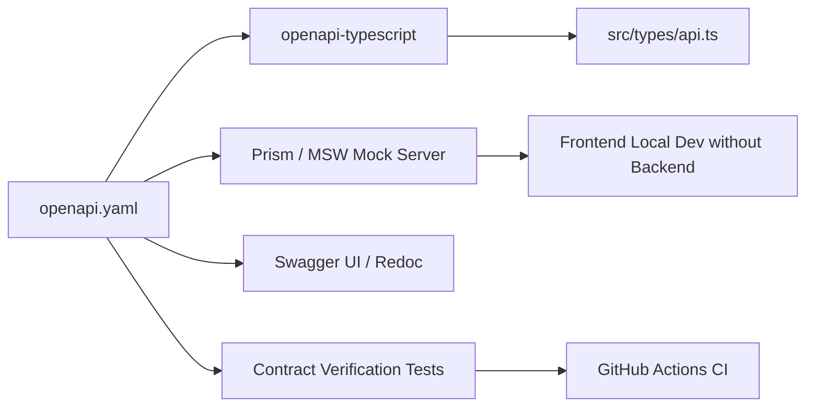

# MahaSkills — API Contracts & Client Code Generation

**Platform:** MahaSkills · Government of Maharashtra (DSEEI / MSInS)  
**Contract Source:** [`openapi.yaml`](file:///e:/CODING/Projects/new%20sih2026/docs/03-api/openapi.yaml)  
**Version:** 1.0  
**Status:** Canonical Contract Guide Baseline  

---

## 1. Single Source of Truth Principle

The OpenAPI specification at [`docs/03-api/openapi.yaml`](file:///e:/CODING/Projects/new%20sih2026/docs/03-api/openapi.yaml) is the non-negotiable contract between backend service implementations and frontend consumers. Neither team should manually write API schemas or data interfaces.



---

## 2. Generating TypeScript Interfaces

To synchronize the frontend TypeScript types directly from the OpenAPI contract:

```bash
# Generate types from the local OpenAPI schema
npx openapi-typescript docs/03-api/openapi.yaml -o src/types/api.ts
```

This generates strictly typed schemas for all entities and API endpoints:
```typescript
import { paths, components } from '@/types/api';

export type UserProfile = components['schemas']['UserResponse']['data'];
export type GapScoreItem = components['schemas']['GapScoreListResponse']['data'][number];
export type PathwayQuizInput = components['schemas']['PathwayQuizRequest'];
```

---

## 3. Mocking & Local Development (Mock Service Worker / Prism)

Frontend developers can build against the API contract even before backend endpoints are deployed:

### 3.1 Running Prism Mock Server
```bash
# Spin up an instantaneous local mock server on port 4010
npx @stoplight/prism-cli mock docs/03-api/openapi.yaml -p 4010
```

### 3.2 Mock Service Worker (MSW) Integration
MSW handlers in `src/mocks/handlers.ts` adhere to `paths` defined in the contract:
```typescript
import { http, HttpResponse } from 'msw';

export const handlers = [
  http.get('*/v1/auth/me', () => {
    return HttpResponse.json({
      success: true,
      data: {
        id: 'f3a18b72-2d10-4491-a189-9e1201ab78c1',
        email: 'dpo.pune@gov.in',
        full_name: 'Dr. Rajesh Patil',
        roles: ['DISTRICT_OFFICER'],
        scopes: { district_id: 14, district_name: 'Pune' }
      }
    });
  }),
];
```

---

## 4. Contract Linting & CI Verification

In CI pipelines, OpenAPI contracts are validated using Spectral to catch breaking schema modifications:
```bash
npx @stoplight/spectral-cli lint docs/03-api/openapi.yaml
```
Breaking changes (e.g. removing fields, altering types, or adding non-nullable parameters) fail the PR verification gate automatically.
