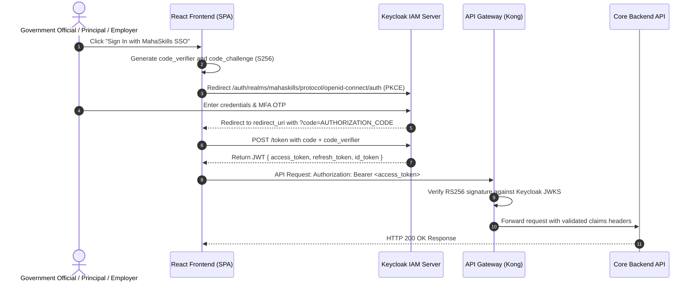

# MahaSkills — Authentication & Identity Architecture

**Platform:** MahaSkills · Government of Maharashtra (DSEEI / MSInS)  
**IAM Provider:** Keycloak 24 (OIDC 1.0 & OAuth 2.0)  
**Version:** 1.0  
**Status:** Canonical Identity & Authentication Baseline  

---

## 1. Authentication Topology & Protocols

MahaSkills uses **Keycloak** as the centralized Identity and Access Management (IAM) provider for all authenticated roles. Public candidates can access exploratory tools anonymously or authenticate for personalized pathways via Mahaswayam Single Sign-On (SSO).



---

## 2. Token Anatomy & Claims Structure

Keycloak issues RS256-signed JSON Web Tokens (JWT). The platform injects jurisdictional scoping claims into the token payload:

```json
{
  "exp": 1788739200,
  "iat": 1788735600,
  "jti": "d3b07384-91f2-482a-a92c-7b41e9b28312",
  "iss": "https://auth.mahaskills.maharashtra.gov.in/realms/mahaskills",
  "aud": "mahaskills-api",
  "sub": "8c3b01a2-9b98-4b71-9f20-8012bcfe1430",
  "typ": "Bearer",
  "azp": "mahaskills-web",
  "preferred_username": "rajesh.patil",
  "email": "dpo.pune@gov.in",
  "email_verified": true,
  "realm_access": {
    "roles": [
      "DISTRICT_OFFICER"
    ]
  },
  "district_id": 14,
  "district_name": "Pune",
  "division": "Pune",
  "institute_id": null,
  "sector_ids": []
}
```

### 2.1 Role-Specific Scoping Attributes
* **`POLICY_MAKER`**: `district_id = null` (Statewide visibility across all 36 districts).
* **`DISTRICT_OFFICER`**: `district_id = [Integer]` (Strictly scoped to designated district).
* **`ITI_PRINCIPAL`**: `district_id = [Integer]`, `institute_id = [UUID]` (Scoped to individual ITI).
* **`SSC_REVIEWER`**: `sector_ids = [Array of Sector IDs]` (Scoped to assigned Sector Skill Council domains).
* **`EMPLOYER`**: `employer_id = [UUID]`, `gstin = [String]`.

---

## 3. Token Lifecycle & Session Management

| Token Type | Lifetime | Storage Location | Rotation / Revocation |
|:---|:---|:---|:---|
| **Access Token** | 15 minutes | In-memory JavaScript closure | Ephemeral; never saved to `localStorage` |
| **Refresh Token** | 8 hours | `HttpOnly`, `Secure`, `SameSite=Strict` Cookie | Rotated on every token refresh request |
| **Silent Refresh** | Before expiry | Background iframe / timer | Automatically refreshed at $T - 60\text{s}$ |

---

## 4. Backend Security Middleware Verification

1. **Signature Verification:** The API Gateway validates tokens against Keycloak's JSON Web Key Set (`JWKS`) endpoint, cached with an hourly TTL.
2. **Audience & Issuer Check:** `iss` must match the official realm URI, and `aud` must include `mahaskills-api`.
3. **Scope Enforcement Filter:** FastAPI dependency `get_current_security_context()` enforces that `district_id` in path or query parameters matches the claim in the JWT:
```python
def verify_district_scope(requested_district_id: int, ctx: SecurityContext = Depends(get_security_context)):
    if "POLICY_MAKER" in ctx.roles or "ADMIN" in ctx.roles:
        return
    if ctx.district_id != requested_district_id:
        raise HTTPException(status_code=403, detail="Cross-district access forbidden.")
```
