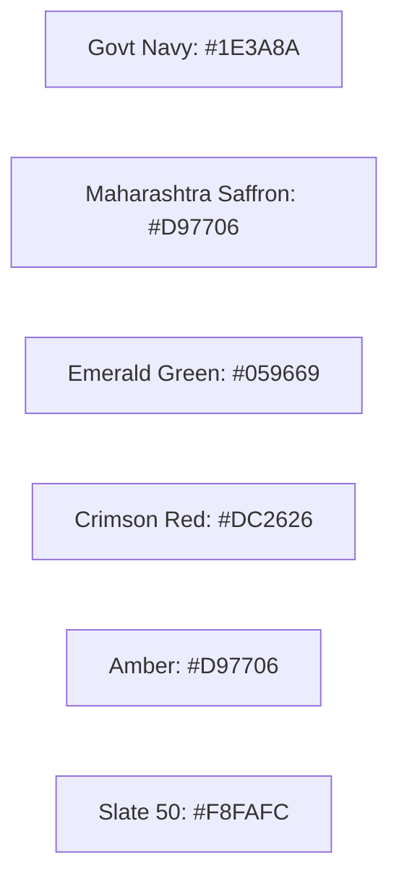

# MahaSkills — Design System & Tokens Specification

**Platform:** MahaSkills · Government of Maharashtra (DSEEI / MSInS)  
**Problem Statement ID:** 26134  
**Framework:** Tailwind CSS + Radix UI / shadcn/ui  
**Version:** 1.0  
**Status:** Canonical Design Tokens Baseline  

---

## 1. Color Tokens & Semantic Palette

The MahaSkills color system combines authoritative government aesthetics with accessible contrast ratios ($\ge 4.5:1$ for normal text, $\ge 3:1$ for large text):



### 1.1 CSS Variable Tokens
```css
:root {
  /* Brand Foundations */
  --primary: 221.2 83.2% 32.5%;             /* Deep Maharashtra Navy #1E3A8A */
  --primary-foreground: 210 40% 98%;
  --accent: 37.7 92.1% 44.1%;               /* State Saffron Accent #D97706 */
  --accent-foreground: 210 40% 98%;

  /* Neutral Backgrounds & Text */
  --background: 210 40% 98%;               /* Slate 50 */
  --foreground: 222.2 84% 4.9%;            /* Slate 950 */
  --card: 0 0% 100%;                       /* Pure White */
  --card-foreground: 222.2 84% 4.9%;
  --muted: 210 40% 96.1%;
  --muted-foreground: 215.4 16.3% 46.9%;
  --border: 214.3 31.8% 91.4%;

  /* Semantic Feedback */
  --destructive: 0 84.2% 60.2%;            /* Crimson Red */
  --destructive-foreground: 210 40% 98%;
  --success: 152 76% 36%;                  /* Emerald Green */
  --warning: 38 92% 50%;                   /* Amber */

  /* Gap Severity Scale */
  --gap-low: 152 76% 36%;                  /* Low Gap / Balanced */
  --gap-moderate: 45 93% 47%;              /* Moderate Gap */
  --gap-high: 25 95% 53%;                  /* High Deficit */
  --gap-critical: 0 84% 60%;               /* Critical Shortage */
}
```

---

## 2. Typography & Bilingual Font Scale

* **Latin Typography:** `Inter`, system-ui, sans-serif.
* **Devanagari Typography (Marathi & Hindi):** `Noto Sans Devanagari`, sans-serif.
* **Devanagari Line-Height Compensation:** All headings and body blocks apply a $+15\%$ line-height modifier when `lang="mr"` or `lang="hi"` to avoid clipping Devanagari matras (vowel diacritics).

| Token | Size | Line Height | Weight | Usage |
|:---|:---|:---|:---|:---|
| `text-xs` | 12px (0.75rem) | 16px | 400 / 500 | Metadata, timestamps, badge labels |
| `text-sm` | 14px (0.875rem)| 20px | 400 / 500 | Table cell content, form hints |
| `text-base` | 16px (1.0rem) | 24px | 400 / 500 | Body prose, input field text |
| `text-lg` | 18px (1.125rem)| 28px | 600 | Card titles, navigation items |
| `text-xl` | 20px (1.25rem) | 28px | 600 / 700 | Subsection headers, modal titles |
| `text-2xl` | 24px (1.5rem) | 32px | 700 | Primary screen headers |
| `text-3xl` | 30px (1.875rem)| 36px | 800 | Hero headlines, large KPI values |

---

## 3. Spacing & Layout Tokens

* **Base Grid:** 4px baseline unit.
* **Spacing Scale:**
  * `space-1`: 4px | `space-2`: 8px | `space-3`: 12px | `space-4`: 16px
  * `space-6`: 24px | `space-8`: 32px | `space-12`: 48px | `space-16`: 64px
* **Card Elevation:**
  * Standard: `shadow-sm` (`0 1px 2px 0 rgb(0 0 0 / 0.05)`)
  * Hover: `hover:shadow-md` (`0 4px 6px -1px rgb(0 0 0 / 0.1)`)
  * Modal: `shadow-xl` (`0 20px 25px -5px rgb(0 0 0 / 0.1)`)
