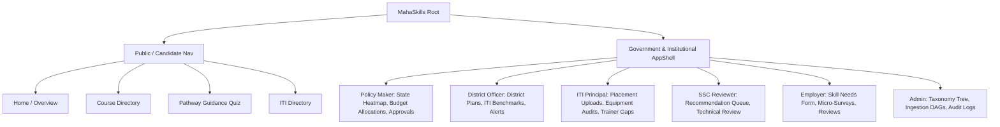

# MahaSkills — Information Architecture & Navigation

**Platform:** MahaSkills · Government of Maharashtra (DSEEI / MSInS)  
**Problem Statement ID:** 26134  
**Version:** 1.0  
**Status:** Canonical Information Architecture Baseline  

---

## 1. Global Sitemap & Navigation Hierarchies by Role

---

## 2. Detailed Navigation Trees

### 2.1 Policy Maker (`POLICY_MAKER`)
* **State Overview (`/dashboard/policy-maker`):** Statewide gap heatmap, top 10 demanded trades, macro placement rates.
* **Curriculum Approvals (`/recommendations/approvals`):** Dossier queue awaiting Joint Secretary sign-off.
* **Budget Allocation (`/district-plans/budget-model`):** Capital grant allocation modeling across districts.
* **LMI Analytics (`/analytics/lmi`):** Vacancy trend projections and sector growth curves.

### 2.2 District Officer (`DISTRICT_OFFICER`)
* **District Workbench (`/dashboard/district-officer`):** Local trade gap scores and operational alerts.
* **District Training Plans (`/district-plans`):** Annual plan builder, target intake synthesizer.
* **ITI Monitoring (`/placements/benchmarks`):** Institute placement rates vs. district median.
* **Equipment Audits (`/district-plans/equipment-deficits`):** Machinery gaps across local ITIs.

### 2.3 ITI Principal (`ITI_PRINCIPAL`)
* **Institute Overview (`/dashboard/iti`):** Institute placement status and sanctioned courses.
* **Monthly Placement Upload (`/placements/upload`):** CSV upload dropzone and error validator.
* **Course Performance (`/courses/performance`):** Course-by-course placement rates vs. district benchmarks.
* **Asset Register (`/iti/assets`):** Workshop machinery inventory and deficit flags.

### 2.4 Sector Skill Council Reviewer (`SSC_REVIEWER`)
* **Review Workbench (`/recommendations/review-queue`):** Incoming curriculum update proposals.
* **Evidence Dossier Viewer (`/recommendations/:id/dossier`):** Real-time empirical market data package.
* **Taxonomy Alignment (`/taxonomy/roles`):** National Occupational Standards (NOS) mapping.

### 2.5 Industry Partner / Employer (`EMPLOYER`)
* **Employer Dashboard (`/employer/dashboard`):** Active hiring signals and submissions.
* **Submit Skill Needs (`/employer/skill-needs`):** Quarterly trade demand specification.
* **Curriculum Validation (`/employer/curriculum-reviews`):** Industry feedback on draft syllabi.
* **Micro-Surveys (`/employer/surveys`):** Rapid 2-minute sector skill pulse surveys.

### 2.6 Trainee / Candidate (`CANDIDATE` & Public)
* **Explore Courses (`/candidate/courses`):** Verified placement statistics and salary benchmarks.
* **Pathway Quiz (`/candidate/pathway`):** 5-step adaptive career guidance flow.
* **My Enrolled Courses (`/candidate/dashboard`):** Mahaswayam course handoff and status.

---

## 3. Global Search Scope & Exclusions

In accordance with **DPDP Act 2023** and architectural decision **ADR-005**:
* **Included in Global Search:** Job Roles, Competency Skills, Vocational Courses, ITI Institutes, Sectors, Curriculum Recommendations.
* **Strictly Excluded from Global Search:** Candidate names, roll numbers, student records, and placement identifiers. There is **zero candidate search** across the entire platform.
