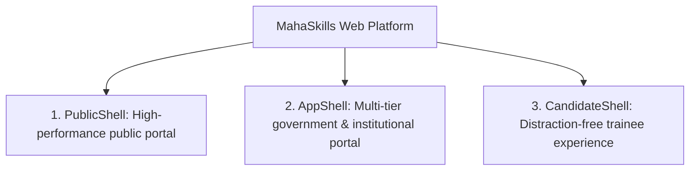

# MahaSkills — UI/UX Design Specification

**Platform:** MahaSkills · Government of Maharashtra (DSEEI / MSInS)  
**Problem Statement ID:** 26134  
**Primary Design System:** Radix UI / shadcn/ui + Tailwind CSS  
**Version:** 1.0  
**Status:** Canonical UI/UX Specification Baseline  

---

## 1. Shell Design & Navigation Framework

MahaSkills partitions user experience across **three core application shells**:

### 1.1 Shell Topologies & Responsive Breakpoints
* **Desktop ($> 1280\text{px}$):** Persistent 260px collapsible sidebar in `AppShell`, sticky header with jurisdictional scope badge and language selector.
* **Tablet ($768\text{px} - 1279\text{px}$):** Collapsible off-canvas drawer navigation, responsive table scroll containers with frozen primary columns.
* **Mobile ($< 768\text{px}$):** Candidate-first layout; bottom navigation bar for candidates, stacked cards replacing multi-column analytical tables.

---

## 2. Key Screen & Interface Specifications

### 2.1 Policy Maker State Dashboard (`/dashboard/policy-maker`)
* **Statewide Choropleth Heatmap:** Interactive map of Maharashtra highlighting all 36 districts colored by aggregated Skill Gap Intensity (`LOW`, `MODERATE`, `HIGH`, `CRITICAL`). Tooltip exposes active vacancies and ITI placement rates.
* **Top 10 Priority Interventions:** Ranked tabular cards displaying trades requiring urgent curriculum update or seat expansion.
* **Budget Model Visualizer:** Interactive bar charts contrasting proposed capital grant allocations against local industrial growth rates.

### 2.2 District Officer Workbench (`/dashboard/district-officer`)
* **District Plan Stepper:** 4-stage progress tracker for annual training plan generation:
  1. *Demand Extraction* $\rightarrow$ 2. *ITI Capacity Allocation* $\rightarrow$ 3. *Equipment Deficit Review* $\rightarrow$ 4. *Submission*.
* **ITI Compliance Monitor:** Real-time leaderboard tracking monthly placement return submissions across all district ITIs.

### 2.3 ITI Placement Upload Portal (`/placements/upload`)
* **Drag-and-Drop CSV Dropzone:** Visual drag zone with instant client-side file size and header check.
* **Inline Validation Error Grid:** Virtualized error table detailing exact row numbers, erroneous column values, and bilingual correction guidance.

### 2.4 SSC Curriculum Review Workbench (`/recommendations/:id/review`)
* **Dual-Pane Evaluation Layout:** Left pane displays the auto-compiled Evidence Dossier (12-month vacancy trend curves, top hiring companies, interstate benchmark comparisons). Right pane provides the formal technical review action form (`Approve`, `Request Revisions`, `Reject`).

### 2.5 Candidate Guidance & Pathway Quiz (`/candidate/pathway`)
* **5-Step Adaptive Career Quiz:** Wizard UI asking:
  1. *Current Educational Qualification*
  2. *Geographic District / Taluka*
  3. *Primary Sector Interests*
  4. *Language Preference*
  5. *Relocation Mobility*.
* **Outcome Cards:** Top 3 recommended courses featuring Verified Placement Rate, Median Starting Salary ($₹$), and "Enroll via Mahaswayam" primary CTA.

---

## 3. Universal State Patterns

| State | Visual Treatment & User Guidance |
|:---|:---|
| **Loading** | Accessible pulse skeletons replicating table/card layout. Zero blocking full-page spinners. |
| **Empty** | Contextual SVG illustration, clear descriptive heading, and a direct primary action button (e.g., "Upload First Placement Return"). |
| **Error** | Non-destructive alert banners with distinct error codes, retry buttons, and helpdesk contact details. |
| **Form Error** | Inline red border highlighting (`border-destructive`), ARIA `aria-invalid="true"`, and specific error text below the input. |
