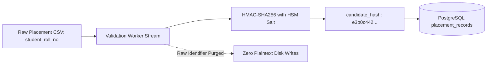

# MahaSkills — Data Privacy & DPDP Act 2023 Compliance

**Platform:** MahaSkills · Government of Maharashtra (DSEEI / MSInS)  
**Problem Statement ID:** 26134  
**Primary Regulatory Framework:** Digital Personal Data Protection (DPDP) Act 2023 (India)  
**Version:** 1.0  
**Status:** Canonical Data Privacy Baseline  

---

## 1. Statutory Context & Principles

MahaSkills processes vocational education and post-training employment returns on behalf of the Government of Maharashtra. Under the **Digital Personal Data Protection (DPDP) Act 2023**, the platform functions as a **Data Fiduciary** committed to:

1. **Lawful & Specified Purpose:** Personal data is collected solely to evaluate vocational curriculum effectiveness and calculate empirical skill gap scores.
2. **Data Minimization:** No unnecessary personal attributes (Aadhaar numbers, caste/religion identifiers, home addresses) are ingested or stored.
3. **Pseudonymization at Ingestion:** Candidate identities are cryptographically hashed before crossing into transactional databases.
4. **Zero Public Searchability:** The platform provides **zero candidate directory** and **zero employer-facing candidate search** in v1.
5. **Right to Erasure & Shredding:** Candidate pseudonymization keys are rotated and purged after 36 months, rendering records permanently de-linked.

---

## 2. Personal Data Inventory & Collection Justification

| Data Element | Source | Purpose of Processing | DPDP Justification | Storage State |
|:---|:---|:---|:---|:---|
| **Student Roll Number / Enrollment ID** | ITI Monthly Placement CSV | Verifying graduate employment status | Performance auditing of public vocational funds | Converted immediately to HMAC-SHA256; raw string purged |
| **Monthly Placement Salary** | ITI Monthly Placement CSV | Calculating median starting salaries per trade | Public transparency for prospective candidates | Persisted as aggregate statistics; individual records restricted |
| **Hiring Employer Name** | ITI Monthly Placement CSV | Measuring industry placement absorption | Curriculum alignment evidence | Persisted in placement returns |
| **Govt Official Name & Email** | Keycloak IAM | System authentication & audit logging | Legitimate state administrative operations | Plaintext with RBAC access gates |
| **Employer GSTIN & Contact** | Employer Registration | Verifying legal corporate identity | Preventing fraudulent skill demand submissions | Plaintext verified via MCA/GST portal |

---

## 3. Cryptographic Anonymization Pipeline

* **Tenant-Isolated Salt:** The HMAC salt is generated within an AWS CloudHSM / KMS enclave and is never accessible to database administrators.
* **Non-Reversibility:** Even in the event of a full database breach, candidate records cannot be converted back into student roll numbers or real-world names without access to the isolated HSM key.

---

## 4. Candidate Rights & DPDP Workflows

1. **Right to Confirmation & Correction:** Candidates may verify their training and placement record through their secure Mahaswayam SSO portal.
2. **Right to Grievance Redressal:** An in-app Data Protection Officer (DPO) ticketing workflow allows citizens to report data inaccuracies or unauthorized record submissions.
3. **Right to Erasure (Crypto-Shredding):** Upon completion of the statutory 3-year observation window, candidate pseudonymization salts are rotated. Historical placement records become mathematically impossible to re-identify, preserving aggregate econometric counts while fulfilling absolute right-to-erasure.

---

## 5. Data Breach Notification Protocol

In compliance with DPDP Act Section 8(6) and CERT-In directions:
1. **Detection & Containment:** SecOps isolates affected network segments within 60 minutes of alert trigger.
2. **Regulatory Notice:** Formal notification to the Data Protection Board of India and CERT-In within 6 hours.
3. **Citizen Notification:** Impacted Data Principals notified via registered SMS/email with mitigation advisories.
