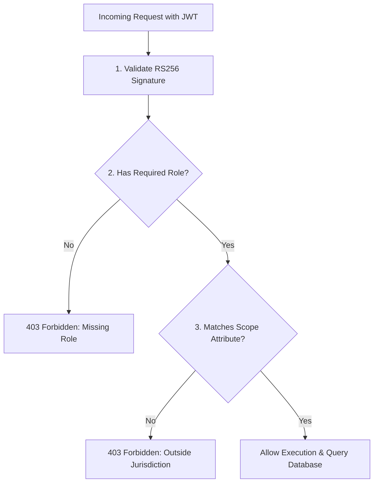

# MahaSkills — Role-Based Access Control (RBAC) Matrix

**Platform:** MahaSkills · Government of Maharashtra (DSEEI / MSInS)  
**Problem Statement ID:** 26134  
**Version:** 1.0  
**Status:** Canonical RBAC Matrix Baseline  

---

## 1. Access Control Model Overview

MahaSkills implements an enterprise **Role-Based Access Control (RBAC)** architecture coupled with **Attribute-Based Access Control (ABAC)** for jurisdictional scoping (`district_id`, `institute_id`, `sector_id`). 

* **Frontend Role:** Route guards, component rendering conditions, and UI action disabling provide user feedback.
* **Backend Role:** The backend API Gateway and service dependency injection act as the non-bypassable security boundary.



---

## 2. Master Role × Resource × Action × Scope Matrix

| Resource | Action | Role | Jurisdictional Scope Constraint | Backend Guard Rule | Frontend Guard |
|:---|:---|:---|:---|:---|:---|
| **LMI Analytics** | `READ` | `POLICY_MAKER`, `ADMIN` | Statewide (All 36 Districts) | Unrestricted read | `/analytics/lmi` |
| **LMI Analytics** | `READ` | `DISTRICT_OFFICER` | Assigned district only | `district_id == user.district_id` | District Filter locked |
| **LMI Analytics** | `READ` | `ITI_PRINCIPAL` | Assigned district only | `district_id == user.district_id` | District Filter locked |
| **LMI Analytics** | `READ` | `EMPLOYER`, `CANDIDATE` | Aggregated state summaries only | Strip raw posting metadata | Public summary view |
| **Taxonomy** | `READ` | All Authenticated & Public | Global | Public read | `/taxonomy` |
| **Taxonomy** | `CREATE`, `UPDATE` | `ADMIN` | Global | Full write permission | `/admin/taxonomy` |
| **Gap Scores** | `READ` | `POLICY_MAKER`, `ADMIN` | Statewide (All 36 Districts) | Full read | `/gap-analysis` |
| **Gap Scores** | `READ` | `DISTRICT_OFFICER` | Assigned district only | `district_id == user.district_id` | Scoped to own district |
| **Gap Scores** | `RECALCULATE` | `ADMIN` | System-wide trigger | Admin role required | Admin maintenance panel |
| **Recommendations** | `READ` | All Roles | Statewide / Sector scoped | Public & internal summaries | `/recommendations` |
| **Recommendations** | `REVIEW` | `SSC_REVIEWER` | Assigned Sector SSCs only | `rec.sector_id in user.sector_ids` | Review button active |
| **Recommendations** | `APPROVE` | `POLICY_MAKER` | Statewide | DSEEI sign-off role | Approve button active |
| **Placement Returns**| `UPLOAD` | `ITI_PRINCIPAL` | Own Institute only | `institute_id == user.institute_id`| `/placements/upload` |
| **Placement Returns**| `READ_ERRORS` | `ITI_PRINCIPAL` | Own Institute only | `institute_id == user.institute_id`| View error grid |
| **Placement Returns**| `READ_RECORDS`| `DISTRICT_OFFICER` | Own District ITIs (anonymized) | `inst.district_id == user.district_id`| District benchmark view |
| **Placement Returns**| `READ_RECORDS`| `POLICY_MAKER`, `ADMIN` | Statewide (anonymized) | Read all anonymized returns | State benchmark view |
| **District Plans** | `CREATE`, `UPDATE`| `DISTRICT_OFFICER` | Own District only | `district_id == user.district_id` | `/district-plans/builder` |
| **District Plans** | `SANCTION` | `POLICY_MAKER` | Statewide | DSEEI Director role required | Sanction budget button |
| **District Plans** | `READ` | `ITI_PRINCIPAL` | Own District targets only | `district_id == user.district_id` | View assigned quotas |
| **Skill Needs** | `CREATE`, `UPDATE`| `EMPLOYER` | Registered enterprise profile | `employer_id == user.employer_id` | `/employer/skill-needs` |
| **Candidate Guidance**| `READ`, `QUIZ`| `CANDIDATE`, `ANONYMOUS`| Public | Open endpoints | `/candidate/pathway` |
| **Audit Logs** | `READ` | `ADMIN` | System-wide | Superadmin role required | `/admin/audit-logs` |
| **System Health** | `READ` | `ADMIN` | System-wide | Ops role required | `/admin/health` |

---

## 3. Scope Verification Implementation Details

### 3.1 Backend Security Middleware (FastAPI)
```python
def require_district_scope(requested_district_id: int, user: UserClaims = Depends(get_current_user)):
    if "POLICY_MAKER" in user.roles or "ADMIN" in user.roles:
        return  # Statewide override
    if "DISTRICT_OFFICER" in user.roles and user.district_id == requested_district_id:
        return  # Authorized district scope
    raise HTTPException(
        status_code=status.HTTP_403_FORBIDDEN,
        detail="Access denied: Resource outside jurisdictional district boundary."
    )
```

### 3.2 Frontend Route Guard (`TenantScopeGuard.tsx`)
```tsx
export const TenantScopeGuard = ({ requiredDistrictId, children }: Props) => {
  const { user } = useAuth();
  if (user.roles.includes('POLICY_MAKER') || user.roles.includes('ADMIN')) {
    return <>{children}</>;
  }
  if (user.district_id !== requiredDistrictId) {
    return <Navigate to="/unauthorized-scope" replace />;
  }
  return <>{children}</>;
};
```
