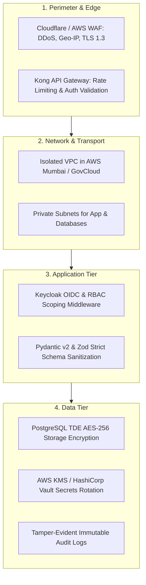

# MahaSkills — Security Architecture Specification

**Platform:** MahaSkills · Government of Maharashtra (DSEEI / MSInS)  
**Problem Statement ID:** 26134  
**Compliance Standard:** CERT-In Guidelines · ISO/IEC 27001 · OWASP ASVS Level 2  
**Version:** 1.0  
**Status:** Canonical Security Baseline  

---

## 1. Defense-in-Depth Security Model

MahaSkills applies a layered security defense model across all architectural planes:



---

## 2. OWASP Top 10 Countermeasures

| Vulnerability Category | Risk Scenario in MahaSkills | Technical Countermeasure |
|:---|:---|:---|
| **A01: Broken Access Control** | District Officer queries records belonging to an unauthorized district. | Strict jurisdictional claim validation in `TenantScopeGuard` at both API gateway and database query levels. |
| **A02: Cryptographic Failures** | Student PII exposed during placement CSV ingestion. | Immediate one-way HMAC-SHA256 pseudonymization before database write; TLS 1.3 in transit; AES-256 at rest. |
| **A03: Injection** | SQL injection via unvalidated filter parameters or CSV values. | Parameterized queries enforced across 100% of database access via SQLAlchemy 2.0 async ORM. |
| **A04: Insecure Design** | Premature curriculum publication bypassing SSC review. | Enforced state-machine transitions with digital administrative approval verification. |
| **A05: Security Misconfiguration** | Default Keycloak admin credentials or open CORS. | Keycloak administrative consoles restricted to internal VPC VPN; strict CORS allowing only registered domains. |
| **A06: Vulnerable Components** | Outdated npm packages or Python dependencies. | Automated dependency scanning via Dependabot, Snyk, and GitHub Actions security gates. |
| **A07: Identification & Auth Failures**| Session hijacking or brute force on login. | Keycloak multi-factor authentication (MFA) for government roles, OAuth 2.0 PKCE, and ephemeral in-memory access tokens. |
| **A08: Software & Data Integrity** | Tampered CSV files or forged evidence dossiers. | SHA-256 checksum verification on file upload; immutable S3 versioning with Object Lock. |
| **A09: Security Logging Failures** | Unauthorized data deletion goes undetected. | Centralized immutable audit logs written on all transactional writes; forwarded to CloudWatch / Loki. |
| **A10: Server-Side Request Forgery**| Scraper tricked into hitting internal metadata endpoints. | Scrapers execute in an isolated sandbox VPC with zero network route access to internal microservices. |

---

## 3. HTTP Security Headers Specification

Every response issued by the API Gateway or frontend CDN enforces these HTTP security headers:

```http
Strict-Transport-Security: max-age=63072000; includeSubDomains; preload
X-Content-Type-Options: nosniff
X-Frame-Options: DENY
Referrer-Policy: strict-origin-when-cross-origin
Permissions-Policy: geolocation=(), camera=(), microphone=(), payment=()
Content-Security-Policy: default-src 'self'; script-src 'self'; style-src 'self' 'unsafe-inline'; img-src 'self' data: https:; font-src 'self'; connect-src 'self' https://api.mahaskills.maharashtra.gov.in https://auth.mahaskills.maharashtra.gov.in; frame-ancestors 'none';
```

---

## 4. Secrets Management & Key Lifecycle

* **Secrets Storage:** Zero secrets, database passwords, or JWT signing keys are stored in source code or unencrypted configuration files. All secrets reside in AWS Secrets Manager / HashiCorp Vault.
* **Key Rotation:**
  * Keycloak RS256 signing keys are rotated automatically every 90 days.
  * DPDP tenant pseudonymization salts are managed within AWS KMS Hardware Security Modules (HSMs) with strict access logging.
