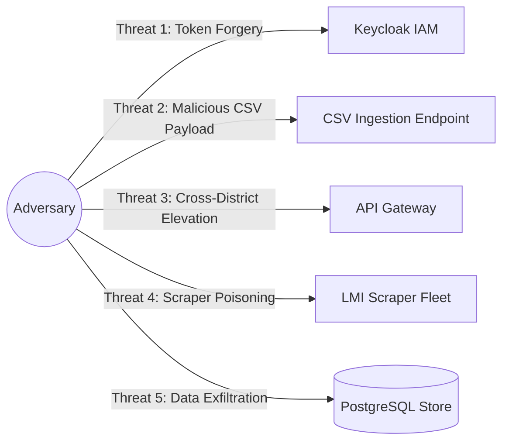

# MahaSkills — STRIDE Threat Model

**Platform:** MahaSkills · Government of Maharashtra (DSEEI / MSInS)  
**Problem Statement ID:** 26134  
**Methodology:** Microsoft STRIDE Threat Modeling  
**Version:** 1.0  
**Status:** Canonical Threat Model Baseline  

---

## 1. Attack Surfaces & Threat Analysis



---

## 2. STRIDE Threat Assessment & Mitigation Matrix

| Threat Category | Threat Scenario | Impact | Likelihood | Architectural Mitigation | Status |
|:---|:---|:---|:---|:---|:---|
| **Spoofing (S)** | Attacker crafts a forged JWT claiming `POLICY_MAKER` role. | Critical | Low | RS256 cryptographic signature validation against Keycloak JWKS public keys at API Gateway. | Mitigated |
| **Tampering (T)** | ITI Principal modifies CSV placement file to inflate historical placement percentages. | High | Medium | Checksum verification; mandatory employer confirmation; automated statistical outlier detection. | Mitigated |
| **Repudiation (R)**| SSC reviewer approves controversial syllabus revision and denies having signed off. | Medium | Low | Append-only immutable `audit_logs` storing user ID, timestamp, IP address, and digital approval hash. | Mitigated |
| **Information Disclosure (I)**| Candidate PII leaked via database backup or SQL injection. | Critical | Low | Full HMAC-SHA256 pseudonymization of candidate IDs at upload perimeter; zero plaintext storage. | Mitigated |
| **Denial of Service (D)**| Attacker floods CSV upload endpoint with 500MB zip-bombs or nested files. | High | Medium | 100MB streaming upload cap; strict MIME-type checks; asynchronous queueing outside HTTP workers. | Mitigated |
| **Elevation of Privilege (E)**| District Officer alters URL parameter `district_id=14` to `20` to view other districts. | High | Medium | `TenantScopeGuard` enforces JWT scope claim against all requested route and query parameters. | Mitigated |

---

## 3. High-Risk Scenarios & Security Controls

### 3.1 Malicious CSV Upload & Zip-Bomb Prevention
* All placement uploads are inspected via streaming parsers with hard record limits (50,000 rows max).
* Uploaded files are stored in isolated S3 buckets with restricted IAM roles; no executable permissions or shell interpretations are permitted.

### 3.2 Cross-District Jurisdictional Boundary Enforcement
* All database queries issued on behalf of `DISTRICT_OFFICER` or `ITI_PRINCIPAL` automatically inject SQL predicates:
  ```sql
  WHERE district_id = :authenticated_user_district_id
  ```
  ensuring that even if an attacker tampers with client-side parameters, database row-level security denies execution.
