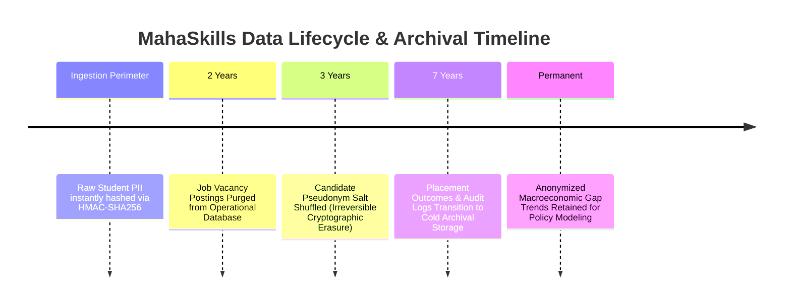

# MahaSkills — Data Governance & Lifecycle Policy

**Platform:** MahaSkills · Government of Maharashtra (DSEEI / MSInS)  
**Problem Statement ID:** 26134  
**Compliance Mandate:** Digital Personal Data Protection (DPDP) Act 2023  
**Version:** 1.0  
**Status:** Canonical Governance Baseline  

---

## 1. Data Ownership & Stewardship RACI

| Data Domain | Responsible (R) | Accountable (A) | Consulted (C) | Informed (I) |
|:---|:---|:---|:---|:---|
| **Skill Taxonomy & NSQF Roles** | State Data Steward | MSInS CEO | 36 Sector Skill Councils | Training Institutes |
| **Job Market Vacancy Signals** | LMI Pipeline Lead | DSEEI Joint Secretary | Industry Associations (MCCIA/CII) | Public |
| **Institutional Placement Records**| ITI Principal | District Skill Officer | DVET Directorate | Candidate Trainees |
| **Curriculum Update Proposals** | SSC Technical Committee | DSEEI Approval Authority | NCVET Council | ITI Principals |
| **District Training Plans** | District Skill Officer | District Collector | Local MSME Associations | DSEEI Planning |
| **System Security & Audit Logs** | SecOps Lead | CISO Maharashtra | CERT-In | PMO Directorate |

---

## 2. Statutory Data Retention & Disposal Schedules

In compliance with DPDP 2023 and Maharashtra State Public Records Rules:

| Record Classification | Operational Retention | Archival Tier | Final Disposal Action | Regulatory Requirement |
|:---|:---|:---|:---|:---|
| **Raw Web Scrape Dumps** | 90 days (S3 Standard) | S3 Glacier (1 year) | Cryptographic Deletion | Platform Optimization |
| **Processed Job Postings** | 24 months (PostgreSQL) | None | Automated Partition Drop | Storage Optimization |
| **Placement Records** | 36 months (PostgreSQL) | S3 Coldline (48 months) | Permanent Cold Storage | ITI Audit Statutory Rules (7 yrs) |
| **Candidate Pseudonym Keys**| 36 months (KMS Vault) | None | Key Shredding (Crypto-Erase)| DPDP Act 2023 Data Minimization |
| **Administrative Audit Logs**| 84 months (PostgreSQL) | WORM S3 Storage | Immutable Archive | State IT Audit Guidelines |

---

## 3. Data Freshness Service Level Objectives (SLOs)

* **Labour Market Intelligence:** Live vacancy index updated daily by 06:00 IST ($< 24\text{h}$ freshness).
* **Placement Returns:** Institutional monthly returns validated and ingested within 48 hours of monthly upload cutoff.
* **Skill Gap Recalculation:** Statewide 36-district gap score refreshed every Sunday by 03:00 IST ($< 7\text{d}$ freshness).
* **Curriculum Dossiers:** Evidence dossiers re-synthesized within 15 minutes of any official recommendation stage transition.
