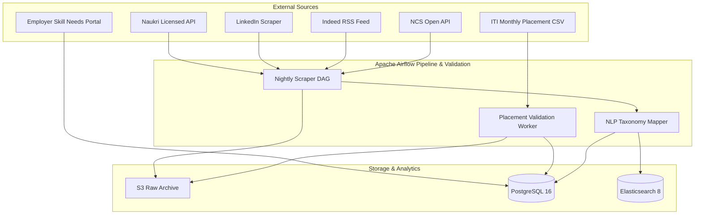

# MahaSkills — Data Ingestion & Pipeline Specification

**Platform:** MahaSkills · Government of Maharashtra (DSEEI / MSInS)  
**Problem Statement ID:** 26134  
**Version:** 1.0  
**Status:** Canonical Ingestion Baseline  

---

## 1. Ingestion Architecture & Data Sources

MahaSkills ingests high-frequency labour demand and institutional outcome signals through four dedicated ingestion channels:



---

## 2. ITI Placement CSV Upload Specification

ITIs must submit placement returns on or before the 5th of each calendar month using the standardized template below.

### 2.1 Standardized CSV Header Format
```csv
candidate_id,course_code,batch_year,placed,employer_name,job_role,monthly_salary,months_to_placement
```

### 2.2 Row Validation Schema & Business Constraints

| Header Field | Type / Format | Mandatory? | Validation Rule | Error Code on Failure |
|:---|:---|:---|:---|:---|
| `candidate_id` | Alphanumeric (String) | **Yes** | 6 to 32 characters; converted immediately to HMAC-SHA256 | `ERR_INVALID_CANDIDATE_ID` |
| `course_code` | String (e.g. `CTS-ELE-01`) | **Yes** | Must match an active course sanctioned for the uploading institute | `ERR_UNSANCTIONED_COURSE` |
| `batch_year` | Integer ($YYYY$) | **Yes** | Current year or preceding 2 years ($2024 \le \text{Year} \le 2026$) | `ERR_OUT_OF_RANGE_BATCH_YEAR` |
| `placed` | `Y` or `N` | **Yes** | Case-insensitive single character; converts to boolean | `ERR_INVALID_BOOLEAN_FLAG` |
| `employer_name` | String (1–200 chars) | Cond. | Mandatory if `placed = Y`; must be blank/NA if `placed = N` | `ERR_MISSING_EMPLOYER_NAME` |
| `job_role` | String (1–200 chars) | Cond. | Mandatory if `placed = Y`; must be blank/NA if `placed = N` | `ERR_MISSING_JOB_ROLE` |
| `monthly_salary`| Decimal ($₹$) | Cond. | Mandatory if `placed = Y`. Constraint: $8,000.00 \le \text{Salary} \le 2,00,000.00$ | `ERR_SALARY_OUT_OF_BOUNDS` |
| `months_to_placement` | Integer | Cond. | Mandatory if `placed = Y`. Constraint: $0 \le \text{Months} \le 36$ | `ERR_INVALID_MONTHS_TO_HIRE` |

### 2.3 Pseudonymization Pipeline (DPDP 2023)
```python
import hmac
import hashlib
import os

TENANT_PEPPER = os.environ["DPDP_TENANT_SALT"].encode("utf-8")

def pseudonymize_candidate_id(raw_id: str) -> str:
    """Generates irreversible HMAC-SHA256 hash for student identity."""
    normalized = raw_id.strip().upper().encode("utf-8")
    return hmac.new(TENANT_PEPPER, normalized, hashlib.sha256).hexdigest()
```

---

## 3. Web Scraping & External Feed Engine

### 3.1 Scraping Politeness, Concurrency & Proxy Strategy
* **Scraping Framework:** Python Scrapy + Playwright headless engine for dynamic JavaScript-rendered postings.
* **Rate Limits:** Maximum 2 requests/second per target domain; randomized delay jitter ($\pm 400\text{ms}$).
* **User-Agent & Proxies:** Residential proxy rotation with Maharashtra/India IP exit nodes; compliant `User-Agent: MahaSkillsBot/1.0 (+https://mahaskills.maharashtra.gov.in/bot)`.
* **Retry Protocol:** Exponential backoff with jitter up to 3 retries. Transient 429/503 errors trigger circuit breaker pauses.

### 3.2 Deduplication Key Formulation
Before inserting into `job_postings`, duplicates are filtered via a composite hash:
$$\text{Deduplication Hash} = \text{MD5}\left(\text{clean}(company\_name) + "|" + \text{clean}(title) + "|" + district\_id + "|" + posted\_date\right)$$
Duplicate postings update the `vacancies_count` rather than creating redundant records.

---

## 4. Pipeline Execution SLA & Alerting Rules

| Pipeline Component | Frequency | Max Processing Duration | Failure Alert Destination |
|:---|:---|:---|:---|
| `lmi_nightly_job_scraping` | Daily at 02:00 IST | 120 minutes | PagerDuty / Slack #ops-alerts |
| `placement_csv_validation` | On-demand (Upload) | 30 seconds (per 10k rows) | In-app notification to ITI Principal |
| `weekly_gap_score_computation` | Sunday at 01:00 IST | 45 minutes | PMO Lead & Data Steward |
