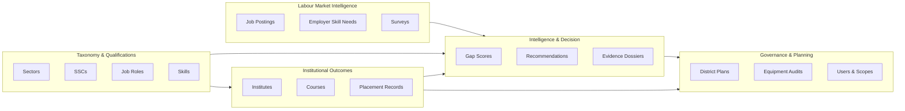
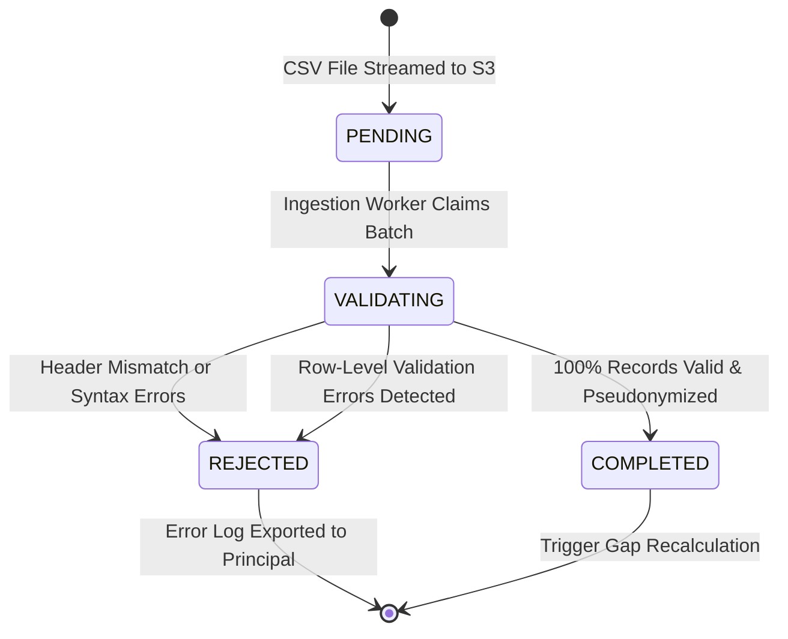
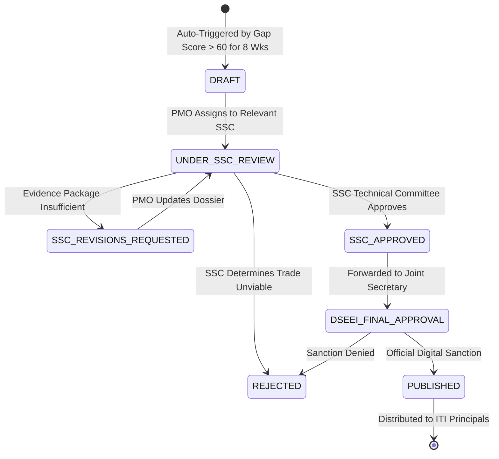
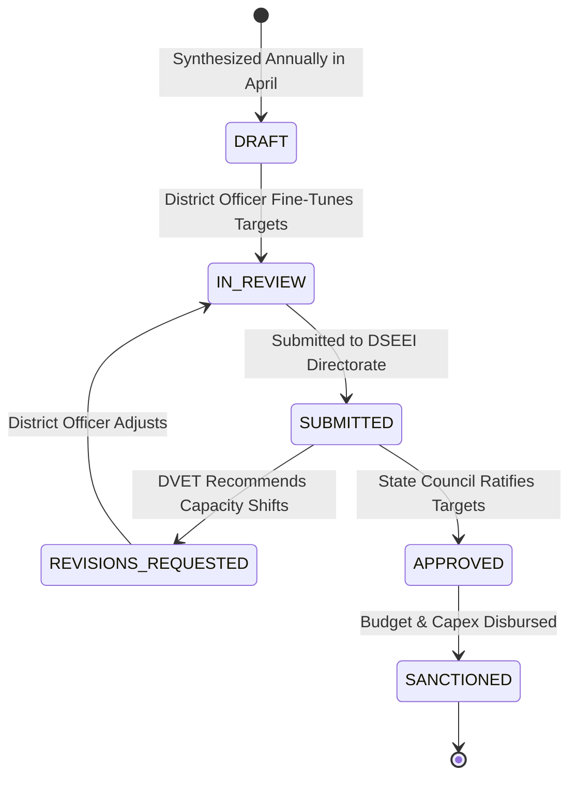

# MahaSkills — Data Model Specification

**Platform:** MahaSkills · Government of Maharashtra (DSEEI / MSInS)  
**Problem Statement ID:** 26134  
**Version:** 1.0  
**Status:** Canonical Logical Data Model Baseline  

---

## 1. Conceptual Domain Boundaries

The MahaSkills domain model is divided into five core business bounded contexts:

1. **Taxonomy & Standards Context:** Standardizes skills, job roles, qualification packs (QPs), sectors, and Sector Skill Councils (SSCs).
2. **Labour Market Intelligence (LMI) Context:** Aggregates external labour demand signals from scrapers, APIs, and employer skill needs.
3. **Institutional Capacity & Outcomes Context:** Represents ITIs, polytechnics, sanctioned seat capacities, and verified placement returns.
4. **Intelligence & Decision Context:** Computes gap scores, identifies oversupply, compiles evidence dossiers, and orchestrates curriculum recommendation workflows.
5. **Operational Governance Context:** Manages annual District Training Plans, equipment gap audits, Keycloak identity mappings, and immutable audit logs.

---

## 2. Core State Machines & Lifecycle Dynamics

### 2.1 Placement Ingestion Batch Lifecycle

### 2.2 Curriculum Recommendation Lifecycle

### 2.3 District Training Plan Lifecycle

---

## 3. Cardinality & Cascade Integrity Rules

| Primary Entity | Related Entity | Cardinality | Deletion Policy | Business Rule Justification |
|:---|:---|:---|:---|:---|
| `sectors` | `job_roles` | $1 : N$ | `RESTRICT` | A sector cannot be deleted if active qualification packs reference it. |
| `sectors` | `sscs` | $1 : N$ | `RESTRICT` | An SSC cannot exist without an overarching sector mapping. |
| `job_roles` | `courses` | $1 : N$ | `RESTRICT` | Cannot delete an official job role while active institute courses teach it. |
| `courses` | `institute_courses` | $1 : N$ | `RESTRICT` | Prevents orphan courses with active student enrollments. |
| `institutes` | `placement_batches` | $1 : N$ | `RESTRICT` | Placement historical returns must persist for 7 years under statutory audit rules. |
| `placement_batches` | `placement_records` | $1 : N$ | `CASCADE` | If a corrupted batch is deleted, its constituent staging records are removed. |
| `recommendations` | `recommendation_evidence` | $1 : N$ | `CASCADE` | Evidence packages are intrinsically tied to their parent recommendation dossier. |
| `recommendations` | `recommendation_audits` | $1 : N$ | `CASCADE` | Approval audit records belong to the recommendation entity lifecycle. |
