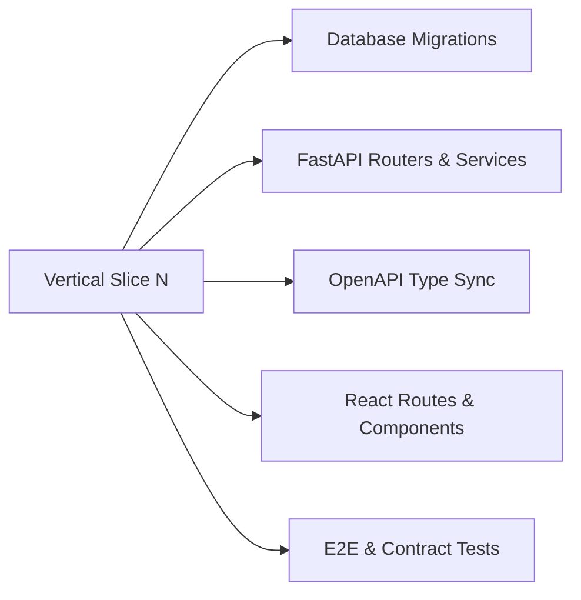

# MahaSkills — Technical Implementation Plan (Vertical Slices 0–11)

**Platform:** MahaSkills · Government of Maharashtra (DSEEI / MSInS)  
**Problem Statement ID:** 26134  
**Strategy:** Domain-Driven Vertical Slices with Strict Quality Gates  
**Version:** 1.0  
**Status:** Canonical Implementation Plan Baseline  

---

## 1. Vertical Slice Engineering Strategy

Every vertical slice delivers an end-to-end operable slice across all tiers: **Database DDL $\rightarrow$ Backend API $\rightarrow$ Mock Server $\rightarrow$ TypeScript Types $\rightarrow$ React Components $\rightarrow$ State Stores $\rightarrow$ Automated Tests**.

---

## 2. Vertical Slices Breakdown

### Slice 0: Foundation & Core Infrastructure
* **Scope:** Setup monorepo/workspace, PostgreSQL 16 migrations base, Redis connection, Docker Compose, Tailwind design tokens, base routing, and CI/CD pipelines.
* **Deliverables:** Working shell, database connectivity, OpenAPI validator.
* **Test Gate:** `TEST-INFRA-001` (DB health check, Docker build passes).

### Slice 1: Shell, Authentication & RBAC Access Gates
* **Scope:** Keycloak OIDC integration with PKCE, JWT decoding, `TenantScopeGuard`, `RoleGuard`, public vs authenticated shell layouts.
* **Deliverables:** `/auth/login`, `/auth/callback`, `AppShell`, role-based sidebar switching.
* **Test Gate:** `TEST-SEC-001`, `TEST-SEC-002`, `TEST-SEC-003`.

### Slice 2: Data Primitives & Taxonomy Hierarchy
* **Scope:** NSQF taxonomy seed (~2,200 job roles, 33 sectors, 36 SSCs), Elasticsearch indexing, interactive taxonomy tree view.
* **Deliverables:** `/taxonomy`, `TaxonomyTreeView`, `SkillBadge`, `GET /v1/taxonomy/tree`.
* **Test Gate:** `TEST-TAX-001`, `TEST-TAX-002`.

### Slice 3: Labour Market Intelligence & External Data Feeds
* **Scope:** Nightly Airflow job scraper DAGs, raw posting storage, deduplication, vacancy aggregation endpoints.
* **Deliverables:** `/analytics/lmi`, `DemandTrendChart`, `GET /v1/lmi/aggregates`.
* **Test Gate:** `TEST-ING-001`, `TEST-LMI-001`.

### Slice 4: Algorithmic Gap Scoring & State Dashboards
* **Scope:** Weekly gap scoring engine Celery tasks, oversupply detection heuristic, interactive state and district choropleth heatmap.
* **Deliverables:** `/gap-analysis`, `GapHeatmap`, `OversupplyTable`, `GET /v1/gap-scores`.
* **Test Gate:** `TEST-GAP-001`, `TEST-GAP-002`.

### Slice 5: ITI Placement Ingestion & DPDP Anonymization
* **Scope:** Monthly placement CSV drag-and-drop upload, streaming parser, HMAC-SHA256 candidate pseudonymization, cell-level validation grid.
* **Deliverables:** `/placements/upload`, `CsvDropzone`, `ValidationErrorTable`, `POST /v1/ingestion/placements/upload`.
* **Test Gate:** `TEST-PLA-001`, `TEST-PLA-002`, `TEST-PLA-003`.

### Slice 6: Curriculum Recommendations & Multi-Stage Review Workflow
* **Scope:** Automated recommendation triggering ($> 60$ gap for 8 wks), evidence dossier auto-compiler, SSC review workbench, DSEEI approval flow.
* **Deliverables:** `/recommendations`, `DossierViewer`, `ApprovalStepper`, `POST /v1/recommendations/{id}/review`.
* **Test Gate:** `TEST-REC-001`, `TEST-REC-002`, `TEST-REC-003`.

### Slice 7: Employer Portal & Structured Skill Needs
* **Scope:** GSTIN-verified registration, quarterly skill needs submission form, sector-triggered micro-surveys.
* **Deliverables:** `/employer/skill-needs`, `GstinLookup`, `MicroSurveyDialog`.
* **Test Gate:** `TEST-EMP-001`, `TEST-EMP-002`, `TEST-EMP-003`.

### Slice 8: Candidate Guidance, Course Finder & Pathway Quiz
* **Scope:** Public course catalog with verified placement statistics (median salary, time-to-hire), 5-step adaptive pathway quiz, Mahaswayam SSO handoff.
* **Deliverables:** `/candidate/courses`, `/candidate/pathway`, `PathwayQuizWizard`.
* **Test Gate:** `TEST-CAN-001`, `TEST-CAN-002`, `TEST-CAN-003`.

### Slice 9: District Training Plan Synthesis & Equipment Deficit Auditing
* **Scope:** Automated annual training plan compiler, course intake targets, ITI equipment inventory comparison.
* **Deliverables:** `/district-plans`, `PlanBuilder`, `EquipmentGapList`.
* **Test Gate:** `TEST-DTP-001`, `TEST-DTP-002`, `TEST-DTP-003`.

### Slice 10: Administration, Observability & Security Audit Trails
* **Scope:** Immutable security audit logging, system health status, pipeline queue monitoring, user scope management.
* **Deliverables:** `/admin/audit-logs`, `/admin/system-health`.
* **Test Gate:** `TEST-ADM-001`, `TEST-ADM-002`.

### Slice 11: Predictive Demand Forecasting & Advanced Analytics (Phase 4)
* **Scope:** ARIMA/Prophet time-series models for 12-month forward vacancy forecasting, hidden behind feature flag `features.forecasting`.
* **Deliverables:** Predictive forecast charts, confidence intervals, planned empty states for Phase 1–3.
* **Test Gate:** `TEST-PRED-001`.
