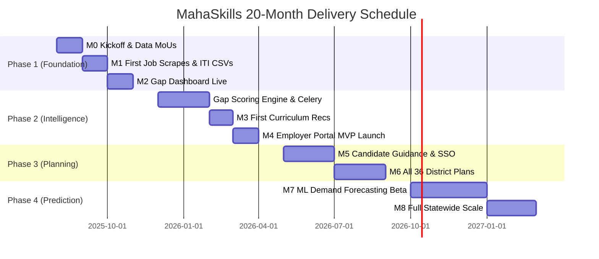

# MahaSkills — Project Breakdown & Delivery Milestones

**Platform:** MahaSkills · Government of Maharashtra (DSEEI / MSInS)  
**Problem Statement ID:** 26134  
**Duration:** 20 Months (Four Delivery Phases)  
**Version:** 1.0  
**Status:** Canonical Project Breakdown Baseline  

---

## 1. 20-Month Statewide Delivery Roadmap

---

## 2. Phased Milestone Breakdown

### Phase 1: Foundation & Data Flow (Months 0–4)
* **Milestone M0 (Month 0):** Vendor onboarded, PMO constituted, data MoUs drafted with job aggregators and pilot ITIs.
* **Milestone M1 (Month 2):** Scraper fleet operational; 5 pilot districts and 10 ITIs uploading placement data.
* **Milestone M2 (Month 4):** Read-only Gap Dashboard live for DSEEI leadership; taxonomy database seeded with ~2,200 job roles.
* **Team:** 1 PM, 1 Backend Engineer, 1 Data Engineer, 1 Frontend Engineer.

### Phase 2: Intelligence Engine & Employer Portal (Months 4–9)
* **Milestone M3 (Month 7):** First 10 automated curriculum recommendations reviewed by Automotive and IT SSCs.
* **Milestone M4 (Month 9):** Employer Portal launched; $\ge 50$ enterprise employers onboarded with GSTIN verification.
* **Team:** +1 ML / Data Scientist, +1 Backend Engineer, +1 Frontend Engineer (6 total).

### Phase 3: District Planning & Candidate Guidance (Months 9–14)
* **Milestone M5 (Month 12):** Candidate Course Finder and 5-question Pathway Quiz live; Mahaswayam SSO enrollment operational.
* **Milestone M6 (Month 14):** Automated District Training Plans generated for all 36 districts of Maharashtra.
* **Team:** 4 Full-stack engineers, 1 Data Engineer, 1 PM.

### Phase 4: Prediction & Statewide Scale (Months 14–20)
* **Milestone M7 (Month 18):** ARIMA/Prophet 12-month demand forecasting active; candidate mobile app beta released.
* **Milestone M8 (Month 20):** 100% of government ITIs onboarded; 500+ verified active employers; curriculum revision cycles reduced to $\le 12$ months.
* **Team:** 5 Engineers, 1 ML Engineer, 1 SecOps, 1 PM.
