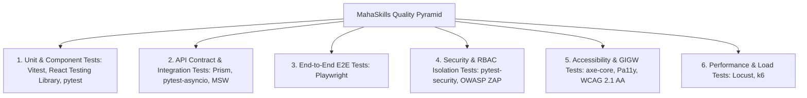

# MahaSkills — Comprehensive Testing Strategy

**Platform:** MahaSkills · Government of Maharashtra (DSEEI / MSInS)  
**Problem Statement ID:** 26134  
**Coverage Target:** $\ge 85\%$ Branch Coverage  
**Version:** 1.0  
**Status:** Canonical Testing Baseline  

---

## 1. Testing Pyramid & Verification Layers



---

## 2. Test Suites Mapped to Core Requirements

| Test Suite ID | Test Category | Target Component | Core Assertions & Test Criteria | Requirement Trace |
|:---|:---|:---|:---|:---|
| `TEST-SEC-001` | Integration / Unit | `AuthService`, `Keycloak` | OIDC Authorization Code + PKCE token exchange; RS256 signature verification. | `REQ-AUTH-01` |
| `TEST-SEC-002` | Unit / RBAC | `RoleGuard`, `RBACMiddleware` | 7 roles correctly restricted from unassigned endpoints and UI routes. | `REQ-AUTH-02` |
| `TEST-SEC-003` | Integration / Scope | `TenantScopeGuard` | Cross-district parameter tampering returns HTTP 403 Forbidden. | `REQ-AUTH-03` |
| `TEST-ING-001` | Integration | Airflow Ingestion Scraper | Web scraping parser handles HTML changes and deduplicates records. | `REQ-LMI-01` |
| `TEST-TAX-001` | Unit | `TaxonomyService` | Canonical hierarchy loads 33 sectors, 36 SSCs, and ~2,200 roles. | `REQ-TAX-01` |
| `TEST-GAP-001` | Unit / Algorithm | `GapScoringEngine` | Mathematical formula matches expected gap scores across edge cases. | `REQ-GAP-01` |
| `TEST-GAP-002` | Integration | Oversupply Flagging Task | Correctly flags courses with placement $< 25\%$ and low demand over 2 quarters. | `REQ-GAP-02` |
| `TEST-PLA-001` | Unit / Validation | CSV Streaming Parser | Validates headers, mandatory fields, salary bounds, and date windows. | `REQ-PLA-01` |
| `TEST-PLA-002` | Integration | Validation Error Logger | Generates line-by-line rejection logs with bilingual error messages. | `REQ-PLA-02` |
| `TEST-SEC-004` | Unit / Privacy | `DataSanitizationService` | HMAC-SHA256 candidate ID hashing with zero plaintext disk persistence (DPDP). | `REQ-SEC-01` |
| `TEST-REC-001` | Integration | Recommendation Engine | Triggers recommendation proposal when gap $> 60$ for $\ge 8$ weeks. | `REQ-REC-01` |
| `TEST-REC-003` | Integration / E2E | Workflow State Machine | Enforces linear lifecycle: Draft $\rightarrow$ SSC Review $\rightarrow$ DSEEI Approval $\rightarrow$ Published. | `REQ-REC-03` |
| `TEST-CAN-002` | Unit / Algorithm | Pathway Quiz Wizard | Adaptive algorithm ranks top 3 courses with personalized rationales. | `REQ-CAN-02` |
| `TEST-NFR-002` | E2E / i18n | `react-i18next` | Marathi, Hindi, and English strings load dynamically with zero missing keys. | `REQ-NFR-02` |
| `TEST-NFR-003` | Automated Audit | `axe-core` / Playwright | 100% of public and administrative pages pass WCAG 2.1 AA audit with 0 violations. | `REQ-NFR-03` |

---

## 3. Specialized Testing Protocols

### 3.1 Role & Cross-District Scope Isolation Testing
```python
@pytest.mark.asyncio
async def test_district_officer_cross_district_isolation(client, pune_officer_token):
    # Pune officer attempts to access Nashik district plan (district_id = 20)
    response = await client.get(
        "/v1/district-plans?district_id=20&fiscal_year=2026-2027",
        headers={"Authorization": f"Bearer {pune_officer_token}"}
    )
    assert response.status_code == 403
    assert response.json()["error"]["code"] == "AUTH_SCOPE_RESTRICTED"
```

### 3.2 Automated Accessibility (WCAG 2.1 AA) Testing with Playwright
```typescript
import { test, expect } from '@playwright/test';
import AxeBuilder from '@axe-core/playwright';

test('landing page meets WCAG 2.1 AA accessibility standards', async ({ page }) => {
  await page.goto('/');
  const accessibilityScanResults = await new AxeBuilder({ page })
    .withTags(['wcag2a', 'wcag2aa', 'wcag21a', 'wcag21aa'])
    .analyze();

  expect(accessibilityScanResults.violations).toEqual([]);
});
```

### 3.3 CSV Ingestion Fuzzing & Boundary Testing
* **Salary Boundaries:** Test records with salaries at ₹7,999 (rejected), ₹8,000 (accepted), ₹2,00,000 (accepted), ₹2,00,001 (rejected).
* **Malicious Payloads:** Inject SQL statements (`'; DROP TABLE placement_records;--`) and script tags into student names; verify that parameterized queries and pseudonymization render payloads harmless.
