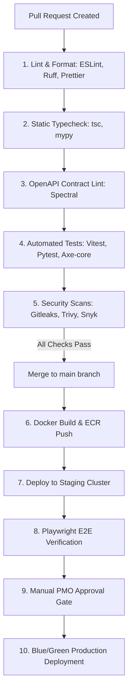

# MahaSkills — Continuous Integration & Deployment (CI/CD)

**Platform:** MahaSkills · Government of Maharashtra (DSEEI / MSInS)  
**CI/CD Engine:** GitHub Actions · AWS CodeDeploy / ArgoCD  
**Version:** 1.0  
**Status:** Canonical CI/CD Pipeline Baseline  

---

## 1. Automated Pipeline Architecture



---

## 2. GitHub Actions Workflow Configuration

```yaml
name: MahaSkills CI/CD Pipeline

on:
  push:
    branches: [main, staging]
  pull_request:
    branches: [main]

jobs:
  validate:
    name: Code Quality, Contracts & Security
    runs-on: ubuntu-latest
    steps:
      - uses: actions/checkout@v4

      - name: Setup Node.js & Python
        uses: actions/setup-node@v4
        with: { node-version: 20 }
      - uses: actions/setup-python@v5
        with: { python-version: "3.11" }

      - name: Validate OpenAPI Contract
        run: npx @stoplight/spectral-cli lint docs/03-api/openapi.yaml

      - name: Secrets Detection
        uses: gitleaks/gitleaks-action@v2

      - name: Frontend Typecheck & Tests
        run: |
          npm ci
          npm run typecheck
          npm run test:unit
          npm run test:a11y

      - name: Backend Tests & Coverage
        run: |
          pip install -r requirements-dev.txt
          pytest --cov=app --cov-fail-under=85
```

---

## 3. Production Deployment Strategy (Blue/Green)

* **Zero-Downtime Blue/Green Rollout:** ArgoCD manages Kubernetes deployments. A new release is deployed as a green replica set. Once health checks verify 100% pass rates, traffic is cut over at the Application Load Balancer.
* **Automated Rollback:** If 5xx error rates exceed $0.5\%$ or latency p95 spikes above $500\text{ms}$ within 5 minutes of cutover, traffic immediately reverts to the blue replica set.
