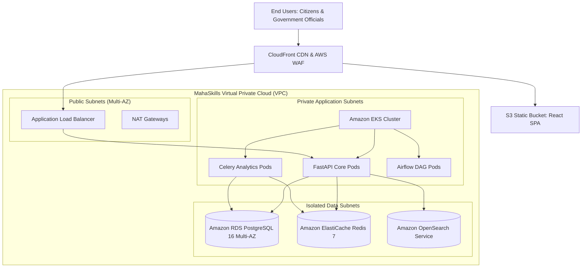

# MahaSkills — Deployment & Cloud Infrastructure Specification

**Platform:** MahaSkills · Government of Maharashtra (DSEEI / MSInS)  
**Problem Statement ID:** 26134  
**Hosting Environment:** AWS Mumbai Region (`ap-south-1`) / MeitY-Empaneled GovCloud  
**Version:** 1.0  
**Status:** Canonical Infrastructure Baseline  

---

## 1. Cloud Infrastructure Topology



---

## 2. Containerization & Orchestration (Docker & Kubernetes)

### 2.1 Multi-Stage Dockerfile (FastAPI Backend)
```dockerfile
FROM python:3.11-slim AS builder
WORKDIR /app
RUN apt-get update && apt-get install -y --no-install-recommends build-essential libpq-dev
COPY requirements.txt .
RUN pip install --no-cache-dir --user -r requirements.txt

FROM python:3.11-slim AS runner
WORKDIR /app
RUN apt-get update && apt-get install -y --no-install-recommends libpq5 curl && rm -rf /var/lib/apt/lists/*
COPY --from=builder /root/.local /root/.local
COPY ./app ./app
ENV PATH=/root/.local/bin:$PATH
EXPOSE 8000
HEALTHCHECK --interval=30s --timeout=5s CMD curl -f http://localhost:8000/v1/admin/health || exit 1
CMD ["uvicorn", "app.main:app", "--host", "0.0.0.0", "--port", "8000", "--workers", "4"]
```

### 2.2 Kubernetes Horizontal Pod Autoscaling (HPA)
* **API Service:** Minimum 3 pods, maximum 15 pods. Scale trigger: CPU utilization $> 70\%$ or HTTP request rate $> 500\text{ req/sec}$.
* **Celery Analytics Workers:** Minimum 2 pods, maximum 8 pods. Scale trigger: Redis queue length $> 100$ tasks.

---

## 3. Database & Storage Provisioning

| Component | Service | Instance Sizing | High Availability Configuration |
|:---|:---|:---|:---|
| **Transactional DB** | Amazon RDS PostgreSQL 16 | `db.r6g.xlarge` (32GB RAM, 4 vCPU) | Multi-AZ synchronous standby; automated daily snapshots with 30-day retention. |
| **Distributed Cache**| Amazon ElastiCache Redis 7| `cache.r6g.large` (13GB RAM) | Multi-AZ cluster with auto-failover; Redis AUTH enabled. |
| **Search Index** | Amazon OpenSearch | 3 $\times$ `m6g.large.search` | Multi-AZ with dedicated cluster manager nodes. |
| **Object Storage** | Amazon S3 Standard | Infinite auto-scaling | Server-side encryption (SSE-KMS); Versioning enabled; Object Lock for audit logs. |
