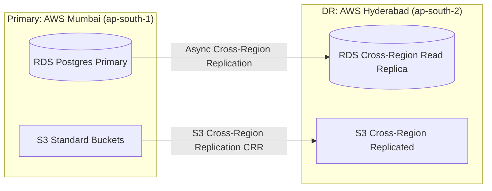

# MahaSkills — Disaster Recovery & Business Continuity Plan

**Platform:** MahaSkills · Government of Maharashtra (DSEEI / MSInS)  
**Problem Statement ID:** 26134  
**Primary Region:** AWS Mumbai (`ap-south-1`)  
**Secondary DR Region:** AWS Hyderabad (`ap-south-2`)  
**Version:** 1.0  
**Status:** Canonical Disaster Recovery Baseline  

---

## 1. RTO & RPO Objectives

| Metric | Target SLA | Strategy to Achieve |
|:---|:---|:---|
| **Recovery Point Objective (RPO)** | **$< 1$ minute** | PostgreSQL continuous Write-Ahead Log (WAL) archiving to S3 and synchronous multi-AZ replica. |
| **Recovery Time Objective (RTO)** | **$< 15$ minutes** | Automated Aurora/RDS failover and Route 53 health-checked DNS switching. |

---

## 2. Backup & Replication Architecture



---

## 3. Disaster Recovery Failover Runbook

1. **Failure Confirmation:** AWS CloudWatch synthetic alarms confirm complete regional outage in Mumbai for $\ge 3$ consecutive minutes.
2. **Promote DR Database:**
   ```bash
   aws rds promote-read-replica --db-instance-identifier mahaskills-prod-hyderabad
   ```
3. **Route 53 DNS Switchover:** Failover routing policy detects unhealthy status on Mumbai ALB and directs 100% of traffic to Hyderabad ingress gateway.
4. **Scale Up DR EKS Workloads:** ArgoCD syncs manifests to Hyderabad EKS cluster; pods spin up within 4 minutes.
5. **Post-Failover Health Check:** Automated smoke test suite executes synthetic transactions (`/v1/auth/me`, `/v1/gap-scores`) before public traffic release.
