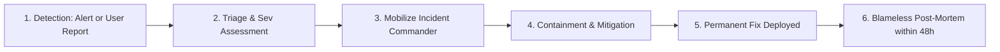

# MahaSkills — Incident Response Framework

**Platform:** MahaSkills · Government of Maharashtra (DSEEI / MSInS)  
**Problem Statement ID:** 26134  
**Version:** 1.0  
**Status:** Canonical Incident Response Baseline  

---

## 1. Severity Classification Matrix

| Severity Level | Definition & Criteria | Target Response SLA | Target Resolution SLA | Escalation Target |
|:---|:---|:---|:---|:---|
| **SEV-1 (Critical)** | Statewide platform outage; data breach involving candidate records; Keycloak authentication failure blocking all users. | **15 minutes** | **$< 2$ hours** | PMO Director, CISO, Vendor Tech Lead |
| **SEV-2 (Major)** | Major module failure (e.g., CSV placement upload blocked; Airflow gap calculation crashed); API latency degraded for $> 20\%$ users. | **30 minutes** | **$< 6$ hours** | Lead SRE, Lead Backend Engineer |
| **SEV-3 (Minor)** | Non-blocking UI glitch; localized report export failure; minor styling or translation bug. | **4 hours** | Next scheduled patch | Engineering Squad Lead |

---

## 2. Incident Response Workflow

### 2.1 Incident Roles & Responsibilities
* **Incident Commander (IC):** Directs triage, owns decision-making, delegates investigation tasks, and authorizes emergency rollbacks.
* **Technical Lead (TL):** Coordinates engineering diagnosis, logs analysis, and writes targeted hotfixes.
* **Communications Lead (CL):** Prepares official stakeholder updates for DSEEI leadership and public status page banners.

---

## 3. Post-Mortem Protocol

Within 48 hours of resolving any SEV-1 or SEV-2 incident, a blameless post-mortem must be published:
1. **Executive Summary:** Incident duration, affected user cohorts, root cause.
2. **Timeline of Events (IST):** Minute-by-minute breakdown from trigger to resolution.
3. **5 Whys Analysis:** Root cause deduction.
4. **Preventive Action Items:** Tracked JIRA issues with designated owners and due dates to prevent recurrence.
