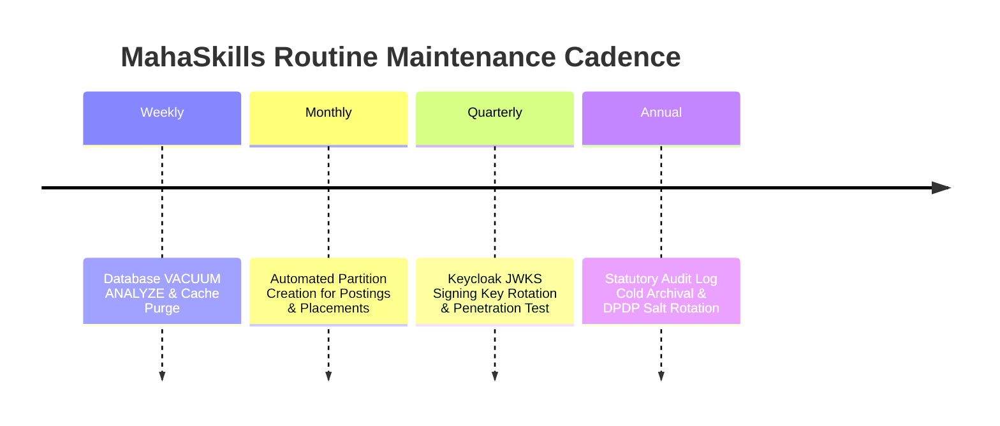

# MahaSkills — Maintenance & Operational Housekeeping

**Platform:** MahaSkills · Government of Maharashtra (DSEEI / MSInS)  
**Problem Statement ID:** 26134  
**Maintenance Window:** Sundays 01:00 – 04:00 IST (Lowest traffic window)  
**Version:** 1.0  
**Status:** Canonical Maintenance Baseline  

---

## 1. Routine Maintenance Schedule



---

## 2. Database Housekeeping Procedures

### 2.1 Automated Vacuuming & Statistics Refresh
While PostgreSQL autovacuum runs continuously, a targeted weekly analyze updates planner statistics for heavy analytics tables:
```sql
VACUUM ANALYZE job_postings;
VACUUM ANALYZE placement_records;
VACUUM ANALYZE gap_scores;
```

### 2.2 Dynamic Table Partition Management
To prevent table bloat, partitions are pre-created 30 days in advance via an automated cron function:
```sql
-- Create upcoming annual placement partition
CREATE TABLE IF NOT EXISTS placement_records_2027 PARTITION OF placement_records
    FOR VALUES FROM (2027) TO (2028);
```

### 2.3 Index Reindexing
High-churn indexes on `job_postings` and `placement_records` are reindexed concurrently without table locking:
```sql
REINDEX TABLE CONCURRENTLY job_postings;
```

---

## 3. Storage & Audit Log Archival

* **S3 Raw Archive Transition:** Raw placement CSV files older than 90 days transition automatically to S3 Glacier Flexible Retrieval via S3 Lifecycle Rules.
* **Audit Log Immutability:** Audit log tables are archived annually into AWS S3 Object Lock (WORM - Write Once Read Many) compliant storage to satisfy Maharashtra State IT audit mandates.
