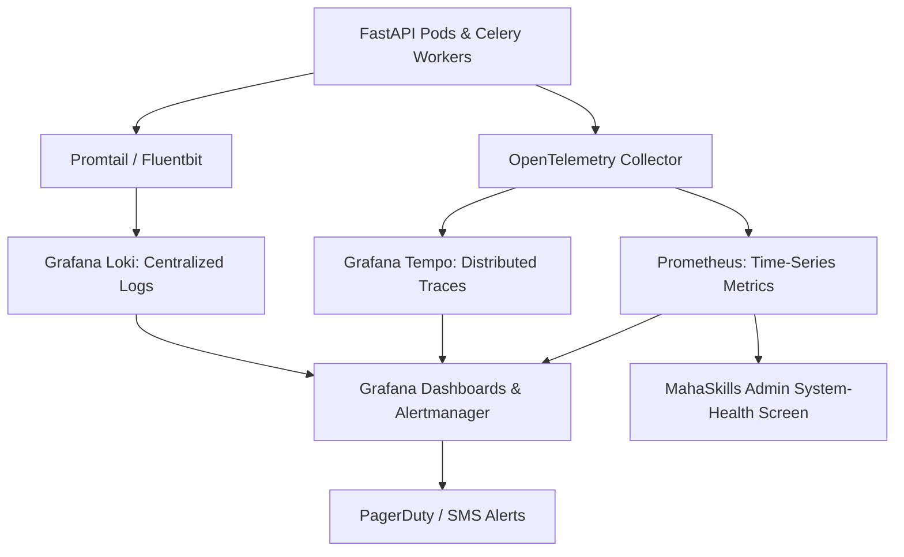

# MahaSkills — Monitoring & Observability Specification

**Platform:** MahaSkills · Government of Maharashtra (DSEEI / MSInS)  
**Problem Statement ID:** 26134  
**Observability Stack:** Prometheus · Grafana · OpenTelemetry · Loki / CloudWatch  
**Version:** 1.0  
**Status:** Canonical Monitoring Baseline  

---

## 1. Observability Architecture (Metrics, Logs, Traces)



---

## 2. Service Level Objectives (SLOs) & Service Level Indicators (SLIs)

| Objective | Target SLI | Measurement Method | Alert Threshold |
|:---|:---|:---|:---|
| **API Availability** | $\ge 99.5\%$ Uptime | Ratio of HTTP $2xx/3xx/4xx$ vs. total requests over 30 days | Availability $< 99.5\%$ over 5 mins |
| **API Latency (p95)** | $< 300\text{ms}$ | Latency for non-analytical endpoints measured at API Gateway | $\text{p95} > 500\text{ms}$ over 5 mins |
| **Dashboard Load Time**| $< 2.0\text{s}$ | Synthetic browser transaction measuring time to interactive (TTI) | TTI $> 3.0\text{s}$ over 10 mins |
| **Ingestion Pipeline SLA**| Completed by 06:00 IST | Scheduled Airflow run completion timestamp | Uncompleted at 06:15 IST |

---

## 3. Core Operational Alert Rules (Prometheus Alertmanager)

```yaml
groups:
  - name: mahaskills_critical_alerts
    rules:
      - alert: HighHttp5xxRate
        expr: sum(rate(http_requests_total{status=~"5.."}[5m])) / sum(rate(http_requests_total[5m])) > 0.01
        for: 2m
        labels:
          severity: critical
        annotations:
          summary: "API 5xx error rate exceeds 1% in production."

      - alert: DatabaseConnectionSaturation
        expr: pg_stat_database_numbackends / pg_settings_max_connections > 0.85
        for: 3m
        labels:
          severity: critical
        annotations:
          summary: "PostgreSQL active connections exceed 85% of pool capacity."

      - alert: CeleryQueueStalled
        expr: redis_queue_length{queue="placements"} > 50
        for: 10m
        labels:
          severity: warning
        annotations:
          summary: "Placement CSV validation queue stalled with > 50 pending batches."
```

---

## 4. Product-Integrated Admin Observability Screen

In accordance with product specifications, the MahaSkills Administrative UI exposes live system health at `/admin/system-health` querying `/v1/admin/health`:
* **Pipeline Status Grid:** Nightly scraper status, last completion time, scraped record count.
* **Queue Depths:** Celery worker concurrency, active vs pending validation jobs.
* **Database & Cache Health:** PostgreSQL latency ($< 5\text{ms}$ baseline), Redis memory utilization percentage.
