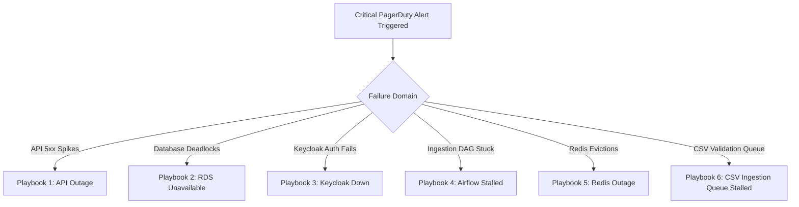

# MahaSkills — Operational Troubleshooting Runbook

**Platform:** MahaSkills · Government of Maharashtra (DSEEI / MSInS)  
**Problem Statement ID:** 26134  
**Audience:** Site Reliability Engineers (SRE), SysOps & On-Call Engineers  
**Version:** 1.0  
**Status:** Canonical Operations Runbook Baseline  

---

## 1. Incident Scenarios & Action Playbooks



---

### Playbook 1: API Gateway / Backend Unresponsive (502 / 504 / 5xx Spikes)
1. **Check Pod Health & Logs:**
   ```bash
   kubectl get pods -n mahaskills -l app=mahaskills-api
   kubectl logs -n mahaskills -l app=mahaskills-api --tail=100 --prefix
   ```
2. **Diagnose Database Connection Saturation:**
   Check if asyncpg pool exhausted (`asyncpg.exceptions.TooManyConnectionsError`). If saturated, scale connection pool or increase RDS `max_connections`.
3. **Execute Emergency Rolling Restart:**
   ```bash
   kubectl rollout restart deployment/mahaskills-api -n mahaskills
   ```

---

### Playbook 2: Primary Database (PostgreSQL) Unavailable
1. **Verify RDS Failover Status:** Check AWS RDS console for automatic multi-AZ failover events.
2. **Identify Long-Running Queries / Deadlocks:**
   ```sql
   SELECT pid, now() - query_start AS duration, query, state 
   FROM pg_stat_activity 
   WHERE state != 'idle' AND now() - query_start > interval '2 minutes';
   ```
3. **Terminate Blocking Queries:**
   ```sql
   SELECT pg_terminate_backend(pid) FROM pg_stat_activity WHERE pid = <BLOCKING_PID>;
   ```

---

### Playbook 3: Keycloak IAM Outage
1. **Symptoms:** Users unable to log in; API returns widespread `401 Unauthorized` or `500 JWKS Fetch Failed`.
2. **Action Steps:**
   * Verify Keycloak container status: `kubectl get pods -n keycloak`.
   * Verify JWKS endpoint reachability: `curl -I https://auth.mahaskills.maharashtra.gov.in/realms/mahaskills/protocol/openid-connect/certs`.
   * API Gateway incorporates a 60-minute in-memory JWKS cache, preventing immediate outage for existing active JWT tokens.
   * If Keycloak database lock is detected, restart Keycloak pods: `kubectl rollout restart statefulset/keycloak -n keycloak`.

---

### Playbook 4: Airflow Scraping or Gap Recalculation DAG Failure
1. **Symptoms:** Job postings not updated; weekly gap scores not refreshed on Sunday morning.
2. **Inspection:**
   * Open Airflow UI (`https://airflow.mahaskills.maharashtra.gov.in`).
   * Inspect task log for `weekly_gap_score_computation`.
3. **Clear & Rerun Task:**
   ```bash
   airflow tasks clear weekly_gap_score_computation --start-date 2026-09-01 --end-date 2026-09-07 -y
   ```

---

### Playbook 5: Redis Cache / Celery Broker Failure
1. **Symptoms:** Asynchronous placement validation stalls; API responses experience latency degradation.
2. **Action Steps:**
   * Check memory usage: `redis-cli -u $REDIS_URL info memory`.
   * If `used_memory` reaches `maxmemory`, check eviction policy: `CONFIG GET maxmemory-policy` (must be `volatile-lru`).
   * Flush volatile cache keys without clearing Celery task queues:
     ```bash
     redis-cli -u $REDIS_URL --scan --pattern "cache:*" | xargs redis-cli -u $REDIS_URL del
     ```

---

### Playbook 6: CSV Ingestion Queue Stuck
1. **Symptoms:** ITI Principal reports uploaded CSV remains in `PENDING_VALIDATION` for $> 10$ minutes.
2. **Action Steps:**
   * Inspect Celery validation workers: `celery -A app.worker inspect active`.
   * Check if worker was OOM-killed by a massive CSV file.
   * Scale Celery validation deployment:
     ```bash
     kubectl scale deployment/placement-worker --replicas=6 -n mahaskills
     ```
