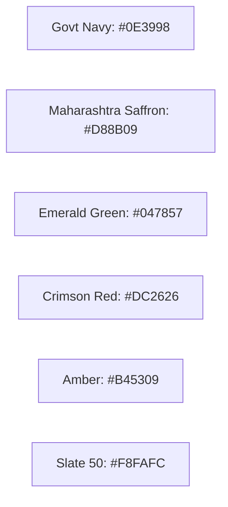

# MahaSkills — Design System & Tokens Specification

Execution rules live in `uiux.md`; this file lists token values.

**Platform:** MahaSkills · Government of Maharashtra (DSEEI / MSInS)  
**Problem Statement ID:** 26134  
**Framework:** Tailwind CSS + Radix UI / shadcn/ui  
**Version:** 1.1  
**Status:** Canonical Design Tokens Baseline (v1.1, aligned with uiux.md)  

---

## 1. Color Tokens & Semantic Palette

The MahaSkills color system combines authoritative government aesthetics with accessible contrast ratios ($\ge 4.5:1$ for normal text, $\ge 3:1$ for large text):



### 1.1 CSS Variable Tokens
```css
:root {
  /* Brand Foundations */
  --primary: 221.2 83.2% 32.5%;             /* Deep Maharashtra Navy #0E3998 */
  --primary-foreground: 210 40% 98%;
  --accent: 37.7 92.1% 44.1%;               /* State Saffron Accent #D88B09 */
  --accent-foreground: 222.2 84% 4.9%;

  /* Neutral Backgrounds & Text */
  --background: 210 40% 98%;               /* Slate 50 #F8FAFC */
  --foreground: 222.2 84% 4.9%;            /* Slate 950 #020817 */
  --card: 0 0% 100%;                       /* Pure White #FFFFFF */
  --card-foreground: 222.2 84% 4.9%;
  --muted: 210 40% 96.1%;
  --muted-foreground: 215.3 19.3% 34.5%;   /* #475569 */
  --border: 214.3 31.8% 91.4%;
  --input: 215.4 16.3% 46.9%;              /* #64748B */

  /* Semantic Feedback */
  --destructive: 0 72.2% 50.6%;            /* Crimson Red #DC2626 */
  --destructive-foreground: 210 40% 98%;
  --success: 162.9 93.5% 24.3%;            /* Emerald Green #047857 */
  --success-foreground: 210 40% 98%;
  --warning: 26 90.5% 37.1%;               /* Amber #B45309 */
  --warning-foreground: 210 40% 98%;
  --info: 224.3 76.3% 48%;                 /* #1D4ED8 */
  --info-foreground: 210 40% 98%;

  /* Subtle Pairs */
  --success-subtle: 151.8 81% 95.9%;
  --success-subtle-foreground: 163.1 88.1% 19.8%;
  --warning-subtle: 48 100% 96.1%;
  --warning-subtle-foreground: 22.7 82.5% 31.4%;
  --danger-subtle: 0 85.7% 97.3%;
  --danger-subtle-foreground: 0 73.7% 41.8%;
  --info-subtle: 213.8 100% 96.9%;
  --info-subtle-foreground: 225.9 70.7% 40.2%;

  /* Gap Severity Scale (3 levels) */
  --gap-low: 149.3 80.4% 90%;              /* #D1FAE5 */
  --gap-low-foreground: 222.2 84% 4.9%;
  --gap-medium: 24.6 95% 53.1%;            /* #F97316 */
  --gap-medium-foreground: 222.2 84% 4.9%;
  --gap-high: 0 73.7% 41.8%;               /* #B91C1C */
  --gap-high-foreground: 210 40% 98%;

  /* Chart Tokens */
  --chart-1: 224.4 64.3% 32.9%;            /* #1E3A8A */
  --chart-2: 175.3 77.4% 26.1%;            /* #0F766E */
  --chart-3: 32.1 94.6% 43.7%;             /* #D97706 */
  --chart-4: 262.1 83.3% 57.8%;            /* #7C3AED */
  --chart-5: 335.1 77.6% 42%;              /* #BE185D */
  --chart-6: 215.4 16.3% 46.9%;            /* #64748B */
}

.dark {
  --background: 222.2 84% 4.9%;            /* #020817 */
  --foreground: 210 40% 98%;               /* #F8FAFC */
  --card: 222.2 47.4% 11.2%;               /* #0F172A */
  --card-foreground: 210 40% 98%;
  --popover: 222.2 47.4% 11.2%;
  --popover-foreground: 210 40% 98%;
  --primary: 213.1 93.9% 67.8%;            /* #60A5FA */
  --primary-foreground: 222.2 84% 4.9%;
  --secondary: 217.2 32.6% 17.5%;          /* #1E293B */
  --secondary-foreground: 210 40% 98%;
  --muted: 217.2 32.6% 17.5%;
  --muted-foreground: 215 20.2% 65.1%;     /* #94A3B8 */
  --accent: 37.7 92.1% 44.1%;              /* #D88B09 */
  --accent-foreground: 222.2 84% 4.9%;
  --destructive: 0 72.2% 50.6%;            /* #DC2626 */
  --destructive-foreground: 210 40% 98%;
  --border: 217.2 32.6% 17.5%;
  --input: 215.7 16.4% 55.9%;              /* #7C8BA1 */
  --ring: 213.1 93.9% 67.8%;

  --success: 162.9 93.5% 24.3%;
  --success-foreground: 210 40% 98%;
  --warning: 26 90.5% 37.1%;
  --warning-foreground: 210 40% 98%;
  --info: 224.3 76.3% 48%;
  --info-foreground: 210 40% 98%;

  --success-subtle: 165.7 91.3% 9%;
  --success-subtle-foreground: 156.2 71.6% 66.9%;
  --warning-subtle: 20.9 91.7% 14.1%;
  --warning-subtle-foreground: 45.9 96.7% 64.5%;
  --danger-subtle: 0 74.7% 15.5%;
  --danger-subtle-foreground: 0 93.5% 81.8%;
  --info-subtle: 226.2 57% 21%;
  --info-subtle-foreground: 211.7 96.4% 78.4%;

  --gap-low: 163.1 88.1% 19.8%;            /* #065F46 */
  --gap-low-foreground: 156.2 71.6% 96.9%; /* #ECFDF5 */
  --gap-medium: 32.1 94.6% 43.7%;          /* #D97706 */
  --gap-medium-foreground: 222.2 84% 4.9%;
  --gap-high: 0 90.6% 70.8%;               /* #F87171 */
  --gap-high-foreground: 222.2 84% 4.9%;

  --chart-1: 213.1 93.9% 67.8%;
  --chart-2: 172.5 66% 50.4%;
  --chart-3: 43.3 96.4% 56.3%;
  --chart-4: 255.1 91.7% 76.3%;
  --chart-5: 328.6 85.5% 70.2%;
  --chart-6: 215 20.2% 65.1%;
}
```

---

## 2. Typography & Bilingual Font Scale

* **Self-Hosted Fonts:** `@fontsource/inter` and `@fontsource/noto-sans-devanagari` (weights 400, 500, 600, 700 only; no Google Fonts CDN).
* **Latin Typography:** `Inter`, system-ui, sans-serif.
* **Devanagari Typography (Marathi & Hindi):** `Noto Sans Devanagari`, sans-serif.
* **Devanagari Line-Height Compensation:** All headings and body blocks apply a $+15\%$ line-height modifier when `lang="mr"` or `lang="hi"` to avoid clipping Devanagari matras (vowel diacritics).

| Token | Size | Line Height | Weight | Usage |
|:---|:---|:---|:---|:---|
| `text-xs` | 12px (0.75rem) | 16px | 400 / 500 | Metadata, timestamps, badge labels |
| `text-sm` | 14px (0.875rem)| 20px | 400 / 500 | Table cell content, form hints |
| `text-base` | 16px (1.0rem) | 24px | 400 / 500 | Body prose, input field text |
| `text-lg` | 18px (1.125rem)| 28px | 600 | Card titles, navigation items |
| `text-xl` | 20px (1.25rem) | 28px | 600 / 700 | Subsection headers, modal titles |
| `text-2xl` | 24px (1.5rem) | 32px | 700 | Primary screen headers |
| `text-3xl` | 30px (1.875rem)| 36px | 800 | Hero headlines, large KPI values |

---

## 3. Spacing & Layout Tokens

* **Base Grid:** 4px baseline unit.
* **Spacing Scale:**
  * `space-1`: 4px | `space-2`: 8px | `space-3`: 12px | `space-4`: 16px
  * `space-6`: 24px | `space-8`: 32px | `space-12`: 48px | `space-16`: 64px
* **Card Elevation:**
  * Standard: `shadow-sm` (`0 1px 2px 0 rgb(0 0 0 / 0.05)`)
  * Hover: `hover:shadow-md` (`0 4px 6px -1px rgb(0 0 0 / 0.1)`)
  * Modal: `shadow-xl` (`0 20px 25px -5px rgb(0 0 0 / 0.1)`)
