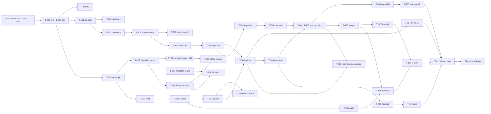

# MahaSkills — Delivery Roadmap (Living Document)

**Version:** v0.2 · **Status:** Proposed. Work can start on the Next Action Queue now. Phase 1+ waits on the Architecture gate (§F, Phase 0).
**Baseline date:** 2026-09-16 · **Baseline commit:** `302e8a9` · **Estimation unit:** ideal engineer-days (d)
**Team shape (declared, see B.4 Q2):** BE = 1 backend engineer · DATA = 1 data/pipeline engineer · FE = 1 frontend engineer · PM = 1 product/programme lead (non-coding)
**Inputs:** `docs/01-product/PRD.md` · `document/frontend_architecture_specification_4.md` ("FE spec") · `docs/backend_architecture_specification.md` ("BE spec") · the repository at `302e8a9`
**Supersedes (once approved):** the slice *ordering* in `IMPLEMENTATION_PLAN.md` and the FE/BE specs. Slice *content* is reused.

> **Change log**
> - 2026-09-16 · **v0.2:** restructured to sections A–N of the revised roadmap-architect prompt. Every task now uses one schema (approach, touches, output, risk, estimate, owner track). New tasks: **T-009** (data-access register), **T-010** (owner decision session), **T-109** (MVP contract freeze, milestone M1), **T-110** (mock data → MSW), **T-413** (recompute after upload). Added: the FE-slice ↔ BE-slice mapping (§E.3), dated milestones, a merged and de-duplicated open-question list (22 → 16, §B.4), the OQ-B09 pseudonymisation-key decision (ADR-010), MoU and licensing risks, and gates. v0.1 is archived at `roadmap-history/ROADMAP-v0.1.md`.
> - 2026-09-16 · v0.1: first roadmap, built from a full repo inspection and live gate runs.

---

## A. Executive summary

MahaSkills has a mature specification set and a polished React frontend. **The frontend runs entirely on mock data, and the backend has no working feature.** All 13 FastAPI routes return hard-coded data, any bearer token is accepted as a Pune District Officer, there are no migrations or queries, and the Airflow DAGs only `print`. The brief describes the project as "IDEA, no code, Java/Spring Boot". The repository contradicts both halves of that (B.3 #1).

**Strategy:** keep the existing FastAPI + React code and stop adding surface area. Build **one real, unattended, end-to-end loop**: *placement CSV + job postings → weekly gap scores → auto-triggered recommendation → SSC review → DSEEI approval → published → candidate sees real outcomes*. It runs on labelled synthetic and curated data for 5 pilot districts, with reference data for all 36. The build order is: decisions → runnable foundation → **agreed mock contract (M1)** → real auth → data backbone → scoring and workflow → wire the existing UI → harden. Employer portal, district plans, Mahaswayam SSO, live scrapers, Airflow, Elasticsearch, NLP and forecasting come after the MVP (§N). Their seams are designed in now.

**Size and date:** ≈ **71 engineer-days** across three engineers, and the backend track is the bottleneck at 27 d. From a start on **Mon 2026-09-21**, the projected release gate is **2026-11-13** with no buffer, or **2026-11-24** with a 20% buffer. That is well inside the brief's "live gap dashboard by month 4". The two risks most likely to break the plan are not engineering risks: data-sharing MoUs and job-portal licensing (§J). The programme lead starts on both in week 1.

---

## B. Current-state assessment

### B.1 What exists (verified 2026-09-16 at `302e8a9`)

| Area | Reality | Evidence |
|---|---|---|
| Backend API | 11 endpoint modules, 13 routes, **all hard-coded** responses. Only `/auth/me` reads the security context | `backend/app/api/v1/endpoints/*.py` |
| Auth | **Bypass:** no token → `ANONYMOUS`; **any** token → `DISTRICT_OFFICER`, district 14. No other route has an auth dependency | `backend/app/core/security.py:19-38` |
| Domain logic worth keeping | Gap formula plus oversupply rule; placement row validation plus HMAC-SHA256 pseudonymisation; 5 unit tests | `backend/app/services/gap_scoring_service.py`, `placement_service.py`, `backend/tests/` |
| Persistence | SQLAlchemy models (20 tables) **and** hand-written `scripts/init-db.sql` (16 tables). The two disagree (B.3 #4). No Alembic. No queries | `backend/app/models/`, `scripts/init-db.sql` |
| Pipelines | Celery app with no tasks. The three DAG files define `print` functions and no DAG object | `backend/app/workers/`, `pipelines/dags/` |
| Seed | 6 districts and 5 sectors (the docstring claims 36 and 33) | `scripts/seed_taxonomy.py` |
| Frontend | React 18, strict TS, Vite, Tailwind. Landing, Dashboard, Gap Analysis, GapHeatmap, Course Finder and Pathway Quiz are **built on local mock data** (`gapScoringData.ts`, `candidateData.ts`). Recommendations, Taxonomy, Placements, District Plans, Employer and Admin are **one-line placeholders** | `frontend/src/app/routes.tsx:11-16` |
| Frontend ↔ API | `apiClient` exists but **nothing uses it**. `msw` and `openapi-typescript` are installed but not wired up. Types are hand-written | grep `apiClient\|useQuery` → only `src/lib/api.ts` |
| Frontend auth | Zustand persona switcher that defaults to an authenticated Policy Maker. `AuthGuard` exists but is unused. No OIDC code | `features/auth/useAuthStore.ts` |
| Contract | `openapi.yaml` has 15 paths. The FE-spec gaps G-01..G-08 that the docs call "incorporated" are **not in it** | `docs/03-api/openapi.yaml` |
| Infra | Compose file for postgres, redis, backend and frontend. It references `keycloak:8080` but has **no keycloak service**. The nginx config has **no SPA fallback**, so a deep link returns 404 | `docker-compose.yml`, `frontend/Dockerfile` |
| CI | **None** (no `.github/`) | — |
| Docs | ~80 canonical docs, a duplicate `docs - Copy/`, and a 129 KB BE spec that prescribes **Java 21 / Spring Boot / Flyway**, contradicting every other doc and the code | `docs/` |

**Gate runs on this machine:** `npm run typecheck` ✅ · `npm run lint` ✅ (0 errors, 7 warnings) · `npm test` ✅ 21/21, testing mock helpers only · `npm run build` ✅ · `pytest` ❌ fastapi and pytest are not installed (Python 3.12.0) · `docker` ❌ not installed · Node 22.19 ✅.

### B.2 What is missing (MVP scope)

Migrations · a real error envelope · JWT verification and RBAC/scope guards · audit writes · the reference seed for 36 districts · institutes and courses · a synthetic data generator · placement persistence · outcome aggregates · job-posting ingestion and role mapping · demand aggregates · the weekly gap batch and its history · the recommendation trigger, dossier and review workflow · the candidate API · every frontend ↔ API wire · OIDC login · CI · a deployable stack · the E2E, security, performance, a11y and i18n gates.

### B.3 What is risky (specific)

1. **The brief contradicts the repository.** The brief says "Codebase: NONE; backend Java/Spring Boot". The repo has a FastAPI backend and a React frontend, and 80 docs are written for FastAPI. **Recommendation: keep FastAPI.** Nobody has named a failure that FastAPI causes. Switching to Java restarts Phases 0–2 (≈ +15 d on the critical path) and changes nothing functionally. The BE spec stays authoritative for *domain design*: modules, state machine, error matrix, ingestion rules, matching explainability. It is not authoritative for technology. Owner decision: **Q3 / ADR-007**. This is flagged as expensive to reverse (§C.4).
2. **Auth bypass** (`core/security.py`). No data endpoint checks authentication.
3. **Gap-score unit bug.** `placement_rate > 1` decides between percent and fraction, so `1.0` (meaning 1%) is read as 100% (`gap_scoring_service.py:15`). The frontend has a copy of the same formula with the same bug (`gapScoringData.ts:7`), and the two copies will drift apart.
4. **Model/SQL drift.** `users`, `user_scopes`, `placement_validation_errors` and `district_plan_items` exist only in the models. `placement_records.employer_name/job_role_title/months_to_placement`, `batches.*_records` and `job_roles.description/version` exist only in the SQL.
5. **Placement validator** crashes on a non-numeric `batch_year` (500), silently defaults the year to 2025, never checks `course_code`, and emits `ERR_*` codes where the docs specify `PLA_*`.
6. **Partition cliff:** `placement_records` has partitions only for 2024–2026.
7. **Secrets as defaults:** `DPDP_TENANT_SALT` and the DB password in `core/config.py` and `docker-compose.yml`. Roll numbers are enumerable, so a leaked pepper de-anonymises every placement row.
8. **DPDP contradiction:** `placement_batches.s3_object_key NOT NULL` implies the raw CSV, with raw candidate IDs, is stored.
9. **Real people and brands in fixtures:** a named serving IAS officer and `@tatamotors.com` emails in `useAuthStore.ts`.
10. **The RTM overstates status.** AUTH-01/02/03, TAX-01, PLA-01/02, ADM-01 and SEC-01/02 are marked Complete, but all of them are stubs.
11. **The pitch diverges from the PRD.** `sih_panel_defense/` promises a Marathi RAG assistant, a cosine-drift gap score on a 0–1 scale, a Green Energy sector and Gadchiroli. None of these are in the PRD or the code.
12. **"Unattended loop" is not fully in the team's control.** Live demand data needs MoUs and licences (Naukri, NCS key). "Required features: 4 sources" includes LinkedIn and Indeed, whose ToS prohibit scraping. **Recommendation:** use NCS, licensed feeds, employer-entered skill needs and curated CSVs, all behind one adapter port. Never scrape LinkedIn or Indeed (ADR-010).
13. **The brief's Phase 1 stack is heavier than the team.** 17 schema-per-module modules, Airflow, Scrapy/Playwright, a separate ML service, ECS and ElastiCache are too many moving parts for three engineers. The MVP uses a modular monolith, plain Python jobs and Postgres search. Each deferred component keeps a seam (§C.3).
14. **Minor error in the brief's appendix:** it calls placements "frontend slice 6". FE spec §G.1 has placements as **slice 5** and recommendations as slice 6. This roadmap uses the spec's numbering.

### B.4 Open questions and working assumptions

**Owner decisions** (all resolved together in T-010; answers are recorded in ADRs):

| # | Question | Blocks | Working assumption |
|---|---|---|---|
| **Q1** | What is the hard date, and what must be shown there (SIH finale demo, DSEEI pilot, programme month-4 review)? | Cut line, milestone dates | Release gate by 2026-11-24. Start date 2026-09-21 |
| **Q2** | Is the team really 3 engineers + 1 PM? Which tasks go to AI agents? | §H, §I parallelism | Declared shape above. Agents assist each track and do not add a track |
| **Q3** | Keep FastAPI and demote the Java BE spec to domain-design reference (ADR-007)? | All backend work | **Yes** |
| **Q4** | Can Docker Desktop be installed on dev machines? | T-007, T-207, T-506 | Yes. Fallback: native Postgres 16 + Memurai (Redis) + dev token issuer |
| **Q5** | Is the repo hosted on GitHub? | T-008 | Yes (GitHub Actions) |
| **Q6** | Gap formula: the PRD's (0–100) or the pitch's (wage premium + cosine drift, 0–1)? | T-003, T-401 | **PRD for the MVP.** The pitch variant becomes an experiment (§N) |
| **Q7** | Pitch-only items (RAG assistant, Green Energy, Gadchiroli): build them, or re-label them as roadmap? | Scope, T-508 | Re-label as roadmap. Show nothing as live that isn't |
| **Q8** | Is any real data accessible now (NCS key, licensed postings, anonymised ITI returns, the DGT ITI list)? | T-304, T-309 realism | None yet. Use synthetic data behind adapters |
| **Q9** | May `docs - Copy/` be deleted? | T-005 | Yes |

**Merged spec questions** (FE spec §H.2 OQ-01..10 plus BE spec §P.2 OQ-B01..12 make 22 questions. After removing duplicates, 7 remain. The suggested defaults from the specs are adopted unless the owner overrides them):

| # | Question (source ids) | Blocks | Working assumption |
|---|---|---|---|
| **S1** | Is sector the same key as SSC? (OQ-01, OQ-B01) | T-301 | Separate tables. `sector.ssc_id` is nullable |
| **S2** | Is SSC_REVIEWER a distinct role? (OQ-02, OQ-B02) | T-203, T-207 | Distinct role (8 principals including anonymous) |
| **S3** | Does "employers rate candidates" mean rating institutes? (OQ-03, OQ-B03) | Post-MVP employer module | Institute/course rating only. No candidate-level surface |
| **S4** | Must the Policy Maker approve every recommendation? (OQ-05, OQ-B06) | T-408 | All of them. Linear path. Bulk approval is post-MVP |
| **S5** | May a District Officer read other districts? (OQ-06, OQ-B07) | T-204, T-404 | Own district only → **403** `AUTH_SCOPE_RESTRICTED` (not the BE spec's 404, see ADR-008) |
| **S6** | **Who holds the pseudonymisation key, and is it per institute?** (OQ-B09) | **T-306. Must be settled before the first real row is hashed** | Platform-held pepper in the secret store. Each institute gets a derived key `HMAC(pepper, institute_id)`. Cross-institute candidate tracking is impossible by design. No re-identification path (OQ-B04) |
| **S7** | Who signs and stores consent for the pathway quiz? (OQ-08) | T-411 | Explicit consent step. Nothing persisted except anonymous counters |

**Deferred with their defaults, no MVP impact:** OQ-04/OQ-B08 (trainer KPI target: show the current value only), OQ-07 (draft plans are hidden from ITIs), OQ-09 (map boundary licence: tracked in T-009), OQ-10/OQ-B11 (amend `PROJECT_BREAKDOWN.md` and `SYSTEM_ARCHITECTURE.md` in T-005), OQ-B05 (no assessment API), OQ-B10 (licence terms: T-009), OQ-B12 (Mahaswayam protocol: assume OIDC brokering, post-MVP).

**Assumptions:**
- **A1:** "Shipped" for the MVP means the loop runs **unattended on synthetic and curated feeds** through production adapters. Running unattended on **live** feeds is the v1.0 definition of done, and it is gated on MoUs.
- **A2:** Synthetic data is acceptable if the data carries an `is_synthetic` flag and the UI labels it.
- **A3:** PostgreSQL 16, Redis 7, React 18 and Keycloak stay (ADR-001..005).
- **A4:** The pilot and demo host is one Linux VM running compose. AWS Mumbai / ECS is the v1.0 target.
- **A5:** The trigger window is 8 consecutive weekly scores above 60 (PRD §7.4). The oversupply window is 2 quarters.

---

## C. Target architecture

The FE spec and the BE spec are the detailed designs. This section records only the end state for the MVP and the places where it **deliberately differs** from those specs.

### C.1 Product end state (MVP, what a stakeholder recognises)

| Actor | Can do, end to end, on real code |
|---|---|
| **ITI Principal** | Log in → upload the monthly placement CSV → see errors by row and column in Marathi, Hindi or English → fix and re-upload → see the institute's placement rate, median salary and time to placement |
| **Admin / Data Steward** | Run or schedule job-posting ingestion and the weekly gap batch → see the run status → browse the NSQF taxonomy |
| **District Officer** | See the gap heatmap, priority table and oversupply flags for their own district. Other districts return 403 |
| **SSC Reviewer** | See recommendations only for their own sectors → read the evidence dossier → approve or request revision, with a rationale |
| **Policy Maker** | See the statewide heatmap → open an auto-generated recommendation → give final approval → publish |
| **Candidate (anonymous)** | Browse courses with real aggregate outcomes (hidden when the cohort is under 10) → take the pathway quiz → get 3 explained recommendations. No PII is stored |

### C.2 Technical end state (MVP)

```
Browser — React SPA · OIDC Auth Code + PKCE · TanStack Query · types generated from OpenAPI · MSW in dev/test
   │ HTTPS · Bearer JWT
   ▼
FastAPI modular monolith  /v1
   core ─ settings (fail-fast) · JWKS verify · RBAC + scope guards · error envelope · request-id JSON logs · audit writer
   modules ─ reference · taxonomy · institutes · placements · labour_market · gap_scoring · recommendations · candidates
   jobs ─ ingest_job_postings · compute_gap_scores · trigger_recommendations   (importable functions; CLI + Celery beat)
   contract ─ OpenAPI exported from code → docs/03-api/openapi.yaml (CI drift gate + Spectral)
   │
   ├─ PostgreSQL 16 — Alembic-managed · pg_trgm · placement_records partitioned + DEFAULT · materialised aggregates
   ├─ Redis 7 — Celery broker · aggregate cache
   └─ Keycloak — dev realm in compose; prod = state IdP. A dev/test token issuer exists only when ENVIRONMENT ∈ {development, test}
```

**Data flow:** an adapter (CSV or NCS JSON) writes to `raw_job_postings`, which is normalised, de-duplicated, mapped to roles, stored in `clean_job_postings`, and aggregated into weekly demand. A placement CSV upload is validated, pseudonymised and persisted atomically as batch + records + errors, then aggregated into outcomes. Weekly demand, outcomes and sanctioned intake feed `gap_scores`, which produce recommendation drafts. Drafts carry a dossier and move through the review state machine, and every step writes an audit row.

**Security posture:** the backend is a pure resource server. Every route has a guard or an explicit `public` marker, and a test enforces this. Out-of-scope access returns 403. No raw candidate identifier is ever persisted or logged. Secrets come only from the environment and fail fast outside development. **Observability:** JSON logs with a request ID, `/health/live`, `/health/ready`, and job run records (rows, duration, status). **Testing:** see §K.

### C.3 Deliberate differences from the specs (each has a seam, so adding it later doesn't mean a rewrite)

| Spec says | MVP does | Seam for later |
|---|---|---|
| Java 21 / Spring Boot / Flyway (BE spec) | FastAPI / SQLAlchemy / Alembic | Module `api` boundaries. Extract a module later if one gets hot |
| 17 modules, schema per module | 8 modules, one schema, module-prefixed tables | Table ownership recorded per module |
| Airflow + Scrapy/Playwright | Plain Python jobs (CLI + Celery beat), CSV/NCS adapters | Airflow wraps `app/jobs/*` unchanged (P-05) |
| Separate ML service (NLP, forecasting) | Keyword + trigram role mapping, no forecasting | `RoleMapper` port, `features.forecasting` flag |
| Elasticsearch | `pg_trgm` | `SkillSearchPort` |
| S3 raw storage | No raw file stored (DPDP minimisation) | Storage adapter for error CSVs only |
| Hand-written contract-first YAML (ADR-006) | Code-first export with a drift gate (ADR-008) | The exported YAML *is* the contract that FE and MSW consume |
| ECS Fargate, RDS Multi-AZ | Compose on one VM | Same images |
| 404 for out-of-scope records (BE spec) | 403 `AUTH_SCOPE_RESTRICTED` (RBAC_MATRIX, TESTING_STRATEGY) | Error-code table |

### C.4 Technology decisions

| Decision | Alternatives considered | Why it fits *this* project | What it makes harder | Reversal cost |
|---|---|---|---|---|
| **Keep FastAPI modular monolith** (ADR-007) | Spring Boot monolith (BE spec); Node + FastAPI microservices (PRD stack doc) | The code, 80 docs, the team's skills and the pandas/scikit analytics are all Python. The BE spec's own "monolith first" argument applies equally here | Fewer compile-time guarantees (mitigation: mypy on `core/` and services). A government SOW may name Java | ⚠️ **HIGH:** changing later means a rewrite. **Decide in Phase 0** |
| **Per-institute derived pseudonymisation key** (ADR-010, S6) | Global salt (current code); per-institute random salts | Cross-institute tracking becomes structurally impossible. There is one secret to protect and rotate | No cross-institute cohort analysis. Rotating the pepper orphans existing hashes | ⚠️ **IRREVERSIBLE** for data already ingested, because raw IDs are never stored. **Decide before T-306** |
| **Alembic baseline from reconciled models** | Flyway; keep `init-db.sql` | Native to the models already written. `alembic check` catches drift in CI | Partitions and extensions need hand-written ops | Medium: the baseline shape is what everything builds on |
| **Code-first OpenAPI + drift gate** (amends ADR-006) | Hand-maintained YAML | The hand-written YAML already drifted. FastAPI emits an accurate spec for free. FE types are generated from it | Contract design review happens in PR code | Low |
| **Keycloak + backend resource server + dev issuer** | Custom auth; Keycloak required in every environment | Keeps ADR-002 and the state SSO path. The dev issuer takes Docker and Keycloak off the critical path | Two token sources in dev, guarded by `ENVIRONMENT` | Low |
| **`oidc-client-ts`** (new FE dependency) | `keycloak-js`; hand-rolled PKCE | Standards-based, so it also works with the state IdP | One more dependency | Low |
| **`pg_trgm` search** | Elasticsearch now | About 2,200 roles and skills fit Postgres. One fewer cluster to run | Weaker relevance ranking | Low (search port) |
| **Plain jobs, Airflow later** | Airflow now | The DAGs are empty. Plain functions can be tested with pytest | No DAG UI in the MVP | Low |
| **CSV/NCS adapters + synthetic data** | Scraping LinkedIn/Indeed | ToS-safe, deterministic, testable | Less "live" | Low (adapter port) |
| **Synchronous upload for ≤ 50k rows** | Celery async + S3 | 50k rows parse in seconds. No raw file is persisted | The UI blocks for a few seconds on large files | Medium |
| **Compose on one VM for the pilot** | K8s/ECS now | Pilot load is tiny. The ops cost isn't justified | No zero-downtime deploys | Low (portable images) |
| **Materialised views + Redis cache** | OLAP store | Meets the p95 targets at pilot scale with components the stack already has | Refreshes have to be orchestrated | Low |

---

## D. Workstreams

Each row owns at least one deliverable that no other row owns. "Owner" is the track from the declared team shape.

| Workstream | Owner | Purpose | Deliverables it alone owns | Depends on | Priority | Complexity | Risk |
|---|---|---|---|---|---|---|---|
| **Decisions & docs** | PM (+BE for ADR text) | Remove contested unknowns. Keep docs truthful | ADR-007..010, truthful RTM, decision log (T-010) | — | P0 | S | Med (stalls) |
| **Data access & partnerships** | PM | Secure real data and legal clearance | Data-access register: MoUs, NCS key, Naukri position, GSTIN, map licence (T-009) | — | P0 for v1.0 | M | **High** (external) |
| **Platform foundation** | BE | Runnable, observable, contract-exporting backend | Settings, error envelope, logging, health, OpenAPI export, CI | Decisions | P0 | M | Low |
| **Data model & pipelines** | DATA | Schema and every batch job | Alembic, seeds, synthetic generator, ingestion, aggregates, gap batch, trigger | Foundation | P0 | L | High |
| **Identity & access** | BE | A non-bypassable boundary | JWT verify, scope guards, RBAC matrix test, audit writer, Keycloak realm | Foundation | P0 | M | High |
| **Domain APIs** | BE | Workflow and read APIs over the data | Placement upload, taxonomy, gap, dossier, review workflow, candidate APIs | Identity, Data | P0 | L | Med |
| **Frontend integration** | FE | Existing UI on real APIs | Typed API layer, MSW fixtures, OIDC login, wired views, new recommendation/placement/taxonomy views | Contract (M1) | P0/P1 | M | Med |
| **Quality & release** | FE (E2E, a11y, i18n), BE (security), DATA (perf, deploy) | Proof and shipping | Closed-loop E2E, security/perf/a11y/i18n reports, deployable stack, runbook | All | P0/P1 | M | Med |

---

## E. Dependency graph

### E.1 Critical chain

```
Decisions (T-001..T-004, T-010) → dev env + DB (T-006, T-007) → Alembic baseline (T-101)
  → error envelope (T-103) → OpenAPI export (T-107) → MVP contract freeze [M1] (T-109)
  → JWT verify (T-201) → scopes (T-203) → route guards (T-204)
  → reference seed (T-301) → taxonomy API (T-302) → institutes & courses (T-304) → synthetic data (T-305)
  → placement upload (T-306) → outcomes (T-308)  ─┐
  → job ingestion (T-309) → demand aggregates (T-310) ─┴→ fixed formula + weekly batch + backfill (T-401..T-403)
  → trigger (T-406) → review state machine (T-408) → recommendations UI (T-409)
  → closed-loop E2E (T-412) → security pass + deployable stack (T-501, T-506) → release
```

### E.2 What runs beside the chain



**Parallel with the chain (respecting the team shape):** PM runs T-005, T-009 and T-010 throughout. FE runs T-008, T-108, T-110, T-208, T-303, T-307, T-405 and T-410/411 UI, against MSW until the APIs land. DATA runs T-101/102, T-207, then the whole data backbone while BE builds the security core.

### E.3 FE-spec slices ↔ BE-spec slices ↔ this roadmap

| FE slice (FE spec §G.1) | Needs BE slice (BE spec §O.1) | Roadmap tasks | Cross-tier dependency that can bite |
|---|---|---|---|
| 0 Foundation | 1 Foundation | T-008, T-103..T-110 | **FE needs the exported contract (T-109) before it can mock anything faithfully** |
| 1 Shell & access | 2 Identity | T-201..T-209 | FE login needs the realm (T-207) or the dev issuer (T-202) |
| 2 Data primitives | — | Absorbed into T-405, T-409 (built on demand, rule 11) | — |
| 3 Labour market + gap | 5 Ingestion/LMI, 7 Gap scoring | T-309, T-310, T-401..T-405 | Heatmap numbers are real only after T-403 |
| 4 Dashboards | 7 Gap scoring (+ G-03 institutes) | T-304, T-404, T-405 | **FE slice 4 cannot complete before BE slice 7 produces real numbers** |
| 5 Placements | 6 Placements | T-306..T-308, T-413 | **Needs the row-level error contract (BE §I.5), frozen in T-109** |
| 6 Recommendations | 8 Curriculum & recs | T-406..T-409 | Needs `If-Match`/409 semantics (ADR-008) |
| 8 Candidate | 10 Candidates & matching | T-410, T-411 | **Needs the explainable matching contract (BE §J.3): factors that sum to the score, plus reasons in 3 languages** |
| 7 Employer · 9 District plans · 10 Notifications/reports/admin · 11 Forecast/PWA | 9, 11, 12 | §N (P-01..P-10) | Post-MVP |

---

## F. Phases

**Task schema used by every task:** description · approach · touches · depends on · output · acceptance · testing · risk · estimate · track. The ids stay `T-<phase><nn>`, the same ids used in v0.1 and in `roadmap-tracker/`.

**Priority placement note:** the priority rule says P0 goes in Phases 1–2. For this project P0 work spans Phases 0–4, because the loop is long and phases are capped at about 15 tasks. The rules that matter still hold: no P2 work before release, and no P1 task starts before its P0 prerequisites.

---

### Phase 0 — Decisions & working environment · 6.0 d · target done 2026-09-25 (M0)

- **Objective:** settle what "correct" means, and make every quality gate runnable.
- **Why now:** four doc conflicts (stack, error codes, 403 vs 404, scoring units and trigger) would each cause rework. No backend gate can run today.
- **Prerequisites:** none.
- **Exit criteria (Architecture gate):** ADR-007..010 are *Accepted* by the owner. The T-010 decision log answers Q1–Q9 and S1–S7, or explicitly adopts the defaults. `pytest -q` → 5 passed locally. CI runs both jobs on a PR. `pg_isready` passes. The data-access register exists and every item has a named counterpart and a next date.
- **Risks:** decisions stall (mitigation: defaults are pre-written, so the owner only has to confirm them). Docker can't be installed (mitigation: native fallback).

#### T-001 · Write ADR-007: keep the FastAPI modular monolith
- **Description:** Record FastAPI as the stack. Mark the BE spec as the *domain-design* reference, not the technology choice. This is the most expensive decision to reverse.
- **Approach:** An ADR with the C.4 rationale, reversal cost, and the list of BE-spec sections that remain normative (§B modules, §F errors except 404, §H state machine, §I ingestion, §J matching). Add a header note to the BE spec.
- **Touches:** `docs/10-decisions/ADR/ADR-007-backend-stack.md`, `docs/backend_architecture_specification.md` (header), `docs/02-architecture/SYSTEM_ARCHITECTURE.md`
- **Depends on:** — · **Output:** accepted ADR
- **Acceptance:** the owner marks it Accepted. `grep -ri "spring boot" docs/ --exclude-dir="docs - Copy"` hits only the annotated BE spec.
- **Testing:** doc review · **Risk:** Medium (the owner may prefer Java; see B.3 #1) · **Estimate:** 0.5 d · **Track:** BE drafts, PM obtains the decision

#### T-002 · Write ADR-008: API conventions and code-first contract
- **Description:** One error-code list (`AUTH_UNAUTHENTICATED`, `AUTH_TOKEN_EXPIRED`, `AUTH_FORBIDDEN`, `AUTH_SCOPE_RESTRICTED`, `PLA_*`, `REC_*`, `INTERNAL_ERROR`). Out-of-scope access returns 403. Also defines the envelope, pagination, `If-Match`/409 on workflow writes, and the code-first OpenAPI export (amends ADR-006).
- **Approach:** Merge `ERROR_CODES.md`, BE spec §F and the RBAC_MATRIX rules. Record each conflict and how it was resolved.
- **Touches:** `ADR-008-api-conventions.md`, `docs/03-api/ERROR_CODES.md`, `API_SPECIFICATION.md`
- **Depends on:** — · **Output:** accepted ADR + updated error-code doc
- **Acceptance:** exactly one error-code table exists. `grep -rn "ERR_" docs/03-api` returns 0.
- **Testing:** doc review · **Risk:** Low · **Estimate:** 0.5 d · **Track:** BE

#### T-003 · Write ADR-009: gap-scoring parameters
- **Description:** Define every number the scoring code uses, once.
- **Approach:** Record that `placement_rate` is strictly on a 0–100 scale. Record the trend-factor definition and its bounds, the normalisation constant, the severity bands (75/60/40, matching the FE), the trigger (8 consecutive weekly scores > 60 and no active local course), the oversupply rule (2 quarters), and the formula version string. The PRD formula is canonical and the pitch variant is future work (Q6).
- **Touches:** `ADR-009-gap-scoring-parameters.md`, cross-reference in `PRD.md`
- **Depends on:** — · **Output:** accepted ADR
- **Acceptance:** every constant used by T-401, T-404 and T-406 appears in the ADR with a unit.
- **Testing:** doc review. T-401 tests cite ADR-009 · **Risk:** Low · **Estimate:** 0.5 d · **Track:** DATA

#### T-004 · Write ADR-010: data sourcing, DPDP and the pseudonymisation key
- **Description:** Record that the MVP does no LinkedIn or Indeed scraping, that data comes through a CSV/NCS adapter port, that synthetic rows are flagged `is_synthetic`, and that the raw placement CSV is never persisted. Also records the k-anonymity threshold of 10 and the **key scheme from S6**.
- **Approach:** An ADR plus a `DATA_PRIVACY.md` update. The key is `HMAC(pepper, institute_id)`, and the pepper comes only from the environment or secret store. Document the rotation consequence.
- **Touches:** `ADR-010-data-sourcing-and-pseudonymisation.md`, `docs/05-security/DATA_PRIVACY.md`
- **Depends on:** — · **Output:** accepted ADR
- **Acceptance:** the owner accepts it. The key scheme, key holder and rotation policy are written down before T-306 starts.
- **Testing:** doc review. T-306 and T-502 enforce it · **Risk:** Medium (irreversible once data flows) · **Estimate:** 0.5 d · **Track:** DATA

#### T-005 · Make the docs tell the truth
- **Description:** Set RTM statuses to their real values. Delete `docs - Copy/` (Q9). Amend `PROJECT_BREAKDOWN.md` and `SYSTEM_ARCHITECTURE.md` to match ADR-007. Link this roadmap from `docs/README.md`.
- **Approach:** Change a row to "Implemented" only when its test id passes in CI.
- **Touches:** `docs/01-product/REQUIREMENTS_TRACEABILITY.md`, `docs/README.md`, `docs/07-development/PROJECT_BREAKDOWN.md`
- **Depends on:** T-001 · **Output:** honest RTM
- **Acceptance:** no row is marked Complete without a passing test id. `docs - Copy/` is gone.
- **Testing:** diff review · **Risk:** Low · **Estimate:** 0.5 d · **Track:** PM

#### T-006 · Make the backend quality gates runnable
- **Description:** Nothing in the backend can be tested today. This task makes that possible.
- **Approach:** Create `backend/.venv` with Python 3.12, and add `requirements-dev.txt` with ruff, black, mypy, pytest-cov, pytest-randomly and pip-audit. Switch `tests/conftest.py` to `httpx.ASGITransport(app=app)`. Document the steps in `AGENTS.md` §3.
- **Touches:** `backend/requirements-dev.txt`, `backend/tests/conftest.py`, `AGENTS.md`
- **Depends on:** — · **Output:** runnable backend gates
- **Acceptance:** `pytest -q` → `5 passed`. `ruff check .` and `black --check .` exit 0.
- **Testing:** paste the command output into the PR · **Risk:** Low · **Estimate:** 0.5 d · **Track:** BE

#### T-007 · Run Postgres 16 and Redis 7 locally
- **Description:** Every DB-backed task needs a database.
- **Approach:** Docker Desktop plus `docker compose up -d postgres redis`, **or** native Postgres 16 plus Memurai on Windows. Document both paths.
- **Touches:** `docs/07-development/LOCAL_SETUP.md`, `.env.example`
- **Depends on:** — · **Output:** running DB and cache
- **Acceptance:** `pg_isready -h localhost -d mahaskills` accepts connections. `redis-cli ping` → `PONG`.
- **Testing:** command output · **Risk:** Low · **Estimate:** 0.5 d · **Track:** DATA

#### T-008 · Add the CI skeleton
- **Description:** Make every later exit criterion enforceable on each PR.
- **Approach:** GitHub Actions with two jobs. The backend job runs a Postgres 16 service, ruff, black and pytest. The frontend job runs `npm ci`, lint, typecheck, test and build. Spectral is added in T-107.
- **Touches:** `.github/workflows/ci.yml`
- **Depends on:** T-006 · **Output:** CI on every PR
- **Acceptance:** both jobs are green on a PR, and a deliberately broken test turns the backend job red.
- **Testing:** PR checks · **Risk:** Low · **Estimate:** 1 d · **Track:** FE

#### T-009 · Open the data-access and licensing register
- **Description:** The engineering team does not control the gating dependencies for v1.0, so they need an owner from week 1.
- **Approach:** One table with, for each item, the counterpart, the current status, the next action and date, the fallback, and the licence basis for retention (OQ-B10). Items: MoUs with ITIs, polytechnics and job portals; the NCS Open API key; the Naukri licence; the LinkedIn/Indeed position (no scraping); the GSTIN verification API; Mahaswayam SSO endpoints and protocol (OQ-B12); the NSDC/SSC taxonomy feed; the DGT ITI list; the licence for the Maharashtra district boundary SVG (OQ-09). Review it weekly.
- **Touches:** `docs/10-decisions/DATA_ACCESS_REGISTER.md`
- **Depends on:** — · **Output:** register + weekly review slot
- **Acceptance:** every item has a named counterpart, a status and a next date. It is reviewed at every phase gate.
- **Testing:** gate checklist · **Risk:** **High** (external parties) · **Estimate:** 1 d up front, then about 1 h/week · **Track:** PM

#### T-010 · Run the owner decision session for Q1–Q9 and S1–S7
- **Description:** One session so that decisions stop dribbling in.
- **Approach:** Present B.4 with the defaults. Record each answer, or "default adopted", in a decision log. Re-plan any milestone whose date changes.
- **Touches:** `docs/10-decisions/OPEN_QUESTIONS.md`, this roadmap's change log
- **Depends on:** — · **Output:** decision log
- **Acceptance:** all 16 questions show an answer and a date.
- **Testing:** gate checklist · **Risk:** Medium (owner availability) · **Estimate:** 0.5 d · **Track:** PM

---

### Phase 1 — Foundation and the agreed contract · 11.0 d · target done 2026-10-02 (M1)

- **Objective:** a schema-managed, error-consistent, observable backend skeleton, **and an exported MVP contract that the frontend mocks faithfully**.
- **Why now:** every feature needs migrations, the envelope, a DB session and fixtures. The FE can only work in parallel once the contract is fixed.
- **Prerequisites:** Architecture gate (Phase 0).
- **Deliverables:** Alembic baseline, partitions, error handlers, hardened settings, DB test harness, JSON logs, health endpoints, OpenAPI export plus drift gate, generated FE types, MSW fixtures, **MVP contract v0.9 (M1)**.
- **Tests:** migration round-trip in CI, envelope tests, settings fail-fast test, one hook test through MSW.
- **Exit criteria (Architecture gate re-check):** `alembic upgrade head && alembic check && alembic downgrade base` is green in CI. The error-envelope tests for 401/403/404/409/422/500 pass. The drift job is green. Starting the app with `ENVIRONMENT=production` and a default secret exits non-zero. **`openapi.yaml` contains every MVP endpoint with request and response schemas, and FE and BE engineers have both signed the contract (M1).** No production FE module imports `gapScoringData` or `candidateData`.
- **Risks:** model/SQL reconciliation turns up more schema decisions (time-box it, and treat `DATABASE_SCHEMA.md` as the tie-breaker). The contract freeze drags (only MVP endpoints are frozen).

#### T-101 · Create the Alembic baseline from reconciled models
- **Description:** A single schema authority, replacing the two drifting ones (B.3 #4).
- **Approach:** Run `alembic init` with the async env. Reconcile the models with `init-db.sql` and `DATABASE_SCHEMA.md` in both directions, and defer non-MVP tables to later slices. Autogenerate the baseline, then hand-add `pg_trgm` and `pgcrypto`. Cut `init-db.sql` down to extensions only. Drop `NOT NULL` on `placement_batches.s3_object_key` (B.3 #8).
- **Touches:** `backend/alembic/`, `backend/alembic.ini`, `backend/app/models/*.py`, `scripts/init-db.sql`, `docs/02-architecture/DATABASE_SCHEMA.md`
- **Depends on:** T-006, T-007, T-001 · **Output:** baseline revision
- **Acceptance:** `upgrade head` succeeds on an empty DB. `alembic check` reports no diff. `downgrade base` is clean.
- **Testing:** a CI step plus a local run log · **Risk:** Medium (hidden schema decisions; time-box 2 d) · **Estimate:** 2 d · **Track:** DATA

#### T-102 · Add placement partitions through 2030 plus a DEFAULT partition
- **Description:** Removes the partition cliff (B.3 #6).
- **Approach:** A migration that creates yearly partitions for 2024–2030 and a `DEFAULT` partition. Document how to add a year.
- **Touches:** `alembic/versions/*_placement_partitions.py`
- **Depends on:** T-101 · **Output:** migration
- **Acceptance:** inserts with `batch_year` 2027 and 2035 both succeed.
- **Testing:** pytest integration · **Risk:** Low · **Estimate:** 0.5 d · **Track:** DATA

#### T-103 · Implement the error envelope and canonical codes
- **Description:** Make every error body the same shape, as ADR-008 requires.
- **Approach:** Add `DomainError(code, status, message, details)` in `app/core/errors.py`, plus handlers for `HTTPException`, `RequestValidationError` and unhandled exceptions. An unhandled exception returns `INTERNAL_ERROR` without leaking the stack trace.
- **Touches:** `backend/app/core/errors.py`, `backend/app/main.py`
- **Depends on:** T-002, T-006 · **Output:** uniform 4xx/5xx bodies
- **Acceptance:** the 401/403/404/409/422/500 bodies match `ERROR_CODES.md`. No traceback appears in any response.
- **Testing:** `tests/test_errors.py` · **Risk:** Low · **Estimate:** 1 d · **Track:** BE

#### T-104 · Harden settings and remove secret defaults
- **Description:** Closes B.3 #7.
- **Approach:** No default values for secrets. Startup fails if `ENVIRONMENT ∉ {development, test}` and the pepper or DB password is unset or still the default. CORS origins come from the environment. Compose uses `env_file`.
- **Touches:** `backend/app/core/config.py`, `docker-compose.yml`, `.env.example`
- **Depends on:** T-006 · **Output:** fail-fast configuration
- **Acceptance:** `ENVIRONMENT=production` with the default pepper → the process exits non-zero with a clear message.
- **Testing:** pytest on `Settings` · **Risk:** Low · **Estimate:** 0.5 d · **Track:** BE

#### T-105 · Add the DB session, test harness and health endpoints
- **Description:** Gives every DB task fixtures and gives ops a readiness probe.
- **Approach:** An async session dependency, a per-test transaction-rollback fixture against real Postgres, and factory helpers. `/health/live` and `/health/ready`, where ready checks DB and Redis.
- **Touches:** `backend/app/core/database.py`, `backend/tests/conftest.py`, `backend/app/main.py`
- **Depends on:** T-101 · **Output:** fixtures + probes
- **Acceptance:** ready returns 503 when the DB is down. Tests pass in random order.
- **Testing:** pytest with `-p randomly` · **Risk:** Low · **Estimate:** 1 d · **Track:** BE

#### T-106 · Add JSON logging with request IDs and redaction
- **Description:** Observability plus DPDP-safe logs.
- **Approach:** JSON formatter and `X-Request-ID` middleware. Redact `Authorization` and any `candidate_id` or `roll_no` key.
- **Touches:** `backend/app/core/logging.py`, middleware in `main.py`
- **Depends on:** T-103 · **Output:** structured logs
- **Acceptance:** captured logs contain `request_id` and no redacted values.
- **Testing:** pytest `caplog` · **Risk:** Low · **Estimate:** 0.5 d · **Track:** BE

#### T-107 · Export OpenAPI from code and gate drift in CI
- **Description:** Makes the code the single source of the contract (ADR-008).
- **Approach:** `scripts/export_openapi.py` writes `docs/03-api/openapi.yaml`. CI re-exports and fails on `git diff`. Add a Spectral ruleset.
- **Touches:** `scripts/export_openapi.py`, `.spectral.yaml`, `.github/workflows/ci.yml`
- **Depends on:** T-103, T-008 · **Output:** a contract that can't drift
- **Acceptance:** changing a route without re-exporting turns CI red. Spectral reports 0 errors.
- **Testing:** CI run · **Risk:** Low · **Estimate:** 1 d · **Track:** BE

#### T-108 · Build the typed frontend API layer
- **Description:** Replaces the unused `apiClient` with a typed, envelope-aware client.
- **Approach:** `npm run gen:api` (openapi-typescript) writes `src/types/generated.ts`. Wrap `apiClient` so it unwraps the envelope and maps error codes (FE spec §F.8). Set up the MSW test server.
- **Touches:** `frontend/package.json`, `frontend/src/lib/api.ts`, `frontend/src/test/msw.ts`
- **Depends on:** T-107 · **Output:** generated types + client
- **Acceptance:** `npm run typecheck` is green. A sample hook test round-trips through MSW, including the error path.
- **Testing:** vitest · **Risk:** Low · **Estimate:** 1 d · **Track:** FE

#### T-109 · Freeze the MVP contract (milestone M1, "mock contract agreed")
- **Description:** The explicit, dated deliverable that lets FE and BE run in parallel. It is on the critical path.
- **Approach:** Declare Pydantic request/response models and route signatures for **every MVP endpoint**: reference, taxonomy tree and search, institutes and courses (G-03), placement upload with the row-level error shape (BE §I.5) and errors listing, outcomes (G-08), LMI aggregates, gap scores, district aggregates and oversupply, recommendations list, dossier and review with `If-Match`, candidate courses, and pathway recommend with its factor breakdown (BE §J.3). Unimplemented handlers raise `DomainError("NOT_IMPLEMENTED", 501)`. Export the contract and tag it `contract-mvp-v0.9`. Both engineers review it. Removing a 501 is how each slice is marked implemented.
- **Touches:** `backend/app/schemas/*.py`, `backend/app/api/v1/endpoints/*.py` (hard-coded bodies removed), `docs/03-api/openapi.yaml`
- **Depends on:** T-103, T-107, T-002 · **Output:** signed-off contract (M1)
- **Acceptance:** every MVP route from §C.1 is in `openapi.yaml` with typed schemas. There are no hard-coded business payloads left in `endpoints/`. BE and FE both approve the PR.
- **Testing:** a test enumerates the MVP route list against `app.routes`. Spectral passes · **Risk:** Medium (contract churn later means rework on both sides) · **Estimate:** 2 d (1 BE + 1 FE review and adjustment) · **Track:** BE + FE

#### T-110 · Move the mock data into MSW handlers
- **Description:** The UI keeps working during the build, but only through the real client (FE spec §F.6).
- **Approach:** Turn `gapScoringData.ts` and `candidateData.ts` into fixtures served by MSW handlers that implement T-109's contract, including filtering, paging, and the `?mockError=` switch. Toggle with `VITE_USE_MOCKS`. Delete the client-side copy of the formula (B.3 #3).
- **Touches:** `frontend/src/mocks/**`, `frontend/src/features/gap-scoring/*`, `frontend/src/features/candidates/*`
- **Depends on:** T-108, T-109 · **Output:** mock-backed UI through the real client
- **Acceptance:** `grep -r "gapScoringData\|candidateData" frontend/src --include=*.tsx` only matches files under `mocks/` or tests. Existing views render unchanged with mocks on.
- **Testing:** vitest (the 21 existing tests are migrated, not deleted) plus a screenshot · **Risk:** Low · **Estimate:** 1.5 d · **Track:** FE

---

### Phase 2 — Security core · 8.25 d · target done 2026-10-09 (M2)

- **Objective:** a backend boundary that can't be bypassed, and real login.
- **Why now:** it is the most severe defect (B.3 #2). Placement upload, SSC review and district scoping are meaningless without it.
- **Prerequisites:** Phase 1 exit.
- **Deliverables:** JWKS verification, dev issuer, principal and scope resolution, guards on every route, RBAC matrix test, audit writer, Keycloak dev realm, frontend PKCE, fictional personas.
- **Tests:** token-forgery tests, the route-enumeration test, the RBAC matrix, audit-row assertions, a Playwright login smoke test.
- **Exit criteria (Feature gate):** the bypass code is deleted. The RBAC matrix is green for every route × 8 principals. The route-enumeration test fails if any route lacks a guard or public marker. A browser login works against the realm, or against the dev issuer if Q4 = no. `grep` finds no real officials or brand emails.
- **Risks:** Keycloak needs Docker (the dev issuer keeps it off the critical path). Token scope claims vs. DB scopes (resolved in T-203).

#### T-201 · Verify JWTs against JWKS and delete the bypass
- **Approach:** RS256 via JWKS, cached and refreshed on a `kid` miss. Verify `iss`, `aud`, `exp` and `nbf`. Map realm roles. Reject `alg=none` and HS256.
- **Touches:** `backend/app/core/security.py` · **Depends on:** T-103 · **Output:** real authentication
- **Acceptance:** no token → 401 `AUTH_UNAUTHENTICATED`. Expired → 401 `AUTH_TOKEN_EXPIRED`. Wrong issuer, `alg=none` or HS256 → 401.
- **Testing:** pytest with locally signed tokens (TEST-SEC-001) · **Risk:** High (touches every request) · **Estimate:** 1.5 d · **Track:** BE

#### T-202 · Add a dev/test token issuer
- **Approach:** A local RSA key and JWKS endpoint, mounted only in development and test. CLI: `python -m app.devtools.token --role DISTRICT_OFFICER --district 14`. Pytest fixtures for each role.
- **Touches:** `backend/app/devtools/`, `backend/tests/conftest.py` · **Depends on:** T-201 · **Output:** tokens for tests and the demo
- **Acceptance:** the issuer route returns 404 under `ENVIRONMENT=production`.
- **Testing:** pytest · **Risk:** Medium (must never ship enabled) · **Estimate:** 0.5 d · **Track:** BE

#### T-203 · Resolve principals and scopes
- **Approach:** Roles come from the token. District, institute and sector scopes come from `user_scopes`, with a user row created on first login. ADMIN and POLICY_MAKER are statewide. SSC_REVIEWER is a distinct role (S2).
- **Touches:** `backend/app/core/security.py`, `backend/app/models/user.py`, a migration · **Depends on:** T-201, T-101 · **Output:** `Principal` object
- **Acceptance:** a user without a scope row gets 403 on scoped routes, never 500.
- **Testing:** pytest · **Risk:** Medium · **Estimate:** 1 d · **Track:** BE

#### T-204 · Put guards on every route
- **Approach:** Add `require_roles`, `require_district_scope`, `require_institute_scope` and `require_sector_scope`, plus an explicit `public=True` marker for candidate routes.
- **Touches:** `backend/app/core/authz.py`, `backend/app/api/v1/endpoints/*.py` · **Depends on:** T-203 · **Output:** enforced RBAC
- **Acceptance:** a test enumerates `app.routes` and fails if any route has neither a guard nor a public marker.
- **Testing:** pytest · **Risk:** High (easy to miss a route; the enumeration test closes that gap) · **Estimate:** 1 d · **Track:** BE

#### T-205 · Write the RBAC matrix test
- **Approach:** A parametrised table built from `RBAC_MATRIX.md`: route × {7 roles + anonymous} → expected status. Tampering with the district in a request → 403 `AUTH_SCOPE_RESTRICTED`.
- **Touches:** `backend/tests/test_rbac_matrix.py` · **Depends on:** T-204 · **Output:** TEST-SEC-002/003
- **Acceptance:** every cell passes. Adding a route without a matrix row fails the test.
- **Testing:** pytest · **Risk:** Low · **Estimate:** 1 d · **Track:** BE (FE may pair on it; FE has slack)

#### T-206 · Add the audit writer
- **Approach:** `audit.record(principal, action, resource, old, new)`, written in the same transaction as the mutation. No candidate hash is written into `new_values`.
- **Touches:** `backend/app/services/audit.py` · **Depends on:** T-203 · **Output:** audit rows
- **Acceptance:** each mutating-endpoint test asserts exactly one audit row.
- **Testing:** pytest (TEST-ADM-001) · **Risk:** Low · **Estimate:** 0.5 d · **Track:** BE

#### T-207 · Add the Keycloak dev realm to compose
- **Approach:** A `keycloak` compose service and a realm export with 8 roles, a `mahaskills-web` client (public, PKCE), a `mahaskills-api` client, and fictional test users.
- **Touches:** `infra/keycloak/realm-mahaskills.json`, `docker-compose.yml` · **Depends on:** T-007 (Docker) · **Output:** an IdP that can log users in
- **Acceptance:** a token for each test user validates against T-201.
- **Testing:** script plus an optional pytest job against the live JWKS · **Risk:** Medium (Docker dependency, Q4) · **Estimate:** 1 d · **Track:** DATA

#### T-208 · Add OIDC login and route guards to the frontend
- **Approach:** `oidc-client-ts` Authorization Code + PKCE, with tokens kept in memory and silent renew. `AuthGuard` and `RoleGuard` on the AppShell routes, plus 403/404 pages. The persona switcher only appears in `import.meta.env.DEV` with the dev issuer.
- **Touches:** `frontend/src/features/auth/*`, `frontend/src/app/routes.tsx`, `frontend/src/lib/api.ts` · **Depends on:** T-207 or T-202, T-108 · **Output:** real login
- **Acceptance:** an unauthenticated visit to `/dashboard` redirects to login. SSC_REVIEWER on `/admin` gets the 403 page, not a blank screen.
- **Testing:** vitest plus a Playwright smoke test · **Risk:** Medium · **Estimate:** 1.5 d · **Track:** FE

#### T-209 · Replace real people and brands with fictional personas
- **Approach:** Fictional names and a `@example.gov.in` / `@example.com` domain. Employers in *market data* may stay named, as the FE spec §F.6 allows, but no personal contacts.
- **Touches:** `frontend/src/features/auth/useAuthStore.ts`, `frontend/src/mocks/**` · **Depends on:** — · **Output:** clean fixtures
- **Acceptance:** `grep -rn "Diwase\|tatamotors.com" frontend/src` returns 0. A CI grep enforces it.
- **Testing:** CI grep · **Risk:** Low · **Estimate:** 0.25 d · **Track:** FE (a quick win that can be done any time)

---

### Phase 3 — MVP data backbone · 17.5 d · target done 2026-10-23 (M3)

- **Objective:** real reference data, placement outcomes and demand signals in Postgres. These are the two inputs of the gap formula.
- **Why now:** the product's central number depends on them.
- **Prerequisites:** Phase 2 exit. T-301, T-304 and T-305 may start once T-101 is done, and T-302 once T-204 is done.
- **Deliverables:** 36-district seed, taxonomy API and UI, institutes and courses, synthetic generator, placement upload with an errors UI, outcomes, job ingestion, demand aggregates.
- **Tests:** seed idempotency, generator determinism, upload counts vs. the manifest, DPDP assertion, ingestion idempotency, mapping precision, aggregate fixtures.
- **Exit criteria (Feature + Integration gates):** uploading the seeded CSVs gives exactly the valid/error counts in the generator manifest. No raw candidate ID from the source file exists in any table. Re-running ingestion inserts 0 rows. Role-mapping precision is ≥ 80% on the labelled sample. Demand and outcome aggregates match hand-computed fixtures to 2 dp. **The formula spike in T-305 shows ≥ 3 district×role pairs above 60 for ≥ 8 weeks.** The RBAC matrix is still green.
- **Risks:** role-mapping quality, synthetic data realism, and upload being the largest privacy-critical task.

#### T-301 · Seed the reference data (36 districts, divisions, sectors, SSCs)
- **Approach:** An idempotent ORM seeder. District ids match the frontend map ids. Sectors and SSCs are separate tables (S1). It replaces `scripts/seed_taxonomy.py`.
- **Touches:** `backend/app/seed/reference.py`, `scripts/seed_taxonomy.py` (removed) · **Depends on:** T-101 · **Output:** `python -m app.seed reference`
- **Acceptance:** 36 districts and 6 divisions exist. A second run changes 0 rows.
- **Testing:** pytest plus a run log · **Risk:** Low · **Estimate:** 1 d · **Track:** DATA

#### T-302 · Build the taxonomy API
- **Approach:** Implement the backend scope of `HANDOFF-slice-2-taxonomy.md`: seed roles and skills, `taxonomy_service`, `/taxonomy/tree`, `/taxonomy/search`, trigram indexes, and the normalisation function (BE slice 4: three spellings resolve to one skill).
- **Touches:** as listed in handoff §5 (backend rows) · **Depends on:** T-301, T-204 · **Output:** a taxonomy backed by the database
- **Acceptance:** the backend scenarios in handoff §8 pass. The size of the tree payload is recorded.
- **Testing:** pytest (TEST-TAX-001) · **Risk:** Low · **Estimate:** 1.5 d · **Track:** BE

#### T-303 · Build the taxonomy UI
- **Approach:** The frontend scope of the handoff: `TaxonomyTreeView`, `SkillBadge`, search, and i18n. The list is virtualised if the tree has more than 500 nodes.
- **Touches:** as listed in handoff §5 (frontend rows) · **Depends on:** T-302 (or MSW), T-108 · **Output:** `/taxonomy` page
- **Acceptance:** the tree expands down to skills. Searching "battery" returns results. It works in `mr`.
- **Testing:** vitest (TEST-TAX-002) plus a screenshot · **Risk:** Low · **Estimate:** 1 d · **Track:** FE

#### T-304 · Seed institutes and courses and serve them (G-03)
- **Approach:** Seed fictional or public-list ITIs for the 5 pilot districts, courses linked to job roles, and `institute_courses` with sanctioned intake. Serve `GET /institutes`, `/institutes/{id}` and `/institutes/{id}/courses`, all scoped.
- **Touches:** `backend/app/seed/institutes.py`, `backend/app/modules/institutes/` · **Depends on:** T-302 · **Output:** supply-side data
- **Acceptance:** ≥ 10 ITIs per pilot district. The scope rules are respected.
- **Testing:** pytest · **Risk:** Low · **Estimate:** 1.5 d · **Track:** DATA

#### T-305 · Build the synthetic data generator, starting with a formula spike
- **Description:** **The risk to retire first in this phase:** if the synthetic data doesn't produce sustained gaps, the trigger never fires and there is no demo.
- **Approach:** **Day 1 is a spike.** Generate the distributions and run the existing formula in pytest over 12 weeks. Only then build the full generator. It must be deterministic (`--seed`). It produces monthly placement returns per ITI and course (rates vary by district and sector, with deliberately bad rows) and 12+ months of postings with district and sector skew. Outputs: a manifest of expected counts and the expected trigger pairs.
- **Touches:** `scripts/synth/`, `scripts/synth/README.md`, `data/synthetic/` (gitignored) · **Depends on:** T-304, T-003 · **Output:** CSVs + manifest
- **Acceptance:** the same seed produces byte-identical files. The spike test shows ≥ 3 pairs above 60 for ≥ 8 weeks. Rows are flagged `is_synthetic`.
- **Testing:** pytest on the generator · **Risk:** **High** (demo viability; tune the generator, never the thresholds) · **Estimate:** 2 d · **Track:** DATA

#### T-306 · Build the placement upload
- **Approach:** `POST /ingestion/placements/upload`, restricted to the ITI_PRINCIPAL's own institute. It checks the header, allows ≤ 50k rows and parses as a stream. It reuses `placement_service` with fixes: the `batch_year` crash, the course-sanction check, and `PLA_*` codes. It pseudonymises with the ADR-010 key and persists batch + valid records + errors **atomically**. The raw file never touches disk. Re-uploading the same batch is idempotent (BE slice 6).
- **Touches:** `backend/app/modules/placements/*`, `backend/app/services/placement_service.py` · **Depends on:** T-204, T-304, T-305, T-004, T-109 · **Output:** working ingestion
- **Acceptance:** the synthetic file gives counts equal to the manifest. A malformed header → 400 `PLA_CSV_MALFORMED_HEADER`. Another institute → 403. A non-numeric year → a row error, not a 500. Re-uploading → no duplicate rows.
- **Testing:** pytest (TEST-PLA-001, TEST-SEC-004) · **Risk:** **High** (largest task, privacy-critical) · **Estimate:** 3 d · **Track:** BE

#### T-307 · Build the errors endpoint and the upload UI
- **Approach:** `GET /ingestion/placements/{batchId}/errors`, with CSV download (BE, about 0.5 d). On the frontend, `CsvDropzone`, a template download, `ValidationErrorTable` and upload history on `/placements/upload` (FE slice 5).
- **Touches:** placement endpoints, `frontend/src/features/placements/*` · **Depends on:** T-306 (or MSW), T-208 · **Output:** upload page
- **Acceptance:** uploading the bad-row file in the browser shows row, column, value and localised reason. Fixing it and re-uploading succeeds.
- **Testing:** vitest plus Playwright (TEST-PLA-002) · **Risk:** Low · **Estimate:** 1.5 d · **Track:** FE (the BE endpoint is paired)

#### T-308 · Compute placement outcomes (G-08)
- **Approach:** Aggregates per course × institute × district × year: placement rate (0–100), median salary, median months to placement, and cohort size. A materialised view refreshed after each upload. `GET /placements/outcomes` is scoped.
- **Touches:** a migration, `backend/app/modules/placements/outcomes.py` · **Depends on:** T-306 · **Output:** outcome metrics
- **Acceptance:** matches a hand-computed fixture to 2 dp.
- **Testing:** pytest (TEST-PLA-003) · **Risk:** Low · **Estimate:** 1.5 d · **Track:** DATA

#### T-309 · Ingest job postings
- **Approach:** `app/jobs/ingest_job_postings.py`, behind a `PostingSource` adapter port (CSV and NCS-JSON). Postings go to `raw_job_postings`, are normalised, de-duplicated by content hash, mapped to roles (keyword + `pg_trgm` against titles and synonyms, behind a `RoleMapper` port) and stored in `clean_job_postings`. Each source records its licence basis. Runs as a CLI and a Celery task.
- **Touches:** a migration, `backend/app/modules/labour_market/*`, `backend/app/jobs/` · **Depends on:** T-302, T-305 · **Output:** demand data
- **Acceptance:** a re-run inserts 0 rows. Malformed rows are rejected with reasons. Mapping precision is ≥ 80% on a 100-row labelled sample, recorded in a report.
- **Testing:** pytest (TEST-ING-001) plus a precision report · **Risk:** **High** (mapping quality; fallback: the curated CSV carries QP codes) · **Estimate:** 3 d · **Track:** DATA

#### T-310 · Compute weekly demand aggregates
- **Approach:** Weekly demand per district × job_role (+ sector), with a scoped `GET /lmi/aggregates`.
- **Touches:** a migration or view, `backend/app/modules/labour_market/api.py` · **Depends on:** T-309 · **Output:** demand series
- **Acceptance:** matches the fixture. A District Officer sees only their own district.
- **Testing:** pytest (TEST-LMI-001) · **Risk:** Low · **Estimate:** 1.5 d · **Track:** DATA

---

### Phase 4 — Intelligence and the decision loop · 21.0 d · target done 2026-11-06 (M4)

- **Objective:** close the loop (scores → trigger → dossier → review → publish) with the UI on real data.
- **Why now:** it is the product's reason to exist, and it depends on everything above.
- **Prerequisites:** Phase 3 exit.
- **Deliverables:** fixed scoring service, weekly batch, backfill, gap APIs, wired dashboards, trigger, dossier, state machine, recommendations UI, candidate APIs wired, recompute on upload, closed-loop E2E.
- **Tests:** formula boundary tests, batch idempotency, trigger exactness, state-machine transitions, dossier snapshot, quiz determinism, the Playwright loop.
- **Exit criteria (Integration gate):** T-412 passes 3 consecutive runs from a clean compose state. No MVP route returns 501. No production module imports mock data. Every view wired in this phase has loading, empty and error states. The RBAC matrix is still green.
- **Risks:** the trigger doesn't fire on synthetic data (retired early by T-305). The state machine is ambiguous (S4 default). The E2E test is flaky.

#### T-401 · Fix the scoring service
- **Approach:** `placement_rate` must be strictly 0–100 and raises on out-of-range values. The trend factor follows ADR-009 and is bounded. The severity function lives on the server. Every score row stores its operands and the formula version (BE slice 7: reproducible).
- **Touches:** `backend/app/services/gap_scoring_service.py`, its tests · **Depends on:** T-003 · **Output:** correct formula
- **Acceptance:** a rate of 1.0 means 1%. Boundaries at 0 and 100 and the trend bounds are tested. Existing tests are updated, not deleted. The same inputs always give the same score.
- **Testing:** pytest (TEST-GAP-001) · **Risk:** Low · **Estimate:** 1 d · **Track:** DATA

#### T-402 · Build the weekly gap batch
- **Approach:** `app/jobs/compute_gap_scores.py --week YYYY-WW` joins demand, outcomes and sanctioned intake and upserts into `gap_scores`. It writes a run record (rows, duration, status) and has a Celery beat entry.
- **Touches:** `backend/app/jobs/`, `backend/app/workers/celery_app.py` · **Depends on:** T-308, T-310, T-401 · **Output:** a populated scores table
- **Acceptance:** idempotent per week. Runs in under 2 minutes at seeded volume.
- **Testing:** pytest plus a run log · **Risk:** Medium · **Estimate:** 1.5 d · **Track:** DATA

#### T-403 · Backfill score history
- **Approach:** A `--from/--to` loop that produces ≥ 12 weekly snapshots from the synthetic history.
- **Touches:** `backend/app/jobs/compute_gap_scores.py` · **Depends on:** T-402 · **Output:** history
- **Acceptance:** ≥ 12 distinct weeks exist. The manifest's expected pairs are above 60 for ≥ 8 weeks.
- **Testing:** SQL assertion in pytest · **Risk:** Low · **Estimate:** 0.5 d · **Track:** DATA

#### T-404 · Serve the gap APIs
- **Approach:** `/gap-scores` with filters, pagination and scope; `/gap-scores/districts` with heatmap aggregates; `/gap-scores/oversupply`, applying the 2-quarter rule. Aggregates are cached in Redis.
- **Touches:** `backend/app/modules/gap_scoring/api.py` · **Depends on:** T-403, T-204 · **Output:** real gap endpoints
- **Acceptance:** a Pune officer requesting Nashik gets 403. The oversupply fixture is flagged. p95 is under 300 ms locally at seeded volume.
- **Testing:** pytest (TEST-GAP-002) plus a query-count test (no N+1) · **Risk:** Medium · **Estimate:** 1.5 d · **Track:** BE

#### T-405 · Wire the gap UI to the real API
- **Approach:** Dashboard, Gap Analysis, GapHeatmap, the district panel and the priority table use TanStack Query hooks on the generated types. Filters live in the URL, so the map → district → skill drill-down keeps them (FE slices 3–4).
- **Touches:** `frontend/src/features/gap-scoring/*` · **Depends on:** T-404, T-110, T-208 · **Output:** real dashboards
- **Acceptance:** with `VITE_USE_MOCKS=false`, the views render seeded numbers. Loading, empty and error states are tested. A drill-down URL can be shared.
- **Testing:** vitest (3 state tests per view) plus a screenshot · **Risk:** Medium · **Estimate:** 2 d · **Track:** FE

#### T-406 · Build the recommendation trigger
- **Approach:** For each district × role with 8 consecutive weekly scores above 60 and no active local course, create a `DRAFT` of type `NEW_QUALIFICATION` or `ADD_MODULE` according to the rule, assigned to an SSC by sector. No duplicate while one is open.
- **Touches:** `backend/app/jobs/trigger_recommendations.py`, `backend/app/modules/recommendations/` · **Depends on:** T-403 · **Output:** drafts
- **Acceptance:** fires exactly for the manifest's expected pairs. A re-run creates 0 drafts.
- **Testing:** pytest (TEST-REC-001) · **Risk:** High (the loop fails without it; retired early by T-305) · **Estimate:** 2 d · **Track:** DATA

#### T-407 · Build the evidence dossier
- **Approach:** Evidence JSON (BE §K.3): 12-month demand series, top employers from postings, gap history, local outcomes, and projected uplift using a documented, simple formula. `GET /recommendations/{id}/dossier`.
- **Touches:** `backend/app/modules/recommendations/dossier.py` · **Depends on:** T-406 · **Output:** dossier API
- **Acceptance:** every figure traces back to a named query. A snapshot test covers the fixture.
- **Testing:** pytest (TEST-REC-002) · **Risk:** Low · **Estimate:** 1.5 d · **Track:** BE

#### T-408 · Build the review state machine
- **Approach:** `DRAFT → UNDER_SSC_REVIEW → (REVISION_REQUESTED | SSC_APPROVED) → DSEEI_APPROVED → PUBLISHED`, as a transition table (tiering stays data-driven, S4). `POST /recommendations/{id}/review` takes a rationale and `If-Match`. Each step writes to `recommendation_audits` and to the audit writer.
- **Touches:** a migration, `backend/app/modules/recommendations/workflow.py` · **Depends on:** T-406, T-204, T-206 · **Output:** governed workflow
- **Acceptance:** an illegal transition → 409 `REC_INVALID_STATE_TRANSITION`. A reviewer from the wrong sector → 403. A stale version → 409. A missing rationale → 422.
- **Testing:** pytest (TEST-REC-003) · **Risk:** Medium · **Estimate:** 2.5 d · **Track:** BE

#### T-409 · Build the recommendations UI
- **Approach:** A list with filters, `EvidencePackage` (Recharts plus an accessible table alternative), `WorkflowStepper`, role- and step-aware actions, a 409 conflict dialog, an audit trail, and i18n (FE slice 6).
- **Touches:** `frontend/src/features/recommendations/*`, `frontend/src/app/routes.tsx` · **Depends on:** T-407, T-408, T-208 · **Output:** `/recommendations` pages
- **Acceptance:** in the browser, SSC approves → Policy Maker approves → the item shows as Published. A stale edit shows the conflict state.
- **Testing:** vitest plus Playwright · **Risk:** Low · **Estimate:** 2.5 d · **Track:** FE

#### T-410 · Serve candidate courses and wire the Course Finder
- **Approach:** A public `/candidates/courses` endpoint (search, district, sector) that returns outcome stats, **suppressed when the cohort is under 10**. Wire `CourseFinder`.
- **Touches:** `backend/app/modules/candidates/`, `frontend/src/features/candidates/CourseFinder.tsx` · **Depends on:** T-308, T-110 · **Output:** a real course directory
- **Acceptance:** the suppression test passes. Anonymous requests never get 401. The page is usable at a 360 px viewport.
- **Testing:** pytest (TEST-CAN-001) plus vitest · **Risk:** Low · **Estimate:** 1.5 d · **Track:** BE (FE pairs on the wiring)

#### T-411 · Move pathway ranking to the server, with explanations
- **Approach:** Port the `candidatePathway` ranking. Its tests become backend tests. The response carries factor contributions that sum to the score, plus a reason in mr/hi/en (BE §J.3). A consent flag is required (S7). Only anonymous counters are persisted. Wire `PathwayQuiz`.
- **Touches:** `backend/app/modules/candidates/pathway.py`, `frontend/src/features/candidates/PathwayQuiz.tsx` · **Depends on:** T-410 · **Output:** a server-side, explainable quiz
- **Acceptance:** the top 3 results are deterministic for the fixture answers. The factors sum to the score within ±0.01. No consent → 422.
- **Testing:** pytest (TEST-CAN-002) · **Risk:** Low · **Estimate:** 1.5 d · **Track:** BE

#### T-412 · Write the closed-loop E2E test and demo script
- **Approach:** A Playwright run: reset the DB → seed → upload CSVs → ingest postings → backfill → trigger → SSC review → DSEEI approval → the published item appears → the course finder shows the outcomes. Setup happens through the API, and the UI is used only for the decision steps. `scripts/demo_loop.(sh|ps1)`.
- **Touches:** `frontend/e2e/`, `scripts/demo_loop.*`, a CI compose job · **Depends on:** T-405, T-409, T-411, T-307, T-413 · **Output:** Integration-gate proof
- **Acceptance:** 3 consecutive green runs from a clean state.
- **Testing:** CI job plus a recording · **Risk:** Medium (flakiness) · **Estimate:** 2 d · **Track:** FE

#### T-413 · Recompute affected gap scores after an upload
- **Approach:** A successful upload enqueues a Celery task that recomputes the current week for the affected district. FE invalidates the gap query keys (FE slice 5 gate: "upload visibly refreshes the gap dashboard"). This is the event from BE slice 6.
- **Touches:** `backend/app/modules/placements/*`, `backend/app/jobs/compute_gap_scores.py`, `frontend/src/lib/query-keys.ts` · **Depends on:** T-306, T-402 · **Output:** a loop that refreshes itself
- **Acceptance:** after an upload, `/gap-scores` for that district reflects the new outcomes within 60 s, with no manual step.
- **Testing:** pytest integration (eager Celery) · **Risk:** Low · **Estimate:** 1 d · **Track:** DATA

---

### Phase 5 — Hardening and release · 7.5 d · target done 2026-11-13 (M5), or 2026-11-24 with the 20% buffer

- **Objective:** safe, fast, accessible, deployable and rehearsed.
- **Prerequisites:** Integration gate.
- **Deliverables:** security, DPDP, performance, a11y and i18n reports; a deployable stack; a runbook; a demo reset; a fallback recording.
- **Exit criteria (Release gate):** every MVP item in §M is checked.
- **Risks:** access to hosting; last-minute scope creep from the pitch material (Q7).

#### T-501 · Run the security pass
- **Approach:** `/security-review`, `pip-audit`, `npm audit --omit=dev`, gitleaks, and an OWASP ZAP baseline against compose.
- **Touches:** CI, fixes · **Depends on:** T-412 · **Output:** reports
- **Acceptance:** 0 high or critical findings open. Every finding is logged with a decision.
- **Testing:** reports attached · **Risk:** Medium · **Estimate:** 1.5 d · **Track:** BE

#### T-502 · Verify DPDP compliance end to end
- **Approach:** After a full upload, scan every table, log file and temp directory for the raw candidate IDs from the source CSV.
- **Touches:** `backend/tests/test_dpdp.py` · **Depends on:** T-306 · **Output:** TEST-SEC-004
- **Acceptance:** 0 matches.
- **Testing:** pytest · **Risk:** Low · **Estimate:** 0.5 d · **Track:** BE

#### T-503 · Run the performance smoke test
- **Approach:** Seed about 36 districts × 200 roles × 52 weeks. Run k6 against `/gap-scores`, the district aggregates and the outcomes endpoint. Measure dashboard time to interactive with Playwright on a throttled "Fast 3G, 4× CPU" profile. Add indexes or caching where needed.
- **Touches:** `perf/`, migrations · **Depends on:** T-404, T-405 · **Output:** performance report
- **Acceptance:** API p95 under 300 ms at 20 VUs. **Dashboard under 2 s** and **dossier under 5 s** (PRD NFR). The batch finishes in under 45 minutes at seeded volume.
- **Testing:** k6 plus Playwright timing output · **Risk:** Medium · **Estimate:** 1 d · **Track:** DATA

#### T-504 · Run the accessibility audit (WCAG 2.1 AA, a legal requirement)
- **Approach:** axe-playwright on the landing, dashboard, gap analysis, recommendations, upload, taxonomy, course finder and quiz pages, plus a keyboard-only pass.
- **Touches:** `frontend/e2e/a11y.spec.ts` · **Depends on:** T-412 · **Output:** a11y report
- **Acceptance:** 0 serious or critical violations. Every page can be operated by keyboard alone.
- **Testing:** CI job (TEST-NFR-003) · **Risk:** Low · **Estimate:** 1 d · **Track:** FE

#### T-505 · Check i18n completeness and Marathi text length
- **Approach:** A script compares the key sets across mr, hi and en and removes inline default strings. A visual test renders the longest `mr` strings on the core pages (Marathi runs about 30% longer).
- **Touches:** `scripts/i18n-check.mjs`, locale files, `frontend/e2e/longest-strings.spec.ts` · **Depends on:** T-412 · **Output:** TEST-NFR-002
- **Acceptance:** 0 missing keys. 0 `t('x', 'literal')` defaults. No text overflows on the core pages at 360 px or 1280 px.
- **Testing:** CI · **Risk:** Low · **Estimate:** 1 d · **Track:** FE

#### T-506 · Make the stack deployable
- **Approach:** nginx with SPA fallback and a `/v1` proxy, `VITE_*` build args, the backend running as non-root, a one-shot `migrate` service that runs before the app, a prod compose profile, and a single-VM deployment with a smoke script.
- **Touches:** `frontend/nginx.conf`, the Dockerfiles, `docker-compose.yml`, `scripts/smoke.sh` · **Depends on:** T-412 · **Output:** a running environment
- **Acceptance:** the deep link `/dashboard` loads. The smoke script is green on the target host. Rolling back to the previous image tag works.
- **Testing:** smoke script output plus a rollback drill · **Risk:** Medium (hosting access) · **Estimate:** 1.5 d · **Track:** DATA

#### T-507 · Write the operations docs
- **Approach:** Update the runbook, add an env-var table, and document the demo reset and backup/restore of the seeded DB.
- **Touches:** `docs/09-operations/RUNBOOK.md`, `docs/08-deployment/ENVIRONMENT_CONFIGURATION.md` · **Depends on:** T-506 · **Output:** docs
- **Acceptance:** someone who didn't write the docs can reset the demo using only the docs.
- **Testing:** a dry run by a second person · **Risk:** Low · **Estimate:** 0.5 d · **Track:** PM (with DATA)

#### T-508 · Rehearse the demo and record a fallback
- **Approach:** A scripted walkthrough that claims only what the system does (Q7), a recorded fallback video, and an offline DB snapshot.
- **Touches:** `sih_panel_defense/` notes · **Depends on:** T-506 · **Output:** rehearsed demo
- **Acceptance:** two timed rehearsals with the live segment under 3:30. Every claim in the pitch maps to a passing test or an item labelled as roadmap.
- **Testing:** rehearsal log · **Risk:** Low · **Estimate:** 0.5 d · **Track:** PM

---

## G. Execution sequence (flat build order)

Read top to bottom. Items on the same line can run at the same time on different tracks.

1. T-006 · T-010 · T-009 · T-209
2. T-001 · T-002 · T-003 · T-004 · T-007
3. T-008 · T-005
4. T-101 · T-103 · T-104
5. T-102 · T-105 · T-106 · T-107
6. T-108 · T-301
7. **T-109 (M1)** · T-207
8. T-110 · T-201 · T-304 *(may start early; it needs T-302 for role links, so seed institutes first and link courses after T-302)*
9. T-202 · T-203 · T-305 *(spike first)*
10. T-204 · T-208
11. T-205 · T-206 · T-302
12. T-303 · T-306 · T-309
13. T-307 · T-308 · T-310
14. T-401 · T-402 · T-403
15. T-404 · T-406 · T-410 · T-413
16. T-405 · T-407 · T-411
17. T-408
18. T-409
19. T-412 **(M4)**
20. T-501 · T-502 · T-503 · T-504 · T-505 · T-506
21. T-507 · T-508 **(M5)**

---

## H. Critical path

`T-001..T-004 (2) → T-006/T-007 (1) → T-101 (2) → T-103 (1) → T-107 (1) → T-109 (2) → T-201 (1.5) → T-203 (1) → T-204 (1) → T-302 (1.5) → T-304 (1.5) → T-305 (2) → T-306 (3) → T-308 (1.5) → T-401..T-403 (3) → T-406 (2) → T-408 (2.5) → T-409 (2.5) → T-412 (2) → T-501/T-506 (3)` ≈ **40 engineer-days** of sequential work.

**Load by track:** BE 27 d · DATA 24 d · FE 17.25 d · PM 3 d up front + about 1 h/week. **BE is the bottleneck.** FE has about 7 d of slack, which should go to the BE overflow tasks marked "FE may pair" (T-205, T-307 endpoint, T-410 wiring) and to pulling T-504/T-505 checks forward into each UI task. **Milestones** (start 2026-09-21, no buffer): M0 09-25 · M1 10-02 · M2 10-09 · M3 10-23 · M4 11-06 · M5 11-13. With a 20% buffer, M5 is 11-24.

| Bottleneck / high-risk task | Why | Retire it early by |
|---|---|---|
| **T-305 synthetic data** | If gaps don't persist, the trigger never fires and there is no demo | **Prototype on day 1 of T-305**: formula over generated data, before T-306 exists |
| **T-109 contract freeze** | FE parallelism depends on it, and churn means rework on both sides | Freeze only MVP endpoints. Changes after M1 need a PR approved by both FE and BE |
| T-101 Alembic baseline | Two conflicting schemas, and everything builds on it | 2 d time-box. `DATABASE_SCHEMA.md` breaks ties. Non-MVP tables are deferred |
| T-201/T-204 auth + guards | Touches every route | The route-enumeration test makes a gap impossible to merge. The dev issuer takes Keycloak off the path |
| T-306 placement upload | Largest task, privacy-critical, irreversible key choice | ADR-010 is accepted first. Reuse the existing validator and tests |
| T-309 role mapping | Quality is unknown | **Prototype** by labelling 100 postings in week 3 and measuring precision before building the full job. Fallback: QP codes in the curated CSV |
| T-408 workflow | Governance ambiguity | Transition table. Tiering is data (S4) |
| T-412 E2E | Cross-tier flakiness | Deterministic seed, API-level setup |
| **T-009 MoUs and licences** | Not engineering, but v1.0 is impossible without them | Start in week 1. Review at every gate |

---

## I. Parallel work (3 engineers + 1 PM)

| Week (from 09-21) | BE | DATA | FE | PM |
|---|---|---|---|---|
| 1 | T-006, T-001, T-002, T-103, T-104 | T-003, T-004, T-007, T-101 | T-209, T-008 | T-010, T-009, T-005 |
| 2 | T-105, T-106, T-107, **T-109** | T-102, T-301, T-207 | T-108, T-109 review, T-110 | register follow-ups |
| 3 | T-201, T-202, T-203, T-204 | T-304, T-305 (spike first), role-mapping labels | T-208, pair on T-205 | MoU / NCS / licence chasing |
| 4 | T-205, T-206, T-302, T-306 starts | T-305 finishes, T-309 | T-303, T-307 against MSW | — |
| 5 | T-306 finishes, T-307 endpoint | T-308, T-310, T-401 | T-307 on real API, T-405 prep on MSW | Gate M3 review |
| 6 | T-404, T-407, T-410, T-411 | T-402, T-403, T-406, T-413 | T-405, T-409 on MSW | — |
| 7 | T-408 | T-503 prep, T-506 prep | T-409 on real API, T-412 | Gate M4 review |
| 8 | T-501, T-502 | T-503, T-506 | T-504, T-505 | T-507, T-508 |

**Must not run in parallel:** two tasks that add Alembic heads at the same time (T-101/T-102/T-203/T-308/T-309/T-408). Merge migrations one at a time, or use `alembic merge` with a review. Contract changes after M1 go through one PR at a time.

---

## J. Risk register

| Risk | Prob. | Impact | Early warning sign | Mitigation | Contingency |
|---|---|---|---|---|---|
| **Data-sharing MoUs not signed** (no real placement or posting data) | High | **High** (v1.0 blocked) | T-009 register shows no counterpart response 2 weeks after first contact | PM owns it from week 1. MVP runs on synthetic data behind adapters (A1) | Pilot on voluntarily shared anonymised returns from 1–2 ITIs. Present the MVP as "ready for data" |
| **Job-portal licensing (Naukri) / ToS (LinkedIn, Indeed)** blocks the demand signal | High | **High** | No licence position by M3. Any scraper code for those domains appears in a PR | ADR-010: no scraping. Adapter port. NCS key requested in week 1 | NCS + employer skill needs (post-MVP) + curated CSV from DSEEI |
| Stack dispute (Java spec vs FastAPI) reopens | Med | High | New docs or handoffs mention Spring/Flyway. The SOW names Java | ADR-007 signed at M0 with its reversal cost stated | Escalate. Switching later means restarting Phases 0–2 (≈ +15 d) |
| Pseudonymisation key chosen wrong or leaked | Low | **Critical** | Pepper default present outside dev. T-502 finds a match | ADR-010 before T-306. Fail-fast config. Log redaction | Purge and re-ingest (hashes can't be migrated). Follow `INCIDENT_RESPONSE.md` |
| Auth bypass reaches a shared or hosted environment | Med | Critical | `security.py` returns a context without verification | T-201 before any deploy. Route-enumeration test | Deploy job blocked unless the RBAC matrix is green |
| Synthetic data fails to produce triggers | Med | High | T-305 spike shows fewer than 3 pairs above 60 for 8 weeks | Spike first. Tune the generator, not the thresholds | Scenario pack with explicit high-gap pairs, documented as such |
| Contract churn after M1 | Med | Med | More than 2 contract-change PRs per week after M1 | Freeze MVP only. Both FE and BE approve changes | Version the contract. FE keeps the MSW handler for the old shape until migrated |
| Deadline shorter than plan (Q1) | Med | High | No date agreed by M0 | Get the date at T-010 | Cut in order: T-413, T-411 UI polish, T-303. Decision steps via Swagger |
| Demo stays mock-driven | Med | High | `VITE_USE_MOCKS=true` still required after M4 | Wiring tasks are on the critical path. CI grep gate | Freeze new UI work until the Integration gate passes |
| Pitch claims features the product lacks | High | High (jury credibility) | The claim → test mapping in T-508 has unmapped claims | Q7. T-508 aligns the pitch | Show those items explicitly as roadmap |
| Role-mapping precision too low | Med | Med | Week-3 labelled sample below 80% | Keyword + trigram baseline. `RoleMapper` port | Manual mapping table for pilot roles |
| Maharashtra boundary SVG licence unclear | Med | Med (flagship visual) | No licence basis recorded in T-009 by M3 | Source an official open-data file | Choropleth table / tile grid behind the same `GapHeatmap` props |
| Docker unavailable on dev machines | High (true today) | Med | `docker` not found | Native Postgres/Redis path. Dev issuer | CI (Linux) runs the compose jobs |
| Model/SQL reconciliation balloons | Med | Med | T-101 passes 2 d | Time-box. Defer non-MVP tables | Baseline only the MVP tables |
| Performance of aggregates | Low | Med | k6 p95 above 300 ms, or dashboard above 2 s | Materialised views, indexes, Redis | Precompute weekly district aggregates in the batch |
| Data loss on the pilot VM | Low | High | Backups not verified | Nightly `pg_dump` plus a tested restore (T-507) | Restore from snapshot and re-run the batch jobs, which are idempotent |
| Team capacity (one person per track) | Med | High | Any track more than 3 d behind its week in §I | FE slack covers BE overflow. AI agents assist within tracks | Drop P1 items in the cut order above |
| Scope creep from specs (employer, plans, notifications) | High | Med | PRs touching `employers`/`district_plans` before M5 | §N is explicit. Architect reviews every PR | Move the work to a branch and park it |
| Technical debt from stubs left in place | Med | Med | Any route still returns 501 at M4 | T-109 turns stubs into 501s. The Integration gate checks them | Remove the route from the MVP contract, stated as a scope change |
| External SSO / GSTIN dependencies | Med | Med | Endpoints or credentials unavailable when promoted | Post-MVP placement. Adapters | Clearly labelled mock adapters |

---

## K. Testing strategy

Testing happens inside every phase. A phase whose code is untested has not met its exit criteria.

| Layer | Tooling | Introduced | Minimum bar |
|---|---|---|---|
| Unit | pytest, vitest | Phase 0 → | **≥ 90% line/branch** on `core/security*`, `core/authz`, gap scoring, placement validation, the workflow and pathway modules |
| Integration (DB) | pytest + real Postgres in CI, rollback fixtures | Phase 1 → | Every endpoint has ≥ 1 happy-path test and ≥ 1 authz-denied test. Backend overall ≥ 80% |
| API / contract | OpenAPI export diff, Spectral, generated TS + `tsc`, MVP route-list test | Phase 1 → | Drift job green to merge |
| Data | Seed idempotency, generator determinism, ingestion idempotency, aggregate fixtures, mapping precision | Phase 3 → | Fixtures match to 2 dp. Precision ≥ 80% |
| Security | Token forgery, route-enumeration test, RBAC matrix, DPDP scan, gitleaks, pip/npm audit, ZAP | Phase 2, Phase 5 | 100% of routes in the matrix. 0 high/critical findings |
| Frontend component | vitest + RTL + MSW (`?mockError=`) | Phase 1 → | Every wired view has loading, empty and error tests |
| End-to-end | Playwright on compose | Phase 2 smoke, Phase 4 loop | 3 consecutive green runs |
| Regression | Full CI on every PR, E2E nightly | Phase 0 → | No merge on red. Flaky tests quarantined within 24 h, with a ticket |
| Performance | k6, Playwright timing, batch run records | Phase 5 (a query-count test from Phase 4) | API p95 < 300 ms. Dashboard < 2 s. Dossier < 5 s. Batch < 45 min |
| Accessibility / i18n | axe-playwright, keyboard pass, key-set diff, longest-string test | Smoke per UI task, full in Phase 5 | 0 serious/critical. 0 missing keys. No overflow |
| Failure & recovery | Readiness with DB down, job re-runs after a mid-run kill, restore drill | Phase 1, 4, 5 | 503 when not ready. Re-runs converge. Restore works from the documented steps |

**Per critical feature (input → expected → failure cases → verified by):**

| Feature | Input | Expected behaviour | Failure cases | Verified by |
|---|---|---|---|---|
| Auth | Bearer JWT | Principal with roles and scopes | Missing, expired, wrong issuer, `alg=none`, HS256, no scope row | TEST-SEC-001..003, RBAC matrix |
| Placement upload | CSV, ≤ 50k rows | Batch + valid rows + row errors, atomic, pseudonymised | Bad header, non-numeric year, unsanctioned course, other institute, duplicate batch, 50k+1 rows | TEST-PLA-001/002, TEST-SEC-004 |
| Job ingestion | CSV / NCS JSON | Clean, de-duplicated, role-mapped postings | Duplicate, malformed, unmappable title, re-run | TEST-ING-001, precision report |
| Gap scoring | Demand, outcomes, intake per week | Reproducible 0–100 score with stored operands | Rate outside 0–100, zero intake, missing week, re-run | TEST-GAP-001/002 |
| Trigger | 8+ weeks of scores | Exactly one draft per qualifying pair | Pair with an active course, open draft exists, 7 weeks only | TEST-REC-001 |
| Review workflow | Decision + rationale + `If-Match` | Legal transition + audit row | Illegal transition, wrong sector, stale version, no rationale | TEST-REC-003 |
| Candidate courses / quiz | Filters; quiz answers + consent | Suppressed stats for cohorts under 10; deterministic top 3 with factors | Anonymous caller, no consent, cohort of 9 | TEST-CAN-001/002 |

Test IDs follow `docs/07-development/TESTING_STRATEGY.md`. An RTM row flips to *Implemented* only when its test id passes in CI.

### Gates

| Gate | Where | Passes when |
|---|---|---|
| **Architecture** | End of Phase 0, re-checked at M1 | ADRs accepted. Decision log complete. Contract frozen. No abstraction added before its second use (the ports in C.3 each have a named second implementation in §N) |
| **Feature** | End of each task, and Phase 2/3 exits | Acceptance met, edge cases tested, CI green |
| **Integration** | End of Phase 3 (data) and Phase 4 (loop) | Works with what exists. Contract drift green. RBAC matrix green. No regressions |
| **Release** | End of Phase 5 | Every item in §M checked. Rollback drill done |

A failed gate sends the work back to the phase that caused the failure. The bar is not lowered.

---

## L. Release strategy

- **Environments:** *local* (compose or native, dev issuer) → *CI* (Linux, Postgres service, compose E2E job) → *staging VM* (prod profile, Keycloak realm, synthetic data) → *pilot VM* (same images, 5 pilot districts; real data only once T-009 clears it).
- **Build:** one image per deployable (backend, frontend), tagged with the git SHA. CI publishes images only when the full pipeline is green.
- **Migrations:** the one-shot `migrate` service runs `alembic upgrade head` before the backend starts. Migrations follow expand → migrate → contract, so the previous image keeps working against the new schema for one release. Every migration has a tested `downgrade`, or is marked irreversible in its docstring and needs a snapshot first.
- **Rollout:** staging smoke + E2E → take a DB snapshot → deploy to the pilot → run the smoke script → a 30-minute watch of error logs and the readiness probe → announce.
- **Rollback:** redeploy the previous image tag. If the release contained an irreversible migration, restore the pre-release snapshot and re-run the idempotent jobs. Rehearsed once in T-506.
- **Data:** synthetic data is flagged in the database and labelled in the UI. Switching the pilot to real data is a separate, owner-approved release with a DPDP check (T-502) run on the real file.

---

## M. Definition of done

### M.1 MVP (Release gate). Every item can be checked.

- [ ] On an empty DB, `alembic upgrade head` followed by `python -m app.seed demo` produces a working demo database in **under 5 minutes**.
- [ ] CI is green on `main`: ruff, black, pytest on Postgres, coverage bars (§K), frontend lint/typecheck/test/build, Spectral, OpenAPI drift.
- [ ] **No MVP route returns 501 or hard-coded business data.** A test enumerates the routes, and a grep over `endpoints/` finds no literal payloads.
- [ ] The RBAC matrix covers **every route × 8 principals** and passes. The route-enumeration test passes.
- [ ] An ITI Principal uploads the seeded CSV and sees exactly the manifest's valid/error counts, with localised row errors. Re-uploading creates no duplicates.
- [ ] Running ingestion twice inserts 0 new postings on the second run. Mapping precision is ≥ 80% on the labelled sample.
- [ ] The weekly batch plus backfill produces ≥ 12 weeks of scores. Identical inputs give identical scores, and every score's operands can be retrieved.
- [ ] The trigger creates drafts for exactly the manifest's expected pairs. SSC approval → DSEEI approval → Published works in the browser, each step writes an audit row, and a stale `If-Match` returns 409.
- [ ] After an upload, that district's gap scores update within 60 s with no manual step.
- [ ] A Playwright closed-loop E2E passes 3 consecutive runs from a clean compose state.
- [ ] After an upload, a scan finds **no raw candidate ID** in any table, log line or temp file.
- [ ] API p95 is under 300 ms at 20 VUs. The dashboard is under 2 s and the dossier under 5 s on the throttled profile.
- [ ] axe reports 0 serious or critical issues on the 8 core pages. The mr/hi/en key check and the longest-string check pass.
- [ ] The deep link `/dashboard` loads on the deployed VM. A rollback drill has been done.
- [ ] RTM statuses match CI. The runbook, env-var table and demo reset exist and have been dry-run by a second person.
- [ ] Every pitch claim maps to a passing test or is labelled as roadmap.

### M.2 v1.0 (programme), for reference

- [ ] The loop runs unattended on **live** feeds (NCS + at least one licensed source + ITI uploads under MoU) for 4 consecutive weeks with no manual data movement. The job run records prove it.
- [ ] All 36 districts and all ITIs and polytechnics are onboarded. 99.5% monthly uptime is measured by an external probe.
- [ ] Retention jobs are enforced: job data 2 years, placement data 7 years, PII anonymised at 3 years.
- [ ] **Outcome KPIs** are tracked on a dashboard with a defined data source (these are measurements, not engineering done-ness): placement rate (baseline 38%, target 62% by year 2), curriculum revision cycle under 12 months (median time from DRAFT to PUBLISHED), 40% of identified gaps closed per year, and 500+ active employers.

---

## N. Future roadmap

These items are deferred on purpose. None of them is silently dropped.

| Stage | Item | Depends on | Exit criterion |
|---|---|---|---|
| **MVP** | Phases 0–5 above | — | §M.1 |
| **v1.0** | **P-01** Employer portal: registration, GSTIN adapter, skill needs, micro-surveys (FE 7, BE 9) | Release gate, GSTIN API (T-009) | A submitted skill need moves the gap score it should. TEST-EMP-001..003 |
| v1.0 | **P-02** District training plans: seat targets, equipment gaps, budget scoring, publish and lock (FE 9, BE 11) | Release gate, ITI asset data | A generated plan references only real courses. Publishing makes it immutable. TEST-DTP-001..003 |
| v1.0 | **P-05** Airflow wrapping `app/jobs` + live NCS/licensed feeds (second `PostingSource`) | MoUs and licences (T-009) | 7 consecutive nightly runs green |
| v1.0 | **P-04** Notifications, async report export, global search, public stats (G-01/02/05/06; FE 10, BE 12) | Release gate | Contract tests per endpoint. An export completes asynchronously and notifies |
| v1.0 | **P-03** Admin observability: job runs, audit viewer | T-206, T-106 | TEST-ADM-002 |
| v1.0 | AWS Mumbai deployment (ECS, RDS Multi-AZ), retention jobs, 99.5% SLO monitoring | Release gate | §M.2 |
| **v1.1** | **P-07** Mahaswayam SSO and enrolment handoff | NIC endpoints, protocol (OQ-B12) | TEST-CAN-003 |
| v1.1 | Bulk approval for low-impact recommendation types (S4) | Measured approval volume | Queue p95 wait time reduced |
| v1.1 | **P-06** NLP skill extraction + emerging-skills staging (second `RoleMapper`) | P-05 | Precision/recall report vs. the labelled set |
| **v2.0** | **P-08** Elasticsearch behind `SkillSearchPort` | Measured need (search p95 > 300 ms) | Parity tests with `pg_trgm` |
| v2.0 | **P-09** Forecasting behind `features.forecasting` (FE 11, G-07) | ≥ 12 months of real history | Backtest MAPE report |
| v2.0 | **P-10** Offline-first PWA / mobile for candidates | Stable v1 API | Store beta |
| **Experimental** | Pitch gap-formula variant (wage premium, cosine syllabus drift) (Q6) | v1.0 data | A/B backtest vs. the PRD formula |
| Experimental | Marathi RAG assistant (pitch only, not in the PRD) (Q7) | An explicit product decision, P-06 | Groundedness eval on a labelled question set |

---

# NEXT ACTION QUEUE

These are the 10 tasks to pick up this week. The full schema for each is in §F. This list only adds why each one comes now, and the one command or check that proves it's done.

| # | Task | Track | Est. | Why now | Done when |
|---|---|---|---|---|---|
| 1 | **T-006** Make the backend quality gates runnable | BE | 0.5 d | No backend test can run today, and every later exit criterion depends on one. No decision is needed | `cd backend && .venv\Scripts\python -m pytest -q` → `5 passed`. `ruff check .` and `black --check .` exit 0 |
| 2 | **T-010** Owner decision session (Q1–Q9, S1–S7) | PM | 0.5 d | Milestone dates, the stack and the key scheme all hang on it, and the defaults are already written | The decision log shows 16 answers with dates |
| 3 | **T-009** Data-access and licensing register | PM | 1 d | MoUs and licences have the longest lead time in the project, and engineering can't shorten them | Every item has a counterpart, status and next date |
| 4 | **T-001** ADR-007: keep FastAPI | BE | 0.5 d | It is the decision that costs the most to reverse. Waiting makes the bill bigger | Accepted by the owner. The spring-boot grep only hits the annotated spec |
| 5 | **T-002** ADR-008: API conventions | BE | 0.5 d | T-103 and T-109 implement it next week | One error-code table. `grep -rn "ERR_" docs/03-api` → 0 |
| 6 | **T-003** ADR-009: scoring parameters | DATA | 0.5 d | T-305's spike needs the constants | Every constant has a unit and a single definition |
| 7 | **T-004** ADR-010: sourcing, DPDP, key scheme | DATA | 0.5 d | The key choice can't be undone once data is hashed | Accepted. Key holder, derivation and rotation are written down |
| 8 | **T-007** Local Postgres 16 + Redis 7 | DATA | 0.5 d | T-101 and T-105 need a database | `pg_isready -h localhost -d mahaskills` OK. `redis-cli ping` → `PONG` |
| 9 | **T-008** CI skeleton | FE | 1 d | Makes every gate enforceable. FE is otherwise idle this week | Both jobs green on a PR. A deliberately broken test turns the backend job red |
| 10 | **T-209** Fictional personas | FE | 0.25 d | A reputational risk that should be gone before anyone sees the app, and it has no dependencies | `grep -rn "Diwase\|tatamotors.com" frontend/src` → 0 |

**Next after these:** T-101 (DATA, once T-006, T-007 and T-001 are done) and T-103 (BE, once T-002 is done). Both start Phase 1.

**Before starting any task, answer these:** what are we building · why now · what existing code is reused (for T-006: the existing 5 tests and `conftest.py`) · what changes · what could break · how will we test it · what proves it complete. The last two answers are in the table above.
