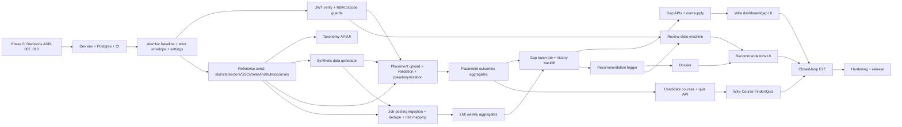

# MahaSkills — Delivery Roadmap (Living Document)

**Status:** Proposed, pending approval of the blocking decisions in §14
**Baseline date:** 2026-09-16 · **Baseline commit:** `302e8a9`
**Supersedes (once approved):** the slice ordering in `IMPLEMENTATION_PLAN.md`. Slice *content* is reused. The *order* changes (see §4, "Ordering defects").

> **Change log**
> - 2026-09-16: v0.1, the first roadmap, built from a full repo inspection and live gate runs.

---

## 1. Executive Summary

MahaSkills has a mature **documentation set** and a polished **frontend that runs entirely on mock data**. The **backend has no working features**: all 13 routes return hard-coded data, auth accepts any token, there are no migrations and no DB queries, and the Airflow DAGs only contain `print` statements. The previous docs describe a 20-month government program. On paper it should be finishing Phase 3 now, but the code is at Slice 0.

**Strategy:** stop adding surface area. Build **one real, end-to-end closed loop** on the existing FastAPI + React code:

`placement CSV + job postings → gap scores → auto-triggered recommendation → SSC review → DSEEI approval → published`

Run it on clearly labelled synthetic data for 5 pilot districts. Do it in this order: decisions → runnable foundation → real auth → data backbone → scoring and workflow → wire the existing UI → harden. Defer Employer portal, District Plans, Mahaswayam SSO, Airflow scrapers, Elasticsearch, NLP and forecasting to post-MVP. Keep what already works: the frontend components, the gap formula, the row validator and HMAC pseudonymization. Rewrite nothing that works.

---

## 2. Current-State Assessment

### 2.1 What exists (verified 2026-09-16)

| Area | Reality | Evidence |
|---|---|---|
| Backend API | 13 routes, **all hard-coded** responses. Only `/auth/me` reads the security context | `backend/app/api/v1/endpoints/*.py` |
| Auth | **Bypass**: no token → `ANONYMOUS`, **any** token → `DISTRICT_OFFICER` (district 14). No other route has an auth dependency | `backend/app/core/security.py:19-38` |
| Domain logic | `GapScoringService` (formula + oversupply rule), `PlacementValidationService` (row validation + HMAC-SHA256), 5 unit tests | `backend/app/services/`, `backend/tests/` |
| Persistence | SQLAlchemy models (20 tables) **plus** a hand-written `scripts/init-db.sql` (16 tables), and they **disagree**. No Alembic. No query anywhere | see §2.3 |
| Workers/pipelines | `celery_app` has no tasks. The weekly DAG defines only `print` functions and `default_args` with **no DAG object**. The other two DAG files are the same size (<1 KB) | `backend/app/workers/`, `pipelines/dags/` |
| Seed | 6 districts and 5 sectors (docstring claims 36/33) | `scripts/seed_taxonomy.py` |
| Frontend | React 18/TS strict/Vite/Tailwind. Landing, Dashboard, Gap Analysis, Course Finder, Pathway Quiz are **built on local mock data** (`gapScoringData.ts` 24 KB, `candidateData.ts` 40 KB). Recommendations, Taxonomy, Placements, District Plans, Employer, Admin are **one-line placeholders** | `frontend/src/app/routes.tsx:11-16` |
| Frontend ↔ API | `apiClient` (axios) exists but is **used nowhere**. `query-keys.ts` is unused. Types are hand-written, not generated. `openapi-typescript` and `msw` are installed but not wired up | grep `apiClient\|useQuery` → only `lib/api.ts` |
| Frontend auth | Zustand persona switcher, default `isAuthenticated: true` as POLICY_MAKER. `AuthGuard.tsx` exists but no route uses it. No Keycloak/OIDC code | `features/auth/useAuthStore.ts` |
| Contract | `openapi.yaml` has 15 paths. The G-01..G-08 endpoints that `OPEN_QUESTIONS.md` says were "formally incorporated" are **not in it** | `docs/03-api/openapi.yaml` |
| Infra | `docker-compose.yml` (postgres, redis, backend, frontend). It references `KEYCLOAK_URL=http://keycloak:8080` but has **no keycloak service**. Frontend nginx has **no SPA fallback**, so deep links like `/dashboard` return 404 | `docker-compose.yml`, `frontend/Dockerfile` |
| CI | **None** (no `.github/`) | — |
| Docs | ~80 canonical docs, a duplicate `docs - Copy/` tree, and a 129 KB `backend_architecture_specification.md` that prescribes **Java 21 / Spring Boot / Flyway**. That contradicts every other doc and the code | `docs/` |

### 2.2 Gate runs on this machine

| Gate | Result |
|---|---|
| `npm run typecheck` | ✅ pass |
| `npm run lint` | ✅ 0 errors, 7 warnings (`react-refresh/only-export-components`) |
| `npm test` (vitest) | ✅ 21/21. They test **mock-data helpers**, not API integration |
| `npm run build` | ✅ 477 KB JS (144 KB gzip) |
| `pytest -q` | ❌ **cannot run**: `fastapi`, `pytest`, `ruff` are not installed in the Python 3.12 env |
| `docker compose up` | ❌ **cannot run**: Docker is not installed |

### 2.3 Broken or risky items (specific)

1. **Auth bypass** (`core/security.py`). All data endpoints are unauthenticated.
2. **Gap score unit bug:** `placement_rate > 1` decides percent vs. fraction, so `1.0` (1%) is read as 100% and `0.5` (0.5%) as 50% (`services/gap_scoring_service.py:15`). The frontend copy of the formula (`gapScoringData.ts:7`) has the same bug, and the duplication will drift.
3. **Placement validator crashes** on a non-numeric `batch_year` (`int()` is uncaught → 500). It silently defaults the year to 2025, never checks `course_code`, and emits `ERR_*` codes where `ERROR_CODES.md` specifies `PLA_*`.
4. **Model/SQL drift:** `users`, `user_scopes`, `placement_validation_errors` and `district_plan_items` exist only in the models. `placement_records.employer_name/job_role_title/months_to_placement`, `batches.total/valid/error_records` and `job_roles.description/version` exist only in the SQL.
5. **Partition cliff:** `placement_records` has partitions only for 2024–2026, so any `batch_year=2027` insert fails.
6. **Secrets as defaults:** `DPDP_TENANT_SALT` and the DB password are defaults in `core/config.py` and hard-coded in `docker-compose.yml`. If the pepper leaks, pseudonymization is broken, because roll numbers are enumerable.
7. **DPDP contradiction:** `placement_batches.s3_object_key NOT NULL` implies the **raw CSV** (with raw candidate IDs) is stored, which conflicts with "never store raw identifiers".
8. **Real people and brands in mock personas** (e.g., a named serving IAS officer, `@tatamotors.com` emails) in `useAuthStore.ts`. That is a reputational risk in front of a government jury.
9. **Docs that misstate status:** RTM marks AUTH-01/02/03, TAX-01, PLA-01/02, ADM-01, SEC-01/02 **Complete**, but all are stubs.
10. **Pitch/PRD divergence:** `sih_panel_defense/` promises a Marathi RAG assistant, a gap score with "wage premium + cosine syllabus drift" on a 0–1 scale, 15,000 synthetic records, a Green Energy sector and Gadchiroli. **None of these are in the PRD or the code.**

---

## 3. Target Architecture

### 3.1 MVP end state: user experience

| Actor | Can do, end to end, on real code |
|---|---|
| **ITI Principal** | Log in → upload the monthly placement CSV → see cell-level errors → see institute outcomes (placement rate, median salary) |
| **Admin / Data Steward** | Run (or schedule) job-posting ingestion and the weekly gap batch → see run status → browse the taxonomy |
| **District Officer** | See their own district's gap heatmap/table and oversupply flags. **403** on other districts |
| **Policy Maker** | Statewide heatmap → open an auto-generated recommendation → read the dossier → give final approval → publish |
| **SSC Reviewer** | See recommendations only for their sectors → approve or request revision with a rationale |
| **Candidate / public** | Browse courses with **real aggregated** outcome stats (hidden when the cohort is under 10) → take the 5-step quiz → get 3 recommendations. No PII stored |

### 3.2 Technical end state (MVP)

```
Browser (React SPA, OIDC PKCE, TanStack Query, generated types)
   │  HTTPS, Bearer JWT
   ▼
FastAPI modular monolith  (/v1)
   ├─ core: settings · JWT/JWKS verify · RBAC+scope deps · error envelope · request-id JSON logs · audit writer
   ├─ modules: reference · taxonomy · placements · labour_market · gap_scoring · recommendations · candidates
   ├─ jobs: ingest_job_postings · compute_gap_scores · trigger_recommendations   (CLI + Celery beat)
   └─ OpenAPI export → docs/03-api/openapi.yaml (CI drift check + Spectral)
   │
   ├─ PostgreSQL 16 (Alembic-managed; pg_trgm; placement_records partitioned + DEFAULT partition)
   ├─ Redis 7 (Celery broker; response cache for aggregates)
   └─ Keycloak (dev realm in compose; prod = state IdP) — dev/test token issuer when ENVIRONMENT∈{development,test}
```

**Not in the MVP:** Elasticsearch, Airflow, S3/MinIO, the ML service, Kubernetes, Mahaswayam, and the Node services. Each is added later behind an existing seam (search port, job CLI, storage adapter, identity provider).

### 3.3 Definition of Done: MVP

- [ ] `alembic upgrade head` on an empty DB followed by `python -m app.seed demo` produces a demo database from scratch in under 5 minutes.
- [ ] CI is green on `main`: ruff, black, pytest (with a Postgres service), coverage gates (§12), frontend lint/typecheck/test/build, Spectral, and the OpenAPI drift check.
- [ ] **No endpoint returns hard-coded business data.** A grep test fails the build if `mock_` or literal UUIDs appear in `endpoints/`.
- [ ] The RBAC matrix test covers **every route × 8 principals** (7 roles + anonymous) and passes.
- [ ] The Playwright closed-loop E2E (T-412) passes against `docker compose` from a clean state.
- [ ] After an upload, a DPDP test confirms no raw `candidate_id` exists in any table, log line or temp file.
- [ ] p95 is under 300 ms for `/gap-scores` and the district aggregates at seeded volume. axe reports 0 serious/critical issues on core pages. The i18n missing-key check passes for mr/hi/en.
- [ ] RTM statuses match reality. Runbook, env-var table and demo reset script exist.

---

## 4. Dependency Graph

### 4.1 Major chain



### 4.2 Per-feature analysis (major features)

| Feature | Prerequisites | Blocks | Parallel with | If it slips |
|---|---|---|---|---|
| Decisions (ADR-007..010) | none | everything backend | env setup | work proceeds on contested assumptions, and rework follows |
| Alembic baseline | dev env, Postgres | every DB-backed task | CI, frontend type generation | the whole backend waits |
| JWT + RBAC | Alembic (user_scopes), error envelope | placement upload scoping, review workflow, the "no bypass" demo claim | reference seed, synthetic data | security claims in the pitch are false |
| Reference seed | Alembic | taxonomy, institutes/courses, placements, ingestion mapping | auth | nothing can be scored |
| Synthetic generator | reference seed (IDs/codes) | placement and posting volume, history backfill | auth, taxonomy UI | demo shows empty charts |
| Placement ingestion | auth, reference, synthetic | outcomes → gap scoring, candidate stats | job ingestion | gap scores cannot be computed (no placement rate) |
| Job ingestion + LMI | reference, synthetic | gap scoring (demand), dossier (employers) | placement ingestion | gap scores cannot be computed (no demand) |
| Gap batch + backfill | outcomes, LMI | gap APIs, **trigger (needs ≥8 weekly snapshots)** | candidate API | recommendations never fire |
| Review workflow | auth, trigger | recommendations UI, E2E | dossier | the loop cannot close |
| UI wiring | respective APIs, generated types | E2E | each other | demo stays on mock data |

### 4.3 Ordering defects fixed from `IMPLEMENTATION_PLAN.md`

1. **Gap Scoring (old Slice 4) came before Placement Ingestion (old Slice 5)**, but the formula needs `placement_rate` and `trained_capacity`. **Placements now come first.**
2. **The 8-week trigger was never given history.** Explicit backfill task T-403.
3. **Candidate stats (old Slice 8) depend on placement outcomes.** Now sequenced after T-308.
4. **Contract-first against a hand-maintained YAML** diverged within one commit (15 paths vs. the claimed G-01..G-08). Now code-first export plus a drift gate (ADR-008).

---

## 5. Feature Inventory

Status legend: **Done**, **Partial** (logic exists, not integrated), **Stub** (hard-coded/placeholder), **Broken**, **Missing**.

| ID | Feature | Workstream | Priority | Complexity | Risk | Dependencies | Status |
|---|---|---|---|---|---|---|---|
| F01 | Reproducible dev env (venv, dev deps, DB) | Foundation | P0 | S | Low | none | Missing |
| F02 | CI pipeline | Foundation | P0 | M | Low | F01 | Missing |
| F03 | Alembic migrations + model/SQL reconciliation + partitions | Data | P0 | M | Med | F01 | Missing |
| F04 | Error envelope + canonical error codes | Backend | P0 | S | Low | ADR-008 | Missing |
| F05 | Settings/secrets hardening | Security | P0 | S | Low | F01 | Broken |
| F06 | JWT verification (OIDC resource server) + dev issuer | Auth | P0 | M | High | F03, F04 | Broken (bypass) |
| F07 | RBAC + district/institute/sector scope guards | Auth | P0 | M | High | F06 | Missing |
| F08 | Audit log writer | Security | P1 | S | Low | F03, F06 | Missing |
| F09 | Frontend OIDC PKCE + route guards | Frontend/Auth | P1 | M | Med | F06, Keycloak realm | Missing |
| F10 | Typed API layer (generated types, TanStack Query, MSW) | Frontend | P0 | M | Low | F11 | Partial |
| F11 | OpenAPI export + Spectral + drift check | Architecture | P1 | S | Low | F04 | Partial (drifted) |
| F12 | Reference data seed (36 districts, sectors, SSCs, institutes, courses) | Data | P0 | M | Med | F03 | Partial (6/5) |
| F13 | Taxonomy tree + search API/UI (REQ-TAX-01) | Backend/Frontend | P1 | M | Low | F12 | Stub (handoff ready) |
| F14 | Synthetic data generator (placements, postings) | Data | P0 | M | Med | F12 | Missing |
| F15 | Placement upload/validation/pseudonymization/persist (PLA-01/02, SEC-01) | Backend | P0 | L | High | F07, F12, F14 | Partial (row validator) |
| F16 | Placement outcomes/benchmarks (PLA-03, G-08) | Analytics | P1 | M | Low | F15 | Missing |
| F17 | Job-posting ingestion + dedupe + role mapping (LMI-01) | Data | P0 | L | High | F12, F14 | Stub |
| F18 | LMI weekly aggregates API (LMI-02) | Analytics | P1 | M | Low | F17 | Stub |
| F19 | Gap scoring batch + history + APIs (GAP-01) | Analytics | P0 | L | High | F16, F18 | Partial (formula, bug) |
| F20 | Oversupply detection (GAP-02) | Analytics | P1 | M | Med | F19 | Partial (pure fn) |
| F21 | Dashboard/heatmap/gap UI wired to API | Frontend | P1 | M | Med | F10, F19 | Partial (mock) |
| F22 | Recommendation trigger (REC-01) | Analytics | P0 | M | High | F19 | Stub |
| F23 | Evidence dossier JSON (REC-02) | Backend | P1 | M | Low | F22 | Stub |
| F24 | Review state machine + optimistic locking (REC-03) | Backend | P0 | M | Med | F07, F22 | Missing |
| F25 | Recommendations UI (list, dossier, stepper) | Frontend | P1 | M | Low | F23, F24 | Missing (placeholder) |
| F26 | Candidate course directory with real stats (CAN-01) | Backend/Frontend | P1 | M | Low | F16 | Partial (mock UI) |
| F27 | Pathway quiz server-side (CAN-02) | Backend/Frontend | P1 | M | Low | F26 | Partial (client logic) |
| F28 | Closed-loop E2E + demo script | Testing | P0 | M | Med | F21, F25, F27 | Missing |
| F29 | i18n completeness mr/hi/en (NFR-02) | Frontend | P1 | M | Low | UI tasks | Partial |
| F30 | Accessibility audit (NFR-03) | Frontend | P1 | M | Low | UI tasks | Missing |
| F31 | Deployable compose (Keycloak svc, SPA fallback, non-root, migrate job) | Deployment | P1 | M | Med | F03, F09 | Broken |
| F32 | Structured logs, request IDs, readiness/health | Ops | P1 | S | Low | F01 | Stub |
| F33 | Docs hygiene (RTM truth, `docs - Copy`, Java spec disposition) | Documentation | P0 | S | Low | ADR-007 | Broken |
| F34 | Employer portal: GSTIN registration, skill needs, surveys (EMP-01..03) | Post-MVP | P2 | L | High (GSTIN API) | F07 | Stub |
| F35 | District training plans, equipment gaps, budget (DTP-01..03) | Post-MVP | P2 | L | Med | F19, asset data | Stub |
| F36 | Mahaswayam SSO handoff (CAN-03) | Integrations | P2 | M | High (external) | F09, NIC endpoints | Missing (modal only) |
| F37 | Airflow orchestration + licensed/API feeds | Data | P2 | L | High | F17 | Stub |
| F38 | NLP skill extraction + emerging skills (TAX-02) | AI/ML | P2 | L | High | F17 | Missing |
| F39 | Notifications, report export, global search, public stats (G-01/02/05/06) | Backend | P2 | M | Low | F07 | Missing |
| F40 | Admin observability UI: pipelines, audit viewer (ADM-02) | Ops | P2 | M | Low | F08, F32 | Stub |
| F41 | Elasticsearch behind search port | Data | P3 | M | Low | F13 | Missing (deferred) |
| F42 | ARIMA/Prophet forecasting behind flag (Slice 11) | AI/ML | P3 | L | High | 12+ months history | Missing |
| F43 | Offline-first mobile app | Frontend | P3 | L | Med | stable API | Missing |
| F44 | Marathi RAG assistant (pitch only, **not in PRD**) | AI/ML | P3, decision needed | L | High | F13, F19 | Missing |

---

## 6. Phased Roadmap

### Phase 0: Decisions & Working Environment
- **Objective:** remove contested unknowns and make every gate runnable locally and in CI.
- **Why now:** four doc conflicts (stack, error codes, 403/404, scoring units/trigger) would each cause rework, and backend gates currently cannot run at all.
- **Tasks:** T-001…T-008 · **Deliverables:** ADR-007..010, truthful RTM, a venv where `pytest` passes, Postgres/Redis running, CI skeleton.
- **Entry:** this roadmap approved. · **Exit (Gate 1):** ADRs accepted by the owner. `pytest -q` passes the 5 existing tests locally. CI runs on a PR. `pg_isready` passes.
- **Risks:** Docker Desktop install blocked on this machine (use native Postgres 16 for Windows instead). Decisions stall.

### Phase 1: Foundation (Slice 0 done properly)
- **Objective:** a schema-managed, error-consistent, observable backend skeleton, plus a typed frontend API layer.
- **Why now:** every feature needs migrations, the envelope, the DB session and test fixtures.
- **Tasks:** T-101…T-108 · **Deliverables:** Alembic baseline, partitions, error handlers, hardened settings, DB test harness, JSON logs, OpenAPI export and drift gate, `npm run gen:api`.
- **Entry:** Gate 1. · **Exit (Gate 2, foundation):** migrations round-trip. Envelope tests pass. CI drift check green. No default secrets outside development.
- **Risks:** model/SQL reconciliation surfaces more schema decisions. Time-box them to `DATABASE_SCHEMA.md`.

### Phase 2: Security Core (Slice 1)
- **Objective:** a non-bypassable backend boundary and real login.
- **Why now:** placement upload, SSC review and scope isolation are all meaningless without it, and it is the highest-severity defect.
- **Tasks:** T-201…T-209 · **Deliverables:** JWKS verification, dev issuer, principal/scope resolution, guards on all routes, RBAC matrix test, audit writer, Keycloak dev realm, frontend PKCE, fictional personas.
- **Entry:** Phase 1 exit. · **Exit (Gate 2):** RBAC matrix test green for every route × 8 principals. The bypass code is gone. Login works in the browser against the Keycloak realm.
- **Risks:** Keycloak needs Docker (the dev issuer keeps tests and demo independent of it). Scope claims vs. DB scopes (resolved in T-203).

### Phase 3: MVP Data Backbone
- **Objective:** real reference data, placement outcomes and labour-demand signals in Postgres.
- **Why now:** these are the two inputs of the gap formula, the product's central number.
- **Tasks:** T-301…T-310 · **Deliverables:** 36-district reference seed, taxonomy API/UI, institutes/courses, synthetic generator, working placement upload + errors UI, outcomes aggregates, job-posting ingestion, LMI aggregates.
- **Entry:** Phase 2 exit (T-301, T-302 and T-305 may start after Phase 1). · **Exit (Gate 2):** uploading the seeded CSVs yields the expected valid/error counts. A DPDP test passes. Ingestion is idempotent (re-running adds 0 rows). LMI aggregates match a hand-computed fixture.
- **Risks:** job-role mapping quality (use keyword/trigram baseline, measure precision on 100 labelled postings); synthetic data realism.

### Phase 4: MVP Intelligence & Decision Loop
- **Objective:** close the loop: scores → trigger → dossier → review → publish, with the UI on real data.
- **Why now:** it is the product's reason to exist, and it depends on everything above.
- **Tasks:** T-401…T-412 · **Deliverables:** fixed scoring service, weekly batch, 12-week backfill, gap APIs, wired dashboards, trigger job, dossier, state machine, recommendations UI, candidate APIs wired, Playwright closed-loop E2E.
- **Entry:** Phase 3 exit. · **Exit (Gate 3, integration):** T-412 passes from a clean `docker compose` state. No mock arrays are imported by production code (they are MSW fixtures only).
- **Risks:** trigger never fires on synthetic data (tune generator, not thresholds). State-machine ambiguity (OQ-05 tiered approval).

### Phase 5: Hardening & Release (MVP / SIH demo / pilot)
- **Objective:** safe, fast, accessible, deployable, rehearsed.
- **Tasks:** T-501…T-508 · **Deliverables:** security scan reports, perf report, a11y report, i18n check, deployable stack on one VM, runbook, demo reset, fallback recording.
- **Entry:** Gate 3. · **Exit (Gate 4, release):** §3.3 DoD fully checked.
- **Risks:** hosting access; last-minute scope creep from pitch material.

### Phase 6: Post-MVP (separate backlog, do not mix with MVP)
Employer portal (F34) → District Plans (F35) → Admin observability (F40) → G-endpoints (F39) → Airflow + licensed feeds (F37) → NLP (F38) → Mahaswayam SSO (F36) → Elasticsearch (F41) → Forecasting (F42) → Mobile (F43). F44 (RAG) only after an explicit product decision.

---

## 7. Task Breakdown

Estimates are ideal engineer-days (d) for one engineer plus an AI agent. They are **assumptions** for critical-path math, not commitments.

### Phase 0: Decisions & Environment

| Task ID | Task | Description | Files / Modules | Depends On | Expected Output | Acceptance Criteria | Verification Method |
|---|---|---|---|---|---|---|---|
| T-001 | ADR-007 Backend stack (0.5d) | Record FastAPI modular monolith as the stack. Mark `backend_architecture_specification.md` as superseded for technology (keep its §1.2 scope rulings, §H state machine, §I ingestion rules as reference) | `docs/10-decisions/ADR/ADR-007-*.md`, spec header | none | Accepted ADR | Owner approves. Spec header states status. No doc still presents Java as current | Doc review; `grep -ri "spring boot" docs/` only hits the superseded spec |
| T-002 | ADR-008 API conventions (0.5d) | Canonical error codes (`AUTH_UNAUTHENTICATED` vs `AUTH_UNAUTHORIZED`, `PLA_*` not `ERR_*`), **403** `AUTH_SCOPE_RESTRICTED` for out-of-scope, envelope, pagination, `If-Match` on workflow writes, **code-first OpenAPI export** amending ADR-006 | ADR-008, `ERROR_CODES.md`, `API_SPECIFICATION.md` | none | Accepted ADR + updated docs | One error-code list. Handoff and docs use the same names | Doc review; grep for old names returns 0 |
| T-003 | ADR-009 Scoring parameters (0.5d) | Units (placement_rate strictly 0–100), trend factor definition, normalisation constant, severity bands (match frontend 75/60/40), trigger 8 consecutive weekly scores > 60 plus no active course, oversupply 2 quarters. Record the PRD formula as canonical for MVP and the pitch variant as future | ADR-009, `PRD.md` cross-ref | none | Accepted ADR | Every number used by T-401/T-406 is defined once | Doc review |
| T-004 | ADR-010 Data sourcing & DPDP (0.5d) | No LinkedIn/Indeed scraping in MVP. Postings come via CSV/NCS adapter. Synthetic data must be flagged `is_synthetic` and labelled in UI. **Raw placement CSV is not persisted.** Pepper only from env. k-anonymity threshold 10 for public stats | ADR-010, `DATA_PRIVACY.md` | none | Accepted ADR | Owner approves | Doc review |
| T-005 | Docs truth pass (0.5d) | Set RTM statuses to real values. Remove `docs - Copy/` after owner confirms. Add a "Roadmap" link in `docs/README.md` | `REQUIREMENTS_TRACEABILITY.md`, `docs/README.md` | T-001 | Honest RTM | No row says Complete without a passing test ID | Manual diff review |
| T-006 | Backend dev env (0.5d) | `.venv` (3.11 preferred, 3.12 acceptable); add `requirements-dev.txt` (ruff, black, mypy, pytest-cov, pip-audit); fix `conftest.py` to `ASGITransport` | `backend/requirements-dev.txt`, `backend/tests/conftest.py`, `AGENTS.md` §3 | none | Runnable backend gates | `pytest -q` → 5 passed. `ruff check .` and `black --check .` exit 0 | Paste command output |
| T-007 | Local Postgres 16 + Redis 7 (0.5d) | Docker Desktop (user installs) **or** native Postgres 16 + Memurai/Redis for Windows. Document both | `docs/07-development/` setup note | none | Running DB | `pg_isready -h localhost` OK. `redis-cli ping` → PONG | Command output |
| T-008 | CI skeleton (1d) | GitHub Actions: backend job (postgres service, ruff, black, pytest), frontend job (lint, typecheck, test, build), Spectral | `.github/workflows/ci.yml` | T-006 | CI on PR | Workflow green on a PR. Fails when a test is broken deliberately | PR checks screenshot |

### Phase 1: Foundation

| Task ID | Task | Description | Files / Modules | Depends On | Expected Output | Acceptance Criteria | Verification Method |
|---|---|---|---|---|---|---|---|
| T-101 | Alembic baseline (2d) | `alembic init`. Reconcile models with `init-db.sql` and `DATABASE_SCHEMA.md` (add missing columns/tables both ways). Autogenerate plus hand-edit baseline. Shrink `init-db.sql` to extensions only | `backend/alembic/`, `backend/alembic.ini`, `app/models/*.py`, `scripts/init-db.sql` | T-006, T-007 | Baseline revision | `alembic upgrade head` on an empty DB OK. `alembic check` reports no diff. `downgrade base` OK | CI job step + local run log |
| T-102 | Placement partitions (0.5d) | Partitions 2024–2030 plus `DEFAULT` partition. Documented yearly add | migration `*_placement_partitions.py` | T-101 | Migration | Inserting `batch_year` 2027 and 2035 succeeds | pytest integration test |
| T-103 | Error envelope (1d) | `app/core/errors.py`: `DomainError(code, status, message, details)`. Handlers for `HTTPException`, `RequestValidationError`, unhandled → `INTERNAL_ERROR` without stack leak | `app/core/errors.py`, `app/main.py` | T-002 | Uniform 4xx/5xx bodies | 401/403/404/409/422/500 bodies match `ERROR_CODES.md` envelope | pytest `test_errors.py` |
| T-104 | Settings hardening (0.5d) | No secret defaults. Startup fails if `ENVIRONMENT` is not development/test and the pepper or DB password is unset or default. CORS origins from env. Compose uses `env_file` | `core/config.py`, `main.py`, `docker-compose.yml`, `.env.example` | T-006 | Fail-fast config | `ENVIRONMENT=production` with default pepper → process exits non-zero with a clear message | pytest on `Settings` |
| T-105 | DB session + test harness (1d) | Async session dep, per-test transaction rollback fixture against real Postgres, factory helpers. `/health/live` and `/health/ready` (DB+Redis) | `core/database.py`, `tests/conftest.py`, `main.py` | T-101 | Fixtures | Readiness returns 503 when DB is down. Tests isolated (order-independent with `-p randomly`) | pytest |
| T-106 | Logging + request ID (0.5d) | JSON logs, `X-Request-ID` propagation, redaction of `Authorization` and any `candidate_id` key | `core/logging.py`, middleware | T-103 | Structured logs | Log capture test shows request_id and no redacted fields | pytest caplog |
| T-107 | OpenAPI export + drift gate (1d) | `scripts/export_openapi.py` writes `docs/03-api/openapi.yaml` from the app. CI fails on `git diff`. Spectral ruleset | `scripts/`, `.spectral.yaml`, CI | T-103, T-008 | Single contract source | CI fails if a route changes without re-export. Spectral 0 errors | CI run |
| T-108 | Frontend typed API layer (1d) | `npm run gen:api` (openapi-typescript) → `src/types/generated.ts`. Typed `apiClient` wrapper unwrapping the envelope. MSW test server setup | `frontend/package.json`, `src/lib/api.ts`, `src/test/msw.ts` | T-107 | Generated types | `npm run typecheck` green. One sample hook test hits MSW | vitest |

### Phase 2: Security Core

| Task ID | Task | Description | Files / Modules | Depends On | Expected Output | Acceptance Criteria | Verification Method |
|---|---|---|---|---|---|---|---|
| T-201 | JWT verification (1.5d) | RS256 via JWKS (cached, rotated on `kid` miss), verify `iss`/`aud`/`exp`/`nbf`. Map realm roles. **Delete the bypass** | `core/security.py` | T-103 | Real auth | Missing token → 401 `AUTH_UNAUTHENTICATED`. Expired → 401 `AUTH_TOKEN_EXPIRED`. Wrong issuer/alg `none`/HS256 → 401 | pytest with locally signed tokens (TEST-SEC-001) |
| T-202 | Dev/test token issuer (0.5d) | Local RSA key + JWKS served only when `ENVIRONMENT∈{development,test}`. `python -m app.devtools.token --role DISTRICT_OFFICER --district 14`. Pytest fixtures per role | `app/devtools/`, `tests/conftest.py` | T-201 | Tokens for tests/demo | Endpoint absent (404) when `ENVIRONMENT=production` | pytest |
| T-203 | Principal & scope resolution (1d) | Roles from token. District/institute/sector scopes from `user_scopes` (JIT user row on first login). ADMIN/POLICY_MAKER statewide | `core/security.py`, `models/user.py`, migration | T-201, T-101 | `Principal` object | User without scope row gets 403 on scoped routes, not 500 | pytest |
| T-204 | Guards on all routes (1d) | `require_roles(...)`, `require_district_scope`, `require_institute_scope`, `require_sector_scope`; explicit `public=True` marker for candidate routes | `core/authz.py`, all `endpoints/*.py` | T-203 | Enforced RBAC | Unit test enumerates `app.routes` and fails if any route lacks a guard or public marker | pytest |
| T-205 | RBAC matrix test (1d) | Parametrized table from `RBAC_MATRIX.md`: route × {7 roles + anonymous} → expected status. Cross-district tampering → 403 `AUTH_SCOPE_RESTRICTED` | `tests/test_rbac_matrix.py` | T-204 | TEST-SEC-002/003 | All cells pass | pytest |
| T-206 | Audit writer (0.5d) | `audit.record(principal, action, resource, old, new)` called in services on every mutation, same transaction | `services/audit.py` | T-203 | Audit rows | Each mutating endpoint test asserts one audit row. No candidate hash in `new_values` | pytest (TEST-ADM-001) |
| T-207 | Keycloak dev realm (1d) | Compose `keycloak` service, realm export with 7 roles, `mahaskills-web` (public, PKCE) and `mahaskills-api` clients, fictional test users | `infra/keycloak/realm-mahaskills.json`, `docker-compose.yml` | T-007 (Docker) | Login-able IdP | `docker compose up keycloak` → token for each test user validates against T-201 | Script + pytest against live JWKS (optional job) |
| T-208 | Frontend OIDC (1.5d) | `oidc-client-ts` Authorization Code + PKCE, tokens in memory, silent renew. `AuthGuard` + `RoleGuard` on AppShell routes. Persona switcher only in `import.meta.env.DEV` with the dev issuer | `features/auth/*`, `app/routes.tsx`, `lib/api.ts` | T-207, T-108 | Real login | Unauthenticated `/dashboard` → login redirect. SSC_REVIEWER cannot open `/admin` | vitest + Playwright smoke |
| T-209 | Fictional personas (0.25d) | Replace real names, officials and brand emails in personas and mock data | `useAuthStore.ts`, `candidateData.ts`, `gapScoringData.ts` | none | Clean fixtures | grep for the named real officials and `tatamotors.com` returns 0 | grep in CI |

### Phase 3: MVP Data Backbone

| Task ID | Task | Description | Files / Modules | Depends On | Expected Output | Acceptance Criteria | Verification Method |
|---|---|---|---|---|---|---|---|
| T-301 | Reference seed (1d) | Idempotent ORM seeder: 36 districts / 6 divisions (IDs aligned with frontend map IDs), pilot sectors + SSCs | `app/seed/reference.py`, replaces `scripts/seed_taxonomy.py` | T-101 | `python -m app.seed reference` | 36 districts, 6 divisions. A second run changes 0 rows | pytest + run log |
| T-302 | Taxonomy API (1.5d) | Execute `HANDOFF-slice-2-taxonomy.md` backend scope: seed roles/skills, `taxonomy_service`, `/taxonomy/tree`, `/taxonomy/search`, trigram indexes | per handoff §5 (backend rows) | T-301, T-204 | DB-backed taxonomy | Handoff §8 backend scenarios pass. Tree payload size recorded | pytest (TEST-TAX-001) |
| T-303 | Taxonomy UI (1d) | Handoff frontend scope: `TaxonomyTreeView`, `SkillBadge`, search, i18n | per handoff §5 (frontend rows) | T-302, T-108 | `/taxonomy` page | Expand to skills, search "battery" works | vitest (TEST-TAX-002) + screenshot |
| T-304 | Institutes & courses (1.5d) | Seed fictional or public-list ITIs for 5 pilot districts, courses linked to job roles, `institute_courses` with sanctioned intake. `GET /institutes`, `/institutes/{id}/courses` (G-03) | `app/seed/institutes.py`, `modules/institutes` | T-302 | Supply side data | ≥ 10 ITIs per pilot district. Scope rules honoured | pytest |
| T-305 | Synthetic generator (2d) | Deterministic (`--seed`) CSV generator: monthly placement returns per ITI/course (rates vary by district/sector, a few deliberately bad rows) and 12+ months of job postings with district/sector skew so ≥ 3 district×role pairs exceed a gap of 60 for ≥ 8 weeks | `scripts/synth/` | T-304 | `data/synthetic/*.csv` (gitignored) + README of distributions | Same seed → byte-identical files. Documented expected triggers | pytest on generator |
| T-306 | Placement upload (3d) | `POST /ingestion/placements/upload` (ITI_PRINCIPAL own institute): header check, ≤ 50k rows, streaming parse, reuse `PlacementValidationService` (fix batch_year crash, course sanction check, `PLA_*` codes), pseudonymize, **atomic** persist of batch + valid records + errors. Raw file never written to disk | `modules/placements/*`, `services/placement_service.py` | T-204, T-304, T-305 | Working ingestion | Synthetic file → counts match generator manifest. Malformed header → 400 `PLA_CSV_MALFORMED_HEADER`. Other institute → 403 | pytest (TEST-PLA-001, TEST-SEC-004) |
| T-307 | Errors endpoint + UI (1.5d) | `GET /ingestion/placements/{batchId}/errors` (+ CSV download). Frontend `CsvDropzone` + `ValidationErrorTable` on `/placements/upload` | endpoints + `features/placements/*` | T-306, T-208 | Upload page | Upload the bad-row file in browser → rows/columns/codes shown in the selected locale | vitest + Playwright (TEST-PLA-002) |
| T-308 | Placement outcomes (1.5d) | Aggregates per course × institute × district × year: placement rate, median salary, median months, cohort size. Materialized view refreshed after upload. `GET /placements/outcomes` (G-08) | migration, `modules/placements/outcomes.py` | T-306 | Outcome metrics | Matches hand-computed fixture to 2 dp | pytest (TEST-PLA-003) |
| T-309 | Job-posting ingestion (3d) | `app/jobs/ingest_job_postings.py`: CSV/NCS-JSON adapter → `raw_job_postings` → normalise → dedupe (hash) → `clean_job_postings` → role mapping (keyword + `pg_trgm` against titles/synonyms). CLI + Celery task. Idempotent | migration, `modules/labour_market/*`, `app/jobs/` | T-302, T-305 | Demand data | Re-run inserts 0. Mapping precision ≥ 80% on a 100-row labelled sample (recorded) | pytest (TEST-ING-001) + precision report |
| T-310 | LMI aggregates (1.5d) | Weekly demand per district × job_role (+ sector). `GET /lmi/aggregates` scoped | migration/view, `modules/labour_market/api.py` | T-309 | Demand series | Matches fixture. District Officer sees only own district | pytest (TEST-LMI-001) |

### Phase 4: MVP Intelligence & Decision Loop

| Task ID | Task | Description | Files / Modules | Depends On | Expected Output | Acceptance Criteria | Verification Method |
|---|---|---|---|---|---|---|---|
| T-401 | Fix scoring service (1d) | Strict 0–100 `placement_rate` (raise on out-of-range), trend factor per ADR-009 (bounded), severity function server-side | `services/gap_scoring_service.py`, tests | T-003 | Correct formula | New tests: rate 1.0 means 1%, boundaries 0/100, trend bounds. Existing tests updated, not deleted | pytest (TEST-GAP-001) |
| T-402 | Weekly gap batch (1.5d) | `app/jobs/compute_gap_scores.py --week YYYY-WW`: join LMI demand + outcomes + sanctioned intake → upsert `gap_scores`. Logs duration and row count. Celery beat entry | `app/jobs/`, `workers/celery_app.py` | T-308, T-310, T-401 | Scores table | Idempotent per week. Runtime < 2 min at seeded volume | pytest + run log |
| T-403 | History backfill (0.5d) | `--from --to` loop producing ≥ 12 weekly snapshots from synthetic history | `app/jobs/compute_gap_scores.py` | T-402 | History | ≥ 12 distinct `calculation_date` values. Generator's expected pairs exceed 60 for ≥ 8 weeks | SQL assertion in pytest |
| T-404 | Gap APIs (1.5d) | `/gap-scores` (filters, pagination, scope), `/gap-scores/districts` aggregates for heatmap, `/gap-scores/oversupply` (rule over 2 quarters) | `modules/gap_scoring/api.py`, OpenAPI export | T-403, T-204 | Real gap endpoints | Pune officer → Nashik 403. Oversupply fixture flagged. p95 < 300 ms locally | pytest (TEST-GAP-002) |
| T-405 | Wire gap UI (2d) | Dashboard, Gap Analysis, Heatmap, District panel, Priority table use TanStack Query hooks. Remove client formula. Mock arrays move to MSW fixtures | `features/gap-scoring/*` | T-404, T-108, T-208 | Real dashboards | No import of `gapScoringData` from non-test code. Loading, empty and error states render | vitest + grep + screenshot |
| T-406 | Recommendation trigger (2d) | Job: for each district × role with 8 consecutive weekly scores > 60 and no active local course → create `DRAFT` (type `NEW_QUALIFICATION` or `ADD_MODULE` per rule), assign SSC by sector. No duplicate while one is open | `app/jobs/trigger_recommendations.py`, `modules/recommendations/` | T-403 | Drafts created | Fires exactly for the generator's expected pairs. Re-run creates 0 | pytest (TEST-REC-001) |
| T-407 | Dossier (1.5d) | Evidence JSON: 12-month demand series, top employers (from postings), gap history, local outcomes, projected uplift (documented simple formula). `GET /recommendations/{id}/dossier` | `modules/recommendations/dossier.py` | T-406 | Dossier API | Every figure traceable to a query. Fixture snapshot test | pytest (TEST-REC-002) |
| T-408 | Review state machine (2.5d) | `DRAFT→UNDER_SSC_REVIEW→(REVISION_REQUESTED\|SSC_APPROVED)→DSEEI_APPROVED→PUBLISHED` (tiered path per OQ-05 if confirmed). `POST /recommendations/{id}/review` with rationale and `If-Match` version. `recommendation_audits` | migration, `modules/recommendations/workflow.py` | T-406, T-204, T-206 | Governed workflow | Illegal transition → 409 `REC_INVALID_STATE_TRANSITION`. Wrong-sector reviewer → 403. Stale version → 409. Missing rationale → 422 | pytest (TEST-REC-003) |
| T-409 | Recommendations UI (2.5d) | List with filters, `DossierViewer` (Recharts), `ApprovalStepper`, role-aware actions, i18n | `features/recommendations/*`, routes | T-407, T-408, T-208 | `/recommendations` pages | SSC approve → Policy Maker approve → Published visible, in browser | vitest + Playwright |
| T-410 | Candidate courses API (1.5d) | Public `/candidates/courses` (search, district, sector) with outcome stats, suppressed if cohort < 10. Wire `CourseFinder` | `modules/candidates/`, `features/candidates/CourseFinder.tsx` | T-308, T-108 | Real directory | Suppression test passes. No 401 for anonymous | pytest (TEST-CAN-001) + vitest |
| T-411 | Pathway recommend API (1.5d) | Move ranking server-side (port `candidatePathway` logic; its tests become backend tests). Consent flag required. Nothing persisted except anonymous counters | `modules/candidates/pathway.py`, `PathwayQuiz.tsx` | T-410 | Server quiz | Top 3 deterministic for fixture answers. Request without consent → 422 | pytest (TEST-CAN-002) |
| T-412 | Closed-loop E2E (2d) | Playwright: reset DB → seed → upload CSVs → ingest postings → backfill → trigger → SSC review → DSEEI approve → published appears. `scripts/demo_loop.(sh\|ps1)` | `frontend/e2e/`, `scripts/` | T-405, T-409, T-411, T-307 | Gate 3 proof | Passes 3 consecutive runs from clean state | CI job (compose) + recording |

### Phase 5: Hardening & Release

| Task ID | Task | Description | Files / Modules | Depends On | Expected Output | Acceptance Criteria | Verification Method |
|---|---|---|---|---|---|---|---|
| T-501 | Security pass (1.5d) | `/security-review`, `pip-audit`, `npm audit --omit=dev`, gitleaks, OWASP ZAP baseline against compose | CI, fixes | T-412 | Reports | 0 high/critical open. Findings logged | Reports attached |
| T-502 | DPDP verification (0.5d) | After a full upload, scan all tables, logs and temp dirs for raw candidate IDs from the source CSV | `tests/test_dpdp.py` | T-306 | TEST-SEC-004 | 0 matches | pytest |
| T-503 | Performance smoke (1d) | Seed ≈ 36 districts × 200 roles × 52 weeks. k6 on `/gap-scores`, districts aggregates, outcomes. Add indexes/cache | `perf/`, migrations | T-404 | Perf report | p95 < 300 ms at 20 VUs. Batch < 45 min at seeded volume | k6 output |
| T-504 | Accessibility (1d) | axe-playwright on landing, dashboard, gap analysis, recommendations, upload, taxonomy, course finder, quiz | `frontend/e2e/a11y.spec.ts` | T-412 | a11y report | 0 serious/critical | CI job (TEST-NFR-003) |
| T-505 | i18n completeness (1d) | Script comparing key sets across mr/hi/en. Remove inline default strings from `t()` calls | `scripts/i18n-check.mjs`, locales | T-412 | TEST-NFR-002 | 0 missing keys. 0 `t('x', 'literal')` defaults | CI |
| T-506 | Deployable stack (1.5d) | nginx SPA fallback + `/v1` proxy, `VITE_*` build args, backend non-root, `migrate` one-shot service, prod compose profile, single-VM deploy | `frontend/nginx.conf`, Dockerfiles, compose | T-412 | Running environment | Deep link `/dashboard` loads. Smoke script green on target host | Smoke script output |
| T-507 | Ops docs (0.5d) | Runbook update, env-var table, demo reset, backup/restore of seeded DB | `docs/09-operations/RUNBOOK.md`, `docs/08-deployment/ENVIRONMENT_CONFIGURATION.md` | T-506 | Docs | A new engineer resets the demo using only the docs | Dry run by a second person |
| T-508 | Demo rehearsal & fallback (0.5d) | Scripted walkthrough aligned with the pitch (only claims the system does), recorded fallback video, offline DB snapshot | `sih_panel_defense/` notes | T-506 | Rehearsed demo | Two timed rehearsals under 3:30 for the live segment | Rehearsal log |

### Phase 6: Post-MVP (epic level; break down when promoted)

| Task ID | Epic | Depends On | Exit criterion |
|---|---|---|---|
| P-01 | Employer registration + GSTIN verification adapter + skill needs + micro-surveys (F34) | Gate 4, GSTIN API access | TEST-EMP-001..003 |
| P-02 | District training plans + equipment gap + budget model (F35) | Gate 4, ITI asset data | TEST-DTP-001..003 |
| P-03 | Admin observability UI: job runs, audit viewer (F40) | T-206, T-106 | TEST-ADM-002 |
| P-04 | Notifications, report export (202 + polling), global search, public stats (F39) | Gate 4 | Contract tests per endpoint |
| P-05 | Airflow wrapping existing `app/jobs` + licensed/NCS live feeds (F37) | data MoUs | 7 consecutive nightly runs green |
| P-06 | NLP skill extraction + emerging skills staging (F38) | P-05 | Precision/recall report vs. labelled set |
| P-07 | Mahaswayam SSO + enrollment handoff (F36) | NIC endpoints (ASM-03) | TEST-CAN-003 |
| P-08 | Elasticsearch adapter behind search port (F41) | measured need (search p95 > 300 ms) | Parity tests with pg_trgm |
| P-09 | Forecasting behind `features.forecasting` (F42) | ≥ 12 months real history | Backtest MAPE report |
| P-10 | Offline-first mobile (F43) | stable v1 API | Store beta |

---

## 8. Critical Path

`T-001..T-004 (2d) → T-006/T-007 (1d) → T-101 (2d) → T-103 (1d) → T-201 (1.5d) → T-203 (1d) → T-204 (1d) → T-301 (1d) → T-302 (1.5d) → T-304 (1.5d) → T-305 (2d) → T-306 (3d) → T-308 (1.5d) → T-401/T-402/T-403 (3d) → T-406 (2d) → T-408 (2.5d) → T-409 (2.5d) → T-412 (2d) → T-501/T-506 (3d)`

The critical path alone is **≈ 37 engineer-days**. Parallel streams (§9) are ≈ 30 more. With **3 engineers** (backend, data, frontend), elapsed time is ≈ **5–6 weeks** to Gate 4. That is an assumption (A2), to re-plan once the deadline is known (Q1).

| High-risk / bottleneck task | Why | De-risking |
|---|---|---|
| T-101 Alembic baseline | Two conflicting schemas. Every later task builds on it | Time-box to 2d. Treat `DATABASE_SCHEMA.md` as tie-breaker. Defer non-MVP tables to later migrations |
| T-201/T-204 Auth + guards | Touches every route. Easy to leave gaps | Route-enumeration test (T-204) makes gaps impossible to merge. Dev issuer removes Keycloak from the critical path |
| T-305 Synthetic data | If distributions don't produce sustained gaps, the trigger never fires, and there is no demo | **Spike first:** generate → run the formula in a notebook/pytest before building T-306. Tune the generator, never the thresholds |
| T-306 Placement upload | Largest task, privacy-critical | Reuse existing validator and tests. Synchronous for ≤ 50k rows (no queue in MVP). Streaming parse |
| T-309 Role mapping | Quality unknown | Baseline keyword + trigram with a measured precision gate. Fallback: postings carry QP code in the curated CSV |
| T-408 Workflow | Governance ambiguity (OQ-05) | Implement linear path first behind a transition table. Tiered rule is data, not code |
| T-412 E2E | Flaky cross-tier test | Deterministic seed, API-level setup, UI only for the decision steps |

---

## 9. Parallel Work Opportunities

| Stream | Can start after | Tasks |
|---|---|---|
| **Docs/decisions** | now | T-001–T-005 (while env is being set up) |
| **Infra/CI** | T-006 | T-008, T-104, T-106, T-107, later T-207, T-506 |
| **Frontend** | T-107 (types) | T-108 → T-208 → T-303 → T-307 → T-405 → T-409 → T-410/T-411 UI. Before APIs land, build against MSW fixtures from the exported OpenAPI |
| **Data** | T-301 | T-305 generator and T-309 ingestion run in parallel with T-306 placements |
| **Quick wins (anytime)** | none | T-209 fictional personas, T-102 partitions, frontend lint warnings |
| **Must not parallelise** | none | Two tasks editing Alembic heads at once (T-101/T-102/T-203/T-308/T-309/T-408). Serialize migration merges, or use `alembic merge` with review |

---

## 10. Risk Register

| Risk | Probability | Impact | Detection Signal | Mitigation | Contingency |
|---|---|---|---|---|---|
| Deadline unknown / shorter than plan (SIH finale) | High | High | No date by end of Phase 0 | Get the date (Q1). Cut to the critical path only | Drop T-409 styling, T-410/411 wiring. Demo loop via API + Swagger for the decision steps |
| Demo remains mock-driven (UI polished, backend fake) | High | High | `gapScoringData` still imported after T-405 | Wiring tasks are on the critical path. Grep gate in CI | Freeze new UI work until Gate 3 |
| Auth bypass reaches a shared or hosted environment | Med | Critical | `core/security.py` returns a context without verification | T-201 before any deploy. Route-guard test | Block deploy job unless the RBAC matrix test passes |
| Stack dispute (Spring spec vs FastAPI) reopens mid-build | Med | High | New docs/handoffs referencing Spring/Flyway | ADR-007 signed in Phase 0 | Hold the line: switching stacks = restart. Escalate to the owner |
| Synthetic data fails to produce triggers | Med | High | T-403 shows no pair > 60 for 8 weeks | Spike in T-305 with formula check | Documented "scenario pack" with explicit high-gap pairs |
| DPDP breach (raw IDs stored/logged, pepper leaked) | Med | Critical | T-502 scan hits. Pepper default in non-dev env | No raw file persistence, log redaction, fail-fast config | Rotate pepper → re-hash impossible, so purge and re-ingest. Incident per `INCIDENT_RESPONSE.md` |
| Scraping LinkedIn/Indeed violates ToS/law | High if attempted | High | Scraper code for those domains | ADR-010: API/CSV adapters only | Use NCS + curated/licensed datasets |
| Pitch claims features absent from product (RAG, cosine-drift formula, Gadchiroli/Green Energy) | High | High (jury credibility) | Pitch vs. demo checklist mismatch | T-508 aligns pitch to shipped features. Q7 decision | Present absent items explicitly as roadmap, not as live |
| Real officials/brands in fixtures | High (present now) | Med | grep | T-209 | Remove before any external showing |
| Docker unavailable on dev machine | High (present now) | Med | `docker` not found | Native Postgres/Redis path (T-007). Dev issuer (T-202) | CI (Linux) runs compose-based jobs |
| Model/SQL reconciliation balloons | Med | Med | T-101 exceeds 2d | Time-box. Defer non-MVP tables | Baseline only MVP tables. Add the rest per slice |
| OpenAPI drift continues | Med | Med | CI drift job red | Code-first export (T-107) | Block merges on drift |
| Role-mapping quality too low | Med | Med | Precision < 80% | Curated CSV includes QP codes | Manual mapping table for pilot roles |
| Performance of aggregates at scale | Low (MVP) | Med | k6 p95 > 300 ms | Materialized views, indexes, Redis cache | Precompute per-week district aggregates in batch |
| Keycloak/Mahaswayam/GSTIN external dependencies | Med | Med | Endpoints/credentials unavailable | Dev issuer. Post-MVP placement of external integrations | Mock adapters clearly labelled |
| Single-maintainer knowledge / agent drift from scope | Med | Med | PRs touching out-of-scope files | Handoff specs + DoD + CODEOWNERS | Architect review gate per PR |

---

## 11. Technology Decisions

| Decision | Alternatives | Why it fits MahaSkills | Trade-offs | Reversibility |
|---|---|---|---|---|
| **Keep FastAPI modular monolith** (ADR-007) | Spring Boot 3 monolith (129 KB spec); Node + FastAPI microservices (PRD) | Code, 80 docs, team skills, panel Q&A and pandas/scikit analytics are all Python. The spec's own "monolith first" argument applies equally to FastAPI. Rewriting in Java adds weeks with zero functional gain | Weaker compile-time guarantees than Java. Mitigated with mypy on `core/` and services | Medium: module boundaries let a hot module be extracted later |
| **Alembic migrations** replacing `init-db.sql` | Flyway; keep init SQL | Native to SQLAlchemy models already written. Autogenerate detects drift in CI (`alembic check`) | Autogenerate misses partitions/extensions (hand-written ops) | High |
| **Code-first OpenAPI export + drift gate** (amends ADR-006) | Hand-maintained YAML contract-first | The hand YAML already drifted (15 paths vs. claimed G-01..G-08). FastAPI emits an accurate spec for free. Frontend types generated from it | Design review happens in PR code rather than YAML | High |
| **Keycloak as IdP, backend as pure resource server + dev issuer** | Custom auth; Keycloak mandatory in all envs | Keeps ADR-002 and government SSO path. Dev issuer removes the Docker/Keycloak dependency from tests and the critical path | Two token sources in dev (guarded by `ENVIRONMENT`) | High: issuer is config |
| **`oidc-client-ts`** in frontend (new dep) | `keycloak-js`; hand-rolled PKCE | Standards-based (works with the state IdP, not just Keycloak), maintained, small | One more dependency | High |
| **PostgreSQL `pg_trgm` search**, Elasticsearch deferred | Elasticsearch 8 now | ~2,200 roles + skills fits Postgres. The Java spec itself defers ES. One less cluster to run | Weaker relevance ranking | High (search port) |
| **Plain Python jobs (CLI + Celery beat)**, Airflow post-MVP | Airflow 2.8 now | The DAGs are empty. Jobs as importable functions are testable with pytest and later wrapped by Airflow unchanged | No DAG UI/backfill tooling in MVP | High |
| **CSV/NCS adapters + synthetic data** for demand | Scrapy/Playwright scraping LinkedIn/Indeed | Legal and ToS-safe, deterministic for demos and tests | Less "live" | High (adapter interface) |
| **Synchronous placement upload ≤ 50k rows**, no object storage | Celery async + S3/MinIO raw file storage | 50k rows parse in seconds. Not storing the raw file satisfies DPDP minimisation | Large-file UX blocks for seconds | Medium: add async when measured |
| **Docker Compose on a single VM** for MVP/demo | Kubernetes + ArgoCD blue/green (CI_CD.md) | Pilot/demo load is tiny. K8s ops cost is unjustified now | No zero-downtime deploys | High: images are portable |
| **Materialized views + Redis cache** for aggregates | OLAP store; on-the-fly queries | Meets p95 < 300 ms at pilot scale with existing components | Refresh orchestration needed | High |

---

## 12. Testing Strategy

| Layer | Tooling | What | Phase introduced | Minimum bar |
|---|---|---|---|---|
| Unit | pytest, vitest | Scoring formula, validators, state machine transitions, pathway ranking, guards | 0–4 | **≥ 90% line/branch** on `core/security*`, `core/authz`, `services/gap_scoring*`, `services/placement*`, `recommendations/workflow` |
| Integration (DB) | pytest + real Postgres (CI service), rollback fixtures | Migrations up/down, ingestion idempotency, aggregates vs. hand-computed fixtures, audit rows | 1–4 | Every endpoint has ≥ 1 happy + ≥ 1 authz-denied test. Overall backend ≥ 80% (raise to 85% post-MVP, per `TESTING_STRATEGY.md`) |
| Security | pytest RBAC matrix, route-enumeration test, DPDP scan, gitleaks, pip-audit/npm audit, ZAP baseline | Bypass regression, scope tampering, token forgery (alg none/HS256), PII leakage | 2, 5 | 100% of routes in matrix. 0 high/critical findings |
| Contract | OpenAPI export diff, Spectral, generated TS types + `tsc` | Backend ↔ frontend agreement | 1 | Drift job must be green to merge |
| Frontend component | vitest + RTL + MSW | Loading/empty/error states, role-aware actions, i18n rendering | 1–4 | Each wired view has 3 state tests |
| E2E | Playwright against compose | Closed loop (T-412), login redirect, upload error flow | 4 | 3 consecutive green runs before Gate 3 |
| Regression | Full CI on every PR. E2E nightly + before release | Everything above | 1+ | No merge on red. Flaky tests quarantined within 24 h with a ticket |
| Accessibility | axe-playwright | 8 core pages | 5 (smoke from 4) | 0 serious/critical |
| Performance | k6; batch job timing logs | `/gap-scores`, aggregates, outcomes; weekly batch | 5 | p95 < 300 ms @ 20 VUs; batch < 45 min at seeded volume |

Test IDs keep the `TEST-*` mapping from `TESTING_STRATEGY.md`. The RTM row flips to *Implemented* only when its test ID passes in CI.

---

## 13. Documentation Plan

| Artifact | Location | When | Owner trigger |
|---|---|---|---|
| ADR-007..010 | `docs/10-decisions/ADR/` | Phase 0 | Before any code depending on them |
| Setup (venv, native Postgres or Docker, dev tokens) | `docs/07-development/LOCAL_SETUP.md`, `AGENTS.md` §3 | T-006/T-007/T-202 | Same PR |
| Data schema | `docs/02-architecture/DATABASE_SCHEMA.md` (sync with Alembic) | Every migration PR | Same PR |
| API contract | `docs/03-api/openapi.yaml` (generated), `API_SPECIFICATION.md` (narrative only) | Every route PR | CI drift gate |
| Error codes | `docs/03-api/ERROR_CODES.md` | T-002, then per new code | Same PR |
| Env vars | `.env.example` + `ENVIRONMENT_CONFIGURATION.md` table | Every new setting | Same PR |
| Synthetic data spec | `scripts/synth/README.md` | T-305 | Same PR |
| Handoff specs | `docs/11-agent-delivery/handoffs/HANDOFF-T-xxx.md` | Before each agent-executed task | Architect |
| RTM | `docs/01-product/REQUIREMENTS_TRACEABILITY.md` | On test ID green | Same PR |
| Runbook, deploy, troubleshooting | `docs/09-operations/`, `docs/08-deployment/` | T-506/T-507, plus each resolved incident | Same PR |
| This roadmap | `docs/07-development/ROADMAP.md` change log | After every completed task / re-plan | Task closer |

---

## 14. Open Questions and Assumptions

### 14.1 Blocking questions (need an owner answer)

| # | Question | Blocks | Recommended answer |
|---|---|---|---|
| **Q1** | What is the hard deadline and what must be shown (SIH Grand Finale demo? DSEEI pilot?) | Scope cut line, all estimates | Target Gate 4 at least 1 week before the date |
| **Q2** | Team size and roles. Which tasks go to Antigravity agents vs. humans? | Parallelism, §8 elapsed time | 3 streams (backend, data, frontend) |
| **Q3** | Confirm FastAPI and retire the Java/Spring spec as technology guidance (ADR-007) | All backend work | **Yes** |
| **Q4** | Can Docker Desktop be installed on dev machines? | T-007, T-207, T-506 local | Yes. Otherwise native Postgres/Redis + dev issuer |
| **Q5** | Is the repo on GitHub (CI host)? | T-008 | Assumed GitHub |
| **Q6** | Gap formula: PRD (0–100, demand×trend − capacity×rate) or pitch variant (wage premium, cosine drift, 0–1)? | T-003, T-401 | **PRD for MVP.** Pitch variant as a post-MVP experiment |
| **Q7** | Pitch items not in PRD (Marathi RAG assistant, 15k synthetic records, Green Energy sector, Gadchiroli): build, or remove from pitch? | Scope, T-508 | Remove from "live" claims. Keep as roadmap slide. Synthetic volume is naturally met by T-305 |
| **Q8** | Is any real data accessible (NCS API key, licensed postings, real anonymised ITI returns, DGT ITI list)? | T-304, T-309 realism | Proceed synthetic. Swap adapters if data arrives |
| **Q9** | Tiered approval (OQ-05) in the MVP state machine, or linear only? | T-408 | Linear MVP, with tiering as a data rule |
| **Q10** | May `docs - Copy/` be deleted? | T-005 | Yes (duplicate) |

### 14.2 Assumptions (labelled; revisit when answered)

- **A1:** Primary goal is a *working* closed loop on real code with realistic synthetic data for 5 pilot districts, with reference data for all 36. The 20-month statewide program is post-MVP.
- **A2:** Three engineers with AI agents, and estimates in ideal engineer-days.
- **A3:** FastAPI, PostgreSQL 16, Redis 7 and React stay (ADR-001..005 remain valid).
- **A4:** Keycloak remains the IdP (ADR-002). The state's production IdP is out of MVP scope.
- **A5:** Synthetic data is acceptable if labelled as such in the UI and docs.
- **A6:** The gap-score trigger window is 8 weekly snapshots (PRD §7.4). The Phase 1 audit noted a conflicting value elsewhere, and ADR-009 records the resolution.
- **A7:** Out-of-scope access returns **403** `AUTH_SCOPE_RESTRICTED` (RBAC_MATRIX, TESTING_STRATEGY), not 404 as in the Java spec.
- **A8:** Hosting for the demo is a single Linux VM or laptop running compose.

---

## 15. Next 5 Tasks

1. **T-006: make backend gates runnable** *(start now, no decision needed)*
   Create `backend/.venv`, run `pip install -r requirements.txt -r requirements-dev.txt` (new file: `ruff`, `black`, `mypy`, `pytest-cov`, `pip-audit`), and switch `tests/conftest.py` to `httpx.ASGITransport(app=app)`.
   **Done when:** `pytest -q` shows `5 passed`, and `ruff check .` and `black --check .` exit 0. Paste the output.
2. **T-001–T-004: draft ADR-007..010** *(start now, and the owner approves)*
   Write the four ADRs from §11/§14 recommendations, plus the matching edits to `ERROR_CODES.md` and the spec header.
   **Done when:** the owner marks each *Accepted*, and grep shows no live doc still prescribing Spring, `ERR_*` placement codes, or 404-for-scope.
3. **T-007: local Postgres 16 + Redis**
   Install Docker Desktop, then run `docker compose up -d postgres redis`. The alternative is native Postgres 16 on Windows on port 5432 with the `mahaskills` DB/user from `.env.example`.
   **Done when:** `pg_isready -h localhost -d mahaskills` reports accepting connections and Redis answers `PONG`.
4. **T-008: CI skeleton**
   Add `.github/workflows/ci.yml` with a backend job (Postgres 16 service, ruff, black, pytest) and a frontend job (`npm ci`, lint, typecheck, test, build).
   **Done when:** a PR shows both jobs green, and a deliberately failing test turns the backend job red.
5. **T-101: Alembic baseline** *(after T-006, T-007 and T-001 accepted)*
   Run `alembic init alembic` (async env). Reconcile the §2.3 item 4 differences into the models, generate a baseline and hand-add `pg_trgm`/`pgcrypto`. Cut `scripts/init-db.sql` to extensions only.
   **Done when:** `alembic upgrade head` works on an empty DB, `alembic check` reports no changes, and `alembic downgrade base` is clean. All three run in CI.

**Why this order:** today no backend gate can execute, and four document conflicts decide what "correct" means. Every later task needs runnable tests, a database and settled conventions. None of these five changes product behaviour, so they carry near-zero regression risk and unblock the whole critical path.
