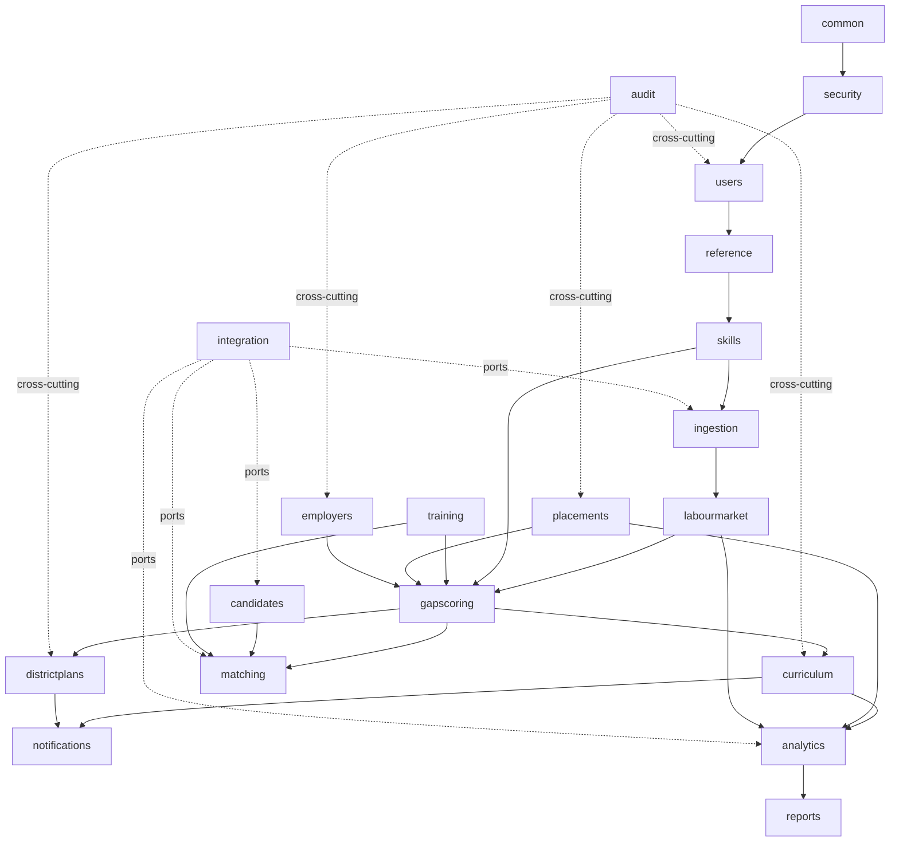
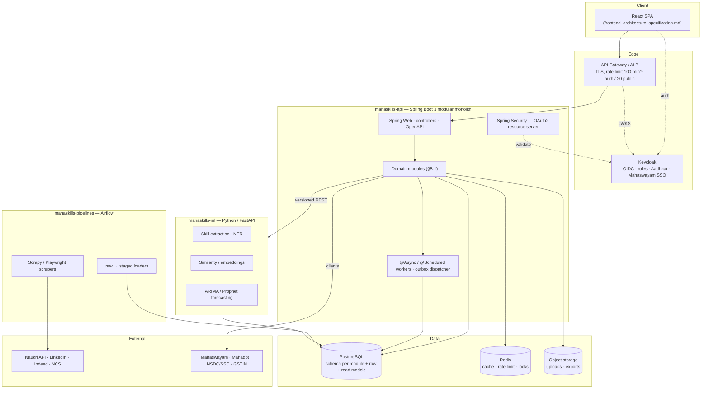
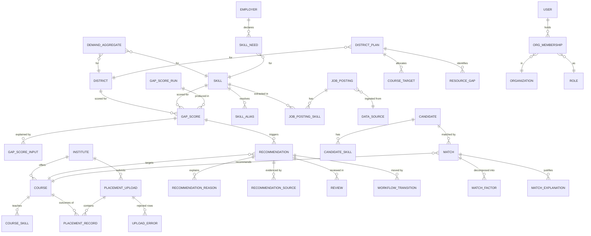
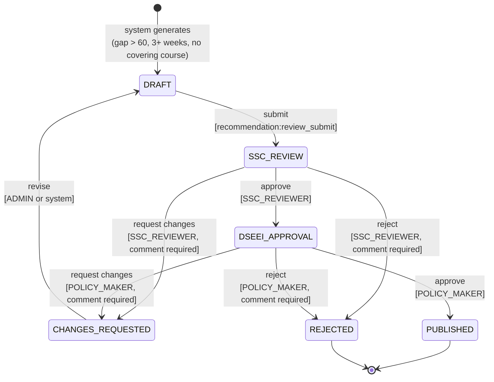

# MahaSkills — Principal Backend Architecture & Engineering Specification

**Target architecture:** Java 21 / Spring Boot 3 **modular monolith** — PostgreSQL as system of record, Redis for caching, Airflow + Python for ingestion, one Python ML service.
**Platform:** MahaSkills — Labour-Market Intelligence & Curriculum Alignment Platform
**Owner:** Government of Maharashtra — DSEEI / Maharashtra State Innovation Society (MSInS) · Problem Statement 26134
**Source of truth:** `MahaSkills_PRD.md` v1.0, `ARCHITECTURE.md`, `DATABASE_SCHEMA.md`, `API_SPECIFICATION.md`, `UI_UX_DESIGN.md`, `DEPLOYMENT.md`
**Companion:** `frontend_architecture_specification.md` v1.0 — the two documents share one API contract and must stay in sync.
**Document status:** Pre-implementation. Deliverables **A–O** as required before writing controllers.
**Version:** 1.0

---

## 0. Deliverable index

| § | Deliverable | Purpose |
|:---|:---|:---|
| **A** | PRD requirement map | Traceability: PRD requirement → domain → use case → API → entity → service → event/job → test |
| **B** | Domain decomposition | Module boundaries, ownership, and the dependency rules that keep the monolith modular |
| **C** | Architecture diagram | Runtime topology across Spring, Postgres, Redis, Airflow and the ML service |
| **D** | Database ER model | Schema per module: keys, constraints, indexes, audit columns, optimistic locking |
| **E** | Entity relationship map | How the domains join, and the joins that are deliberately forbidden |
| **F** | Error matrix | Stable error codes, HTTP mapping, and the response envelope |
| **G** | API route map | The complete REST surface, permission per endpoint |
| **H** | Event / workflow map | State machines, transitions, guards, and the events each emits |
| **I** | Data-ingestion pipeline | Raw → validated → normalised → deduplicated → canonical → aggregated, with provenance |
| **J** | Matching architecture | Explainable scoring — decomposition, weights, reproducibility |
| **K** | Recommendation architecture | Generation separated from delivery; every recommendation carries its reasons |
| **L** | ML integration architecture | The Java ↔ Python contract, versioning, and failure behaviour |
| **M** | Security model | Keycloak, RBAC, permission enforcement, PII and DPDP 2023 |
| **N** | Deployment architecture | Local Docker, environments, CI/CD, observability |
| **O** | Implementation plan | Twelve vertical slices with a verification loop after each |
| **P** | Assumptions, open questions, contract divergences | Every judgement call, and everything that still needs a human |

**Read §1 first.** Three conflicts between the brief, the PRD and the already-delivered frontend spec are resolved there, and those resolutions govern everything that follows.

---

## 1. Reconciliation — the brief, the PRD, and the frontend spec

### 1.1 Stack: the brief wins on *how*, the PRD wins on *what*

`ARCHITECTURE.md` specifies Node.js / Python FastAPI microservices, one per domain. This brief specifies a Java 21 / Spring Boot 3 modular monolith and argues the case directly: *"the weaker approach is to turn every module in the PRD into a separate service too early — that adds deployment, consistency and debugging complexity before you have proven the domain boundaries."*

That argument is right for this programme. Twenty-four candidate modules, a 3–4 person platform PMO, a government procurement and maintenance context, and a 20-month roadmap — a distributed system here buys nothing and costs a great deal. **Modular monolith, with module boundaries strict enough that any module can be extracted later** if scale or team structure demands it (§B.4 defines exactly what "extractable" means and how it is enforced in CI).

The PRD's *product* requirements are untouched by this. Where a PRD statement is about behaviour, the PRD governs. Where it is about implementation technology, the brief governs — with the four exceptions below, which were decided explicitly rather than by default.

| PRD component | Decision | Rationale |
|:---|:---|:---|
| **Keycloak (OIDC)** | **Kept.** Spring Boot is an OAuth2 **resource server**, not an authorisation server | PRD §4.2; government SSO; Aadhaar-based candidate login; Mahaswayam SSO handoff. Also the contract the delivered frontend spec is built on. The brief's §7 becomes *enforce, don't issue* — see §M |
| **Airflow + Scrapy/Playwright** | **Kept** as a Python ingestion tier writing to a `raw` schema. Spring owns everything downstream of `raw` | Nightly multi-source scraping needs retry, backfill, SLA alerting and per-DAG observability. Rebuilding that in Spring Batch is a worse Airflow |
| **Elasticsearch** | **Deferred.** PostgreSQL full-text search + `pg_trgm` fuzzy matching, behind a `SkillSearchPort` interface | ~2,000 canonical skills plus aliases does not need a search cluster. The port means adopting Elasticsearch later is one adapter, and the operational burden is not taken on before it is earned |
| **Python ML service** | **Kept**, as the only other deployable | NLP skill extraction, similarity matching and ARIMA/Prophet forecasting do not belong in Spring service methods (brief §22) |

Net: **two deployables plus Airflow** — `mahaskills-api` (Spring Boot), `mahaskills-ml` (Python/FastAPI), `mahaskills-pipelines` (Airflow) — against PostgreSQL and Redis.

### 1.2 Scope: the brief's ATS vocabulary is not in the PRD

The backend brief, like the frontend brief before it, is written in generic recruitment-platform language and proposes entities the PRD does not authorise. The brief's own instruction settles it — *"Do not invent product functionality that is absent from the PRD"*, *"only create entities that are actually required"* — and the resolution below is **identical to §1 of the frontend spec**, so the two stay in contract.

| Brief proposes | PRD reality | Decision |
|:---|:---|:---|
| `Job`, `JobSkillRequirement` as employer-authored | Job postings are **ingested** nightly from Naukri (licensed API), LinkedIn, Indeed (RSS), NCS Open API. Employers submit **skill needs** | `JobPosting` is an **ingested, read-only market-signal entity** in the `labourmarket` module, never an employer write surface. `SkillNeed` is the employer's authoring entity |
| `JobApplication`, `HiringPipeline`, `Placement` → `PlacementStage` (Identified → Applied → Interviewed → Selected → Placed) | No applicant tracking anywhere in the PRD. Placement data is **retrospective**: monthly CSV from ITI principals — `candidate_id` (anonymised), `course_id`, `batch_year`, `placed`, `employer_name`, `role`, `salary`, `months_to_placement` | **No ATS.** `PlacementRecord` is an ingested fact, not a workflow. The `placements` module owns upload → validation → ingestion → outcome analytics. `PlacementStage` and `JobApplication` are **not built** |
| `Match`, `MatchScore`, `MatchFactor`, `MatchExplanation` for candidate ↔ job; `GET /jobs/{id}/matches` | The PRD's only matcher is the **Pathway Quiz**: candidate → **course** recommendations with `match_score` and `reason` | The matching **engine and its explainability model are built exactly as the brief demands** — but the matched pair is `Candidate ↔ Course`, not `Candidate ↔ Job`. `MatchFactor` and `MatchExplanation` are generic, so a job-matching variant is a new `MatchStrategy` implementation, not a rewrite |
| Employers browse/compare candidates; `READ_CANDIDATE` for recruiters | PRD §10: *"Candidate PII anonymised; comply with DPDP 2023."* Placement rows carry anonymised IDs | **No candidate directory, no employer-facing candidate read.** `READ_CANDIDATE` exists only for the candidate themselves, and for Admin under audit. See **OQ-B03** |
| `Organization` / `OrganizationMembership` as a general multi-tenant model | The PRD has four concrete scope types: DSEEI (state), District, Institute, Employer | Kept, but **typed**: `Organization.type ∈ {STATE_BODY, DISTRICT_OFFICE, INSTITUTE, EMPLOYER, SSC}`. Scope is enforced by type-aware policies (§M.4), not by a generic tenant id |

### 1.3 Contract divergences with the delivered frontend spec — these must be closed now

Both documents are being written against the same `API_SPECIFICATION.md`, but the backend brief introduces three contract details that differ. Resolving them after implementation starts is expensive, so each has a decision here.

| # | Frontend spec / `API_SPECIFICATION.md` | Backend brief | Decision |
|:---|:---|:---|:---|
| **CD-01** | Base URL `https://api.mahaskills.gov.in/v1` — paths like `/gap-scores` | `/api/v1/...` | **`/api/v1` is the application path; the public base URL stays `https://api.mahaskills.gov.in/v1`.** The gateway strips `/api`. Spring's `server.servlet.context-path=/api`, `spring.mvc.servlet.path=/`, controllers mapped `/v1/...`. Both documents remain correct; the frontend's `VITE_API_BASE_URL` is unchanged |
| **CD-02** | Resource names `gap-scores`, `district-plans`, `candidates/courses`, `employers/skill-needs` | `candidates`, `jobs`, `skills`, `labour-market`, `curricula` | **`API_SPECIFICATION.md` wins** — the frontend is already built against it. The brief's examples are illustrative. Full authoritative surface in §G, with the brief's `/labour-market/*` and `/curricula/*` **added** where they fill genuine gaps |
| **CD-03** | Frontend flagged eight endpoints it needs that `API_SPECIFICATION.md` omits (notifications, reports/exports, institutes, employer registration, public stats, global search, forecasts, placement outcomes) | Brief mandates modules for notifications (§30), reporting (§31), file storage (§37) | **All eight are in scope for the backend** and specified in §G. This closes frontend gaps G-01 through G-08 |

Two further contract details the frontend spec asked for and this specification commits to:

- **`POST /ingestion/placements/upload` returns row-level errors** — `{ row, column, value, code, message }[]` plus a downloadable error CSV reference. The frontend's `UploadErrorModal` depends on it (§I.5).
- **Optimistic concurrency on multi-editor resources** — `District Plan` and recommendation decisions carry a `version` and require `If-Match`; a stale write returns `409 CONFLICT`. The brief mandates this in §44; the frontend cannot honestly implement its conflict state without it.

### 1.4 What "workflow-complete, not CRUD-complete" means here

The brief's closing principle — `DATA → INTELLIGENCE → DECISION → RECOMMENDATION → ACTION → OUTCOME → FEEDBACK` — is the acceptance test for this backend. Concretely, the loop this system must close:

```
Job postings + employer skill needs + placement CSVs   (DATA)
  → canonical skills, demand aggregates                (INTELLIGENCE)
  → gap scores per district × skill × NSQF × sector     (DECISION INPUT)
  → curriculum recommendations + district plans        (RECOMMENDATION)
  → SSC review → DSEEI approval → published            (ACTION)
  → revised courses → new placement outcomes           (OUTCOME)
  → recomputed gap scores                              (FEEDBACK)
```

Every module in §B exists to serve a segment of that loop. A module that cannot name its segment does not get built.

---
## A. PRD Requirement Map (traceability)

Every row traces one PRD requirement through to the test that proves it. A module with no row here is not built; a row with no test is not done.

### A.1 Core traceability

| PRD ref | Requirement | Domain | Use case | API | Entities | Service | Event / job | Test |
|:---|:---|:---|:---|:---|:---|:---|:---|:---|
| §6.1 | Nightly job-posting ingestion from Naukri, LinkedIn, Indeed, NCS | `ingestion`, `labourmarket` | Ingest & canonicalise postings | `GET /v1/ingestion/jobs/sources`, `POST …/trigger-scrape` | `DataSource`, `ImportBatch`, `RawJobPosting`, `JobPosting` | `JobPostingIngestionService` | Airflow `dag_job_scrape` (nightly) → `JobPostingsIngested` | IT: dedup on re-import; UT: normalisation rules |
| §6.1 | ITI placement CSV upload, monthly, structured | `placements`, `ingestion` | Upload & validate placements | `POST /v1/ingestion/placements/upload`, `GET …/upload-history` | `PlacementUpload`, `PlacementUploadError`, `PlacementRecord` | `PlacementUploadService` | `PlacementDataIngested` → gap recompute | IT: malformed rows rejected with row numbers; E2E: upload → gap score changes |
| §6.1 | Employer micro-surveys triggered by gap-score spikes | `employers`, `notifications` | Trigger & collect survey | `POST /v1/ingestion/surveys`, `POST …/{id}/responses` | `Survey`, `SurveyQuestion`, `SurveyResponse` | `SurveyService` | `GapScoreSpiked` → `SurveyAssigned` | IT: spike triggers exactly one survey per employer per window |
| §6.1 | Sector growth data, quarterly manual upload | `ingestion` | Upload sector growth | `POST /v1/ingestion/sector-growth` | `SectorGrowthDatum`, `ImportBatch` | `SectorGrowthService` | — | IT: idempotent re-upload |
| §6.2 | Canonical skill taxonomy seeded from ~2,000 NSQF/SSC job roles | `skills` | Manage taxonomy | `GET /v1/taxonomy/skills`, `/tree`, `/sectors`, `PUT /skills/{id}` | `Skill`, `SkillAlias`, `SkillRelation`, `JobRole`, `Sector`, `NsqfLevel` | `TaxonomyService` | Flyway seed migration | UT: alias resolution; IT: merge preserves references |
| §6.2 | NLP enrichment maps free-text posting skills to taxonomy | `skills`, `ml` | Enrich taxonomy | `POST /v1/taxonomy/skills/enrich` | `SkillCandidateTerm`, `SkillAlias` | `SkillEnrichmentService` → ML client | Async job `skill-enrichment` | IT: unmapped terms land in review queue, never auto-merge |
| §6.2 | "Emerging roles" bucket for skills outside any SSC framework | `skills` | List emerging skills | `GET /v1/taxonomy/skills/emerging` | `Skill.isEmerging` | `TaxonomyService` | — | UT: classification rule |
| §6.3 | Gap score = (demand × trend weight) − (trained seats × placement rate), normalised 0–100 per district | `gapscoring` | Compute gap scores | `GET /v1/gap-scores`, `/districts/{id}`, `/skills/{id}`, `/heatmap`, `/trends` | `GapScore`, `GapScoreRun`, `GapScoreInput` | `GapScoringService` | Weekly `dag_gap_refresh`; `POST /gap-scores/refresh` | UT: formula with fixed inputs; IT: same inputs → same score (reproducibility) |
| §6.3 | Oversupply flag: placement rate < 25% **and** demand below 20th percentile, 2+ consecutive quarters | `gapscoring` | Flag oversupplied courses | `GET /v1/gap-scores/oversupply` | `OversupplyFlag` | `OversupplyDetectionService` | Weekly | UT: boundary cases at 25% and P20; one quarter must not flag |
| §6.4 | Recommendation trigger: gap score > 60 sustained 3+ weeks, no covering course | `curriculum` | Generate recommendations | `GET /v1/recommendations`, `/{id}`, `/{id}/evidence` | `CurriculumRecommendation`, `RecommendationReason`, `RecommendationSource`, `EvidencePackage` | `CurriculumRecommendationService` | `dag_recommendation_generate` → `RecommendationDrafted` | UT: 2 weeks does not trigger; IT: evidence package is complete |
| §6.4 | Types: add module · update unit · develop qualification · retire course | `curriculum` | — | — | `RecommendationType` enum | — | — | UT: type selection rules |
| §6.4 | Validation workflow SSC reviewer → DSEEI approver → published | `curriculum` | Review & approve | `POST /v1/recommendations/{id}/review`, `/approve` | `CurriculumReview`, `WorkflowTransition`, `AuditLog` | `RecommendationWorkflowService` | `RecommendationPublished` → notify ITIs | IT: role-gated transitions; illegal transition rejected; concurrent approval → 409 |
| §6.5 | District plans auto-generated from gap scores + placement history + industrial composition | `districtplans` | Generate plan | `POST /v1/district-plans/generate` | `DistrictPlan`, `PlanCourseTarget`, `PlanResourceGap`, `BudgetScore` | `DistrictPlanGenerationService` | Async `plan-generation` | IT: generated plan references only real courses |
| §6.5 | Officer adjusts seat targets and publishes; annual + rolling 3-year | `districtplans` | Adjust & publish | `PUT /v1/district-plans/{id}`, `POST /{id}/publish` | as above + `version` | `DistrictPlanService` | `DistrictPlanPublished` | IT: published plan is immutable; stale `If-Match` → 409 |
| §6.5 | Equipment gap: course equipment list vs ITI asset register, cost estimate | `districtplans`, `institutions` | Equipment gap analysis | `GET /v1/district-plans/{id}/equipment-gaps` | `CourseEquipmentRequirement`, `InstituteAsset`, `EquipmentGap` | `EquipmentGapService` | — | UT: gap and cost computation |
| §6.5 | Budget priority scoring for DSEEI fund distribution | `districtplans` | Budget scoring | `GET /v1/district-plans/{id}/budget-scoring` | `BudgetScore` | `BudgetScoringService` | — | UT: factor weights; scores sum correctly |
| §6.6 | Course cards: duration, NSQF, fees, median salary, time-to-placement, top 5 employers, demand badge | `training`, `analytics` | Search courses | `GET /v1/candidates/courses`, `/{id}` | `Course`, `CourseOutcomeAggregate` | `CourseCatalogService` | Nightly aggregate refresh | IT: aggregates match underlying placements; UT: badge thresholds |
| §6.6 | Pathway quiz: 5 inputs → top 3 course recommendations with reasons | `matching` | Recommend courses | `POST /v1/candidates/pathway-quiz` | `PathwayRequest`, `Match`, `MatchFactor`, `MatchExplanation` | `CandidateCourseMatchingService` | — | UT: deterministic for fixed input; every result has a non-empty reason |
| §6.6 | Mahaswayam SSO enrolment handoff; NCS job alerts | `candidates`, `integration` | Enrol / alerts | `GET /v1/candidates/enrollment-status` | `EnrollmentHandoff` | `MahaswayamClient`, `NcsClient` | — | IT: handoff token; circuit-breaker on outage |
| §7 | Role-specific dashboards (5 roles) | `analytics` | Dashboard aggregates | `GET /v1/dashboard/{policy-maker\|district-officer/{id}\|iti-principal/{id}}` | materialised views | `DashboardService` | Refresh job | Perf: p95 < 2s (PRD NFR) |
| §3 | Six roles + SSC reviewer, scoped access | `auth`, `users` | Authorise | all | `User`, `Role`, `Permission`, `Organization`, `OrganizationMembership` | `AuthorizationService` | — | Security IT: every endpoint × every role |
| §8 | Governance: SSC Technical Committee → DSEEI Joint Secretary | `curriculum` | Approval chain | as above | `WorkflowDefinition` | `RecommendationWorkflowService` | — | IT: chain cannot be short-circuited |
| §10 | 99.5% uptime; dashboards < 2s; recommendations < 5s | cross-cutting | — | — | — | caching, materialised views, async | — | Perf tests at realistic volume |
| §10 | Marathi / Hindi / English; all UI strings externalised | `common` | Localised reference data | all reference endpoints | `*.nameMr`, `*.nameHi` | `LocalizationService` | — | IT: `Accept-Language` returns localised names |
| §10 | WCAG 2.1 AA | frontend | — | — | — | — | — | (frontend spec §G.5) |
| §10 | Retention: job data 2y, placement 7y, PII anonymised after 3y | `admin`, `audit` | Retention enforcement | — | retention policy tables | `DataRetentionService` | `dag_retention` (monthly) | IT: expired rows anonymised, not deleted where audit requires |
| §10 | OWASP Top 10; RBAC; audit log for all data writes; TLS everywhere | `security`, `audit` | — | all | `AuditLog` | `AuditService` (AOP) | — | Security scan in CI; IT: every write emits an audit row |
| §4.3 | Integrations: Mahaswayam, NCS, Mahadbt, NSDC/SSC, PM Vishwakarma/PMKVY | `integration` | External sync | internal | `IntegrationRun`, `ExternalRef` | one client per integration | Scheduled sync DAGs | IT: contract tests with recorded fixtures |
| Phase 4 | 12-month demand forecast (ARIMA/Prophet) | `forecasting`, `ml` | Forecast demand | `GET /v1/labour-market/forecasts` | `DemandForecast`, `ModelVersion` | `ForecastingService` → ML client | Monthly `dag_forecast` | IT: model version recorded with every forecast |
| Phase 4 | Automated annual curriculum review report per course | `curriculum`, `reports` | Annual review | `POST /v1/reports/export` | `Report`, `ReportJob` | `ReportGenerationService` | Async | IT: report reproducible from stored filters |

### A.2 Requirements the brief lists that the PRD does **not** support

Recorded so they are visibly declined rather than silently dropped (brief §0: *"do not invent product functionality absent from the PRD"*).

| Brief item | Status | Reason |
|:---|:---|:---|
| `JobApplication`, `HiringPipeline`, `PlacementStage` | **Not built** | No applicant tracking in the PRD (§1.2) |
| Employer-authored `Job` + `PUBLISH_JOB` permission | **Not built** | Job postings are ingested market data; employers author `SkillNeed` |
| `Candidate ↔ Job` matching, `GET /jobs/{id}/matches` | **Not built in v1** | Engine built for `Candidate ↔ Course`; job matching is a future `MatchStrategy` |
| Employer reads candidate profiles / `READ_CANDIDATE` for recruiters | **Not built** | DPDP 2023 + anonymised placement IDs (**OQ-B03**) |
| `CandidateAssessment` | **Deferred** | The PRD has no assessment instrument. Table reserved, no API (**OQ-B05**) |
| Generic multi-tenant `Organization` | **Narrowed** | Typed organisations matching the four real scopes (§1.2) |
| Kafka / RabbitMQ for all async | **Narrowed** | Transactional **outbox** + Postgres-backed queue for v1; broker only if fan-out volume proves it (§H.5) |

---

## B. Domain Decomposition

### B.1 Modules

Twenty-four candidates in the brief; **seventeen** survive the PRD test. Each is a Java package under `in.gov.maharashtra.mahaskills`, with `controller` / `service` / `repository` / `domain` / `dto` / `mapper` / `validation` / `exception` inside it, plus a public `api` package that is the only thing other modules may import.

| # | Module | Owns | Phase |
|:---:|:---|:---|:---:|
| 1 | `common` | Response envelope, error model, pagination, correlation id, localisation, base entities | 1 |
| 2 | `security` | Keycloak resource-server config, JWT→principal mapping, permission evaluation, method security | 1–2 |
| 3 | `users` | `User`, `Role`, `Permission`, `Organization`, `OrganizationMembership`, scope resolution | 2 |
| 4 | `reference` | `District`, `Region`, `Sector`, `Occupation`, `NsqfLevel`, `Institute` — read-mostly, cached | 3 |
| 5 | `skills` | Canonical `Skill`, aliases, relations, `JobRole`, taxonomy tree, enrichment queue | 3 |
| 6 | `ingestion` | `DataSource`, `ImportBatch`, raw staging, validation, normalisation, dedup, provenance | 4 |
| 7 | `labourmarket` | `JobPosting` (ingested), demand aggregates by skill/occupation/sector/district/time | 4 |
| 8 | `gapscoring` | `GapScore`, `GapScoreRun`, inputs, oversupply flags, heatmap and trend queries | 5 |
| 9 | `curriculum` | `Curriculum`, `CurriculumModule`, `CurriculumSkill`, `IndustryRequirement`, `CurriculumGap`, recommendations, review workflow | 5 |
| 10 | `candidates` | `Candidate`, education, skills, experience, preferences, saved courses, enrolment handoff | 6 |
| 11 | `employers` | `Employer`, profile, GSTIN verification, `SkillNeed`, surveys, curriculum feedback | 7 |
| 12 | `matching` | `Match`, `MatchFactor`, `MatchExplanation`, `MatchStrategy`, pathway quiz | 8 |
| 13 | `training` | `TrainingProvider`, `Course`, `CourseSkill`, `TrainingProgram`, course outcome aggregates | 9 |
| 14 | `placements` | `PlacementUpload`, `PlacementRecord`, outcome aggregates, institute performance | 10 |
| 15 | `districtplans` | `DistrictPlan`, seat targets, resource gaps, equipment gaps, budget scoring | 10 |
| 16 | `analytics` | Dashboard aggregates, materialised views, `forecasting` sub-package | 11 |
| 17 | `reports` | `Report`, `ReportJob`, async generation, export formats, file storage refs | 11 |
| 18 | `notifications` | `Notification`, channels, templates, preferences, fan-out | 11 |
| 19 | `audit` | `AuditLog`, AOP interceptor, retention | 2 (cross-cutting) |
| 20 | `integration` | Mahaswayam, NCS, Mahadbt, NSDC/SSC, GSTIN, ML clients | as needed |
| 21 | `admin` | System health, pipeline status, data sources, retention jobs, configuration | 1, 12 |

*(`occupations` and `sectors` fold into `reference`; `organizations` folds into `users`; `forecasting` is a sub-package of `analytics`; `jobs` becomes `labourmarket`; `institutions` folds into `reference` + `placements`.)*

### B.2 Layering inside a module

```
controller/   HTTP only. Request DTO in, Response DTO out. No business logic. No entities.
service/      Application services (use cases, @Transactional boundaries)
              + domain services (pure business rules, no Spring, unit-testable)
repository/   Spring Data JPA + JOOQ/native for analytical queries
domain/       JPA entities, value objects, enums, state machines
dto/          request/, response/ — never reused across the boundary in both directions
mapper/       MapStruct, entity ↔ DTO
validation/   Bean Validation + custom cross-field validators
exception/    Module-specific exceptions, mapped centrally in common
api/          PUBLIC: the interfaces and DTOs other modules may use. Nothing else is importable.
```

The brief's two prohibitions, enforced rather than hoped for: **controllers contain no business logic** and **repositories contain no workflows**. Both are checked by ArchUnit tests in CI (§B.4).

### B.3 Module dependency graph



**Rules:**

1. Dependencies point **down** the graph only. No cycles, ever.
2. A module imports another only through its `api` package.
3. Cross-module reads that would be a join go through the owning module's `api` service, or through a **read model** (materialised view) owned by `analytics`. No module writes another module's tables.
4. Cross-module *reactions* are **events**, not calls. `placements` does not call `gapscoring`; it publishes `PlacementDataIngested` and `gapscoring` subscribes.
5. `common`, `security` and `audit` are the only modules everything may depend on.

### B.4 What "extractable later" actually means

The brief's promise — modules can become services if scale demands — is only true if it is enforced from day one. Three mechanisms, all in CI:

- **ArchUnit tests**: no package outside `x.api` is imported across module boundaries; no controller depends on a repository; no entity leaves a controller; no cycles between modules.
- **Schema ownership**: each module owns a Postgres **schema** (`skills`, `gapscoring`, `curriculum`, …). Cross-schema foreign keys are permitted **only** to `reference` and `users` — the two genuinely shared kernels. Everywhere else a module holds an id and resolves it through the owning module's API. This is the single decision that makes extraction possible later; it is also the one most easily lost, so it is asserted by a test that inspects `information_schema.table_constraints`.
- **Event contracts**: domain events are versioned records in the publishing module's `api` package. Adding a field is allowed; changing or removing one is a new version.

When a module is extracted, its schema travels with it, its API package becomes an HTTP client, and its event subscriptions become broker subscriptions. Nothing else changes.

---

## C. Architecture

### C.1 Runtime topology



### C.2 The choices worth defending

| Decision | Why | What it costs |
|:---|:---|:---|
| **Modular monolith over microservices** | Domain boundaries are not yet proven; a 3–4 person PMO cannot operate 24 services; government procurement and maintenance favour one deployable | Requires discipline that is enforced mechanically (§B.4), not culturally |
| **Postgres as the single system of record** | Every analytical question in the PRD is a join across ingestion, taxonomy, placements and courses. One database makes those correct and cheap | Analytical load competes with transactional; mitigated by read replicas and materialised views |
| **Materialised views for dashboards** | PRD NFR is < 2 s for dashboards over 36 districts × ~2,000 skills; live aggregation will not hold that | Refresh scheduling and staleness must be explicit and shown in the UI |
| **Airflow retained for ingestion** | Retries, backfills, SLA alerts and per-source observability for nightly multi-source scraping | A second runtime and language to operate |
| **Postgres FTS + `pg_trgm` instead of Elasticsearch** | ~2,000 skills + aliases; fuzzy alias matching is the actual requirement, not full-text ranking at scale | Behind `SkillSearchPort` so Elasticsearch is one adapter away if it is ever earned |
| **Outbox + Postgres queue instead of Kafka** | The brief warns against a broker per CRUD action; v1 fan-out is small and bounded | Revisit when notification fan-out or ingestion volume justifies it |
| **Separate Python ML service** | NLP, embeddings and forecasting have a different lifecycle, dependency set and release cadence from the transactional core | A network hop and a versioned contract (§L) |

---
## D. Database ER Model

### D.1 Conventions applied to every table

| Rule | Detail |
|:---|:---|
| Primary key | `id UUID PRIMARY KEY DEFAULT gen_random_uuid()` — UUIDv7 where insert ordering matters (`audit_log`, `raw_job_posting`) |
| Timestamps | `created_at`, `updated_at` — `TIMESTAMPTZ NOT NULL`, always UTC, `Asia/Kolkata` only at the presentation edge |
| Actor columns | `created_by`, `updated_by` (FK `users.user.id`) on every table a human can change. **Not** on ingested/derived tables, where provenance replaces authorship |
| Optimistic locking | `version BIGINT NOT NULL DEFAULT 0` + JPA `@Version` on `district_plan`, `curriculum_recommendation`, `candidate`, `employer`, `skill`, `course` — every multi-editor row (brief §44) |
| Soft delete | Only where the PRD needs history: `skill` (merged, not deleted), `course` (retired), `user` (deactivated). Everything else is a hard delete. `deleted_at TIMESTAMPTZ NULL` + partial unique indexes `WHERE deleted_at IS NULL` |
| Status | Explicit enum column plus a check constraint; never a boolean pair |
| Money | `NUMERIC(12,2)` in INR. Never floating point |
| Localisation | `name`, `name_mr`, `name_hi` on reference tables (PRD §10) |
| Schema per module | `reference`, `users`, `skills`, `ingestion`, `labourmarket`, `gapscoring`, `curriculum`, `candidates`, `employers`, `matching`, `training`, `placements`, `districtplans`, `analytics`, `reports`, `notifications`, `audit`, `raw` |
| Cross-schema FKs | Permitted **only** to `reference.*` and `users.*` (§B.4) |

### D.2 `reference` — shared kernel, read-mostly, cached

```sql
reference.region        (id, name, name_mr, name_hi)
reference.district      (id, region_id FK, name, name_mr, name_hi, lgd_code UNIQUE, geo_centroid POINT)
                        -- fixed cardinality 36
reference.sector        (id, name, name_mr, name_hi, ssc_id FK NULL)      -- 33 sectors
reference.ssc           (id, name, ncvet_code UNIQUE)                     -- 36 councils (OQ-B01)
reference.occupation    (id, sector_id FK, nco_code, name, name_mr, name_hi)
reference.nsqf_level    (level SMALLINT PK CHECK (level BETWEEN 1 AND 10), descriptor)
reference.institute     (id, district_id FK, name, type CHECK (type IN
                         ('ITI','POLYTECHNIC','PRIVATE_TRAINING_PARTNER')),
                         code UNIQUE, address, is_active)
```

Indexes: `district(region_id)`, `sector(ssc_id)`, `occupation(sector_id)`, `institute(district_id, type)`.

### D.3 `users` — identity, scope, authorisation

Keycloak owns credentials; this schema owns the **domain** view of a user: which organisation they act for and what that lets them do.

```sql
users.app_user          (id, keycloak_subject UNIQUE NOT NULL, email, display_name,
                         preferred_language CHECK (IN ('en','mr','hi')),
                         status CHECK (IN ('ACTIVE','SUSPENDED','DEACTIVATED')),
                         last_login_at, deleted_at)
users.role              (id, code UNIQUE, name, description)              -- 7 roles (§A.1 FE spec)
users.permission        (id, code UNIQUE, description)                    -- resource:action
users.role_permission   (role_id FK, permission_id FK, PK(role_id, permission_id))
users.organization      (id, type CHECK (IN ('STATE_BODY','DISTRICT_OFFICE','INSTITUTE',
                                             'EMPLOYER','SSC')),
                         district_id FK NULL, institute_id FK NULL, employer_id NULL,
                         ssc_id FK NULL, name,
                         CHECK (exactly one scope column matches type))
users.org_membership    (id, user_id FK, organization_id FK, role_id FK,
                         valid_from, valid_to NULL,
                         UNIQUE (user_id, organization_id, role_id) WHERE valid_to IS NULL)
```

**The scope check constraint is the heart of multi-tenancy.** `type='DISTRICT_OFFICE'` requires `district_id NOT NULL` and every other scope column `NULL`. A District Officer's effective scope is derived from their membership, never from a request parameter (§M.4).

### D.4 `skills` — canonical taxonomy

The brief's central worry — *"Machine Learning", "Machine-Learning", "MachineLearning" must not become three skills"* — is a schema problem before it is a service problem.

```sql
skills.skill            (id, canonical_name, normalized_name UNIQUE NOT NULL,
                         sector_id FK NULL, nsqf_level FK NULL,
                         is_emerging BOOLEAN NOT NULL DEFAULT false,
                         source CHECK (IN ('NSQF_SEED','SSC_SEED','NLP_ENRICHED','MANUAL')),
                         merged_into_id FK skills.skill NULL,   -- merge, never delete
                         status CHECK (IN ('ACTIVE','MERGED','PENDING_REVIEW')),
                         version, created_at, updated_at, created_by, updated_by)
skills.skill_alias      (id, skill_id FK, alias, normalized_alias,
                         source, confidence NUMERIC(4,3) NULL,
                         UNIQUE (normalized_alias))
skills.skill_relation   (id, from_skill_id FK, to_skill_id FK,
                         type CHECK (IN ('SYNONYM','RELATED','PREREQUISITE','BROADER','NARROWER')),
                         UNIQUE (from_skill_id, to_skill_id, type),
                         CHECK (from_skill_id <> to_skill_id))
skills.job_role         (id, sector_id FK, nsqf_level FK, name, ssc_code UNIQUE, ssc_id FK)
skills.job_role_skill   (job_role_id FK, skill_id FK, importance CHECK (IN ('CORE','OPTIONAL')),
                         PK(job_role_id, skill_id))
skills.candidate_term   (id, raw_term, normalized_term, occurrence_count,
                         first_seen_at, suggested_skill_id FK NULL, confidence,
                         status CHECK (IN ('PENDING','MAPPED','REJECTED','NEW_SKILL')))
```

`normalized_name` is produced by one deterministic function — lowercase, strip punctuation and whitespace, collapse separators, apply a stopword list — used identically in Java and in the Airflow loaders, and covered by a shared fixture set so the two implementations cannot drift. **`UNIQUE(normalized_name)` plus `UNIQUE(normalized_alias)` is what makes duplicate skills structurally impossible**, not a service check that can be bypassed by a bulk import.

Indexes: `GIN (normalized_name gin_trgm_ops)` and the same on `skill_alias.normalized_alias` for fuzzy resolution; `skill(sector_id, nsqf_level)`; `candidate_term(status, occurrence_count DESC)`.

### D.5 `ingestion` and `raw` — provenance before canon

```sql
ingestion.data_source   (id, code UNIQUE, name,
                         type CHECK (IN ('JOB_PORTAL_API','SCRAPER','CSV_UPLOAD',
                                         'SURVEY','MANUAL_UPLOAD','PARTNER_API')),
                         is_active, config JSONB, last_success_at, tos_notes)
ingestion.import_batch  (id, data_source_id FK, external_batch_ref,
                         status CHECK (IN ('RECEIVED','VALIDATING','VALIDATED','NORMALIZING',
                                           'LOADED','PARTIALLY_FAILED','FAILED')),
                         row_count, accepted_count, rejected_count,
                         started_at, finished_at, triggered_by FK NULL,
                         idempotency_key UNIQUE NOT NULL)
ingestion.import_error  (id, import_batch_id FK, row_number, column_name,
                         raw_value, error_code, message)
ingestion.rejected_record (id, import_batch_id FK, payload JSONB, reason_code, rejected_at)

raw.job_posting         (id UUIDv7, data_source_id FK, source_ref,
                         payload JSONB NOT NULL, fetched_at,
                         content_hash BYTEA NOT NULL,
                         UNIQUE (data_source_id, content_hash))
raw.placement_row       (id, import_batch_id FK, row_number, payload JSONB, received_at)
```

`raw` is append-only and never joined by application queries. `content_hash` over the normalised payload is what makes a re-scrape idempotent (brief §25).

### D.6 `labourmarket` — the demand signal

```sql
labourmarket.job_posting        (id, data_source_id FK, source_ref, raw_id FK raw.job_posting,
                                 title, normalized_title, employer_name_raw,
                                 employer_id FK NULL, district_id FK NULL,
                                 occupation_id FK NULL, sector_id FK NULL,
                                 nsqf_level FK NULL,
                                 salary_min NUMERIC(12,2), salary_max NUMERIC(12,2),
                                 experience_min_years, experience_max_years,
                                 posted_at DATE NOT NULL, ingested_at,
                                 content_hash BYTEA,
                                 UNIQUE (data_source_id, source_ref))
labourmarket.job_posting_skill  (job_posting_id FK, skill_id FK,
                                 extraction_confidence NUMERIC(4,3),
                                 extraction_model_version,
                                 PK(job_posting_id, skill_id))
labourmarket.demand_aggregate   (id, period_month DATE, district_id FK, sector_id FK NULL,
                                 occupation_id FK NULL, skill_id FK NULL, nsqf_level FK NULL,
                                 posting_count, unique_employer_count,
                                 median_salary NUMERIC(12,2),
                                 trend_weight NUMERIC(6,4), computed_at,
                                 UNIQUE (period_month, district_id, sector_id,
                                         occupation_id, skill_id, nsqf_level))
labourmarket.demand_forecast    (id, skill_id FK, district_id FK, horizon_month DATE,
                                 predicted_count, confidence_low, confidence_high,
                                 model_name, model_version, generated_at,
                                 UNIQUE (skill_id, district_id, horizon_month, model_version))
```

Partition `job_posting` by `posted_at` month once the table passes ~10M rows — 2-year retention (PRD §10) makes that a bounded, predictable set. `demand_aggregate` is what every dashboard reads; nothing user-facing scans `job_posting` directly.

### D.7 `gapscoring` — the platform's central number

```sql
gapscoring.gap_score_run  (id, run_type CHECK (IN ('SCHEDULED','MANUAL')),
                           formula_version NOT NULL, parameters JSONB NOT NULL,
                           started_at, finished_at,
                           status CHECK (IN ('RUNNING','COMPLETED','FAILED')),
                           triggered_by FK NULL)
gapscoring.gap_score      (id, run_id FK, district_id FK, skill_id FK,
                           sector_id FK, nsqf_level FK,
                           demand_count, trend_weight NUMERIC(6,4),
                           trained_seats, placement_rate NUMERIC(5,4),
                           raw_score NUMERIC(12,4), score SMALLINT
                             CHECK (score BETWEEN 0 AND 100),
                           severity CHECK (IN ('LOW','MEDIUM','HIGH')),
                           computed_at,
                           UNIQUE (run_id, district_id, skill_id, nsqf_level))
gapscoring.gap_score_input (id, gap_score_id FK, input_name, input_value NUMERIC,
                            source_table, source_ref)
gapscoring.oversupply_flag (id, course_id FK, district_id FK,
                            quarters_flagged SMALLINT, placement_rate NUMERIC(5,4),
                            demand_percentile NUMERIC(5,2),
                            first_flagged_at, last_evaluated_at, is_active)
```

Two decisions carry the brief's reproducibility requirement (*"gap calculations should be reproducible; store the relevant inputs used to generate a result"*):

- **Scores are versioned by run, never updated in place.** History is free, "what did we know in March?" is answerable, and a formula change is a new `formula_version` rather than a silent rewrite of the past.
- **`gap_score_input` stores every operand** that produced each score. A reviewer can reconstruct the arithmetic without re-running the pipeline, which is what makes an approval defensible.

Indexes: `gap_score(run_id, district_id, score DESC)`, `gap_score(skill_id, run_id)`, and a partial index on the current run for the hot dashboard path.

### D.8 `curriculum` — the governed output

```sql
curriculum.curriculum             (id, course_id FK NULL, job_role_id FK NULL, name,
                                   nsqf_level FK, version_label, status, effective_from)
curriculum.curriculum_module      (id, curriculum_id FK, name, sequence, duration_hours)
curriculum.curriculum_skill       (curriculum_id FK, skill_id FK, coverage_level
                                     CHECK (IN ('INTRODUCED','PRACTISED','MASTERED')),
                                   PK(curriculum_id, skill_id))
curriculum.industry_requirement   (id, sector_id FK, skill_id FK, nsqf_level FK,
                                   required_level, evidence_source, valid_from, valid_to)
curriculum.curriculum_gap         (id, curriculum_id FK, skill_id FK,
                                   gap_type CHECK (IN ('MISSING','OUTDATED','EMERGING',
                                                       'UNDER_COVERED')),
                                   coverage_score NUMERIC(5,2), severity, detected_at,
                                   gap_score_id FK NULL)
curriculum.recommendation         (id, type CHECK (IN ('ADD_MODULE','UPDATE_UNIT',
                                                       'DEVELOP_QUALIFICATION','RETIRE_COURSE')),
                                   status CHECK (IN ('DRAFT','SSC_REVIEW','DSEEI_APPROVAL',
                                                     'PUBLISHED','REJECTED','CHANGES_REQUESTED')),
                                   title, skill_id FK, target_course_id FK NULL,
                                   sector_id FK, estimated_uplift_pct NUMERIC(5,2),
                                   trigger_rule TEXT NOT NULL, gap_score_run_id FK,
                                   current_step_role_id FK, due_at,
                                   version, created_at, updated_at, created_by, updated_by)
curriculum.recommendation_reason  (id, recommendation_id FK, reason_code, reason_text,
                                   weight NUMERIC(5,2), sequence)
curriculum.recommendation_source  (id, recommendation_id FK, source_type
                                     CHECK (IN ('GAP_SCORE','JOB_POSTING_TREND',
                                                'EMPLOYER_SKILL_NEED','SURVEY','PLACEMENT_OUTCOME')),
                                   source_table, source_ref, contribution NUMERIC(5,2))
curriculum.recommendation_district (recommendation_id FK, district_id FK,
                                    PK(recommendation_id, district_id))
curriculum.review                 (id, recommendation_id FK, reviewer_user_id FK,
                                   reviewer_role_id FK,
                                   decision CHECK (IN ('APPROVED','REJECTED','CHANGES_REQUESTED')),
                                   comment TEXT, decided_at,
                                   CHECK (decision = 'APPROVED' OR comment IS NOT NULL))
curriculum.workflow_transition    (id, recommendation_id FK, from_status, to_status,
                                   actor_user_id FK, actor_role_id FK, occurred_at,
                                   correlation_id)
curriculum.recommendation_feedback (id, recommendation_id FK, employer_id FK NULL,
                                    institute_id FK NULL, sentiment, comment, submitted_at)
```

The check constraint `decision = 'APPROVED' OR comment IS NOT NULL` puts the PRD's governance rule in the database, where it cannot be forgotten by a new controller.

### D.9 `candidates`, `employers`, `training`, `placements`, `districtplans`, `matching`

```sql
-- candidates (PII-bearing: see §M.5)
candidates.candidate            (id, user_id FK NULL, anonymised_ref UNIQUE NOT NULL,
                                 district_id FK, preferred_language, mobility
                                   CHECK (IN ('DISTRICT','STATE','ANYWHERE')),
                                 education_level, consent_version, consent_at,
                                 version, created_at, updated_at, deleted_at)
candidates.candidate_education  (id, candidate_id FK, level, institution_name,
                                 year_of_completion, stream)
candidates.candidate_skill      (id, candidate_id FK, skill_id FK, proficiency,
                                 source CHECK (IN ('SELF_DECLARED','COURSE','ASSESSMENT')),
                                 valid_from, valid_to NULL,
                                 UNIQUE (candidate_id, skill_id) WHERE valid_to IS NULL)
candidates.candidate_preference (candidate_id PK FK, sector_interests UUID[], updated_at)
candidates.saved_course         (candidate_id FK, course_id FK, saved_at,
                                 PK(candidate_id, course_id))
candidates.enrollment_handoff   (id, candidate_id FK, course_id FK, provider
                                   CHECK (IN ('MAHASWAYAM')),
                                 external_ref, status, initiated_at, confirmed_at,
                                 idempotency_key UNIQUE)

-- employers
employers.employer              (id, name, gstin UNIQUE NOT NULL, sector_id FK,
                                 district_id FK,
                                 verification_status CHECK (IN ('PENDING','VERIFIED','REJECTED')),
                                 verified_at, profile_completeness SMALLINT,
                                 version, created_at, updated_at)
employers.skill_need            (id, employer_id FK, skill_id FK, district_id FK,
                                 headcount INT CHECK (headcount > 0),
                                 urgency CHECK (IN ('IMMEDIATE','WITHIN_3M','WITHIN_12M')),
                                 nsqf_level FK NULL, created_at, created_by,
                                 UNIQUE (employer_id, skill_id, district_id, created_at::date))
employers.survey                (id, title, trigger_type, sector_id FK NULL,
                                 district_id FK NULL, question_count
                                   CHECK (question_count BETWEEN 5 AND 8),
                                 opens_at, closes_at, created_by FK)
employers.survey_question       (id, survey_id FK, sequence, prompt, prompt_mr, prompt_hi,
                                 answer_type, options JSONB)
employers.survey_assignment     (id, survey_id FK, employer_id FK, assigned_at,
                                 responded_at NULL, UNIQUE (survey_id, employer_id))
employers.survey_response       (id, assignment_id FK, question_id FK, answer JSONB,
                                 submitted_at)

-- training
training.provider               (id, institute_id FK NULL, name, type, is_active)
training.course                 (id, provider_id FK, institute_id FK, name, name_mr, name_hi,
                                 sector_id FK, occupation_id FK, nsqf_level FK,
                                 duration_months, fees_inr NUMERIC(12,2), seat_capacity,
                                 status CHECK (IN ('ACTIVE','RETIRED')), retired_at,
                                 version, created_at, updated_at)
training.course_skill           (course_id FK, skill_id FK, coverage_level,
                                 PK(course_id, skill_id))
training.course_equipment_req   (id, course_id FK, equipment_name, quantity,
                                 estimated_cost_inr NUMERIC(12,2), maintained_by_ssc_id FK)
training.course_outcome_agg     (course_id PK FK, batch_year, placed_count, total_count,
                                 placement_rate NUMERIC(5,4), median_salary NUMERIC(12,2),
                                 median_months_to_placement NUMERIC(4,1),
                                 top_employers TEXT[], demand_trend_badge, computed_at)

-- placements  (retrospective facts — no ATS, see §1.2)
placements.upload               (id, institute_id FK, uploaded_by FK, file_ref,
                                 status CHECK (IN ('RECEIVED','VALIDATING','PARTIALLY_FAILED',
                                                   'LOADED','FAILED')),
                                 row_count, accepted_count, rejected_count,
                                 batch_year, uploaded_at,
                                 idempotency_key UNIQUE NOT NULL)
placements.upload_error         (id, upload_id FK, row_number, column_name, raw_value,
                                 error_code, message)
placements.record               (id, upload_id FK, institute_id FK, course_id FK,
                                 candidate_anonymised_ref NOT NULL, batch_year,
                                 placed BOOLEAN NOT NULL,
                                 employer_name_raw, employer_id FK NULL, role_title,
                                 salary_inr NUMERIC(12,2) NULL,
                                 months_to_placement SMALLINT NULL,
                                 created_at,
                                 UNIQUE (institute_id, course_id,
                                         candidate_anonymised_ref, batch_year))
placements.institute_performance (institute_id FK, district_id FK, batch_year,
                                  placement_rate NUMERIC(5,4), median_salary,
                                  vs_district_delta NUMERIC(6,4), computed_at,
                                  PK(institute_id, batch_year))

-- district plans
districtplans.plan              (id, district_id FK, fiscal_year, plan_type
                                   CHECK (IN ('ANNUAL','ROLLING_3Y')),
                                 status CHECK (IN ('DRAFT','PUBLISHED')),
                                 generated_from_run_id FK, published_at, published_by FK,
                                 total_budget_request NUMERIC(14,2),
                                 version, created_at, updated_at, updated_by,
                                 UNIQUE (district_id, fiscal_year, plan_type))
districtplans.course_target     (id, plan_id FK, course_id FK, institute_id FK,
                                 recommended_seats, adjusted_seats, priority_score
                                   NUMERIC(5,2),
                                 UNIQUE (plan_id, course_id, institute_id))
districtplans.resource_gap      (id, plan_id FK, institute_id FK, course_id FK,
                                 gap_type CHECK (IN ('TRAINER','EQUIPMENT')),
                                 description, required_qualification, current_state,
                                 estimated_cost_inr NUMERIC(12,2))
districtplans.budget_score      (id, plan_id FK, factor
                                   CHECK (IN ('DEMAND','CURRENT_CAPACITY','HISTORICAL_PLACEMENT')),
                                 raw_value NUMERIC, weight NUMERIC(4,3),
                                 weighted_score NUMERIC(6,3))

-- matching
matching.match_run              (id, strategy_code, strategy_version, requested_at,
                                 requested_by FK NULL, input_hash BYTEA NOT NULL)
matching.match                  (id, run_id FK, subject_type CHECK (IN ('CANDIDATE')),
                                 subject_ref, target_type CHECK (IN ('COURSE')),
                                 target_id, overall_score SMALLINT
                                   CHECK (overall_score BETWEEN 0 AND 100),
                                 rank SMALLINT, created_at)
matching.match_factor           (id, match_id FK, factor_code, factor_score SMALLINT,
                                 weight NUMERIC(4,3), contribution NUMERIC(6,3))
matching.match_explanation      (id, match_id FK, reason_code, reason_text,
                                 reason_text_mr, reason_text_hi, sequence)
```

`matching.match.target_type` is constrained to `COURSE` today; adding `JOB` later is a check-constraint migration and a new strategy, not a schema redesign (§1.2).

### D.10 `notifications`, `reports`, `audit`, `admin`

```sql
notifications.notification      (id, recipient_user_id FK, type, severity
                                   CHECK (IN ('CRITICAL','WARNING','INFO','SUCCESS')),
                                 title, body, entity_type, entity_id,
                                 read_at NULL, created_at,
                                 dedupe_key, UNIQUE (recipient_user_id, dedupe_key))
notifications.delivery          (id, notification_id FK, channel
                                   CHECK (IN ('IN_APP','EMAIL','SMS')),
                                 status, attempts, last_error, sent_at)
notifications.preference        (user_id PK FK, channel_prefs JSONB, updated_at)

reports.report_job              (id, requested_by FK, report_type, filters JSONB NOT NULL,
                                 format CHECK (IN ('PDF','CSV','XLSX')),
                                 status CHECK (IN ('QUEUED','RUNNING','COMPLETED','FAILED')),
                                 file_ref, row_count, error_message,
                                 requested_at, completed_at, expires_at,
                                 idempotency_key UNIQUE)

audit.audit_log                 (id UUIDv7, actor_user_id FK NULL, actor_role_code,
                                 action NOT NULL, entity_type NOT NULL, entity_id,
                                 old_state JSONB NULL, new_state JSONB NULL,
                                 correlation_id NOT NULL, ip_address INET,
                                 occurred_at NOT NULL)
                                 -- append-only; no UPDATE/DELETE grant; partitioned by month

admin.file_object               (id, storage_key UNIQUE NOT NULL, bucket, content_type,
                                 size_bytes, checksum BYTEA, owner_user_id FK,
                                 entity_type, entity_id, uploaded_at, expires_at NULL)
admin.system_config             (key PK, value JSONB, updated_by FK, updated_at)
admin.outbox                    (id UUIDv7, aggregate_type, aggregate_id, event_type,
                                 payload JSONB, occurred_at, published_at NULL,
                                 attempts SMALLINT DEFAULT 0)
```

Per brief §37, **file bytes never go in Postgres** — `admin.file_object` holds metadata and a storage key; bytes live in object storage (S3/MinIO).

### D.11 Migrations (Flyway)

Versioned, deterministic, forward-only. No manual schema edits in any environment — asserted by a startup check that fails if `flyway_schema_history` shows drift.

```
V001__create_schemas.sql              V002__reference_tables.sql
V003__reference_seed.sql              V004__users_roles_permissions.sql
V005__permission_seed.sql             V006__skills_taxonomy.sql
V007__skills_seed_nsqf_roles.sql      V008__ingestion_and_raw.sql
V009__labour_market.sql               V010__gap_scoring.sql
V011__curriculum.sql                  V012__candidates.sql
V013__employers.sql                   V014__training.sql
V015__placements.sql                  V016__district_plans.sql
V017__matching.sql                    V018__notifications_reports.sql
V019__audit_partitioned.sql           V020__outbox_and_files.sql
V021__materialized_views.sql          V022__indexes_analytical.sql
R__seed_reference_data.sql            -- repeatable: districts, sectors, NSQF, SSC roles
```

Seed reference data ships as a **repeatable** migration so the 36 districts, 33 sectors, NSQF levels and ~2,000 SSC job roles are versioned with the code rather than loaded by hand (brief §6). Development seed data (§N.4) is a separate profile-gated loader and never runs in production.

---

## E. Entity Relationship Map

### E.1 The joins that matter



### E.2 Joins that are deliberately forbidden

Each of these would be technically easy and is prohibited for a reason. All are enforced by the cross-schema FK rule (§B.4) and asserted in tests.

| Forbidden join | Why |
|:---|:---|
| `employers.*` → `candidates.candidate` | No employer-facing candidate access under DPDP 2023 (§1.2) |
| `placements.record` → `candidates.candidate` | Placement rows carry an **anonymised ref**, not a candidate FK. Re-identification must not be one join away (**OQ-B04** covers whether an authorised re-identification path is ever needed) |
| Any module → another module's tables directly | Ownership boundary; go through the `api` package or a read model (§B.3) |
| `labourmarket.job_posting` → `employers.employer` as a required FK | Ingested employer names are free text and frequently unmatchable. The FK is nullable and populated only on confident match, with the raw name always retained |
| Dashboard queries → `raw.*` | `raw` is append-only provenance, not a query surface |

### E.3 Reference-data cardinalities the code may assume

36 districts · 33 sectors · 36 SSCs · NSQF levels 1–10 · ~2,000 seeded job roles. These are stable enough to cache with `staleTime = ∞` (frontend) and a Redis TTL of 24h (backend), and small enough that the taxonomy tree can be served whole.

---

## F. Error Matrix

### F.1 Response envelope

Identical in shape to the envelope the frontend already consumes (`API_SPECIFICATION.md` §1), extended with the brief's `traceId`:

```json
{
  "success": false,
  "data": null,
  "error": {
    "code": "VALIDATION_ERROR",
    "message": "Request contains invalid fields",
    "errors": [
      { "field": "skills", "code": "REQUIRED", "message": "At least one skill is required" }
    ]
  },
  "meta": null,
  "traceId": "01J9F3K2Q7X4M8N0P2R5T7V9W1"
}
```

`traceId` is the correlation id (§N.5) and appears in every log line for that request, so a user-reported failure resolves to a log query.

### F.2 Codes

| Code | HTTP | Raised when | Retryable |
|:---|:---:|:---|:---:|
| `VALIDATION_ERROR` | 400 | Bean Validation or cross-field rule fails | no |
| `AUTHENTICATION_ERROR` | 401 | Missing, malformed or expired JWT | after refresh |
| `AUTHORIZATION_ERROR` | 403 | Authenticated, lacks permission or out of scope | no |
| `RESOURCE_NOT_FOUND` | 404 | Id does not exist, or is outside the caller's scope | no |
| `DUPLICATE_RESOURCE` | 409 | Unique constraint violated (GSTIN, skill name, upload key) | no |
| `BUSINESS_RULE_VIOLATION` | 422 | Legal request, illegal in this state — e.g. publishing a plan with zero targets, approving out of turn | no |
| `CONFLICT` | 409 | Optimistic lock failure — `version` / `If-Match` mismatch | after reload |
| `RATE_LIMITED` | 429 | Gateway or per-user bucket exhausted; `Retry-After` set | yes |
| `PAYLOAD_TOO_LARGE` | 413 | Upload exceeds the configured limit | no |
| `UNSUPPORTED_MEDIA_TYPE` | 415 | Wrong content type on upload | no |
| `EXTERNAL_SERVICE_ERROR` | 502 | Mahaswayam, NCS, GSTIN or ML service failed or timed out | yes |
| `SERVICE_UNAVAILABLE` | 503 | Dependency circuit open, or maintenance | yes |
| `INTERNAL_ERROR` | 500 | Anything unhandled | no |

### F.3 Rules

- **One `@RestControllerAdvice`** maps every exception. No controller catches and formats its own errors.
- **Stack traces never reach a client** (brief §11). They are logged with the `traceId` and nothing more is exposed.
- **`RESOURCE_NOT_FOUND` for out-of-scope reads**, not `AUTHORIZATION_ERROR` — a District Officer probing another district's plan ids must not learn which ids exist. `403` is reserved for resources the caller can see but may not act on.
- **`BUSINESS_RULE_VIOLATION` carries a machine-readable sub-code** (`PLAN_ALREADY_PUBLISHED`, `REVIEW_STEP_NOT_OWNED`, `RECOMMENDATION_ALREADY_DECIDED`) so the frontend can tailor its message without string-matching.
- **`errors[]` is present only for `VALIDATION_ERROR`**, always keyed by the request field path the client sent.

---
## G. API Route Map

Authoritative surface. Base path `/api/v1` (§CD-01); public base URL `https://api.mahaskills.gov.in/v1`. Resource names follow `API_SPECIFICATION.md` so the delivered frontend needs no change. Endpoints marked **NEW** close the eight gaps the frontend spec identified (§CD-03).

Permission column uses `resource:action` codes from §M.2.

### G.1 Auth (`/auth`) — thin, because Keycloak owns identity

| Method | Path | Purpose | Permission |
|:---|:---|:---|:---|
| GET | `/auth/me` | Current principal: roles, permissions, organisation scope, language | authenticated |
| PUT | `/auth/me` | Update display name, preferred language | authenticated |
| POST | `/auth/logout` | Revoke refresh token at Keycloak, clear server session | authenticated |

`POST /auth/login` and `/auth/refresh` remain in the documented contract for compatibility but **proxy to Keycloak's token endpoint** rather than issuing tokens in Spring (§M.1). The frontend's authorization-code + PKCE flow talks to Keycloak directly and is unaffected.

### G.2 Reference & taxonomy

| Method | Path | Purpose | Permission |
|:---|:---|:---|:---|
| GET | `/reference/districts` · `/regions` · `/sectors` · `/occupations` · `/nsqf-levels` | Cached reference data, `Accept-Language` aware | authenticated |
| GET | `/reference/institutes` | Institutes, filterable by district/type | authenticated |
| GET | `/taxonomy/skills` | Search/filter skills — `sector_id`, `nsqf_level`, `is_emerging`, `search`, `page`, `per_page` | `taxonomy:read` |
| GET | `/taxonomy/skills/{id}` | Skill detail with aliases and relations | `taxonomy:read` |
| POST | `/taxonomy/skills` | Create skill | `taxonomy:write` |
| PUT | `/taxonomy/skills/{id}` | Update skill | `taxonomy:write` |
| POST | `/taxonomy/skills/{id}/merge` | Merge into another skill (destructive, audited) | `taxonomy:merge` |
| GET | `/taxonomy/skills/tree` | Full sector → job role → skill tree | `taxonomy:read` |
| GET | `/taxonomy/sectors` | Sectors with skill counts | `taxonomy:read` |
| GET | `/taxonomy/skills/emerging` | Skills outside any SSC framework | `taxonomy:read` |
| POST | `/taxonomy/skills/enrich` | Trigger NLP enrichment run | `taxonomy:enrich` |
| GET | `/taxonomy/candidate-terms` | Unmapped term review queue | `taxonomy:write` |

### G.3 Ingestion

| Method | Path | Purpose | Permission |
|:---|:---|:---|:---|
| POST | `/ingestion/placements/upload` | Multipart CSV upload; returns `upload_id`, status, counts, **row-level errors** | `placement:upload` + own institute |
| GET | `/ingestion/placements/upload-history` | Past uploads with status | `placement:read` + own institute |
| GET | `/ingestion/placements/uploads/{id}` | Upload detail incl. error rows | `placement:read` + own institute |
| GET | `/ingestion/placements/uploads/{id}/errors.csv` | Downloadable error CSV **NEW** | `placement:read` + own institute |
| GET | `/ingestion/placements/template.csv` | Canonical template **NEW** | `placement:upload` |
| POST | `/ingestion/surveys` | Create survey | `survey:manage` |
| GET | `/ingestion/surveys/{id}` | Survey detail | `survey:read` |
| POST | `/ingestion/surveys/{id}/responses` | Submit response | `survey:respond` |
| POST | `/ingestion/sector-growth` | Upload sector growth data | `ingestion:manage` |
| GET | `/ingestion/jobs/sources` | Active scraping sources | `ingestion:manage` |
| POST | `/ingestion/jobs/trigger-scrape` | Manual scrape trigger (202) | `ingestion:manage` |
| GET | `/ingestion/batches` | Import batch history, status, reject counts **NEW** | `ingestion:manage` |

### G.4 Labour market

| Method | Path | Purpose | Permission |
|:---|:---|:---|:---|
| GET | `/labour-market/insights` | Demand overview: top skills, sectors, occupations, districts | `labourmarket:read` |
| GET | `/labour-market/demand` | Aggregates — `district_id`, `sector_id`, `occupation_id`, `skill_id`, `from`, `to`, `granularity` | `labourmarket:read` |
| GET | `/labour-market/skills/{id}/demand` | Demand series for one skill | `labourmarket:read` |
| GET | `/labour-market/employers/demand` | Employer-side demand (postings + declared skill needs) | `labourmarket:read` |
| GET | `/labour-market/forecasts` | 12-month forecast (Phase 4, feature-flagged) **NEW** | `forecast:read` |

### G.5 Gap scoring

| Method | Path | Purpose | Permission |
|:---|:---|:---|:---|
| GET | `/gap-scores` | Filter/sort/paginate — `district_id`, `sector_id`, `skill_id`, `nsqf_level`, `min_score`, `max_score`, `sort_by` | `gapscore:read` (scoped) |
| GET | `/gap-scores/districts/{id}` | All gaps for one district | `gapscore:read` + scope |
| GET | `/gap-scores/skills/{id}` | One skill across districts | `gapscore:read` |
| GET | `/gap-scores/heatmap` | District × skill matrix | `gapscore:read` |
| GET | `/gap-scores/oversupply` | Flagged oversupplied courses with reasons | `gapscore:read` |
| GET | `/gap-scores/trends` | Time series across runs | `gapscore:read` |
| GET | `/gap-scores/{id}/inputs` | Operands behind one score **NEW** | `gapscore:read` |
| POST | `/gap-scores/refresh` | Manual recomputation (202) | `gapscore:refresh` |

### G.6 Curriculum & recommendations

| Method | Path | Purpose | Permission |
|:---|:---|:---|:---|
| GET | `/curricula/{id}` | Curriculum with modules and skill coverage | `curriculum:read` |
| GET | `/curricula/{id}/gaps` | Coverage vs industry requirement | `curriculum:read` |
| GET | `/curricula/{id}/recommendations` | Recommendations for this curriculum | `curriculum:read` |
| GET | `/recommendations` | Pipeline list — `status`, `type`, `sector_id`, `district_id`, `assigned` | `recommendation:read` |
| GET | `/recommendations/{id}` | Detail with workflow and audit trail | `recommendation:read` |
| GET | `/recommendations/{id}/evidence` | Evidence package | `recommendation:read` |
| POST | `/recommendations/{id}/review` | SSC decision — requires `If-Match` | `recommendation:review` |
| POST | `/recommendations/{id}/approve` | DSEEI final approval — requires `If-Match` | `recommendation:approve` |
| GET | `/recommendations/stats` | Pipeline counts by status | `recommendation:read` |
| POST | `/recommendations/{id}/feedback` | Employer/institute comment on a draft | `recommendation:comment` |

### G.7 District plans

| Method | Path | Purpose | Permission |
|:---|:---|:---|:---|
| GET | `/district-plans` | List — `district_id`, `fiscal_year`, `plan_type`, `status` | `plan:read` (scoped) |
| GET | `/district-plans/{id}` | Full plan | `plan:read` + scope |
| POST | `/district-plans/generate` | Generate draft from gap scores (202) | `plan:generate` |
| PUT | `/district-plans/{id}` | Adjust seat targets — `If-Match`, draft only | `plan:write` + scope |
| POST | `/district-plans/{id}/publish` | Publish and lock | `plan:publish` + scope |
| GET | `/district-plans/{id}/equipment-gaps` | Equipment gaps with cost estimates | `plan:read` |
| GET | `/district-plans/{id}/budget-scoring` | Budget priority factors | `plan:read` |

### G.8 Candidates (public + authenticated)

| Method | Path | Purpose | Permission |
|:---|:---|:---|:---|
| GET | `/candidates/courses` | Course search — `district`, `sector`, `nsqf_level`, `duration`, `fee_range`, `sort_by` ∈ {placement_rate, salary, demand_score} | public |
| GET | `/candidates/courses/{id}` | Course detail with outcome aggregates | public |
| POST | `/candidates/pathway-quiz` | 5 inputs → top 3 matches with reasons | public |
| GET | `/candidates/saved-courses` | Saved list | `candidate:self` |
| POST | `/candidates/saved-courses/{id}` | Save | `candidate:self` |
| DELETE | `/candidates/saved-courses/{id}` | Unsave | `candidate:self` |
| GET | `/candidates/enrollment-status` | Mahaswayam handoff status | `candidate:self` |
| POST | `/candidates/enrollment-handoff` | Initiate SSO handoff (idempotent) **NEW** | `candidate:self` |

### G.9 Employers

| Method | Path | Purpose | Permission |
|:---|:---|:---|:---|
| POST | `/employers/register` | Registration with GSTIN **NEW** | public |
| POST | `/employers/verify-gstin` | Verification check **NEW** | public / `employer:self` |
| GET | `/employers/me` · PUT | Own profile **NEW** | `employer:self` |
| POST | `/employers/skill-needs` | Submit skill need | `skillneed:write` |
| GET | `/employers/skill-needs` | Own submitted needs | `skillneed:read` |
| GET | `/employers/curriculum-reviews` | Drafts awaiting comment | `recommendation:comment` |
| POST | `/employers/curriculum-reviews/{id}/feedback` | Submit feedback | `recommendation:comment` |
| GET | `/employers/surveys` | Assigned surveys | `survey:respond` |
| POST | `/employers/surveys/{id}/respond` | Submit response | `survey:respond` |

### G.10 Institutes, placements, training **NEW** (frontend gap G-03, G-08)

| Method | Path | Purpose | Permission |
|:---|:---|:---|:---|
| GET | `/institutes` | List — `district_id`, `type` | `institute:read` |
| GET | `/institutes/{id}` | Institute detail | `institute:read` |
| GET | `/institutes/{id}/courses` | Course performance vs district average | `institute:read` (scoped) |
| GET | `/institutes/{id}/trainer-gaps` | Trainer qualification gaps | `institute:read` + scope |
| GET | `/institutes/{id}/leaderboard-rank` | Rank within district | `institute:read` |
| GET | `/districts/{id}/institutes` | ITI leaderboard | `institute:read` + scope |
| GET | `/placements/outcomes` | Aggregate outcomes — `course_id`, `district_id`, `batch_year` | `placement:read` (scoped) |

### G.11 Dashboards, search, notifications, reports, admin

| Method | Path | Purpose | Permission |
|:---|:---|:---|:---|
| GET | `/dashboard/policy-maker` | State aggregates | `dashboard:state` |
| GET | `/dashboard/district-officer/{id}` | District aggregates | `dashboard:district` + scope |
| GET | `/dashboard/iti-principal/{id}` | Institute aggregates | `dashboard:institute` + scope |
| GET | `/public/stats` | Landing-page counters **NEW** | public, cached 1h |
| GET | `/search` | Global search — `q`, `types` **NEW**. Excludes candidates (§1.2) | authenticated |
| GET | `/notifications` | Paged list **NEW** | authenticated |
| GET | `/notifications/unread-count` | Badge count **NEW** | authenticated |
| POST | `/notifications/{id}/read` · `/read-all` | Mark read **NEW** | authenticated |
| GET | `/notifications/preferences` · PUT | Channel preferences **NEW** | authenticated |
| POST | `/reports/export` | Queue an export (202 + job id) **NEW** | `report:generate` |
| GET | `/reports/exports/{id}` | Job status / download URL **NEW** | `report:generate` |
| GET | `/admin/users` · POST | User management | `user:manage` |
| PUT | `/admin/users/{id}/role` | Change role (audited) | `user:manage` |
| GET | `/admin/audit-logs` | Query — `user_id`, `action`, `entity_type`, date range | `audit:read` |
| GET | `/admin/pipeline-status` | Airflow DAG health | `admin:read` |
| GET | `/admin/system-health` | DB, Redis, ML, storage | `admin:read` |
| GET | `/admin/config` · PUT | System configuration | `admin:manage` |

### G.12 Conventions

- **Pagination** on every list: `page` (1-based), `per_page` (default 20, max 100), `sort_by` with `-` prefix for descending. `meta.total` returned. Deep pagination (`page > 100`) is refused with a `BUSINESS_RULE_VIOLATION` pointing to keyset params — the brief's *"never fetch entire datasets into memory"* applies to offset scans too.
- **Filtering is server-side, always.** Every filter parameter maps to an indexed predicate; unindexed filter combinations are rejected in code review, not discovered in production.
- **`202 Accepted`** for anything expensive: scrape trigger, gap refresh, plan generation, report export, enrichment. Response carries a job id and a poll URL.
- **`If-Match` required** for `PUT /district-plans/{id}`, `POST /recommendations/{id}/review`, `POST /recommendations/{id}/approve`. Absent → `428 Precondition Required`; stale → `409 CONFLICT`.
- **`Idempotency-Key` accepted** on placement upload, enrolment handoff, report export and scrape trigger; a repeat returns the original result rather than creating a second job (brief §25).
- **OpenAPI** generated from annotations, published at `/api/v1/openapi.json` and Swagger UI at `/swagger-ui`, gated to non-production or authenticated users. Contract diffs against the previous release are checked in CI so a breaking change is a deliberate act.

---
## H. Event & Workflow Map

### H.1 The curriculum recommendation state machine

The one genuine approval workflow in the PRD, and the module that most needs to be workflow-complete rather than CRUD-complete.



**Transition guards, all enforced server-side:**

| Guard | Rule |
|:---|:---|
| Role | The actor's role must equal `current_step_role_id`. A Policy Maker cannot perform the SSC step, and vice versa — the governance chain cannot be short-circuited (PRD §8) |
| Concurrency | `If-Match` on `version`; a second approver on a stale version gets `409 CONFLICT`, never a silent overwrite (brief §44) |
| Comment | `REJECTED` and `CHANGES_REQUESTED` require a non-empty comment — DB check constraint *and* validation |
| Terminality | `PUBLISHED` and `REJECTED` accept no further transitions; attempts return `BUSINESS_RULE_VIOLATION / RECOMMENDATION_ALREADY_DECIDED` |
| Evidence | A recommendation cannot leave `DRAFT` without a complete evidence package (trend, employers, comparables, affected districts, trigger rule) |

Implemented as an explicit `WorkflowDefinition` — a transition table with guard predicates — not as `if (status == …)` scattered across a service. Every transition writes a `workflow_transition` row and an `audit_log` entry in the same transaction as the status change.

### H.2 District plan lifecycle

```
DRAFT --(generate)--> DRAFT  (regeneration replaces course targets, preserves manual adjustments flagged as overridden)
DRAFT --(publish, plan:publish + own district, ≥1 course target)--> PUBLISHED  [immutable]
```

Publishing locks every field, sets `published_at`/`published_by`, and emits `DistrictPlanPublished`. A published plan is superseded by creating the next fiscal year's plan, never by editing.

### H.3 Placement upload lifecycle

```
RECEIVED → VALIDATING → { VALIDATED → LOADED | PARTIALLY_FAILED | FAILED }
```

`PARTIALLY_FAILED` is a first-class outcome, not an error: valid rows load, invalid rows land in `upload_error` with row number, column, value and reason, and the principal gets a downloadable error CSV to fix and re-upload. Re-uploading the corrected file is safe because `UNIQUE (institute_id, course_id, candidate_anonymised_ref, batch_year)` makes row insertion idempotent.

### H.4 Domain events

| Event | Published by | Consumed by | Effect |
|:---|:---|:---|:---|
| `PlacementDataIngested` | `placements` | `gapscoring`, `analytics`, `notifications` | Recompute affected gap scores; refresh course outcome aggregates; notify district officer |
| `JobPostingsIngested` | `ingestion` | `labourmarket`, `skills` | Rebuild demand aggregates; queue unmapped terms for enrichment |
| `SkillNeedSubmitted` | `employers` | `gapscoring`, `analytics` | Feed demand side; may raise a gap score |
| `GapScoreRunCompleted` | `gapscoring` | `curriculum`, `districtplans`, `notifications` | Trigger recommendation generation; flag spikes |
| `GapScoreSpiked` | `gapscoring` | `employers`, `notifications` | Trigger a micro-survey to employers in that sector/district |
| `RecommendationDrafted` | `curriculum` | `notifications` | Notify SSC reviewers |
| `RecommendationPublished` | `curriculum` | `notifications`, `districtplans` | Alert affected ITI principals; feed next plan generation |
| `DistrictPlanPublished` | `districtplans` | `notifications`, `analytics` | Notify institutes of seat targets |
| `TaxonomyChanged` | `skills` | `gapscoring`, `labourmarket`, `analytics` | Invalidate caches; schedule re-aggregation if a merge occurred |
| `EmployerVerified` | `employers` | `notifications` | Unlock portal features |
| `ReportCompleted` | `reports` | `notifications` | Notify requester with download link |

### H.5 How events are delivered

**Transactional outbox**, not a broker — for v1 (§C.2).

1. A service writes its state change **and** an `admin.outbox` row in one transaction. Either both happen or neither does; there is no window where a gap score exists but the event that should follow it was lost.
2. A dispatcher polls the outbox (`FOR UPDATE SKIP LOCKED`, batched), publishes to Spring's `ApplicationEventPublisher` for in-process handlers, marks `published_at`, and retries with backoff on failure.
3. Handlers are idempotent by contract — keyed on `(event_id, handler_name)` — because at-least-once delivery is the guarantee.

When fan-out volume outgrows this (notification broadcast to 500+ employers is the likely first pressure point), the dispatcher's publish target changes from the in-process bus to Kafka. Nothing upstream of it changes. That is the whole reason the outbox exists rather than direct method calls.

### H.6 Scheduled work

| Job | Cadence | Owner | Notes |
|:---|:---|:---|:---|
| `dag_job_scrape` | nightly | Airflow | Per-source DAGs, independent retry, ToS-respecting rate limits |
| `dag_ncs_sync` | nightly | Airflow | NCS Open API bidirectional feed |
| `refresh_demand_aggregates` | nightly, post-ingest | Spring `@Scheduled` | Materialised view refresh |
| `gap_score_run` | weekly (PRD §6.3) | Spring | Full recompute; also on-demand via `POST /gap-scores/refresh` |
| `oversupply_evaluation` | quarterly | Spring | Needs 2 consecutive quarters to flag |
| `recommendation_generation` | weekly, post-gap-run | Spring | Applies the >60-for-3-weeks rule |
| `skill_enrichment` | daily | Spring → ML | Batches unmapped terms |
| `dag_nsdc_taxonomy_sync` | monthly | Airflow | NSQF/SSC updates (PRD §4.3) |
| `dag_forecast` | monthly | Airflow → ML | Phase 4 |
| `dag_retention` | monthly | Airflow | Job data 2y, placements 7y, PII anonymised at 3y |
| `outbox_dispatch` | every 2s | Spring | Batched, `SKIP LOCKED` |
| `report_cleanup` | daily | Spring | Expire generated exports |

All Spring schedules run under a **Redis-backed lock** (ShedLock) so a multi-instance deployment does not double-run a gap score.

---

## I. Data Ingestion Pipeline

### I.1 Stages

```
SOURCE → RAW → VALIDATE → NORMALIZE → TAXONOMY MAP → DEDUPLICATE → CANONICAL → AGGREGATE → ANALYTICS
```

Ownership splits at `RAW`: **Airflow/Python writes `raw.*` and stops.** Everything from validation onward is Spring, in Java, under the same transaction and audit rules as the rest of the domain. That boundary is what keeps business logic out of DAG code.

| Stage | Owner | Responsibility | On failure |
|:---|:---|:---|:---|
| Source | Airflow | Fetch per `data_source.config`; respect ToS and rate limits; record `last_success_at` | DAG retry with backoff; SLA alert after N failures |
| Raw | Airflow | Append JSONB payload + `content_hash`; never transform | Duplicate hash → skip, counted not errored |
| Validate | Spring | Required fields, types, ranges, enum membership, referential existence (district, sector, NSQF) | Row → `rejected_record` with reason code; batch continues |
| Normalize | Spring | Trim, case-fold, canonical date/salary parsing, district name → `lgd_code`, employer name cleanup | Unparseable → rejected with the raw value preserved |
| Taxonomy map | Spring (+ML) | Free-text skill → canonical `skill_id` via exact → alias → trigram → ML similarity | No confident match → `skills.candidate_term` for human review. **Never auto-create a skill** |
| Deduplicate | Spring | `(data_source_id, source_ref)` and `content_hash`; fuzzy near-duplicate detection across sources for the same posting | Duplicate → linked to the existing record, counted |
| Canonical | Spring | Insert/upsert into `labourmarket.job_posting` etc. inside a transaction | Constraint violation → rejected, batch marked `PARTIALLY_FAILED` |
| Aggregate | Spring | Rebuild `demand_aggregate` for affected periods only | Retried; aggregates are derivable, never authoritative |

### I.2 The rule that governs all of it

The brief states it plainly: *"never allow invalid external data to silently corrupt canonical records."* Three mechanisms:

1. **Raw is immutable and separate.** Canonical tables are only ever written by validated, normalised inserts. A bad scrape can be replayed from `raw` after a parser fix without re-fetching.
2. **Rejection is recorded, never silent** (brief §24). `rejected_record` keeps the payload and the reason; `import_batch` counts accepted vs rejected; a batch whose rejection rate exceeds a configured threshold is held for review rather than loaded.
3. **The taxonomy never self-modifies from ingestion.** An unrecognised skill term becomes a review item, not a new `Skill` row. This is the single most important safeguard against the duplicate-skill problem the brief calls out — automation proposes, a data steward disposes.

### I.3 Data-quality checks (brief §24)

Missing required values · invalid district · invalid occupation · unknown skill · duplicate record · malformed date · inconsistent relationships (course not offered by the named institute) · impossible values (negative salary, `months_to_placement > 60`, `batch_year` in the future) · outlier salary beyond a per-sector percentile band (flagged, not rejected — flagged rows load but are excluded from median calculations until reviewed).

### I.4 Idempotency (brief §25)

| Surface | Key |
|:---|:---|
| Scrape re-run | `raw.job_posting UNIQUE (data_source_id, content_hash)` |
| Job posting upsert | `job_posting UNIQUE (data_source_id, source_ref)` |
| Placement CSV re-upload | `placements.record UNIQUE (institute_id, course_id, candidate_anonymised_ref, batch_year)` |
| Any batch | `import_batch.idempotency_key UNIQUE` — a repeated submission returns the original batch |
| Enrolment handoff | `enrollment_handoff.idempotency_key UNIQUE` |
| Report export | `report_job.idempotency_key UNIQUE` |

A retry must never create a duplicate posting, placement, import or handoff. Every one of those guarantees is a database constraint, not a service-level check.

### I.5 Placement upload contract (closes the frontend's open item)

```
POST /api/v1/ingestion/placements/upload   multipart/form-data
  file:  CSV — candidate_id, course_id, batch_year, placed(Y/N),
               employer_name, role, salary, months_to_placement
  Idempotency-Key: <uuid>

202 Accepted
{ "success": true,
  "data": {
    "upload_id": "…", "status": "VALIDATING",
    "row_count": 156, "accepted_count": null, "rejected_count": null,
    "poll_url": "/api/v1/ingestion/placements/uploads/{id}"
  } }

GET /api/v1/ingestion/placements/uploads/{id}
{ "success": true,
  "data": {
    "upload_id": "…", "status": "PARTIALLY_FAILED",
    "row_count": 156, "accepted_count": 151, "rejected_count": 5,
    "errors": [
      { "row": 12, "column": "salary", "value": "-5000",
        "code": "IMPOSSIBLE_VALUE", "message": "Salary must be positive" },
      { "row": 47, "column": "course_id", "value": "c_9931",
        "code": "UNKNOWN_REFERENCE", "message": "Course not offered by this institute" }
    ],
    "error_csv_url": "/api/v1/ingestion/placements/uploads/{id}/errors.csv"
  } }
```

Validation is synchronous enough to return within the 5 s NFR for typical monthly files (a few hundred rows); larger files fall through to the async path and the frontend polls.

---

## J. Matching Architecture

### J.1 What is matched

Per §1.2: **Candidate ↔ Course**. The engine, its explainability model and its persistence are exactly what the brief specifies for candidate-job matching; only the target type differs, and it is a strategy parameter.

```
Candidate features                Course requirements / outcomes
  district, mobility               district, institute
  education level                  minimum education, NSQF level
  sector interests                 sector, occupation
  declared skills                  taught skills (course_skill)
  language preference              medium of instruction
            ↓                                ↓
        MatchStrategy (versioned, deterministic)
            ↓
   overall score  ·  factor breakdown  ·  explanations  ·  rank
```

### J.2 Factors and weights

Only factors the PRD supports (brief §20: *"only include factors supported by the PRD"*). Weights live in `admin.system_config`, are versioned with the strategy, and are stored on every match run so a historical result stays explainable after a reweighting.

| Factor | Weight | Computation |
|:---|:---:|:---|
| `SKILL_ALIGNMENT` | 0.30 | Overlap between candidate skills/interests and `course_skill`, weighted by each skill's current gap score — a course teaching in-demand skills scores higher |
| `DEMAND_ALIGNMENT` | 0.25 | Course's sector/occupation demand in the candidate's accessible districts |
| `OUTCOME_STRENGTH` | 0.20 | Course placement rate and median salary vs sector baseline |
| `EDUCATION_FIT` | 0.15 | Candidate education level vs course NSQF entry requirement — a hard gate below the minimum |
| `LOCATION_FIT` | 0.10 | District match, widened by declared mobility (`DISTRICT` → `STATE` → `ANYWHERE`) |

Overall score is the weighted sum, normalised to 0–100. `EDUCATION_FIT = 0` is disqualifying regardless of the total: recommending an ineligible course to a candidate is worse than recommending nothing.

### J.3 Explainability is a hard requirement

The brief: *"a score must be explainable"*, *"do not build an opaque score that recruiters cannot understand"*, *"do not return unexplained AI score values."*

Every `Match` persists:

- `match_factor` — one row per factor with its score, weight and contribution. The rows sum to the overall score; a test asserts it.
- `match_explanation` — human-readable reasons in **all three languages**, generated from templates keyed by reason code, not free-text from a model. `"Matches your 12th-pass education and interest in Automotive, with 22 employers hiring for these skills in Pune"`.
- `match_run.input_hash` — a hash of the exact inputs, so the same request provably reproduces the same result.

### J.4 Determinism and reproducibility

- Strategies are pure functions of `(inputs, weights, referenceDataSnapshot)`. No wall-clock reads, no random tie-breaking — ties break on a stable secondary key.
- `match_run` records `strategy_code`, `strategy_version` and `input_hash`. Re-running a stored run must produce identical output; this is a golden-file test in CI.
- ML similarity, when used, is **advisory**: it can raise a factor score within a bounded range, and its `model_version` is recorded. It can never be the sole basis for a recommendation, so an ML outage degrades match quality rather than breaking matching (§L.4).

---

## K. Recommendation Architecture

### K.1 Generation is separate from delivery

The brief's instruction — *"separate recommendation generation from recommendation delivery"* — becomes three layers with a persistence boundary between each:

```
Generators (scheduled, batch, idempotent)
   CurriculumRecommendationGenerator   gap > 60 sustained 3+ weeks, no covering course
   CourseRecommendationGenerator       pathway quiz, on demand
   DistrictPlanRecommendationGenerator gap scores + placement history + industrial composition
   InterventionRecommendationGenerator policymaker: skill/sector interventions
        ↓  persist with reasons, sources, confidence, generated_at
Store   curriculum.recommendation (+ reason, source, district) | matching.match (+ factor, explanation)
        ↓  query, filter, scope, paginate
Delivery  REST endpoints · dashboard widgets · notifications
```

Nothing generates a recommendation during a GET request. Delivery reads what generation stored. This is what makes recommendations auditable, cacheable and fast enough for the < 5 s NFR.

### K.2 Every recommendation carries its reasoning

| Field | Purpose |
|:---|:---|
| `type` | `ADD_MODULE` · `UPDATE_UNIT` · `DEVELOP_QUALIFICATION` · `RETIRE_COURSE` |
| `trigger_rule` | The exact rule that fired, in words — *"gap score 74 for PLC/SCADA Programming in Pune sustained 4 weeks; no active course covers this skill at NSQF 4"* |
| `recommendation_reason[]` | Weighted, ordered reasons with codes |
| `recommendation_source[]` | Provenance: which gap score run, which postings, which employer needs, which surveys, each with its contribution |
| `estimated_uplift_pct` | Projected placement improvement, with its basis in the evidence package |
| `gap_score_run_id` | The exact scoring run — so the evidence is reconstructable even after the next run |
| `generated_at` / revalidation | Recommendations older than a configured window are re-evaluated; if the gap has closed, the recommendation is withdrawn with a reason rather than left stale |
| `recommendation_feedback` | Employer and institute comments feed back into future generation (the loop's final arrow) |

Recommendation text is **never hard-coded in controllers** (brief §21). Reason codes resolve through localised templates in the `notifications`/`common` message catalogue, which is also what makes the three-language requirement tractable.

### K.3 Evidence package

Assembled once at generation, stored, and served by `GET /recommendations/{id}/evidence`:

12-month job-count trend for the skill · top hiring employers · comparable courses with their placement rates · estimated placement uplift · affected districts · the trigger rule · the gap score run and its inputs. This is precisely what the frontend's `EvidencePackage` component renders, and what an SSC reviewer needs to defend a decision.

---

## L. ML Integration Architecture

### L.1 Boundary

```
Spring Boot (mahaskills-api)                    Python (mahaskills-ml, FastAPI)
  ├── owns authentication, authorization          ├── skill extraction / NER
  ├── owns orchestration, persistence             ├── embeddings & similarity
  ├── owns business rules and thresholds          ├── ARIMA / Prophet forecasting
  ├── owns auditability                           └── model training & inference
  └── calls ML through a versioned contract
```

The brief is explicit: *"do NOT force those workloads into ordinary Spring service methods"*, and *"the Java backend remains responsible for authentication, authorization, orchestration, persistence, business rules, API contracts and auditability."* The ML service holds no business rules, enforces no permissions, and is never reachable from the internet.

### L.2 Contract

```
POST /ml/v1/skills/extract      { texts[], language }        → { extractions[]{ text, spans[], candidates[]{ term, confidence } }, model_version }
POST /ml/v1/skills/similarity   { term, candidates[] }       → { scores[]{ skill_id, score }, model_version }
POST /ml/v1/forecast/demand     { series[], horizon_months } → { points[]{ month, predicted, low, high }, model_name, model_version }
GET  /ml/v1/health                                           → { status, loaded_models[] }
```

Versioned at the path (`/ml/v1`) and in every response body. `model_version` is persisted alongside every derived row — `job_posting_skill.extraction_model_version`, `demand_forecast.model_version`, `match_factor` where ML contributed — so any output can be traced to the model that produced it (brief §22).

### L.3 Client

`MlClient` is an interface in `integration`, implemented over Spring's `RestClient` with: a strict timeout (2 s interactive, 30 s batch), a Resilience4j circuit breaker and bulkhead, retry with jitter on 5xx only, and full request/response logging under the correlation id with payloads redacted.

### L.4 Degradation — what happens when ML is down

The brief's reliability question, answered per capability:

| Capability | ML unavailable |
|:---|:---|
| Skill extraction during ingestion | Fall back to exact + alias + trigram matching. Unmatched terms queue to `candidate_term` as usual. Ingestion completes; quality degrades, nothing is lost |
| Match scoring | Deterministic factors alone produce the score; the ML similarity contribution is omitted and the match records that it was computed without it |
| Forecasting | Endpoint returns `SERVICE_UNAVAILABLE`; the UI shows its designed unavailable state. Nothing else is affected — forecasting is Phase 4 and never a dependency of a core workflow |

No core workflow — ingestion, gap scoring, recommendation generation, approval, planning — has a hard dependency on ML. That is a deliberate architectural constraint, not an accident, and it is tested by running the integration suite with the ML service stopped.

---
## M. Security Model

### M.1 Authentication — enforce, don't issue

Keycloak is the identity provider (PRD §4.2, confirmed §1.1). Spring Boot is an **OAuth2 resource server**:

```yaml
spring.security.oauth2.resourceserver.jwt:
  issuer-uri: ${KEYCLOAK_ISSUER_URI}
  jwk-set-uri: ${KEYCLOAK_ISSUER_URI}/protocol/openid-connect/certs
```

- Frontend performs authorization-code + PKCE against Keycloak directly. The backend never sees a password and stores no credential.
- Every request carries `Authorization: Bearer <JWT>`. Signature and `exp` are validated against cached JWKS; `iss` and `aud` are checked.
- A `JwtAuthenticationConverter` maps the token into a `MahaSkillsPrincipal`: `userId`, `keycloakSubject`, roles, resolved permissions, and **organisation scope** (`districtId` / `instituteId` / `employerId` / `sscId`).
- Aadhaar-based candidate login and Mahaswayam SSO are Keycloak identity-provider configuration, not application code. This is the concrete reason Keycloak is kept.
- Users are provisioned in `users.app_user` on first authenticated request, keyed by `keycloak_subject`; role and organisation assignment is an administrative action in this system, not a Keycloak claim the user could influence.

The brief's §7 list — password hashing, token creation, expiry, account status — is satisfied by Keycloak. What Spring owns is the half the brief cares about most: **authorization enforced in backend services and controllers, never by frontend route hiding.**

### M.2 Permission model

`resource:action` codes, granted to roles, resolved per request, cached in Redis for the token's lifetime.

```
taxonomy:read taxonomy:write taxonomy:merge taxonomy:enrich
labourmarket:read forecast:read
gapscore:read gapscore:refresh
curriculum:read recommendation:read recommendation:review
recommendation:approve recommendation:comment
plan:read plan:generate plan:write plan:publish
placement:upload placement:read
institute:read skillneed:read skillneed:write
survey:manage survey:read survey:respond
candidate:self employer:self
dashboard:state dashboard:district dashboard:institute
report:generate user:manage audit:read admin:read admin:manage
```

The seven role codes, identical to the frontend spec §A.1:

| Code | Scope type | Home surface |
|:---|:---|:---|
| `POLICY_MAKER` | `STATE_BODY` | State dashboard, final approval |
| `DISTRICT_OFFICER` | `DISTRICT_OFFICE` | District dashboard, training plans |
| `ITI_PRINCIPAL` | `INSTITUTE` | Institute dashboard, placement upload |
| `SSC_REVIEWER` | `SSC` | Recommendation review queue |
| `EMPLOYER` | `EMPLOYER` | Skill needs, curriculum feedback, surveys |
| `CANDIDATE` | none (self) | Course discovery, pathway, saved courses |
| `ADMIN` | `STATE_BODY` | Taxonomy, users, pipelines, audit, health |

Seven roles map to these in `V005__permission_seed.sql`, and that seed **is** the role matrix in §B of the frontend spec — one source, two consumers. A permission the frontend hides but the backend grants is a security bug; the two are checked against each other by a contract test that reads the seed and the frontend's permission constants.

### M.3 Enforcement layers

| Layer | Mechanism |
|:---|:---|
| Filter | JWT validation, correlation id, rate limiting |
| Method | `@PreAuthorize("hasAuthority('recommendation:approve')")` on **application services**, not only controllers — so an internal caller cannot bypass it |
| Scope | A `ScopePolicy` component consulted inside the service: does this principal's organisation permit this entity? |
| Data | Repository queries take the scope as a parameter. A District Officer's gap-score query is `WHERE district_id = :scopedDistrictId`, always — scope is never an optional filter the caller supplies |
| Field | Response DTOs are role-specific. Salary detail, candidate refs and employer contact fields are on separate DTOs, not nulled out at the last moment |

### M.4 Answering the brief's own security questions

| Question | Answer |
|:---|:---|
| *Can a user access another organisation's data?* | No. Scope comes from `org_membership`, never from a request parameter. Route params like `/dashboard/district-officer/{id}` are **validated against** the principal's scope; a mismatch returns `404`, not `403`, so ids are not enumerable |
| *Can a candidate modify protected fields?* | No. Candidate-writable fields are a closed set in the request DTO. `anonymised_ref`, `consent_version`, placement records and skills sourced from a course are not in any candidate-facing DTO |
| *Can a normal user call an admin endpoint?* | No. Method security on the service layer; a security integration test iterates **every endpoint × every role** and asserts the expected status. That test is a build gate, not a nice-to-have |
| *Are tokens and secrets protected?* | No secrets in code or images. Environment/secret manager only. Keycloak client secret, DB credentials and third-party API keys are injected at runtime. `V*.sql` contains no credentials. A CI secret-scanner blocks the build on a hit |

### M.5 PII and DPDP 2023

The PRD is unambiguous: *"Candidate PII anonymised; comply with DPDP 2023"*, PII anonymised after 3 years.

- **Placement records never carry identity.** `candidate_anonymised_ref` is a salted hash produced at the institute's upload boundary. There is no FK to `candidates.candidate`, so re-identification is not one join away (§E.2, **OQ-B04**).
- **No employer-facing candidate read.** No endpoint returns a candidate to an employer, and none is planned (§1.2).
- **Least privilege in DTOs.** The brief's rule — *"do not return personal data simply because it exists in the database"* — is enforced by never mapping PII fields into shared response DTOs.
- **Consent is recorded**, versioned, and required before the pathway quiz stores anything against a candidate.
- **Access to PII is audited**, including reads: `audit_log` records actor, entity and correlation id for any candidate-detail retrieval.
- **Retention** is a monthly job: job data 2 years, placement data 7 years, PII anonymised at 3 years. Anonymisation rewrites the identifying columns in place and writes an audit row; rows are not deleted where audit or statutory retention requires the record to persist.
- **Logs never contain PII, tokens or credentials.** A logging filter redacts by field name, and a test asserts that a request containing PII produces no log line containing it.

### M.6 The rest of the brief's §32 checklist

Route protection · rate limiting (100/min authenticated, 20/min public, per-principal via Redis token bucket in addition to the gateway) · security headers (HSTS, CSP, `X-Content-Type-Options`, `Referrer-Policy`) · CORS restricted to known frontend origins per environment · CSRF not applicable to a stateless bearer-token API and explicitly documented as such · input validation on every DTO · output sanitisation for user-supplied text rendered elsewhere (review comments, employer feedback, skill aliases) · TLS everywhere including internal hops · database credentials rotated through the secret manager · no stack traces to clients.

---

## N. Deployment Architecture

### N.1 Deployables

| Artifact | Runtime | Scales on |
|:---|:---|:---|
| `mahaskills-api` | Spring Boot 3 / Java 21, distroless container | Request throughput; horizontally, stateless |
| `mahaskills-ml` | Python 3.12 / FastAPI + models | Inference load; independently, and may be zero-scaled outside batch windows |
| `mahaskills-pipelines` | Airflow (scheduler + workers) | Ingestion volume |
| PostgreSQL 16 | RDS (Multi-AZ) | Vertical + read replica for analytics |
| Redis 7 | ElastiCache | Cache and lock volume |
| Object storage | S3 / MinIO | Uploads and exports |
| Keycloak | Managed or containerised | Auth volume |

Per `DEPLOYMENT.md`: AWS, Mumbai region preferred, ECS Fargate, RDS, ElastiCache, infrastructure-as-code, GitHub Actions.

### N.2 Local development (brief §47)

`docker compose up` brings up Postgres, Redis, Keycloak (with a realm import defining all seven roles), MinIO, the ML service and the API, plus Airflow under a `pipelines` profile so a developer working on the API alone does not pay for it. Flyway migrates on boot; the dev seed profile loads realistic data (§N.4). A documented `.env.example` lists every variable. The acceptance test for this section is literally that a new developer clones, copies `.env.example`, runs one command, and can log in as each of the seven roles.

### N.3 Environments and configuration

`application.yml` plus `application-{dev,test,staging,prod}.yml`, with every environment-specific value supplied by environment variables: database, Redis, Keycloak issuer, ML service URL, object storage, external API credentials, feature flags, log level. **No production secret is ever committed** — enforced by a CI scanner and by the fact that the config files contain placeholders only.

Feature flags: `forecasting`, `elasticsearchSearch`, `messageBroker`, `mlSimilarity`. Each gates a capability that is deliberately deferred, so shipping it later is a configuration change rather than a merge.

### N.4 Seed data (brief §46)

No `John Doe`, no `ABC Company`, no lorem ipsum. Realistic Maharashtra data, shared with the frontend's mock fixtures so both tiers demonstrate the same world:

36 districts with Marathi names (Pune, Nashik, Chhatrapati Sambhajinagar, Nagpur, Solapur, Ratnagiri, Kolhapur, Thane, …) · 33 sectors (Automotive & EV, IT/ITeS, Pharmaceuticals, Agri-processing, Textiles, Logistics, Aerospace & Defence, …) · ~2,000 seeded job roles · skills including PLC/SCADA Programming, EV Battery Management, Industrial IoT, CNC Machining, AI Quality Inspection, Solar PV Installation, plus genuinely emerging terms outside any SSC framework · institutes such as Government ITI Pune, Government Polytechnic Nagpur · employers as market data (Tata Motors, Bajaj Auto, Mahindra, Serum Institute, Cipla, Bharat Forge, Kirloskar, Persistent Systems).

**Volume sufficient to demonstrate the things volume breaks**: ≥ 200k job postings across 24 months, ≥ 50k placement records, 36 × 2,000 gap scores per run across several runs, 40+ recommendations spanning all six workflow states, upload batches including deliberately malformed rows. Pagination, filtering, analytics, matching and dashboards must all be exercised against this, not against a toy set.

### N.5 Observability (brief §35)

- **Correlation id** generated or accepted per request, put in MDC, returned as `traceId` in every response envelope and error, propagated to the ML service and to async jobs through the outbox payload.
- **Structured JSON logs**, no PII, no tokens, no stack traces to clients.
- **Actuator + Micrometer**: `/health` (liveness, readiness with DB/Redis/ML/storage checks), `/metrics`, `/prometheus`.
- **Metrics that matter**: request latency p50/p95/p99 per endpoint (the < 2 s dashboard NFR is a monitored SLO, not an aspiration), gap-score run duration, ingestion accept/reject rates per source, outbox lag and depth, ML call latency and circuit state, async job queue depth and failure counts.
- **Alerts**: ingestion DAG failure, rejection rate above threshold, gap-score run failure or overrun, outbox lag, ML circuit open, p95 latency breach, disk and connection-pool saturation.

### N.6 CI/CD (brief §48)

`compile → format/lint (Spotless + Checkstyle) → unit tests → integration tests (Testcontainers) → ArchUnit boundary tests → static analysis (SpotBugs, Sonar) → dependency vulnerability scan (OWASP) → secret scan → OpenAPI contract diff → build artifact → build image → push`.

Broken tests never pass. Coverage gates on the modules that can damage the product (§O.3), not on controller counts. Flyway migrations run against a scratch database in CI to prove they apply cleanly from empty **and** from the previous release's schema.

---

## O. Implementation Plan

### O.1 Twelve vertical slices

Each slice ships end-to-end: migration, entities, services, controller, permissions, tests, OpenAPI, seed data. The brief's verification loop runs after every one (§O.2).

| # | Slice | Contents | Exit criteria |
|:---:|:---|:---|:---|
| **1** | **Foundation** | Project setup, config profiles, Postgres + Flyway, Redis, response envelope, error model + `@RestControllerAdvice`, correlation id, structured logging, OpenAPI, Actuator, Docker Compose, CI | `docker compose up` works from a clean clone; a health check and one seeded endpoint return the standard envelope; every error code renders correctly |
| **2** | **Identity & authorisation** | Keycloak realm, resource-server config, principal mapping, `users`/`roles`/`permissions`/`organizations`, scope policy, method security, audit AOP | All seven roles log in and land correctly; the endpoint × role security matrix test passes; every write emits an audit row |
| **3** | **Reference data** | Districts, regions, sectors, SSCs, occupations, NSQF, institutes; localisation; caching | 36 districts, 33 sectors, NSQF 1–10 seeded and served in three languages; reference cache invalidation works |
| **4** | **Taxonomy** | Canonical `Skill`, aliases, relations, job roles, tree, normalisation function, trigram search, candidate-term queue | Three spellings of one skill resolve to one `skill_id`; merge preserves references; ~2,000 roles seeded |
| **5** | **Ingestion & labour market** | Data sources, Airflow DAGs, `raw` staging, validation, normalisation, dedup, provenance, `job_posting`, demand aggregates | Re-running a scrape creates zero duplicates; malformed rows are rejected with reasons; demand aggregates match a hand-computed fixture |
| **6** | **Placements** | Upload, validation with row errors, error CSV, `PlacementRecord`, outcome aggregates, institute performance | Upload → partial failure → fix → re-upload is idempotent; upload emits the event that recomputes gap scores |
| **7** | **Gap scoring** | Formula, versioned runs, inputs, severity, heatmap, trends, oversupply detection | Identical inputs produce an identical score; every score's operands are retrievable; oversupply needs two quarters |
| **8** | **Curriculum & recommendations** | Curriculum model, gaps, generation rules, evidence package, workflow state machine, review/approve, notifications | The full SSC → DSEEI → published chain works, is role-gated, is audited, and rejects a stale `If-Match` with 409 |
| **9** | **Employers** | Registration, GSTIN verification, skill needs, surveys and triggering, curriculum feedback | A submitted skill need moves the gap score it should; a gap spike assigns exactly one survey per employer per window |
| **10** | **Candidates, training & matching** | Candidate profile, consent, courses, course outcome aggregates, matching engine, pathway quiz, Mahaswayam handoff | Every match carries factors summing to its score plus reasons in three languages; the same quiz input reproduces the same result |
| **11** | **District plans** | Generation, seat targets, resource and equipment gaps, budget scoring, publish and lock | Generated plan references only real courses; publish makes it immutable; concurrent edits conflict correctly |
| **12** | **Analytics, reports, notifications, forecasting** | Dashboard materialised views, async report generation, exports, notification fan-out, ML forecasting behind its flag | Dashboards meet p95 < 2 s at seeded volume; a state-wide export completes asynchronously and notifies |

Phases 1–7 correspond to PRD Phase 1–2, 8–11 to PRD Phase 2–3, 12 to PRD Phase 4.

### O.2 Verification loop (brief §52)

After **every** slice, stop and run a senior review before starting the next. Do not carry a known architectural problem forward.

**Database** — relationships normalised · indexes present for every filter the slice added · uniqueness enforced · schema survives seeded volume · migrations apply from empty and from the previous release.
**API** — endpoints consistent with §G · no entity leaks through a controller · DTOs separated from persistence · filtering and pagination server-side.
**Security** — cross-organisation access impossible · protected fields unwritable · admin endpoints unreachable by non-admins · no secrets anywhere.
**Business logic** — workflow transitions validated · invalid states unreachable · matching deterministic and explainable · recommendations traceable to sources.
**Data** — re-import creates no duplicates · malformed records cannot reach canonical tables · provenance preserved.
**Performance** — no N+1 (asserted with a query-count test on the slice's hot paths) · large reports async · analytical queries use indexes · behaviour verified at seeded volume, not at fixture volume.
**Reliability** — behaviour defined for Redis down, ML down, partial import failure, concurrent update.
**Operations** — runs locally · failures are identifiable from logs and metrics · migrations reproducible.

### O.3 Testing strategy (brief §42–43)

*"Do not measure quality by controller test count."* Depth goes where damage is possible.

| Layer | Tool | Focus |
|:---|:---|:---|
| **Unit** | JUnit 5 + Mockito | Gap-score formula (including boundaries at 60 and 40, and the 25% / P20 oversupply rule) · match scoring and weights · recommendation trigger rules · skill normalisation · workflow transition guards · permission resolution · Indian-format serialisation · validators |
| **Integration** | Spring Boot Test + **Testcontainers** (Postgres + Redis) | Repository queries and constraints · transaction boundaries and rollback · optimistic locking conflicts · ingestion dedup · audit emission · every endpoint × every role · Flyway from empty and from previous |
| **Contract** | WireMock / recorded fixtures | ML service, Mahaswayam, NCS, GSTIN — including timeout and 5xx paths |
| **Architecture** | ArchUnit | Module boundaries · no controller → repository · no entity in a controller signature · no cross-schema FK outside `reference`/`users` · no cycles |
| **End-to-end** | Testcontainers + RestAssured | Login → dashboard · placement upload → gap recompute · gap → recommendation → SSC → DSEEI → published → notification · employer registration → skill need → gap change · pathway quiz → explained matches · plan generation → adjust → publish · ingestion → validation → persistence → analytics |
| **Performance** | Gatling / k6 against seeded volume | Dashboard p95 < 2 s · recommendation results < 5 s · gap-score query at 36 × 2,000 · state-wide export |

Priority order for test investment, straight from the brief: permissions, matching, scoring, gap calculation, recommendation generation, approval states, placement state transitions, ingestion deduplication, data validation, concurrent updates.

### O.4 Code quality (brief §49)

Clean architecture and SOLID applied where they earn their keep: dependency inversion at the module `api` boundary and at every external integration (ML, Mahaswayam, NCS, storage, search); small cohesive classes; domain services free of Spring so business rules are unit-testable without a context.

Avoided, and checked: god services (a class over ~300 lines or with more than ~7 dependencies is a review failure) · giant controllers (a controller method that is not "validate, delegate, map" is doing too much) · generic `Util` grab-bags · inheritance where composition works · static mutable state · repository access from controllers · abstraction invented before a second implementation exists.

### O.5 Documentation deliverables (brief §50)

`README.md` — architecture, module structure, setup, prerequisites, environment variables, database and migrations, seed data, authentication, API docs, test commands, Docker, ML integration, deployment, operational notes.

`docs/` — `architecture.md` · `database.md` · `api.md` · `security.md` · `data-ingestion.md` · `matching.md` · `recommendations.md` · `ml-integration.md`. Each is the maintained version of the corresponding section here; this specification is the starting point, not a substitute.

---
## P. Assumptions, Open Questions & Contract Divergences

### P.1 Assumptions taken

Documented rather than made silently, per the brief's *"for ambiguous areas, make the smallest reasonable assumption and document it."*

| # | Assumption | Basis |
|:---|:---|:---|
| A-B01 | Modular monolith, not microservices | Brief §2, argued in §1.1 |
| A-B02 | Keycloak remains the IdP; Spring is a resource server | PRD §4.2 + confirmed decision + frontend contract |
| A-B03 | Airflow + Scrapy/Playwright retained for ingestion; Spring owns everything after `raw` | Confirmed decision; retry/backfill/SLA needs |
| A-B04 | Postgres FTS + `pg_trgm` instead of Elasticsearch, behind `SkillSearchPort` | ~2,000 skills; operational cost not yet earned |
| A-B05 | Transactional outbox instead of a broker in v1 | Brief §26 warns against a broker per CRUD action |
| A-B06 | No ATS: no `JobApplication`, `HiringPipeline` or `PlacementStage` | Absent from the PRD (§1.2) |
| A-B07 | `JobPosting` is ingested, read-only market data; employers author `SkillNeed` | PRD §6.1 |
| A-B08 | Matching is Candidate ↔ **Course**; `MatchStrategy` allows a job variant later | PRD's only matcher is the pathway quiz |
| A-B09 | No employer-facing candidate read of any kind | DPDP 2023 + anonymised placement refs |
| A-B10 | `Organization` is typed to the four real scopes plus SSC, not a generic tenant | PRD roles §3 |
| A-B11 | Gap scores are versioned by run and never updated in place | Reproducibility (brief §16) |
| A-B12 | Schema per module; cross-schema FKs only to `reference` and `users` | Extractability (§B.4) |
| A-B13 | `SSC_REVIEWER` is a first-class role | `POST /recommendations/{id}/review` + governance chain (mirrors frontend A-01) |
| A-B14 | Out-of-scope reads return `404`, not `403` | Prevents id enumeration across organisations |
| A-B15 | 33 sectors and 36 SSCs are distinct entities with a nullable link | Reconciles PRD §8 with the DB seed (mirrors frontend A-11) |
| A-B16 | ML is advisory everywhere; no core workflow hard-depends on it | Reliability (§L.4) |
| A-B17 | Development seed data is shared with the frontend's mock fixtures | One world, two tiers, no contradictions in demos |

### P.2 Open questions

| # | Question | Blocks | Suggested default |
|:---|:---|:---|:---|
| **OQ-B01** | Is `sector` the same key as `SSC`, or does a sector map to one or many SSCs? | `reference` schema, taxonomy filters | Separate tables, nullable `sector.ssc_id` (as specified) |
| **OQ-B02** | Is `SSC_REVIEWER` a Keycloak role or a Policy Maker sub-permission? | Permission seed, review queue | Distinct role |
| **OQ-B03** | The PRD roles table says employers "rate candidates", which contradicts anonymisation. Does it mean rating *institutes/courses* they hired from? | Employer module scope | Institute/course rating; no candidate-level rating |
| **OQ-B04** | Is there ever an authorised re-identification path from an anonymised placement ref back to a candidate — for grievance redressal, say? | Whether a key-escrow design is needed at all | No path in v1. If required later it must be a separate, heavily audited service, not a foreign key |
| **OQ-B05** | Is `CandidateAssessment` a real PRD requirement? No assessment instrument is described | Candidate module scope | Table reserved, no API, no UI |
| **OQ-B06** | Does the Policy Maker approve every recommendation, or only above a materiality threshold? | Approval queue volume, bulk-approve design | All, with bulk approval for low-impact types |
| **OQ-B07** | Can a District Officer read other districts for benchmarking? | `ScopePolicy` strictness | Own district only; benchmarking via anonymised state percentiles |
| **OQ-B08** | Trainer upskilling coverage Year-2 target (illegible in the source PRD) | A KPI in dashboard aggregates | Compute current coverage; omit the target until confirmed |
| **OQ-B09** | Salt/key management for `candidate_anonymised_ref` — who holds it, and is it per-institute or global? | Placement ingestion, cross-institute analytics | Per-institute salt held in the secret manager; cross-institute joins are therefore impossible by design |
| **OQ-B10** | Naukri licensing terms and LinkedIn/Indeed ToS boundaries for storage and retention | `data_source` config, retention policy | Store only what the licence permits; record the licence basis per source in `data_source.tos_notes` |
| **OQ-B11** | Does `ARCHITECTURE.md` get amended to the modular-monolith decision, or does it stand? | Team onboarding, procurement documentation | Amend, with §1.1 as the rationale |
| **OQ-B12** | Mahaswayam SSO handoff protocol — SAML, OIDC or a signed-token redirect? | `integration` module, enrolment flow | Assume OIDC via Keycloak identity brokering until confirmed |

### P.3 Verification pass — divergences with delivered documents

Checked against `API_SPECIFICATION.md`, `DATABASE_SCHEMA.md`, `ARCHITECTURE.md`, the PRD, and `frontend_architecture_specification.md` v1.0.

**Resolved here (no action needed beyond agreement):**

| Item | Resolution |
|:---|:---|
| `/api/v1` vs `https://api.mahaskills.gov.in/v1` | Context path vs public base URL; both documents stay correct (CD-01) |
| Resource naming (`gap-scores` vs `skills/{id}/demand`) | `API_SPECIFICATION.md` naming is authoritative; the brief's examples added where they fill gaps (CD-02) |
| Frontend gaps G-01…G-08 | All eight are specified in §G and owned by this backend (CD-03) |
| Placement upload error shape | Specified in §I.5 |
| Optimistic concurrency on plans and recommendation decisions | `version` + `If-Match` + `409`, specified in §G.12 |

**Requires a decision from the programme, not from engineering:**

| # | Divergence | Consequence if unresolved |
|:---|:---|:---|
| **D-01** | `ARCHITECTURE.md` specifies Node.js/FastAPI microservices; this specification is a Java modular monolith | Procurement, hiring and the vendor SOW may reference the wrong stack. Amend `ARCHITECTURE.md` (OQ-B11) |
| **D-02** | `PROJECT_BREAKDOWN.md` divides the work into 7 parallel workstreams assuming service boundaries | With a monolith, parallelism comes from module ownership plus strict `api` boundaries. The 7-part split still works, but "integration contract" now means a Java interface and an event, not an HTTP endpoint. The document should say so |
| **D-03** | `DEPLOYMENT.md` assumes containerised microservices on ECS | Still accurate — three deployables instead of many. Task definitions and the CI matrix need updating, nothing conceptual |
| **D-04** | Elasticsearch appears in `ARCHITECTURE.md`'s component stack but is deferred here | If ES is contractually committed, either adopt it in slice 4 or record the deferral formally. The `SkillSearchPort` makes either path cheap |
| **D-05** | The PRD roles table's "employers rate candidates" (OQ-B03) | Until resolved, the employer module ships without any candidate-facing capability. This is the safe default under DPDP 2023 and should be confirmed rather than assumed indefinitely |

### P.4 The acceptance test for this backend

Not "are all the endpoints implemented" but the brief's own closing principle — is the loop closed?

1. A nightly scrape ingests postings; unrecognised skill terms queue for review rather than polluting the taxonomy.
2. An ITI principal uploads a placement CSV; five rows fail with row numbers and reasons; the corrected re-upload creates no duplicates.
3. An employer submits a skill need; the gap score for that skill in that district moves, and the move is explainable from stored inputs.
4. The weekly run raises a gap above 60 for the third consecutive week with no covering course; a recommendation is generated with a complete evidence package and its trigger rule in words.
5. An SSC reviewer approves; a Policy Maker approves; the recommendation publishes; affected ITI principals are notified; every transition is audited and a stale second approver gets a 409.
6. A District Officer generates next year's plan from those gap scores, adjusts seat targets, and publishes; the plan locks.
7. A candidate takes the pathway quiz and receives three courses, each with a score that decomposes into named factors and a reason in their own language.
8. Twelve months later, new placement outcomes from the revised course feed back into the gap score, and it falls.

`DATA → INTELLIGENCE → DECISION → RECOMMENDATION → ACTION → OUTCOME → FEEDBACK`. If any arrow in that chain requires a human to move data between systems by hand, the backend is not finished — however complete its CRUD surface looks.
