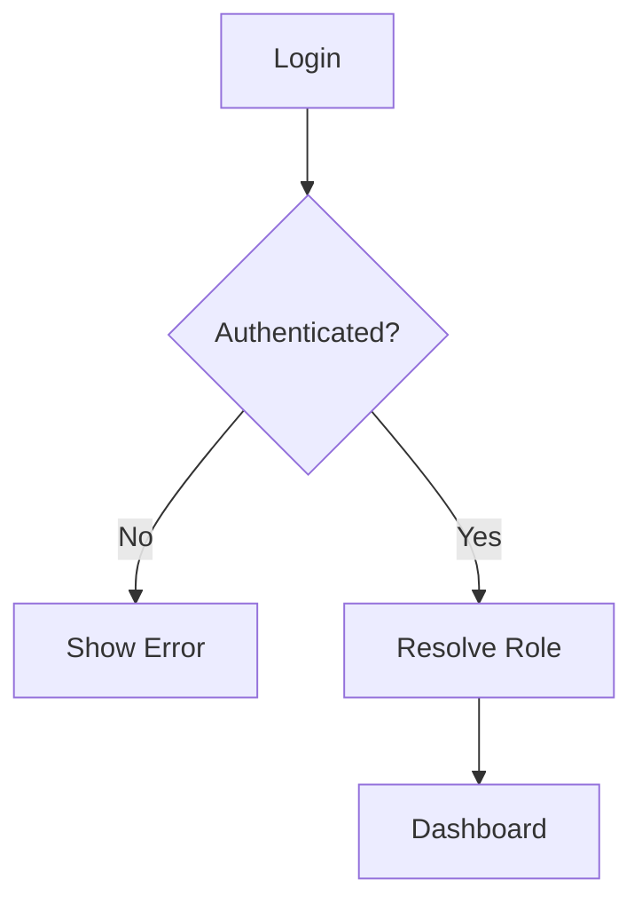

# MahaSkills Application Flow Specification Master Prompt

Use this prompt to create **`appflow.md`** as the authoritative workflow and application-behavior document for MahaSkills:

```text
You are a Principal Product Architect, UX Architect, Systems Designer, Backend Architect, Frontend Architect, and QA Workflow Engineer.

Your task is to CREATE or REWRITE:

appflow.md

for the MahaSkills project.

appflow.md must become the authoritative specification for how users, frontend screens, backend services, databases, asynchronous processes, AI/ML systems, notifications, and state transitions interact throughout the application.

The document must describe the APPLICATION FLOW, not merely list features.

============================================================
1. SOURCE OF TRUTH
============================================================

Before creating appflow.md, inspect the repository and read:

- MahaSkills PRD
- uiux.md
- frontend documentation
- backend documentation
- architecture documentation
- database/schema documentation
- API documentation
- awesome-design.md where relevant
- any existing workflow diagrams
- existing routes
- existing API contracts
- existing authentication/RBAC implementation
- existing Playwright tests
- existing application code

Treat the PRD as the product requirement source of truth.

Treat uiux.md as the UI/UX behavior source of truth.

Treat backend/API/database documentation as the technical implementation source of truth.

Do not invent functionality when the source documents already define it.

When documents conflict:

1. identify the conflict
2. determine which document has authority
3. document the resolution
4. do not silently choose one

============================================================
2. PRIMARY OBJECTIVE
============================================================

Create a single application-flow specification that answers:

“How does MahaSkills actually work from the moment a user enters the system to the moment they complete a business outcome?”

The document must connect:

USER
↓
UI
↓
ROUTE
↓
ACTION
↓
API
↓
BACKEND SERVICE
↓
DATABASE / CACHE / ML
↓
BUSINESS RULE
↓
STATE CHANGE
↓
EVENT
↓
NOTIFICATION
↓
NEXT UI STATE
↓
OUTCOME

The goal is to eliminate disconnected screens and isolated APIs.

Every major feature must have a traceable workflow.

============================================================
3. CORE FLOW MODEL
============================================================

Use this standard representation throughout the document:

TRIGGER
→ PRECONDITIONS
→ USER ACTION
→ FRONTEND STATE
→ API REQUEST
→ BACKEND PROCESSING
→ DATA READ/WRITE
→ BUSINESS RULES
→ ASYNC PROCESSING IF REQUIRED
→ RESULT
→ UI UPDATE
→ NOTIFICATION
→ NEXT POSSIBLE ACTION

For every important workflow document all relevant branches.

============================================================
4. APPLICATION MAP
============================================================

Create a high-level application flow first.

Example structure:

Landing / Entry
      ↓
Authentication
      ↓
Role / Organization Context
      ↓
Role-specific Dashboard
      ↓
Primary Workflows
      ↓
Cross-module Intelligence
      ↓
Actions
      ↓
Outcomes
      ↓
Analytics / Feedback

Then map the major domains:

Authentication
Users / Organizations
Labour Market Intelligence
Skills
Skill Gap
Curriculum
Candidates
Employers
Jobs
Matching
Training
Recommendations
Placements
Reports
Notifications
Administration

Only include modules actually supported by the PRD.

============================================================
5. ROLE-BASED APP FLOWS
============================================================

For every role defined by the PRD, create a separate application-flow section.

At minimum investigate:

- Administrator
- Policymaker
- Institution
- Employer
- Candidate
- Training Provider

Do not assume these exact roles if the PRD defines a different model.

For each role document:

PRIMARY GOALS

TOP TASKS

ENTRY POINT

DEFAULT DASHBOARD

MAIN NAVIGATION

PRIMARY ACTIONS

SECONDARY ACTIONS

PERMITTED DATA

RESTRICTED DATA

WORKFLOWS

NOTIFICATIONS

EXIT / COMPLETION STATES

Example:

Candidate

Login
→ Candidate Dashboard
→ Complete Profile
→ Add Skills
→ Assessment
→ Skill Gap
→ Recommended Training
→ Training Enrollment
→ Job Recommendations
→ Apply
→ Interview
→ Selection
→ Placement
→ Outcome

============================================================
6. USER JOURNEYS
============================================================

Document complete end-to-end user journeys.

Do NOT stop at a page transition.

Every journey should include:

Goal
Actor
Preconditions
Starting point
Steps
Backend interactions
State changes
Possible errors
Success state
Failure state
Next actions

============================================================
7. MANDATORY END-TO-END FLOWS
============================================================

Where supported by the PRD, document workflows such as:

A. Authentication
B. User onboarding
C. Organization onboarding
D. Candidate onboarding
E. Candidate profile completion
F. Candidate skill assessment
G. Skill-gap analysis
H. Training recommendation
I. Course enrollment
J. Course completion
K. Job discovery
L. Job application
M. Employer onboarding
N. Job creation
O. Candidate matching
P. Candidate selection
Q. Placement workflow
R. Placement outcome tracking
S. Labour-market data ingestion
T. Labour-market analytics
U. Demand forecasting
V. Curriculum creation
W. Curriculum skill mapping
X. Curriculum gap analysis
Y. Curriculum recommendation
Z. Curriculum approval
AA. Report generation
AB. Notification lifecycle
AC. Administrative workflows

Do not force workflows that are not required by the PRD.

============================================================
8. AUTHENTICATION FLOW
============================================================

Document:

Application Entry
→ Authentication
→ Credential validation
→ Token/session creation
→ User lookup
→ Organization context
→ Role/permission resolution
→ Dashboard routing

Also document:

Invalid credentials
Expired session
Expired token
Refresh token
Logout
Account disabled
Insufficient permissions
Unauthorized deep link

Include frontend and backend behavior.

============================================================
9. AUTHORIZATION FLOW
============================================================

Do not describe authorization as simply:

“hide the button.”

Document:

UI permission check
→ route guard
→ API authorization
→ service-level authorization
→ data-level authorization

Example:

Employer A requests Candidate B

↓
Authenticate user

↓
Resolve organization

↓
Check employer permissions

↓
Check candidate visibility rules

↓
Allow / deny

The backend remains authoritative.

============================================================
10. NAVIGATION FLOW
============================================================

Map all important application navigation.

For example:

Dashboard
→ Labour Market
→ Skill Demand
→ Skill Detail
→ Occupation
→ Geography
→ Employer Demand

Or:

Dashboard
→ Candidate
→ Candidate Detail
→ Skill Profile
→ Gap Analysis
→ Training Recommendation
→ Course
→ Enrollment

Define:

- route
- entry points
- breadcrumb
- previous context
- next logical action
- deep-link behavior

A user should never get lost after drill-down.

============================================================
11. PAGE-LEVEL FLOW
============================================================

For each major screen define:

PAGE PURPOSE

ENTRY CONDITIONS

DATA REQUIRED

PRIMARY CTA

SECONDARY ACTIONS

USER ACTIONS

API CALLS

STATE CHANGES

NAVIGATION

SUCCESS STATE

ERROR STATE

EMPTY STATE

LOADING STATE

NEXT ACTION

Example:

Candidate Detail

Entry:
Candidates list
Search result
Job matching
Notification

Data:
Candidate
Skills
Education
Experience
Applications
Recommendations

Actions:
Edit
View skill gap
View recommendations
Apply
Contact where permitted

Output:
Updated candidate profile
Audit event
Notification if required

============================================================
12. FRONTEND STATE MACHINES
============================================================

Where workflows have meaningful states, define explicit state machines.

Example:

JOB:

DRAFT
→ UNDER_REVIEW
→ APPROVED
→ PUBLISHED
→ CLOSED
→ ARCHIVED

Candidate Application:

DRAFT
→ SUBMITTED
→ SCREENING
→ INTERVIEW
→ SELECTED
→ REJECTED
→ WITHDRAWN

Training:

AVAILABLE
→ RECOMMENDED
→ ENROLLED
→ IN_PROGRESS
→ COMPLETED
→ OUTCOME_TRACKED

Use only states supported by the actual PRD.

For every state define:

Allowed transitions
Forbidden transitions
Actor
Trigger
API
Side effects
Notification

============================================================
13. BUSINESS WORKFLOW RULES
============================================================

Document rules explicitly.

Example:

A job cannot be published if required skills are missing.

A curriculum cannot be approved without required review.

A placement cannot be completed without required candidate/employer data.

These are examples only.

Derive actual rules from the PRD/backend.

Never leave critical business logic implicit.

============================================================
14. DATA FLOW
============================================================

For every major workflow show where data travels.

Example:

External Labour Dataset
→ Ingestion
→ Validation
→ Normalization
→ Skill Mapping
→ Deduplication
→ PostgreSQL
→ Aggregation
→ Analytics
→ Dashboard

Candidate:

Candidate Input
→ Validation
→ Candidate Service
→ PostgreSQL
→ Skill Engine
→ Gap Analysis
→ Recommendation Engine
→ Candidate Dashboard

============================================================
15. API FLOW
============================================================

For important user actions specify:

Frontend action
→ HTTP method
→ endpoint
→ request
→ authorization
→ backend service
→ database/ML calls
→ response
→ frontend state update

Example:

User clicks “Analyze Skill Gap”

POST /api/v1/candidates/{id}/skill-gap

↓
Authenticate

↓
Authorize

↓
Fetch candidate skills

↓
Fetch target occupation requirements

↓
Calculate gap

↓
Persist result if required

↓
Return analysis

↓
UI renders gap visualization

Do not invent endpoints that contradict API documentation.

============================================================
16. DATABASE FLOW
============================================================

Document important persistence operations.

Show:

Entity creation
Entity update
Entity relationships
Transactions
Audit logs
Events

Example:

Job Created

Job
+
JobSkillRequirements
+
AuditLog

all committed atomically when required.

============================================================
17. ASYNC FLOW
============================================================

Identify workflows that should not block the user request.

Examples may include:

Large data ingestion
Report generation
Forecast generation
Bulk recommendation generation
Large candidate matching operations
Notifications
Analytics recomputation

Use:

REQUEST
→ JOB CREATED
→ QUEUED
→ PROCESSING
→ COMPLETED / FAILED
→ NOTIFICATION
→ RESULT AVAILABLE

Document:

- job status
- retry behavior
- failure behavior
- idempotency
- user-visible status

============================================================
18. ML / AI FLOW
============================================================

Document all AI/ML-assisted workflows explicitly.

Example:

Candidate Profile
→ Skill Extraction
→ Normalization
→ Skill Taxonomy Mapping
→ Match Engine
→ Score
→ Explanation
→ Recommendation
→ User Feedback

Another example:

Historical Labour Data
→ Feature Preparation
→ Forecast Model
→ Forecast Result
→ Validation
→ Persisted Forecast
→ Dashboard

Every AI flow must identify:

Input
Model/service
Model version where relevant
Output
Confidence/uncertainty where applicable
Fallback
Failure mode
Human interpretation

Never make AI a black box in the application flow.

============================================================
19. MATCHING FLOW
============================================================

Document the complete candidate ↔ job matching lifecycle.

Example:

Job Requirements
+
Candidate Profile

↓
Eligibility Filtering

↓
Feature Extraction

↓
Skill Comparison

↓
Experience Comparison

↓
Education Comparison

↓
Other permitted factors

↓
Match Score

↓
Factor Explanation

↓
Candidate/Employer Recommendation

↓
User Action

The exact factors must come from the backend design/PRD.

============================================================
20. RECOMMENDATION FLOW
============================================================

Every recommendation must follow:

DATA
→ ANALYSIS
→ RECOMMENDATION
→ EXPLANATION
→ USER ACTION
→ FEEDBACK
→ OUTCOME

Document:

Who receives it
Why it was generated
What data triggered it
What the user can do
What happens after clicking
Whether it expires
Whether it can be dismissed
Whether feedback is stored

============================================================
21. SKILL-GAP FLOW
============================================================

Document:

Target Requirement
↓
Current Capability
↓
Comparison
↓
Missing Skills
↓
Priority
↓
Recommendation
↓
Training / Curriculum / Job Action
↓
Outcome

Show how the result connects to other modules.

Skill-gap analysis should never become a dead-end screen.

============================================================
22. CURRICULUM FLOW
============================================================

Document:

Curriculum
→ Skill Mapping
→ Industry Requirements
→ Gap Detection
→ Recommendation
→ Review
→ Approval
→ Publication / Adoption
→ Outcome Tracking

Include:

- who can perform each step
- required conditions
- state transitions
- notifications
- audit events

============================================================
23. TRAINING FLOW
============================================================

Document:

Candidate Skill Gap
→ Training Recommendation
→ Course Details
→ Eligibility
→ Enrollment
→ Progress
→ Completion
→ Skill Update
→ Placement Recommendation
→ Outcome

Show where training results modify the candidate state.

============================================================
24. PLACEMENT FLOW
============================================================

Document:

Candidate
→ Job Match
→ Application
→ Screening
→ Interview
→ Selection
→ Placement
→ Outcome
→ Analytics

Define what each state means.

Document who can transition each state.

============================================================
25. NOTIFICATION FLOW
============================================================

Create a common notification model.

Example:

Business Event
→ Notification Rule
→ Notification Created
→ Delivery
→ Read/Unread
→ Action
→ Optional Outcome

Define:

In-app notification
Email where applicable
Other channels only if required by PRD

Avoid sending duplicate notifications during retries.

============================================================
26. ERROR FLOWS
============================================================

Do not document only the happy path.

For every critical workflow include:

Validation failure
Authentication failure
Authorization failure
Resource not found
Conflict
Network failure
Backend failure
External service failure
ML failure
Database failure
Timeout
Partial completion

Example:

Generate Forecast
→ ML Service unavailable

System:
1. record failure
2. retry where appropriate
3. expose status
4. preserve previous valid forecast
5. notify user if required

Do not silently fail.

============================================================
27. EMPTY STATES
============================================================

Document meaningful empty-state behavior.

Examples:

No candidates
No jobs
No labour data
No skill gaps
No recommendations
No training history
No placements

Each should specify:

Explanation
Relevant action
Alternative navigation

============================================================
28. ROLE + DATA-SCOPE FLOW
============================================================

Map not only what users can DO, but what data they can SEE.

Example:

Global Administrator
→ cross-organization data

Institution
→ institution-scoped data

Employer
→ own organization + permitted candidate/job data

Candidate
→ own profile + permitted opportunities

Use the actual PRD authorization model.

============================================================
29. MULTI-ORGANIZATION FLOW
============================================================

Where organizations exist, document:

Login
→ organization resolution
→ organization context
→ permission resolution
→ scoped navigation
→ scoped queries
→ scoped actions

Changing organization context must clearly change accessible data.

============================================================
30. SEARCH FLOW
============================================================

Define global search:

User input
→ debounce
→ search API
→ entity categories
→ result ranking
→ result display
→ selected entity
→ preserve context

Document filters and deep links.

============================================================
31. FILTER FLOW
============================================================

Filters must have predictable behavior.

Example:

Select:
Sector = IT
District = Pune
Date = 2026

↓

Frontend URL/state update

↓

API request

↓

Server-side filtering

↓

Dashboard/table/chart refresh

Document:

- whether filters persist
- whether URLs are shareable
- reset behavior
- default filters

============================================================
32. REPORT FLOW
============================================================

Example:

User selects report
→ filters
→ generate report
→ request validation
→ asynchronous job
→ processing
→ completed
→ notification
→ download

Include failure/retry behavior.

============================================================
33. AUDIT FLOW
============================================================

For important state-changing actions:

User action
→ authorization
→ business operation
→ state change
→ audit event

Document what must be recorded.

============================================================
34. CROSS-MODULE FLOWS
============================================================

This section is critical.

Map how modules affect each other.

Examples:

Labour Market
→ Skills
→ Skill Gap
→ Training
→ Candidate
→ Placement

or:

Employer Demand
→ Job Requirements
→ Matching
→ Candidate Recommendation
→ Application
→ Placement
→ Outcome
→ Labour Analytics

or:

Industry Demand
→ Curriculum Gap
→ Curriculum Recommendation
→ Institutional Change
→ Student Skill Supply
→ Labour Market Outcome

The system should behave like one connected platform.

============================================================
35. FEEDBACK LOOPS
============================================================

MahaSkills should not be a one-way data system.

Document feedback loops such as:

Placement Outcomes
→ Skill Demand Analysis

Training Outcomes
→ Recommendation Quality

Employer Hiring Outcomes
→ Matching Quality

Curriculum Changes
→ Candidate Skill Supply

User Feedback
→ Recommendation Improvement

Clearly distinguish:

existing implemented feedback loops
vs
future/optional feedback loops

============================================================
36. ROUTE → FEATURE → API → DOMAIN MAP
============================================================

Create a master matrix:

| Route | Role | Feature | User Action | API | Backend Domain | Data | Result |
|------|------|---------|-------------|-----|----------------|------|--------|

Every important frontend route should connect to a backend capability.

Identify orphan routes.

Identify APIs with no frontend consumer where appropriate.

============================================================
37. FEATURE → FLOW COVERAGE MATRIX
============================================================

Create:

| Requirement | User Flow | Frontend | API | Backend | DB | Test |
|-------------|------------|----------|-----|---------|----|------|

Use this as a completeness audit.

Anything missing must be marked.

============================================================
38. PLAYWRIGHT FLOW TESTING
============================================================

Use Playwright to verify actual application flows.

Define tests for:

- navigation
- authentication
- forms
- filters
- tables
- dialogs
- matching
- recommendations
- workflows
- state transitions
- error states

Do not only test whether a page loads.

Test:

USER INTENT
→ ACTION
→ SYSTEM RESPONSE
→ NEXT STATE

Examples:

Candidate:
Login
→ Profile
→ Add skill
→ Save
→ Skill appears
→ Gap recalculates

Employer:
Login
→ Create job
→ Add skills
→ Publish
→ Job becomes visible
→ Matching becomes available

============================================================
39. APP FLOW DIAGRAMS
============================================================

Use Mermaid wherever useful.

Example:



Use Mermaid for:

* authentication
* major user journeys
* state machines
* data pipelines
* AI/ML flows
* cross-module flows
* async jobs

Keep diagrams readable.

============================================================
40. FLOW DOCUMENTATION FORMAT
=============================

Every major flow should use this format:

# Flow: <Name>

## Objective

## Actor

## Preconditions

## Entry Points

## Main Flow

1.
2.
3.
4.

## Frontend Flow

## API Flow

## Backend Flow

## Database Flow

## Business Rules

## State Transitions

## Events

## Notifications

## Success State

## Error States

## Empty States

## Retry Behavior

## Security / Permissions

## Audit Requirements

## Playwright Test Cases

## Next Possible Actions

============================================================
41. FLOW DESIGN RULES
=====================

Apply these rules universally:

1. No screen should be an orphan.

2. No critical API should be disconnected from a user workflow.

3. No major action should lack success/error behavior.

4. No state transition should happen without authorization validation.

5. No AI result should be presented without appropriate explanation.

6. No async operation should appear synchronous if it can take significant time.

7. No destructive action should lack confirmation where appropriate.

8. No business-critical state should change only in frontend state.

9. No workflow should depend on hidden assumptions.

10. Every important workflow should be testable.

============================================================
42. UX ↔ BACKEND CONTRACT
=========================

Make the contract between uiux.md and appflow.md explicit.

uiux.md defines:

HOW THE EXPERIENCE SHOULD BE PRESENTED.

appflow.md defines:

HOW THE EXPERIENCE ACTUALLY MOVES THROUGH THE SYSTEM.

PRD defines:

WHAT THE PRODUCT MUST DO.

Backend documentation defines:

HOW THE SYSTEM IMPLEMENTS IT.

These documents must remain consistent.

============================================================
43. PERFORMANCE IN FLOWS
========================

Identify slow operations.

For each slow operation define whether it should be:

* synchronous
* asynchronous
* cached
* paginated
* progressively loaded

Do not make the user wait synchronously for expensive analytics if the operation can reasonably be asynchronous.

============================================================
44. SECURITY IN FLOWS
=====================

For each important flow document:

* authentication requirement
* authorization requirement
* organization scope
* data visibility
* sensitive information
* audit requirement

Do not expose sensitive information simply because the UI has a route to it.

============================================================
45. OBSERVABILITY IN FLOWS
==========================

Critical workflows should have:

* correlation ID
* useful logs
* metrics
* audit events
* failure visibility

Make failures diagnosable.

============================================================
46. DEFINITION OF DONE
======================

A workflow is complete only when:

[ ] User goal is defined
[ ] Preconditions defined
[ ] Entry point defined
[ ] Happy path defined
[ ] Alternative paths defined
[ ] Error states defined
[ ] Empty states defined
[ ] Frontend behavior defined
[ ] API defined
[ ] Backend behavior defined
[ ] Database changes defined
[ ] Authorization defined
[ ] State transitions defined
[ ] Notifications defined
[ ] Audit defined
[ ] Async behavior defined where needed
[ ] Playwright test defined
[ ] End state defined
[ ] Next action defined

============================================================
47. FINAL ARCHITECTURAL REVIEW
==============================

Before completing appflow.md, review it as:

1. Principal Product Architect
2. UX Architect
3. Backend Architect
4. Frontend Architect
5. QA Engineer
6. Security Engineer
7. AI/ML Systems Engineer

Ask:

* Are the workflows actually end-to-end?
* Are users ever trapped on dead-end screens?
* Are APIs connected to actual user actions?
* Are state transitions explicit?
* Can invalid transitions occur?
* Are roles and organization boundaries enforced?
* Are async processes represented honestly?
* Are AI outputs explainable?
* Are errors handled?
* Are notifications connected to real events?
* Are cross-module dependencies documented?
* Can Playwright test the workflows?
* Can a developer implement a feature from this document without guessing?

Fix gaps.

============================================================
48. REQUIRED FINAL DOCUMENT STRUCTURE
=====================================

The final appflow.md must contain:

# MahaSkills Application Flow Specification

## 1. Purpose

## 2. Source-of-Truth Hierarchy

## 3. System-Level Application Flow

## 4. User Roles

## 5. Role-Based Application Flows

## 6. Authentication Flow

## 7. Authorization Flow

## 8. Navigation Flow

## 9. Route Map

## 10. Page-Level Flows

## 11. User Journeys

## 12. State Machines

## 13. Business Rules

## 14. Data Flows

## 15. API Flows

## 16. Database Flows

## 17. Async Processing

## 18. AI/ML Flows

## 19. Matching Flow

## 20. Recommendation Flow

## 21. Skill-Gap Flow

## 22. Curriculum Flow

## 23. Training Flow

## 24. Placement Flow

## 25. Notification Flow

## 26. Search Flow

## 27. Filter Flow

## 28. Reporting Flow

## 29. Audit Flow

## 30. Cross-Module Flows

## 31. Feedback Loops

## 32. Error Flows

## 33. Security Flows

## 34. Observability

## 35. Playwright Flow Tests

## 36. Requirement Coverage Matrix

## 37. Route → API → Domain Matrix

## 38. Definition of Done

## 39. Open Questions / Assumptions

============================================================
49. IMPORTANT OUTPUT RULE
=========================

Create/update ONLY:

appflow.md

Do not modify:

* frontend code
* backend code
* database
* tests
* uiux.md

unless explicitly requested.

The purpose of this task is to establish the authoritative application-flow specification first.

Do not write a superficial page-to-page sitemap.

Build a true SYSTEM FLOW SPECIFICATION.

The final document should allow:

PRD
↓
UI/UX
↓
APP FLOW
↓
FRONTEND
↓
API
↓
BACKEND
↓
DATABASE / ML
↓
TESTING

to form one coherent implementation chain.
```

### The key distinction

For your MahaSkills project, I would keep the three documents deliberately separate:

**`PRD.md`** → **What the product must do**

**`uiux.md`** → **How the experience should look and behave**

**`appflow.md`** → **How the user, frontend, API, backend, database, ML, events, and state changes move through the system**

That makes `appflow.md` the bridge between the product specification and the actual frontend/backend implementation.
