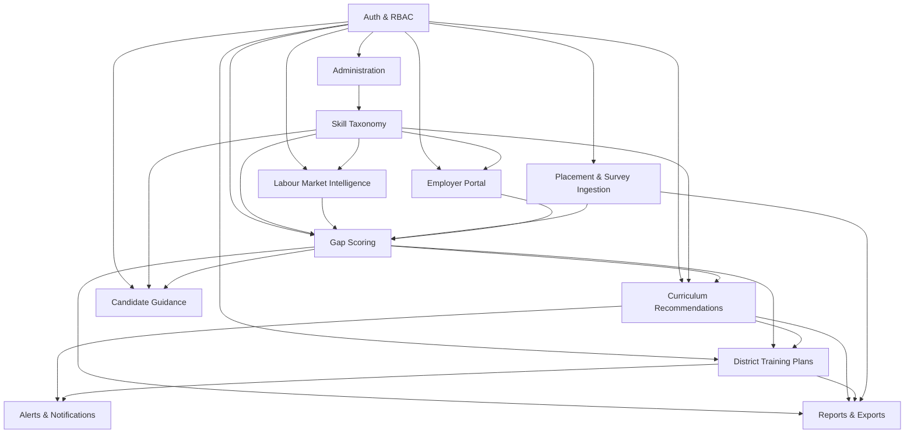
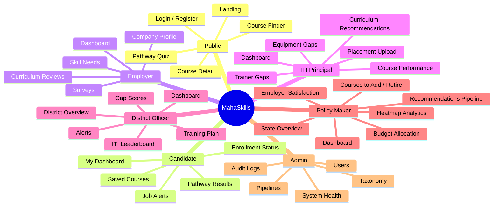

# MahaSkills — Frontend Architecture & Product Design Specification

**Platform:** MahaSkills — Labour-Market Intelligence & Curriculum Alignment Platform
**Owner:** Government of Maharashtra — DSEEI / Maharashtra State Innovation Society (MSInS)
**Problem Statement ID:** 26134
**Source of truth:** `MahaSkills_PRD.md` v1.0 (July 2025), `ARCHITECTURE.md`, `DATABASE_SCHEMA.md`, `API_SPECIFICATION.md`, `UI_UX_DESIGN.md`, `PROJECT_BREAKDOWN.md`, `DEPLOYMENT.md`
**Document status:** Pre-implementation architecture. Deliverables **A–G** as required before writing frontend code.
**Version:** 1.0

---

## 0. How to read this document

This is the artefact the frontend prompt requires *before* any React file is written:

| § | Deliverable | Purpose |
|:---|:---|:---|
| **A** | PRD Feature Map | Everything extracted from the PRD: roles, modules, entities, workflows, KPIs, dashboards, forms, tables, charts, notifications, recommendations, search, API and auth requirements — plus the module dependency graph |
| **B** | Role × Permission Matrix | The RBAC model the frontend enforces at route, component and action level |
| **C** | Information Architecture | Navigation trees per role, global shell elements, breadcrumb and search scope |
| **D** | Page / Route Map | Every route, its guard, layout, data dependencies and delivery phase |
| **E** | Component Architecture | Folder structure, design tokens, component inventory, composition and state-ownership rules |
| **F** | Data / API Model Assumptions | Service layer, query-key design, TypeScript entity model, endpoint→hook map, mock strategy, error taxonomy, URL state |
| **G** | Implementation Plan | Vertical slices, quality gates, testing, performance, accessibility, i18n, risks |
| **H** | Assumptions & Open Questions | The register of every decision made in the absence of a PRD answer, and every question that needs a human |

**Read §1 first.** It resolves a material conflict between the frontend brief and the PRD, and that resolution shapes every section after it.

---

## 1. Scope reconciliation — where the brief and the PRD disagree

The frontend brief is written in the vocabulary of a generic labour-market/recruitment platform. The PRD describes something narrower and, in places, deliberately different: an **intelligence and curriculum-governance platform**, not an applicant tracking system or a job board.

The brief itself resolves this: *"Only include modules that actually exist in the PRD"*, *"Use the PRD as the authoritative role definition"*, and *"Do not silently invent major modules."* So the PRD wins. Below is every place the two diverge, and the decision taken.

| # | Brief asks for | PRD reality | Decision |
|:---|:---|:---|:---|
| **1.1** | §12 Employer experience: *job creation, job requirements, recruitment pipeline* | Employers **do not post jobs**. Job postings are *ingested* nightly from Naukri (licensed API), LinkedIn, Indeed (RSS) and NCS Open API. The employer's authoring surface is the **Skill Needs form** (sector → skills → headcount, urgency, location) | **Build Skill Needs, not job posting.** Employer's demand signal is a structured skill need against the taxonomy. Job postings are read-only market data, never employer-authored |
| **1.2** | §11 Candidate matching: *candidate ↔ job match score, employers compare candidates* | The PRD's only matching engine is the **Pathway Quiz**: candidate → **course** recommendations with `match_score` and a `reason` string. There is no candidate-to-job matcher and no employer-facing candidate directory | **Build candidate ↔ course matching** with the full explainability UX the brief demands. The `MatchScoreBreakdown` component is written generically so a future candidate↔job variant reuses it unchanged |
| **1.3** | §12/§15 Employers browse and compare candidates; global search across *candidates* | PRD §10 NFR: *"Candidate PII anonymised; comply with DPDP 2023."* Placement CSV uploads carry an **anonymised candidate ID**. The roles table does list *"rate candidates"* for employers — this contradicts anonymisation | **No candidate directory, no candidate search, no employer-facing candidate profiles in v1.** Global search excludes all candidate entities. Employer "rate candidates" is flagged as **OQ-03** — most plausibly means *rate the candidates hired from a given course/institute*, i.e. an institute-level rating, which is what the Employer portal already exposes |
| **1.4** | §14 Placement management pipeline: `Identified → Recommended → Applied → Interviewed → Selected → Placed → Outcome tracked` | The PRD has **no applicant tracking**. Placement data is **retrospective**: ITI principals upload a monthly CSV (`candidate_id`, `course_id`, `batch_year`, `placed Y/N`, `employer_name`, `role`, `salary`, `months_to_placement`) | **Replace the ATS pipeline with Placement Outcomes analytics** — upload → validation → ingestion → gap-score recalculation, then cohort outcome analysis. The one genuine pipeline in the PRD is the **curriculum recommendation workflow** (Draft → SSC Review → DSEEI Approval → Published), and it gets the full stepper/evidence/audit treatment the brief asks for |
| **1.5** | §13 Training & upskilling: *enrollments, completion tracking, outcomes* | Enrollment is **handed off to Mahaswayam via SSO**; the platform only *checks* `enrollment-status`. Completion is not tracked in-platform | **Build course discovery, handoff and status check.** Show the Skill Gap → Recommended Training → Enrollment → Placement Outcome chain as an **evidence narrative** built from aggregate data, not as a per-candidate tracker |
| **1.6** | §7 Labour market intelligence incl. **future demand forecasts** | Forecasting (ARIMA/Prophet, 12-month horizon) is **Phase 4** | Build the forecast surfaces behind a **feature flag** (`features.forecasting`), with a designed "available from Phase 4" empty state. No fabricated forecast data |
| **1.7** | Brief's stack: shadcn/ui + TanStack Query + React Hook Form + Zod. `PROJECT_BREAKDOWN.md`: Zustand + Axios, no query library | Both name React 18, TypeScript, Vite, Tailwind, Recharts, React Router | **Brief's stack wins** (confirmed). `react-i18next` is added because the PRD mandates trilingual UI, and **Zustand** is retained for *UI-only* state (sidebar, theme, language, comparison tray). Server state is TanStack Query's exclusively |
| **1.8** | "Salary/CTC where specified by the PRD" | Salary exists in **placement records** (`salary`) and **job postings**, and is surfaced to candidates as **median salary post-placement** | Salary is shown as **aggregates only** (median, range, trend). Never an individual's salary, never joined to an identifiable person |

### 1.9 Two numbers that disagree between documents

| Field | PRD | DB seed | Resolution |
|:---|:---|:---|:---|
| Sector Skill Councils | "36 Sector Skill Councils" (governance §8) | `sectors (33)` | These are different things: **33 sectors** in the taxonomy, **36 SSCs** as governing bodies. The frontend must not treat `sector_id` and `ssc_id` as the same key. Flagged **OQ-01** |
| Districts | 36 (Maharashtra) | `districts (36)` | Consistent. 36 is the fixed cardinality the heatmap and every district filter is designed around |
| Seed job roles | "~2,000 NSQF/SSC published job roles" | `~2,000` | Consistent. Taxonomy tree must virtualise at this scale |
| NSQF levels | 1–10 | 1–10 | Consistent. Rendered as a discrete filter, never a free-text field |

---
## A. PRD Feature Map

### A.1 User roles

Six roles, from the PRD §3 roles table plus the Admin/Data Steward.

| Role key | Display name | Access level | Primary jobs-to-be-done | Phase |
|:---|:---|:---|:---|:---|
| `POLICY_MAKER` | Policy Maker (DSEEI) | State-wide read + approve | View state dashboards, approve curriculum changes, allocate budgets | 1 |
| `DISTRICT_OFFICER` | District Officer | Single district: read + plan | Generate district training plans, assign training targets, action alerts | 1 → 3 |
| `ITI_PRINCIPAL` | ITI / Training Principal | Own institute: read + upload | Upload placement data, view curriculum recommendations, respond to reviews | 1 → 2 |
| `EMPLOYER` | Employer / HR | Employer portal only | Post skill needs, validate draft curricula, complete micro-surveys | 2 |
| `CANDIDATE` | Candidate | Public (authenticated) | Browse courses, see placement stats, get a personalised pathway | 3 |
| `ADMIN` | Admin / Data Steward | Full system | Manage taxonomy, configure pipelines, audit logs, user management | 1 |
| `SSC_REVIEWER` | SSC Reviewer | Recommendation review only | Review evidence packages, approve/reject/request changes | 2 |

> `SSC_REVIEWER` does not appear in the PRD roles table but is required by `API_SPECIFICATION.md` §6 (`POST /recommendations/{id}/review`, role: *SSC Reviewer*) and by the governance model (SSC Technical Committee review precedes DSEEI Joint Secretary approval). Treated as a first-class role. Flagged **OQ-02**.

**Anonymous / public**: Landing page, Course Finder, Course Detail and Pathway Quiz are reachable without login (`GET /candidates/courses` is `Any (Public/Candidate)`). Saving a course or checking enrollment status forces authentication.

### A.2 Modules

Only modules with PRD backing. Each maps to a feature folder in §E.

| Module | PRD source | Consumers | Phase |
|:---|:---|:---|:---|
| **Auth & Session** | §4.2 Keycloak OIDC, RBAC | All | 1 |
| **Labour Market Intelligence** | §6.1 data ingestion; §7 dashboards | Policy Maker, District Officer, Admin | 1 |
| **Skill Taxonomy** | §6.2; `/taxonomy/*` | Admin (write), all (read) | 1 |
| **Gap Scoring & Analysis** | §6.3; `/gap-scores/*` | Policy Maker, District Officer | 1 → 2 |
| **Curriculum Recommendations** | §6.4; `/recommendations/*` | Policy Maker, SSC Reviewer, ITI Principal, Employer | 2 |
| **Employer Portal** | §6 employer portal MVP; `/employers/*` | Employer | 2 |
| **Placement Data & Outcomes** | §6.1; `/ingestion/placements/*` | ITI Principal, District Officer, Policy Maker | 1 |
| **District Training Plans** | §6.5; `/district-plans/*` | District Officer, Policy Maker, ITI Principal | 3 |
| **Candidate Guidance** | §6.6; `/candidates/*` | Candidate, Public | 3 |
| **Alerts & Notifications** | Phase 3 alert system | District Officer, ITI Principal, Policy Maker | 3 |
| **Reports & Exports** | §7; export actions on every dashboard | Policy Maker, District Officer, ITI Principal | 2 → 4 |
| **Administration** | §6.2, `/admin/*` | Admin | 1 |
| **Forecasting** | Phase 4 predictive demand | Policy Maker, District Officer | 4 (flagged) |

### A.3 Core entities

Derived from `DATABASE_SCHEMA.md` and the API response schemas. These become the TypeScript domain model in §F.3.

| Entity | Key fields (frontend-relevant) | Notes |
|:---|:---|:---|
| `District` | `id`, `name`, `name_mr`, `region` | Fixed set of 36. Drives every map and filter |
| `Sector` | `id`, `name`, `ssc_id?` | 33 sectors. Not the same as SSC (OQ-01) |
| `Skill` | `id`, `name`, `sector_id`, `nsqf_level`, `aliases[]`, `is_emerging` | ~2,000 seeded + emerging terms |
| `JobRole` | `id`, `name`, `sector_id`, `nsqf_level`, `ssc_source` | NSQF/SSC published roles |
| `JobPosting` | `title`, `skills[]`, `location`, `salary`, `posted_at`, `source` | Ingested, read-only, aggregate display only |
| `Course` | `id`, `name`, `institute`, `sector`, `nsqf_level`, `duration`, `fees`, `median_salary`, `placement_rate`, `time_to_placement`, `demand_trend_badge`, `top_hiring_employers[]` | The candidate-facing card |
| `Institute` | `id`, `name`, `district_id`, `type` (ITI/polytechnic/private) | Leaderboard subject |
| `PlacementRecord` | `candidate_id` (anonymised), `course_id`, `batch_year`, `placed`, `employer_name`, `role`, `salary`, `months_to_placement` | **Never rendered per-row to non-owning institutes** |
| `PlacementUpload` | `upload_id`, `status`, `rows_processed`, `errors[]`, `uploaded_at` | Drives the upload history table and error modal |
| `GapScore` | `district_id`, `skill_id`, `skill_name`, `sector`, `nsqf_level`, `score` (0–100), `demand_count`, `supply_count`, `trend` | The platform's central number |
| `Recommendation` | `id`, `type`, `target_course_id`, `skill`, `status`, `evidence`, `created_at`, `workflow[]`, `audit[]` | `type ∈ add_module \| update_unit \| develop_qualification \| retire_course` |
| `EvidencePackage` | `job_count_trend[]`, `top_employers[]`, `comparable_courses[]`, `estimated_uplift`, `affected_districts[]` | Non-negotiable: every recommendation is explainable |
| `DistrictPlan` | `id`, `district_id`, `fiscal_year`, `status` (draft/published), `courses[]`, `resource_gaps`, `budget_scoring` | Editable while draft, locked when published |
| `SkillNeed` | `id`, `employer_id`, `skill_id`, `headcount`, `urgency`, `location`, `created_at` | Employer's demand signal |
| `Employer` | `id`, `name`, `gstin`, `sector`, `verified`, `profile_completeness` | GSTIN-verified |
| `Survey` / `SurveyResponse` | `id`, `questions[]` (5–8), `trigger`, `sector`, `district` | Triggered by gap-score spikes |
| `PathwayResult` | `course_id`, `course_name`, `match_score`, `reason` | Must always carry `reason` |
| `Alert` | `id`, `severity`, `type`, `entity_ref`, `read_at`, `created_at` | Severity drives colour, never colour alone |
| `AuditLogEntry` | `user_id`, `action`, `entity_type`, `entity_id`, `before`, `after`, `at` | Admin + inline on recommendations |
| `PipelineRun` | `dag_name`, `last_run`, `status`, `next_run` | Admin system-health |

### A.4 Workflows

The five PRD flows, each owned by a route sequence in §D.

1. **Candidate course discovery** — Landing → (Browse → Course Search → Filters) or (Pathway Quiz → 5 inputs → personalised results) → Course Detail → {Compare ≤3 | Save | Enrol via Mahaswayam SSO handoff}.
2. **Placement data upload** — ITI Principal login → Dashboard → Download CSV template → Upload → **system validation** → invalid: row-level error modal → fix → re-upload; valid: ingest → **triggers gap-score recalculation** → success confirmation.
3. **Curriculum recommendation review** — System generates draft → notify SSC Reviewer → reviewer opens evidence package → {Request changes → back to draft | Reject | Approve} → notify DSEEI approver → {Approve → **Published** → alert ITI principals | Reject}.
4. **Employer registration & skill needs** — Landing → Register → GSTIN input → system verification → profile setup → dashboard → Post Skill Needs (3-step stepper: Sector → Skills → Details) → submit → **gap scores update**. Async: gap-score spike in that sector → system triggers micro-survey → employer completes.
5. **District officer planning** — Login → dashboard → review gap scores → open Training Plan Generator → system creates draft → review course recommendations → adjust target seats → review resource gaps → review budget scoring → Publish.

**Frontend consequence:** flows 2, 3, 4 and 5 all mutate server state that other screens read. Every one of them must invalidate the correct TanStack Query keys — see §F.5. A placement upload that does not visibly refresh the gap dashboard is a bug, not a nicety.

### A.5 KPIs and metrics

Every KPI card must answer four questions (brief §6): *what does this number mean, what changed, why does it matter, what should I do?* The `KpiCard` contract in §E.4 enforces this by making `context` and `action` required props.

| KPI | Current | Target (Y2) | Owner surface |
|:---|:---|:---|:---|
| Placement rate (ITI avg) | 38% | 62% | Policy Maker + District Officer dashboards |
| Employer satisfaction score | no baseline | ≥ 3.8 | Policy Maker dashboard (12-mo trend) |
| Curriculum revision cycle time | 3–5 years | ≤ 12 months | Recommendations module |
| Skill gap closure rate | not measured | 40% of gaps closed/yr | Gap analysis |
| Trainer upskilling coverage | ~20% | per PRD target ⚠ **OQ-04** (value illegible in source) | District plans |
| Equipment gap flagging | manual / ad-hoc | automated alerts | District plans + ITI dashboard |
| Candidate career clarity score | not measured | ≥ 4/5 (survey) | Candidate module |

**Derived metrics the UI computes or displays:** gap score (0–100, per district × skill × NSQF × sector), oversupply flag, recommendation pipeline counts by status, median salary post-placement, time-to-placement (p50), ITI performance vs district average (±%), budget priority score, profile completeness.

**Business rules that must be encoded in the frontend, not just the backend:**

- **Gap score badge:** `> 60` red, `40–60` amber, `< 40` green. One constant, one component, used everywhere.
- **Oversupply flag:** placement rate `< 25%` **and** demand score below the 20th percentile, for 2+ consecutive quarters. The UI shows the flag *and* its reason.
- **Recommendation trigger:** gap score `> 60` sustained 3+ weeks with no covering course. Surfaced in the evidence package so reviewers see why the system spoke up.

### A.6 Dashboards

Role-specific, never one universal dashboard (brief §6).

| Dashboard | Layout | Contents |
|:---|:---|:---|
| **Policy Maker** | KPI row → 60/40 split (map \| lists+charts) → 3-up trends | KPIs: state placement rate vs target, active gap alerts, recommendations in pipeline, employer satisfaction. Map: district gap heatmap. Charts: top 10 skills to add (horizontal bar), courses to retire (table), employer satisfaction line (12mo), recommendation funnel, budget priority treemap. Global filters: time period, sector, district, NSQF |
| **District Officer** | Tabbed: Overview \| Gap Scores \| Training Plan \| ITI Leaderboard \| Alerts | Header mini-stats (placement rate, avg gap score, ITI count, active plans). Sector gap bar chart, top 5 demanded skills, 12-mo placement trend, gap score table (skill, sector, NSQF, gap badge, demand, supply, trend), ITI leaderboard, alert inbox |
| **ITI Principal** | Task-oriented rows | Summary stats (placements, students, courses). Placement upload card (drag-drop + template download + last-3-uploads table). Course performance table with a **vs district** delta column. Trainer gaps table + equipment gaps accordion per course |
| **Employer** | Sidebar + 3 summary cards | Submitted needs, pending curriculum reviews, survey requests. Entry points to Skill Needs stepper and review queue |
| **Candidate** | Mobile-first | Saved courses, pathway results, enrollment status, job alerts |
| **Admin** | Technical admin | Users, taxonomy tree, pipeline monitoring, audit logs, system health (DB / Redis / Airflow workers, recent DAG runs) |

### A.7 Forms

| Form | Fields | Validation notes |
|:---|:---|:---|
| Login | username/email, password, role-context pills, language | Error state with inline message; button → spinner + "Authenticating…" |
| Placement CSV upload | file (multipart) | Client-side: extension, size, header row match. Server-side: row-level errors surfaced in a modal with row numbers |
| Employer registration | company, GSTIN, sector, contact | GSTIN format validated client-side, verified server-side (async state) |
| Skill needs (3-step stepper) | 1: sector · 2: skills (searchable multi-select from taxonomy) · 3: urgency (radio), headcount (number), location (select) | Cannot advance a step with invalid fields; draft preserved across steps |
| Curriculum review | decision (approve/reject/request changes), comment | Comment **required** for reject and request-changes |
| Micro-survey | 5–8 questions, mixed types | Under 2 minutes; progress indicator |
| Pathway quiz (5 steps) | district, education level, sector interests (multi), language preference, mobility (slider) | Fully keyboard operable; resumable |
| District plan editor | per-course target seats (inline numeric) | Locked when `status = published`; unsaved-changes guard |
| Taxonomy node editor | name, NSQF level, aliases, merge-node action | Merge is destructive → typed confirmation |
| User management | user, role, district/institute scope, status | Role change is destructive → confirmation |
| Global filter bar | date range, district, sector, occupation, skill, NSQF, experience, employer | Serialised to URL (§F.7) |

### A.8 Tables

Enterprise-grade throughout: sorting, filtering, pagination, column visibility, search, row selection, bulk actions, export, responsive collapse, loading/empty/error states.

Gap scores · courses to retire · ITI leaderboard · course performance (with district delta) · trainer gaps · placement upload history · upload error rows · district plan courses (editable) · recommendations queue · skill needs · curriculum review queue · users · audit logs · pipeline runs · job-posting demand rankings · comparable courses.

**Scale requirement:** gap scores are 36 districts × ~2,000 skills. Server-side pagination, sorting and filtering are mandatory for that table; client-side sorting is permitted only where the full result set is known to be small (≤ 200 rows, e.g. ITI leaderboard).

### A.9 Charts

| Chart | Where | Encoding |
|:---|:---|:---|
| District gap heatmap (SVG map of Maharashtra) | Policy Maker | Sequential green→red on gap score; legend mandatory; 500 ms transition on filter change |
| Horizontal bar — top 10 skills to add | Policy Maker | Length = gap score |
| Line — employer satisfaction 12mo | Policy Maker | With target reference line |
| Funnel — recommendation pipeline | Policy Maker | Draft → SSC review → DSEEI → Published |
| Treemap — budget priority allocation | Policy Maker | Area = allocation |
| Bar — sector gap | District Officer | Grouped by sector |
| Line — 12-mo placement trend | District Officer, ITI | With district average reference |
| Line — job count trend (12mo) | Recommendation evidence | Spike annotation |
| Radar — budget scoring factors | District plan | Demand / capacity / historical placement |
| Grid heatmap — district × skill matrix | Gap analysis | From `/gap-scores/heatmap` |
| Donut — sector breakdown | Several | Distribution only, ≤ 6 slices |
| Sparkline — trend in table cells | Tables | Paired with a numeric delta, never alone |

**Accessibility rule (PRD NFR + UI/UX §7):** every chart ships either a visually-hidden `<table>` alternative or an `aria-description` summarising the trend. Colour is never the only encoding — gap severity carries a badge label as well as a hue.

### A.10 Notifications & alerts

- **Email/SMS (backend):** district officers when a placement rate drops below threshold.
- **In-app:** ITI principals when a curriculum recommendation affecting their courses is published; SSC reviewers when a recommendation enters review; DSEEI approvers when SSC review completes; employers when a survey is assigned; district officers on gap-score spikes and plan-generation completion.
- **Severity levels:** `critical` · `warning` · `info` · `success` — each with an icon and a label, not colour alone.
- **Surfaces:** notification bell with unread count in the top bar → dropdown of the last 10 → full Alerts page with filters. District Officer keeps a dedicated Alerts tab (its inbox is a working queue, not a feed).

### A.11 Recommendations

Two distinct recommendation systems — do not conflate them in code:

1. **Curriculum recommendations** (institutional, governed, auditable). Types: add elective module, update existing unit of competency, develop new qualification, retire course. Every one carries an evidence package and moves through the SSC → DSEEI workflow. This is the product's centre of gravity.
2. **Course recommendations for candidates** (personal, instant, advisory). From the pathway quiz: `match_score` + `reason`. No workflow, no approval.

Both obey the brief's rule: **no black-box scores**. The score is always accompanied by its decomposition or its reason string.

### A.12 Search & filter requirements

**Global search** (top bar) scopes to: skills, job roles, sectors, occupations, courses, institutes, districts, employers, recommendations, district plans. Autocomplete, recent searches, results grouped by category, "see all" per group. **Candidates are excluded** (§1.3).

**Filter dimensions** (per brief §7): date range, district, sector, occupation, skill, NSQF level, experience, employer, status. Filters are shared state — changing one updates every chart, table and map on the page consistently, and the state is in the URL so a view can be copied and shared.

### A.13 API & data requirements

Base `https://api.mahaskills.gov.in/v1`. Bearer JWT via Keycloak OIDC. Rate limits 100 req/min authenticated, 20 req/min public. Cursor/page pagination via `page` + `per_page`. Standard envelope:

```json
{ "success": true, "data": {}, "error": { "code": null, "message": null }, "meta": { "page": 1, "per_page": 20, "total": 100 } }
```

Domains: `/auth`, `/ingestion`, `/taxonomy`, `/gap-scores`, `/recommendations`, `/district-plans`, `/candidates`, `/employers`, `/dashboard`, `/admin`. Full endpoint→hook mapping in §F.4.

### A.14 Authentication requirements

Keycloak OIDC, authorization-code + PKCE. Access token in memory, refresh via `POST /auth/refresh`, silent renewal ahead of expiry, `POST /auth/logout` revokes. Roles arrive as JWT claims and are the **only** source of frontend role truth. Candidate login additionally offers Aadhaar-based sign-in. Scope claims carry `district_id` (District Officer) and `institute_id` (ITI Principal) — a District Officer's every request is implicitly district-scoped and the UI must never offer them another district's data.

### A.15 Approval / review workflows

Curriculum recommendation: **Draft → SSC Review → DSEEI Approval → Published** (branches: Rejected, Changes Requested → Draft). District plan: **Draft → Published** (fields lock on publish). Taxonomy: node create/merge by Admin with NCVET concurrence noted for formal qualification changes. Employer verification: GSTIN auto-verify → disputes to MSInS PMO.

Every workflow screen renders: current step, who holds it, the deadline, the full audit trail, and only the actions the viewer's role permits at the current step.

### A.16 Cross-role interactions

| Producer | Artefact | Consumer |
|:---|:---|:---|
| ITI Principal | placement CSV | Gap scores → District Officer, Policy Maker |
| Employer | skill need | Gap scores → everyone; triggers micro-survey |
| System | recommendation draft | SSC Reviewer → DSEEI → published → ITI Principal alert |
| District Officer | published training plan | ITI Principal (seat targets, resource gaps), Policy Maker (budget) |
| Admin | taxonomy change | Every module that names a skill |
| Candidate | pathway quiz | Aggregate demand signal only (no PII surfaced) |

### A.17 Module dependency graph



**Reading it:** Auth and Taxonomy are foundational — nothing renders a skill name without the taxonomy. Gap Scoring is the hub: it consumes three ingestion streams and feeds every downstream decision surface. Recommendations and Plans are the two governed outputs. Build order in §G follows this graph, not the screen inventory.

### A.18 Screens the PRD implies that the brief did not name

Called out so they are not lost: Landing page (public), Login, Course Finder + Course Detail (public), Recommendation Detail (the evidence + workflow page), District Training Plan editor, Taxonomy tree management, Pipeline monitoring / system health, Audit log viewer, Upload error-detail modal, Course comparison view (≤3).

---
## B. Role × Permission Matrix

### B.1 Permission model

Permissions are `resource:action` strings resolved from JWT role claims plus scope claims. Three enforcement layers, all required — the brief is explicit that hiding a button is not authorisation:

| Layer | Mechanism | Failure mode |
|:---|:---|:---|
| **Route** | `<RoleGuard roles={[...]} />` wrapping route elements; unauthenticated → `/login?next=`, authenticated-but-unauthorised → `/403` | Never a blank screen |
| **Component** | `<Can permission="recommendation:approve">` and the `usePermission()` hook | Element is not mounted; a disabled affordance is used only when the user *could* have the permission in another state (e.g. wrong workflow step), with a tooltip saying why |
| **Action** | Mutation hooks assert permission before firing and the service layer treats a 403 as an expected outcome with a specific message | No silent no-op |
| **Scope** | `district_id` / `institute_id` claims filter every request and remove other-scope options from filter controls | A District Officer cannot construct a URL for another district |

Backend authorisation is authoritative (brief §27). The frontend is a usability and information-hygiene layer, never the security boundary.

### B.2 The matrix

`F` = full · `R` = read · `O` = own scope only · `A` = approve/decide · `W` = write/create · `—` = no access

| Capability | Policy Maker | District Officer | ITI Principal | SSC Reviewer | Employer | Candidate | Admin |
|:---|:---:|:---:|:---:|:---:|:---:|:---:|:---:|
| State-wide dashboard | F | — | — | — | — | — | R |
| District dashboard | R (all) | O | — | — | — | — | R |
| Institute dashboard | R | R (own district) | O | — | — | — | R |
| Gap scores — view | R | O | O (own courses) | R | — | — | R |
| Gap scores — heatmap / trends | R | O | — | R | — | — | R |
| Gap scores — force refresh | — | — | — | — | — | — | W |
| Taxonomy — read | R | R | R | R | R | R | R |
| Taxonomy — create/update/merge | — | — | — | — | — | — | F |
| Taxonomy — trigger NLP enrichment | — | — | — | — | — | — | W |
| Placement data — upload | — | — | W (own institute) | — | — | — | W |
| Placement data — upload history | — | R (own district) | O | — | — | — | R |
| Placement records — row detail | — | — | O | — | — | — | R |
| Placement analytics — aggregate | R | O | O | — | — | R (course level) | R |
| Recommendations — list/detail | R | R | R (affecting own courses) | R | R (assigned drafts) | — | R |
| Recommendations — evidence package | R | R | R | R | R | — | R |
| Recommendations — SSC review decision | — | — | — | A | — | — | — |
| Recommendations — final approval | A | — | — | — | — | — | — |
| Recommendations — employer feedback | — | — | — | — | W | — | — |
| Recommendations — pipeline stats | R | — | — | R | — | — | R |
| District plans — list/detail | R (all) | O | R (own district) | — | — | — | R |
| District plans — generate | — | W | — | — | — | — | W |
| District plans — adjust seats | — | W (own, draft) | — | — | — | — | — |
| District plans — publish | — | A (own) | — | — | — | — | — |
| District plans — budget scoring | R | R (own) | — | — | — | — | R |
| Equipment gap analysis | R | O | O | — | — | — | R |
| Employer profile | R | R | — | — | O | — | F |
| Skill needs — submit | — | — | — | — | W | — | — |
| Skill needs — view aggregate | R | O | — | R | O | — | R |
| Surveys — create/assign | — | — | — | — | — | — | W |
| Surveys — respond | — | — | — | — | W | — | — |
| Course search / detail | R | R | R | R | R | R | R |
| Pathway quiz | — | — | — | — | — | W | — |
| Saved courses | — | — | — | — | — | O | — |
| Enrollment status | — | — | — | — | — | O | R |
| Alerts inbox | R | O | O | R | O | O | R |
| Reports & exports | F | O | O | — | O | — | F |
| User management | — | — | — | — | — | — | F |
| Audit logs | R (own approvals) | — | — | R (own reviews) | — | — | F |
| Pipeline monitoring / system health | — | — | — | — | — | — | F |

### B.3 The same entity, seen differently

The brief's requirement that one entity render differently per role, made concrete:

| Entity | Policy Maker | District Officer | ITI Principal | Employer | Candidate |
|:---|:---|:---|:---|:---|:---|
| **Gap score** | State ranking, cross-district comparison, drives budget | Own district's actionable list, feeds plan generation | Only gaps touching courses the institute runs | Not shown (their *needs* are an input, not an output) | Rendered as a "High Demand" badge on a course card — never a raw number |
| **Course** | Add/retire candidate with system-wide impact | Seat-target line item in the plan | Owned programme with performance vs district average | Curriculum to review and comment on | Card with salary, fees, duration, placement %, top employers |
| **Recommendation** | Final approval, portfolio view, budget impact | Informational; changes next plan | Notification that a course they run will change | Consultative — comment on the draft | Not shown |
| **Placement record** | Aggregate only | District aggregate + per-institute rollup | Own rows, uploadable, correctable | Not shown | Median salary + placement rate on the course card |
| **Employer** | Satisfaction trend, participation rate | Local participation | Top hiring employers for own courses | Own profile | Top-hiring-employer names on a course card |
| **District plan** | Budget approval view | Author and publisher | Read-only obligations for own institute | Not shown | Not shown |

### B.4 Route guard catalogue

| Guard | Behaviour |
|:---|:---|
| `PublicOnly` | Redirects an authenticated user to their role home |
| `RequireAuth` | Redirects to `/login?next={pathname}` preserving intent |
| `RoleGuard roles=[…]` | 403 page with the role that *would* grant access and a link home |
| `ScopeGuard param="districtId"` | Compares route param against the `district_id` claim; mismatch → 403 |
| `FeatureGuard flag="forecasting"` | Renders the "coming in Phase 4" state rather than a 404 |
| `WorkflowStepGuard` | On recommendation detail, enables the decision actions only for the role that owns the current step |
| `UnsavedChangesGuard` | Blocks navigation away from a dirty district-plan editor or skill-needs stepper |

### B.5 Role home routes

| Role | Landing after login |
|:---|:---|
| Policy Maker | `/dashboard/state` |
| District Officer | `/dashboard/district/:districtId` (from claim) |
| ITI Principal | `/dashboard/institute/:instituteId` (from claim) |
| SSC Reviewer | `/recommendations?status=ssc_review&assigned=me` |
| Employer | `/employer` |
| Candidate | `/me` |
| Admin | `/admin/system-health` |

---
## C. Information Architecture

### C.1 Top-level structure



Three shells, not one:

| Shell | Used by | Chrome |
|:---|:---|:---|
| **PublicShell** | Landing, course finder/detail, pathway quiz, login, register | Top header, language switcher, login CTA, government footer. No sidebar |
| **AppShell** | All authenticated government/institutional/employer roles | Collapsible sidebar, top bar (breadcrumbs, global search, filters slot, notification bell, language, profile), page header with title + actions, content area |
| **CandidateShell** | Authenticated candidate | Mobile-first. Bottom tab navigation on small screens, condensed top bar on desktop. Filters open in a bottom drawer |

### C.2 Sidebar navigation per role

Only modules the role can reach appear. No greyed-out teasers.

**Policy Maker**
`State Dashboard` · `Labour Market` (Demand Overview, Sector Intelligence, Occupation Demand, Forecasts ⚑) · `Skill Gaps` (Gap Explorer, Heatmap, Oversupplied Courses) · `Curriculum` (Recommendations Pipeline, Approvals Queue, Published Changes) · `Districts` (All Districts, Plans & Budgets) · `Employers` (Participation, Satisfaction) · `Reports`

**District Officer**
`District Dashboard` · `Gap Scores` · `Training Plan` (Current Plan, Plan History, Equipment Gaps) · `Institutes` (Leaderboard, Institute Detail) · `Curriculum` (Recommendations affecting district) · `Alerts` · `Reports`

**ITI Principal**
`Institute Dashboard` · `Placement Data` (Upload, Upload History) · `Courses` (Performance, Course Detail) · `Curriculum Recommendations` · `Resources` (Trainer Gaps, Equipment Gaps) · `District Plan` (read-only) · `Reports`

**SSC Reviewer**
`Review Queue` · `Recommendation Detail` · `Taxonomy Reference` (read-only) · `My Review History`

**Employer**
`Dashboard` · `Post Skill Needs` · `My Skill Needs` · `Curriculum Reviews` · `Surveys` · `Company Profile`

**Candidate** (bottom tabs on mobile)
`Explore` · `Pathway` · `Saved` · `Alerts` · `Profile`

**Admin**
`System Health` · `Pipelines` · `Taxonomy` · `Users & Roles` · `Data Sources` · `Audit Logs` · `Configuration`

⚑ = feature-flagged (Phase 4).

### C.3 Global shell elements

| Element | Behaviour |
|:---|:---|
| **Sidebar** | Collapsible to icon rail; state persisted per user; active + nested item states; keyboard navigable; sections labelled with `<nav aria-label>` |
| **Breadcrumbs** | Reflect the true hierarchy, e.g. `Home › Districts › Pune › Training Plan 2026-27`. Every segment is a real link. Drill-downs push breadcrumbs and preserve filter context |
| **Global search** | `Cmd/Ctrl-K`. Debounced 250 ms, grouped results with counts, recent searches, keyboard-first. Excludes candidates |
| **Filter bar** | Page-level, sticky under the header on data pages. Shows active filters as removable chips with a "clear all". Serialised to the URL |
| **Notification bell** | Unread count badge, dropdown of last 10 with severity icons, link to full alerts page |
| **Language switcher** | Segmented control EN / मराठी / हिंदी. Persisted; switches `dir`-safe layout and number/date formatting |
| **Profile menu** | Name, role, scope (district/institute), theme toggle, sign out |
| **Export button** | Present on every report-grade surface; exports respect current filters |
| **Skip link** | "Skip to main content" is the first focusable element on every page |

### C.4 Drill-down paths

The brief requires drilling from a number to an action. These paths are contracts — each step carries its predecessor's filter context in the URL:

- **KPI → chart → filtered table → entity detail → action**
  `State placement rate 38%` → placement trend chart → districts below target (table) → Nashik district detail → generate/adjust training plan
- **Heatmap district → district gap list → skill detail → affected courses → recommendation**
- **Skill gap → occupation → sector → geography → affected candidates (aggregate) → training recommendation**
- **Recommendation → evidence package → job count trend → source postings (aggregate) → comparable courses**
- **ITI leaderboard row → institute detail → course performance → course detail → placement outcomes**

### C.5 Content hierarchy principle

Every data page follows the same vertical rhythm, so a user who learns one page has learned them all:

`Page header (title, scope, primary action)` → `KPI row (what changed)` → `Primary visual (where / how much)` → `Ranked detail (which specific things)` → `Actions (what to do about it)`

---
## D. Page / Route Map

Legend — **Guard:** `pub` public · `auth` any authenticated · role keys from §A.1 · `scope` scope-claim checked. **Ph:** delivery phase (§G).

### D.1 Public

| Route | Page | Shell | Guard | Primary data | Ph |
|:---|:---|:---|:---|:---|:---:|
| `/` | Landing | Public | pub | `GET /dashboard/public-stats` (counters) | 1 |
| `/login` | Login | Public | PublicOnly | `POST /auth/login` | 1 |
| `/register/employer` | Employer registration | Public | PublicOnly | GSTIN verify | 2 |
| `/courses` | Course Finder | Public | pub | `GET /candidates/courses` | 3 |
| `/courses/:courseId` | Course Detail | Public | pub | `GET /candidates/courses/{id}` | 3 |
| `/courses/compare` | Course Comparison (≤3) | Public | pub | batch course fetch | 3 |
| `/pathway` | Pathway Quiz (5 steps) | Public | pub | `POST /candidates/pathway-quiz` | 3 |
| `/pathway/results` | Personalised results | Public | pub | quiz response (cached) | 3 |
| `/403` `/404` `/error` | Status pages | Public | pub | — | 1 |

### D.2 Policy Maker

| Route | Page | Guard | Primary data | Ph |
|:---|:---|:---|:---|:---:|
| `/dashboard/state` | State dashboard | POLICY_MAKER | `GET /dashboard/policy-maker` | 1 |
| `/labour-market` | Demand overview | POLICY_MAKER, ADMIN | job-posting aggregates | 1 |
| `/labour-market/sectors` | Sector intelligence | POLICY_MAKER, ADMIN | sector demand series | 1 |
| `/labour-market/occupations` | Occupation demand | POLICY_MAKER, ADMIN | occupation rankings | 1 |
| `/labour-market/forecasts` | Demand forecasts ⚑ | POLICY_MAKER + flag | forecast series | 4 |
| `/gaps` | Gap explorer | POLICY_MAKER, DISTRICT_OFFICER, SSC_REVIEWER | `GET /gap-scores` | 1 |
| `/gaps/heatmap` | District × skill heatmap | POLICY_MAKER, DISTRICT_OFFICER | `GET /gap-scores/heatmap` | 1 |
| `/gaps/skill/:skillId` | Skill gap detail | POLICY_MAKER, DISTRICT_OFFICER | `GET /gap-scores/skills/{id}` | 1 |
| `/gaps/oversupply` | Oversupplied courses | POLICY_MAKER, DISTRICT_OFFICER | `GET /gap-scores/oversupply` | 2 |
| `/recommendations` | Recommendations pipeline | POLICY_MAKER, SSC_REVIEWER, DISTRICT_OFFICER, ITI_PRINCIPAL | `GET /recommendations` | 2 |
| `/recommendations/:id` | Recommendation detail | as above (actions gated by step) | `GET /recommendations/{id}` + `/evidence` | 2 |
| `/recommendations/stats` | Pipeline analytics | POLICY_MAKER, ADMIN | `GET /recommendations/stats` | 2 |
| `/districts` | All districts | POLICY_MAKER, ADMIN | district rollups | 1 |
| `/districts/:districtId` | District detail (read) | POLICY_MAKER, ADMIN | district aggregates | 1 |
| `/plans` | Plans & budgets | POLICY_MAKER | `GET /district-plans` | 3 |
| `/plans/:planId/budget` | Budget scoring | POLICY_MAKER | `GET /district-plans/{id}/budget-scoring` | 3 |
| `/employers/participation` | Employer participation | POLICY_MAKER, ADMIN | employer aggregates | 2 |
| `/employers/satisfaction` | Satisfaction trend | POLICY_MAKER | survey aggregates | 2 |
| `/reports` | Report builder & exports | POLICY_MAKER, DISTRICT_OFFICER, ITI_PRINCIPAL | filtered exports | 2→4 |

### D.3 District Officer

| Route | Page | Guard | Primary data | Ph |
|:---|:---|:---|:---|:---:|
| `/dashboard/district/:districtId` | District dashboard (tabbed) | DISTRICT_OFFICER + scope, POLICY_MAKER | `GET /dashboard/district-officer/{id}` | 1 |
| `/districts/:districtId/gaps` | Gap scores table | DISTRICT_OFFICER + scope | `GET /gap-scores/districts/{id}` | 1 |
| `/districts/:districtId/institutes` | ITI leaderboard | DISTRICT_OFFICER + scope | institute rollups | 1 |
| `/districts/:districtId/plan` | Current training plan | DISTRICT_OFFICER + scope | `GET /district-plans?district_id=` | 3 |
| `/plans/:planId` | Plan editor | DISTRICT_OFFICER + scope (draft only) | `GET /district-plans/{id}` | 3 |
| `/plans/:planId/equipment-gaps` | Equipment gap analysis | DISTRICT_OFFICER, ITI_PRINCIPAL | `GET /district-plans/{id}/equipment-gaps` | 3 |
| `/plans/history` | Plan history | DISTRICT_OFFICER + scope | plan list | 3 |
| `/alerts` | Alerts inbox | auth (scoped) | alerts list | 3 |

### D.4 ITI Principal

| Route | Page | Guard | Primary data | Ph |
|:---|:---|:---|:---|:---:|
| `/dashboard/institute/:instituteId` | Institute dashboard | ITI_PRINCIPAL + scope | `GET /dashboard/iti-principal/{id}` | 1 |
| `/placements/upload` | Placement CSV upload | ITI_PRINCIPAL + scope | `POST /ingestion/placements/upload` | 1 |
| `/placements/history` | Upload history | ITI_PRINCIPAL + scope | `GET /ingestion/placements/upload-history` | 1 |
| `/placements/uploads/:uploadId` | Upload detail + error rows | ITI_PRINCIPAL + scope | upload detail | 1 |
| `/institute/:instituteId/courses` | Course performance | ITI_PRINCIPAL + scope, DISTRICT_OFFICER | course performance vs district | 1 |
| `/institute/:instituteId/courses/:courseId` | Course outcomes | ITI_PRINCIPAL + scope | placement outcomes | 2 |
| `/institute/:instituteId/trainers` | Trainer gaps | ITI_PRINCIPAL + scope | trainer gap analysis | 3 |
| `/institute/:instituteId/equipment` | Equipment gaps | ITI_PRINCIPAL + scope | equipment gap analysis | 3 |

### D.5 Employer

| Route | Page | Guard | Primary data | Ph |
|:---|:---|:---|:---|:---:|
| `/employer` | Employer dashboard | EMPLOYER | summary counts | 2 |
| `/employer/skill-needs/new` | Skill needs stepper | EMPLOYER | `POST /employers/skill-needs` | 2 |
| `/employer/skill-needs` | My skill needs | EMPLOYER | `GET /employers/skill-needs` | 2 |
| `/employer/reviews` | Curriculum review queue | EMPLOYER | `GET /employers/curriculum-reviews` | 2 |
| `/employer/reviews/:id` | Review a draft | EMPLOYER | `POST …/feedback` | 2 |
| `/employer/surveys` | Assigned surveys | EMPLOYER | `GET /employers/surveys` | 2 |
| `/employer/surveys/:id` | Survey response | EMPLOYER | `POST …/respond` | 2 |
| `/employer/profile` | Company profile | EMPLOYER | profile + completeness | 2 |

### D.6 Candidate

| Route | Page | Guard | Primary data | Ph |
|:---|:---|:---|:---|:---:|
| `/me` | Candidate dashboard | CANDIDATE | saved + status + alerts | 3 |
| `/me/saved` | Saved courses | CANDIDATE | `GET /candidates/saved-courses` | 3 |
| `/me/pathway` | Pathway results | CANDIDATE | stored quiz result | 3 |
| `/me/enrollment` | Enrollment status | CANDIDATE | `GET /candidates/enrollment-status` | 3 |
| `/me/alerts` | Job alerts | CANDIDATE | NCS-fed alerts | 3 |
| `/me/profile` | Profile & language | CANDIDATE | `GET/PUT /auth/me` | 3 |

### D.7 Admin

| Route | Page | Guard | Primary data | Ph |
|:---|:---|:---|:---|:---:|
| `/admin/system-health` | System health | ADMIN | `GET /admin/system-health` | 1 |
| `/admin/pipelines` | Pipeline monitoring | ADMIN | `GET /admin/pipeline-status` | 1 |
| `/admin/data-sources` | Scraping sources | ADMIN | `GET /ingestion/jobs/sources` | 1 |
| `/admin/taxonomy` | Taxonomy tree | ADMIN | `GET /taxonomy/skills/tree` | 1 |
| `/admin/taxonomy/:skillId` | Node editor | ADMIN | `PUT /taxonomy/skills/{id}` | 1 |
| `/admin/users` | Users & roles | ADMIN | `GET /admin/users` | 1 |
| `/admin/audit-logs` | Audit log viewer | ADMIN | `GET /admin/audit-logs` | 2 |
| `/admin/surveys` | Survey builder | ADMIN | `POST /ingestion/surveys` | 2 |
| `/admin/config` | System configuration | ADMIN | config | 4 |

### D.8 Route conventions

- **Scoped resources are addressable.** `/dashboard/district/:districtId` rather than an implicit "my district" — it makes a Policy Maker's cross-district view the same code path, and the `ScopeGuard` does the restricting.
- **Filters live in the query string**, never in route segments: `/gaps?district=pune&sector=auto&nsqf=4&min_score=60&sort=-score&page=2`.
- **Modals that deserve a URL get one** (`?modal=upload-errors&uploadId=…`) so they survive refresh and can be linked. Transient confirmations do not.
- **Every route is lazily loaded** at the feature-folder boundary; the app shell, auth and design system are in the initial chunk.
- **Deep links always resolve or explain.** An unknown ID renders a designed "not found or no longer available" state within the shell, not a bare 404.

---
## E. Component Architecture

### E.1 Folder structure

Feature-based, with a shared design layer. No page assembles raw primitives when a domain component exists.

```
src/
  app/
    App.tsx                  # providers: Query, Router, i18n, Theme, Auth, Toast
    router.tsx               # route tree, lazy boundaries, guards
    providers/
    config/                  # env, feature flags, constants (thresholds, breakpoints)
  components/
    ui/                      # shadcn/ui primitives — button, input, select, dialog, ...
    layout/                  # AppShell, PublicShell, CandidateShell, Sidebar, Topbar,
                             # PageHeader, Breadcrumbs, ContentSection
    charts/                  # ChartCard, LineChart, BarChart, HeatmapGrid, FunnelChart,
                             # TreemapChart, RadarChart, Sparkline, ChartLegend,
                             # ChartEmptyState, ChartDataTable (a11y alternative)
    tables/                  # DataTable, ColumnHeader, TablePagination, ColumnVisibility,
                             # RowActions, BulkActionBar, TableToolbar, ResponsiveTableCards
    forms/                   # Form, FormField, TextField, NumberField, SelectField,
                             # SearchableSelect, MultiSelectTags, DateRangeField,
                             # RadioGroupField, SliderField, FileDropzone, Stepper
    feedback/                # LoadingState, SkeletonBlock, EmptyState, ErrorState,
                             # Toast, AlertBanner, ConfirmDialog, InlineHint
    data-display/            # KpiCard, MetricTrend, StatusBadge, SeverityBadge,
                             # ScoreBadge, ProgressBar, EntityCard, DetailPanel,
                             # Timeline, AuditTrail, DefinitionList
  features/
    auth/                    # login, session, RoleGuard, ScopeGuard, usePermission
    dashboard/               # role dashboards + shared dashboard widgets
    labour-market/           # demand overview, sectors, occupations, forecasts
    skill-intelligence/      # gap explorer, heatmap, skill detail, oversupply
    curriculum/              # recommendations list/detail, evidence, review workflow
    candidates/              # course finder, detail, compare, pathway quiz, saved
    employers/               # dashboard, skill needs, reviews, surveys, profile
    training/                # course performance, trainer & equipment gaps
    placements/              # upload, history, error detail, outcomes
    institutions/            # leaderboard, institute detail
    districts/               # district overview, plan editor, budget
    reports/                 # report builder, export
    notifications/           # bell, dropdown, alerts page
    admin/                   # users, taxonomy, pipelines, audit, health
    search/                  # global search palette
  hooks/                     # useDebounce, useUrlFilters, useMediaQuery,
                             # useUnsavedChanges, usePersistedState, useExport
  services/                  # api client + one file per domain (see §F.2)
  types/                     # domain entities, API envelope, enums
  schemas/                   # Zod schemas — one per form, reused for API validation
  lib/                       # formatters (₹, Indian numbering, dates), cn(), analytics
  i18n/                      # config + public/locales/{en,mr,hi}/*.json
  mocks/                     # MSW handlers + realistic Maharashtra fixtures
  styles/                    # tokens.css, tailwind layer extensions
```

**Rule:** a `features/*` folder may import from `components/*`, `hooks/*`, `services/*`, `types/*`, `lib/*`. It may **not** import from another `features/*` folder. Anything two features need moves up into `components/` or `hooks/`. This is enforced with an ESLint `no-restricted-imports` rule, not by convention alone.

### E.2 Design tokens

From `UI_UX_DESIGN.md` §2. Declared once as CSS custom properties on `:root`, consumed through Tailwind theme extension. No component ever hard-codes a hex value.

**Colour**

| Token | Light | Usage |
|:---|:---|:---|
| `--primary` | `#FF6B35` | Primary buttons, active states, links, brand accent |
| `--primary-light` | `#FF9A76` | Hover, secondary accents, background highlights |
| `--primary-dark` | `#C0552A` | Pressed, high-contrast text on light |
| `--secondary` | `#1A365D` | Headers, primary navigation, authority elements |
| `--secondary-light` | `#2C5282` | Secondary navigation |
| `--neutral-900` | `#0F172A` | Default text |
| `--neutral-700` | `#334155` | Secondary text, icons |
| `--neutral-300` | `#CBD5E1` | Borders, dividers, disabled |
| `--neutral-100` | `#F1F5F9` | Page background, secondary cards |
| `--surface` | `#FFFFFF` | Cards, panels, modals |

**Dark mode** (same token names, redefined): background `#0F172A`, surface `#1E293B`, border `#334155`, primary text `#F8FAFC`, secondary text `#94A3B8`, primary accent desaturated to `#FF8A5B`. Shadows are replaced by border contrast. Heatmap gradients invert their base so high-gap red still reads without glare.

**Semantic + status** (derive, do not invent per screen): `success` · `warning` · `danger` · `info`, each with `-bg`, `-fg`, `-border`. Gap severity maps to `danger` (>60), `warning` (40–60), `success` (<40) and is exposed only through `<ScoreBadge score={n} />`.

**Chart palette:** a single categorical sequence defined in `tokens.css` and read by every chart via `useChartTheme()`. Sequential scales for the heatmap; diverging only where a meaningful midpoint exists. Both palettes are contrast-checked in light and dark.

**Typography** — Inter (Latin) + Noto Sans Devanagari (Marathi/Hindi), explicitly loaded.

| Token | Size / weight / line-height |
|:---|:---|
| `display` | 40px / 700 / 1.2 / -0.02em |
| `h1` | 32px / 700 / 1.3 / -0.01em |
| `h2` | 24px / 600 / 1.3 |
| `h3` | 20px / 600 / 1.4 |
| `subtitle` | 16px / 500 / 1.5 |
| `body` | 16px / 400 / 1.5 |
| `small` | 14px / 400 / 1.5 |
| `caption` | 12px / 500 / 1.4 |

**Spacing** — 8px base. Scale: 4 (xs), 8 (sm), 12 (md), 16 (lg), 24 (xl), 32 (2xl), 48 (3xl), 64 (4xl), 96 (5xl). Every margin, padding and component height is on this scale.

**Layout** — 12-column fluid grid, max width 1280px, gutters 24px desktop / 16px tablet-mobile, auto margins.

**Breakpoints** — `sm` 640 · `md` 768 · `lg` 1024 · `xl` 1280 · `2xl` 1536.

**Radius / elevation** — cards 8px radius, 1px `neutral-300` border, subtle shadow. Radius scale: 4 / 8 / 12 / full. Three elevation levels only.

### E.3 Component inventory

**Layout** — `AppShell` `PublicShell` `CandidateShell` `Sidebar` `SidebarSection` `Topbar` `Breadcrumbs` `PageHeader` `ContentSection` `SplitPane` `StickyFooterBar` `Drawer` `TabNav`

**Data display** — `KpiCard` `MetricTrend` `StatCard` `ScoreBadge` `StatusBadge` `SeverityBadge` `DemandBadge` `ProgressBar` `EntityCard` `CourseCard` `DetailPanel` `DefinitionList` `Timeline` `AuditTrail` `ComparisonTable` `Leaderboard`

**Charts** — `ChartCard` (title, subtitle, units, legend, tooltip, empty/loading/error, export, a11y table) wrapping `LineChart` `BarChart` `StackedBarChart` `HorizontalBarChart` `DonutChart` `FunnelChart` `TreemapChart` `RadarChart` `HeatmapGrid` `MaharashtraMap` `Sparkline`

**Tables** — `DataTable` (generic over `TData`, server-driven) `TableToolbar` `ColumnHeader` `ColumnVisibilityMenu` `TablePagination` `RowActions` `BulkActionBar` `ResponsiveTableCards` `EditableCell` `ExportMenu`

**Forms** — `Form` `FormField` `TextField` `NumberField` `SelectField` `SearchableSelect` `MultiSelectTags` `DateRangeField` `RadioGroupField` `CheckboxField` `SliderField` `FileDropzone` `Stepper` `FormActions` `UnsavedChangesPrompt`

**Feedback** — `LoadingState` `SkeletonBlock` `SkeletonTable` `SkeletonChart` `EmptyState` `ErrorState` `NotFoundState` `PermissionDeniedState` `Toast` `AlertBanner` `ConfirmDialog` `DestructiveConfirmDialog`

**Domain** — `GapScoreCell` `GapTrendIndicator` `RecommendationCard` `EvidencePackage` `WorkflowStepper` `ReviewDecisionPanel` `SkillNeedSummary` `MatchScoreBreakdown` `PathwayQuizStep` `PlacementUploadCard` `UploadErrorModal` `EquipmentGapAccordion` `TrainerGapTable` `BudgetScoringPanel` `TaxonomyTree` `PipelineRunTable` `NotificationBell` `GlobalSearchPalette` `FilterBar` `FilterChips` `ExportButton` `LanguageSwitcher` `RoleGuard` `Can`

### E.4 Two contracts worth pinning down now

**`KpiCard`** — the brief's four questions become required props, so a meaningless metric cannot compile:

```ts
interface KpiCardProps {
  label: string;              // what this number is
  value: number | string;
  format?: 'number' | 'percent' | 'currency' | 'duration';
  delta?: { value: number; direction: 'up' | 'down'; period: string };  // what changed
  context: string;            // why it matters — e.g. "Target 62% by 2027"
  action?: { label: string; to: string };                               // what to do
  status?: 'success' | 'warning' | 'danger' | 'neutral';
  isLoading?: boolean;
  error?: ApiError | null;
}
```

**`MatchScoreBreakdown`** — no black-box scores anywhere:

```ts
interface MatchScoreBreakdownProps {
  overall: number;                                    // 0–100
  factors: { label: string; score: number; weight?: number }[];
  reason: string;                                     // human-readable explanation
  missing?: string[];                                 // e.g. skills the candidate lacks
  recommendation?: { label: string; to: string };     // the next action
}
```

`EvidencePackage` follows the same principle for curriculum recommendations: trend chart, top employers, comparable courses, estimated uplift, affected districts, and the trigger rule that fired — all in one component, reused on the detail page and in the review drawer.

### E.5 Composition rules

- **Pages compose features; features compose components.** A page file is layout + data hooks + feature components. If a page file exceeds ~200 lines, a section wants extracting.
- **One responsibility per component.** `DataTable` renders and paginates; it does not fetch. `useGapScores()` fetches; it does not render.
- **Domain components own domain rules.** The 40/60 gap thresholds live in `ScoreBadge` and a constants file — never inline in a page.
- **No prop-drilling past two levels.** Deeper shared state goes to context (filters, permissions, chart theme) or Zustand (UI-only).
- **Variants over duplicates.** `EntityCard` with variants beats `CourseCard`, `EmployerCard`, `InstituteCard` written three times. `CourseCard` exists only because its content model is genuinely distinct.
- **Every list component ships four states.** Loading (skeleton matching final layout), empty (illustration + explanation + primary CTA), error (what failed, what to do, retry), and content. This is checked at review time.

### E.6 State ownership

| State | Owner | Notes |
|:---|:---|:---|
| Server data | **TanStack Query** | The only cache. No duplication into Zustand or component state |
| Filters | **URL** via `useUrlFilters()` | Shareable, back-button correct, survives refresh |
| Form state | **React Hook Form** | Zod resolver; multi-step drafts kept in the form, not global |
| Auth session | React context over Query | Token in memory; refresh handled by the client |
| UI preferences | **Zustand** (persisted) | Sidebar collapsed, theme, language, table column visibility |
| Ephemeral UI | Component state | Open menus, hover, focus |
| Comparison tray (≤3 courses) | Zustand (session) | Survives navigation within the session |

---
## F. Data / API Model Assumptions

### F.1 Transport contract

Base URL `https://api.mahaskills.gov.in/v1` (`VITE_API_BASE_URL`). Bearer JWT from Keycloak OIDC. Rate limits 100/min authenticated, 20/min public — the client backs off on 429 with `Retry-After` and surfaces a specific message rather than a generic failure.

Every response is the standard envelope. The API client unwraps it so hooks return `data` directly and throw a typed `ApiError` otherwise:

```ts
interface ApiEnvelope<T> {
  success: boolean;
  data: T;
  error: { code: string | null; message: string | null };
  meta?: { page: number; per_page: number; total: number };
}
```

Paginated list hooks return `{ items, page, perPage, total }` so `DataTable` has one shape to consume regardless of domain.

### F.2 Service layer

No component calls `fetch` or `axios`. One file per API domain, each exporting plain typed functions:

```
services/
  client.ts             # base client: auth header, envelope unwrap, error mapping,
                        # retry policy, abort signal, 401 refresh-and-retry (once)
  authService.ts        # login, refresh, logout, me, updateMe
  ingestionService.ts   # placement upload, upload history, surveys, sector growth,
                        # job sources, trigger scrape
  taxonomyService.ts    # skills, skill detail, tree, sectors, emerging, enrich
  gapScoreService.ts    # list, by district, by skill, heatmap, oversupply, trends, refresh
  recommendationService.ts  # list, detail, evidence, review, approve, stats
  districtPlanService.ts    # list, detail, generate, update, publish, equipment gaps, budget
  candidateService.ts   # course search, course detail, pathway quiz, saved courses, enrollment
  employerService.ts    # skill needs, curriculum reviews, feedback, surveys, respond, profile
  dashboardService.ts   # policy-maker, district-officer, iti-principal aggregates
  adminService.ts       # users, roles, audit logs, pipeline status, system health
```

The mock layer (§F.6) implements the same HTTP surface, so swapping to the real backend is an environment variable, not a refactor.

### F.3 Domain types

`src/types/` mirrors `DATABASE_SCHEMA.md`. Illustrative core:

```ts
export type RoleKey =
  | 'POLICY_MAKER' | 'DISTRICT_OFFICER' | 'ITI_PRINCIPAL'
  | 'SSC_REVIEWER' | 'EMPLOYER' | 'CANDIDATE' | 'ADMIN';

export type NsqfLevel = 1|2|3|4|5|6|7|8|9|10;

export interface GapScore {
  districtId: string; districtName: string;
  skillId: string; skillName: string;
  sector: string; nsqfLevel: NsqfLevel;
  score: number;                       // 0–100, normalised per district
  demandCount: number; supplyCount: number;
  trend: 'up' | 'down' | 'flat'; trendPct: number;
  updatedAt: string;
}

export type RecommendationType =
  | 'add_module' | 'update_unit' | 'develop_qualification' | 'retire_course';

export type RecommendationStatus =
  | 'draft' | 'ssc_review' | 'dseei_approval'
  | 'published' | 'rejected' | 'changes_requested';

export interface Recommendation {
  id: string; type: RecommendationType; status: RecommendationStatus;
  title: string; skillId: string; skillName: string;
  targetCourseId?: string; sectorId: string;
  affectedDistrictIds: string[];
  createdAt: string; currentStepOwnerRole: RoleKey; dueAt?: string;
  evidence?: EvidencePackage;
  workflow: WorkflowStep[]; audit: AuditLogEntry[];
}

export interface EvidencePackage {
  jobCountTrend: { month: string; count: number }[];
  topEmployers: string[];
  comparableCourses: { courseId: string; name: string; placementRate: number }[];
  estimatedPlacementUpliftPct: number;
  affectedDistrictIds: string[];
  triggerRule: string;                 // why the system generated this
}

export interface Course {
  id: string; name: string; instituteId: string; instituteName: string;
  districtId: string; sectorId: string; nsqfLevel: NsqfLevel;
  durationMonths: number; feesInr: number;
  medianSalaryInr: number; placementRate: number;
  timeToPlacementMonths: number;
  demandTrendBadge: 'high_demand' | 'growing' | 'stable' | 'declining';
  topHiringEmployers: string[];
}

export interface PathwayResult {
  courseId: string; courseName: string;
  matchScore: number;                  // 0–100
  reason: string;                      // never optional
  factors?: { label: string; score: number }[];
}
```

**Convention:** the API speaks `snake_case`; the frontend speaks `camelCase`. Mapping happens once, in the service layer, never in components.

### F.4 Endpoint → hook map

| Endpoint | Hook | Consumed by |
|:---|:---|:---|
| `POST /auth/login` · `/refresh` · `/logout` · `GET/PUT /auth/me` | `useLogin` `useSession` `useUpdateProfile` | Login, profile |
| `POST /ingestion/placements/upload` | `useUploadPlacements` | Upload card |
| `GET /ingestion/placements/upload-history` | `useUploadHistory` | Upload history table |
| `POST /ingestion/surveys` · `GET /ingestion/surveys/{id}` · `POST …/responses` | `useCreateSurvey` `useSurvey` `useSubmitSurveyResponse` | Admin, Employer |
| `POST /ingestion/sector-growth` | `useUploadSectorGrowth` | Admin |
| `GET /ingestion/jobs/sources` · `POST /ingestion/jobs/trigger-scrape` | `useJobSources` `useTriggerScrape` | Admin data sources |
| `GET /taxonomy/skills` · `/{id}` · `/tree` · `/sectors` · `/emerging` | `useSkills` `useSkill` `useTaxonomyTree` `useSectors` `useEmergingSkills` | Filters, taxonomy admin, skill-needs form |
| `POST/PUT /taxonomy/skills` · `POST /taxonomy/skills/enrich` | `useCreateSkill` `useUpdateSkill` `useEnrichTaxonomy` | Admin |
| `GET /gap-scores` | `useGapScores(filters)` | Gap explorer |
| `GET /gap-scores/districts/{id}` | `useDistrictGapScores` | District dashboard |
| `GET /gap-scores/skills/{id}` | `useSkillGapScore` | Skill detail |
| `GET /gap-scores/heatmap` | `useGapHeatmap` | Policy Maker map, heatmap page |
| `GET /gap-scores/oversupply` | `useOversuppliedCourses` | Oversupply page |
| `GET /gap-scores/trends` | `useGapTrends` | Trend charts |
| `POST /gap-scores/refresh` | `useRefreshGapScores` | Admin |
| `GET /recommendations` · `/{id}` · `/{id}/evidence` · `/stats` | `useRecommendations` `useRecommendation` `useEvidence` `useRecommendationStats` | Pipeline, detail |
| `POST /recommendations/{id}/review` · `/approve` | `useSubmitReview` `useApproveRecommendation` | Review panel |
| `GET /district-plans` · `/{id}` · `/{id}/equipment-gaps` · `/{id}/budget-scoring` | `useDistrictPlans` `useDistrictPlan` `useEquipmentGaps` `useBudgetScoring` | Plans |
| `POST /district-plans/generate` · `PUT /{id}` · `POST /{id}/publish` | `useGeneratePlan` `useUpdatePlan` `usePublishPlan` | Plan editor |
| `GET /candidates/courses` · `/{id}` | `useCourseSearch` `useCourse` | Course finder, detail |
| `POST /candidates/pathway-quiz` | `useSubmitPathwayQuiz` | Quiz |
| `GET/POST/DELETE /candidates/saved-courses` | `useSavedCourses` `useSaveCourse` `useUnsaveCourse` | Saved |
| `GET /candidates/enrollment-status` | `useEnrollmentStatus` | Candidate dashboard |
| `POST/GET /employers/skill-needs` | `useSubmitSkillNeeds` `useSkillNeeds` | Employer |
| `GET /employers/curriculum-reviews` · `POST …/feedback` | `useCurriculumReviews` `useSubmitReviewFeedback` | Employer |
| `GET /employers/surveys` · `POST …/respond` | `useAssignedSurveys` `useRespondToSurvey` | Employer |
| `GET /dashboard/policy-maker` · `/district-officer/{id}` · `/iti-principal/{id}` | `usePolicyMakerDashboard` `useDistrictDashboard` `useInstituteDashboard` | Dashboards |
| `GET/POST /admin/users` · `PUT /admin/users/{id}/role` | `useUsers` `useCreateUser` `useUpdateUserRole` | Admin |
| `GET /admin/audit-logs` · `/pipeline-status` · `/system-health` | `useAuditLogs` `usePipelineStatus` `useSystemHealth` | Admin |

### F.5 Query keys and invalidation

Hierarchical, so a broad invalidation is one call:

```ts
export const qk = {
  gapScores: {
    all: ['gap-scores'] as const,
    list: (f: GapFilters) => ['gap-scores', 'list', f] as const,
    district: (id: string) => ['gap-scores', 'district', id] as const,
    heatmap: (f: HeatmapFilters) => ['gap-scores', 'heatmap', f] as const,
  },
  recommendations: {
    all: ['recommendations'] as const,
    list: (f: RecFilters) => ['recommendations', 'list', f] as const,
    detail: (id: string) => ['recommendations', 'detail', id] as const,
  },
  // …one namespace per domain
};
```

**Invalidation contracts** — these are the ones the brief's "a filter must actually change the data" rule depends on:

| Mutation | Invalidates |
|:---|:---|
| Placement CSV upload succeeds | `uploads.all`, `gapScores.all`, `dashboard.institute(id)`, `dashboard.district(districtId)` |
| Skill need submitted | `gapScores.all`, `employer.skillNeeds`, `dashboard.policyMaker` |
| Recommendation review submitted | `recommendations.detail(id)`, `recommendations.all`, `notifications.all` |
| Recommendation approved/published | `recommendations.all`, `dashboard.policyMaker`, `notifications.all` |
| District plan published | `districtPlans.all`, `dashboard.district(id)`, `notifications.all` |
| Taxonomy node updated/merged | `taxonomy.all`, `gapScores.all` (skill names change everywhere) |

**Cache policy:** reference data (districts, sectors, NSQF levels, taxonomy tree) `staleTime: Infinity`, prefetched at app boot. Dashboards and gap scores `staleTime: 5 min` (they refresh weekly server-side). Alerts and pipeline health `refetchInterval: 60s`. Course search `staleTime: 2 min` with `keepPreviousData` so pagination does not flash.

### F.6 Mock layer

**MSW** (Mock Service Worker) intercepting at the network boundary, so the app under test exercises the real client, the real envelope handling and the real error paths. Toggled with `VITE_USE_MOCKS`.

Fixtures are realistic Maharashtra data — never `John Doe` / `ABC Company` / lorem ipsum:

- **Districts:** all 36, with Marathi names — Pune, Pimpri-Chinchwad (as an industrial cluster within Pune district), Nashik, Chhatrapati Sambhajinagar, Nagpur, Solapur, Ratnagiri, Kolhapur, Thane, Raigad, Amravati, Jalgaon, Satara, Sangli, Latur, Nanded, …
- **Sectors:** Automotive & EV, IT/ITeS, Pharmaceuticals, Agri-processing, Textiles, Logistics, Aerospace & Defence, Mining, Tourism & Hospitality, Fisheries, Construction, Renewable Energy, Retail, BFSI, …
- **Skills:** PLC/SCADA Programming, EV Battery Management, Industrial IoT, CNC Machining, AI Quality Inspection, Solar PV Installation, Cold-Chain Handling, GD&T Inspection, Pharma GMP Documentation — plus deliberate "emerging skills not in any SSC framework" so that surface has content.
- **Institutes:** Government ITI Pune, Government ITI Nashik, Government Polytechnic Nagpur, and similarly plausible names across districts.
- **Employers:** Tata Motors, Bajaj Auto, Mahindra, Serum Institute, Cipla, Kirloskar, Bharat Forge, Persistent Systems — as *market data*, matching the API sample which already names Tata Motors and Bajaj Auto.
- **Volume:** enough to exercise the real thing — 36 × 200 gap-score rows minimum, 40+ recommendations across all six statuses, 12 months of trend series, upload histories including failed uploads with row-level errors.
- **Behaviour:** the mock layer *computes* — filters actually filter, sorts actually sort, pagination actually paginates, and a placement upload actually shifts the gap scores it should. Latency is simulated (200–600 ms) and a `?mockError=` switch forces each error class so the error states are built against real behaviour.

### F.7 URL state

`useUrlFilters()` is the single source of filter truth:

```
/gaps?district=pune&sector=auto-ev&nsqf=4&min_score=60&from=2026-01&to=2026-09&sort=-score&page=2&per_page=25
```

Rules: defaults are omitted from the URL; unknown params are ignored rather than crashing; changing a filter resets `page` to 1; filter changes `replace` history while pagination `push`es, so Back means "previous page of results", not "undo one filter keystroke". Every filtered view is copy-paste shareable — a stated requirement of the brief.

### F.8 Error taxonomy

| Class | Trigger | UI |
|:---|:---|:---|
| `NETWORK` | offline, DNS, timeout | Full-surface `ErrorState`, retry, offline banner |
| `AUTH_EXPIRED` | 401 | Silent refresh once; on failure, redirect to login preserving `next` |
| `FORBIDDEN` | 403 | `PermissionDeniedState` naming the role that would grant access |
| `NOT_FOUND` | 404 | `NotFoundState` inside the shell with a route home |
| `VALIDATION` | 400/422 | Field-level errors mapped onto the form via RHF `setError` |
| `CONFLICT` | 409 | "This was changed by someone else" + reload-and-merge affordance (district plans, recommendation decisions) |
| `RATE_LIMITED` | 429 | Countdown from `Retry-After`, auto-retry |
| `SERVER` | 5xx | Retry once with backoff, then `ErrorState` with a support reference id |
| `PARTIAL` | upload row errors | `UploadErrorModal` listing row numbers, columns and reasons, with a downloadable error CSV |

No message is ever "Something went wrong." Every error states **what failed**, **what the user can do**, and offers **retry** where retry is meaningful.

### F.9 Number, date and currency formatting

Non-negotiable for an Indian government platform, and centralised in `lib/format.ts`:

- **Indian numbering system**: `1,50,000` not `150,000`. Lakh/crore abbreviations in compact contexts (`₹4.5 L`), full digits in tables.
- **Currency**: `₹` prefix, no decimals for salary figures.
- **Dates**: `DD/MM/YYYY`; month-year as `Sep 2026` / `सप्टें 2026` per locale.
- **Percentages**: one decimal place for rates, zero for gap scores.
- All of it locale-aware through `Intl` with the active i18n language, so Marathi and Hindi render correctly without per-component logic.

---
## G. Implementation Plan

### G.1 Principle: vertical slices, in dependency order

Build order follows the module dependency graph (§A.17), not the screen list. Each slice is shippable: routes, guards, services, mock handlers, components, states, tests. No slice is "done" until its loading, empty and error states exist and its quality gate passes.

Frontend phases map onto PRD phases but are finer-grained, because the frontend must be demonstrable before the backend module it fronts is complete.

| FE slice | Contents | PRD phase | Gate |
|:---:|:---|:---:|:---|
| **0** | Foundation: Vite + TS + Tailwind + shadcn/ui, design tokens (light + dark), i18n scaffold with all three locales, MSW, API client + envelope + error mapping, Query/Router/Theme providers, CI (lint, typecheck, test, build) | — | Tokens render; `en`/`mr`/`hi` switchable; a mocked request round-trips through the real client |
| **1** | Shell & access: `AppShell`/`PublicShell`, sidebar, topbar, breadcrumbs, Keycloak login, session + refresh, `RoleGuard`/`ScopeGuard`/`Can`, role home routing, 403/404/error pages | 1 | Every role logs in and lands correctly; a forbidden deep link 403s, does not blank |
| **2** | Data primitives: `DataTable` (server-driven), `ChartCard` + chart set incl. a11y table alternative, `FilterBar` + `useUrlFilters`, `KpiCard`, all four states, export | 1 | A filtered, sorted, paginated table is shareable by URL and readable by a screen reader |
| **3** | Labour market + gap intelligence: demand overview, sector/occupation demand, gap explorer, `MaharashtraMap` heatmap, skill detail, oversupply | 1–2 | Map → district → skill drill-down preserves filters end to end |
| **4** | Policy Maker + District Officer dashboards, ITI leaderboard, district overview | 1 | Every KPI answers all four questions; every drill-down lands somewhere real |
| **5** | Placements: upload with drag-drop + template, validation, row-error modal, upload history, course performance vs district, outcome analytics | 1–2 | A successful upload visibly refreshes the gap dashboard |
| **6** | Curriculum recommendations: pipeline list, detail page, `EvidencePackage`, `WorkflowStepper`, review + approval panels, audit trail, notifications | 2 | Approve/reject/request-changes each work, are role- and step-gated, and are audited |
| **7** | Employer portal: registration + GSTIN, dashboard, skill-needs stepper, review queue, surveys, profile | 2 | Submitting a skill need moves the gap score it should |
| **8** | Candidate: course finder + filters, course detail, comparison (≤3), pathway quiz, results with `MatchScoreBreakdown`, saved courses, Mahaswayam handoff, enrollment status | 3 | Fully usable on a 360px viewport, one-handed |
| **9** | District plans: generator, editor with editable seat targets, resource gaps, budget scoring radar, publish + lock, plan history | 3 | Draft/published modes behave differently; unsaved changes are guarded |
| **10** | Notifications, reports & exports, admin (users, taxonomy tree, pipelines, audit, health) | 2–4 | Exports respect active filters; taxonomy tree performs at ~2,000 nodes |
| **11** | Forecasting behind the flag, PWA groundwork for candidates, performance hardening | 4 | Flag off = designed placeholder, never a broken route |

**Do not advance** while the previous slice has broken navigation, inconsistent components, or unhandled states — the brief is explicit, and it is the rule that keeps this from becoming a pile of screens.

### G.2 Quality gate (run at the end of every slice)

A senior-level pass, not a smoke test:

- **Functional** — every control does the thing it claims. Filters filter, tabs change content, drill-downs carry context, modals complete their action.
- **RBAC** — each route tried as every role; unauthorised access 403s at the route, the component and the action.
- **States** — loading, empty, error and success exist and are designed for every async surface.
- **Responsive** — 360 / 768 / 1024 / 1440 / 1920. No horizontal overflow. Tables degrade to cards where specified.
- **Accessibility** — keyboard-only traversal of the primary journey, visible focus, axe clean, charts have text alternatives, focus trapped and restored in dialogs.
- **i18n** — all three locales, no hard-coded strings, Marathi strings up to ~30% longer than English do not break any layout.
- **Consistency** — tokens only, no stray hex or magic spacing; no duplicated components.
- **Data integrity** — nothing hard-coded that should come from the API; no fake interactions.
- **Types** — no `any` in domain code; API responses are typed at the service boundary.
- **Performance** — no unnecessary re-render storms; large tables paginate or virtualise.

### G.3 Testing

| Level | Tool | Coverage |
|:---|:---|:---|
| Unit | Vitest | Formatters (Indian numbering, ₹, dates), gap-score threshold logic, filter serialisation, permission resolution, envelope/error mapping |
| Component | Vitest + Testing Library | `DataTable` (sort/filter/paginate/select/export), `KpiCard`, `ChartCard` a11y alternative, form validation per Zod schema, all four states per list component, `RoleGuard`/`Can` |
| Integration | Testing Library + MSW | A page with its real hooks against mock handlers: filter → refetch → render; mutation → invalidation → dependent view updates |
| E2E | Playwright | The critical journeys below, each run as the correct role, plus one axe scan per journey |

**Critical journeys (must have E2E coverage):**

1. Login → role home → dashboard renders with data.
2. Gap explorer: filter → sort → drill to skill → see affected courses.
3. ITI: download template → upload CSV → validation failure → fix → success → gap dashboard reflects it.
4. Recommendation: SSC reviewer opens evidence → requests changes → approves → DSEEI approves → published → ITI notified.
5. Employer: register → verify GSTIN → post skill needs (3 steps) → appears in own list and in aggregate demand.
6. Candidate: search → filter → compare 3 → pathway quiz → personalised results with reasons → save → enrolment handoff.
7. District officer: review gaps → generate plan → adjust seats → publish → plan locks.
8. Admin: edit a taxonomy node → the changed skill name appears in gap scores.

### G.4 Performance

Enterprise-scale is the design assumption: 36 districts × ~2,000 skills, 5 lakh candidates trained annually, 500+ employers.

- Server-side pagination, sorting and filtering for gap scores, job postings, audit logs and users. Client-side only where the full set is provably small.
- Row virtualisation (`@tanstack/react-virtual`) for the taxonomy tree and any table permitted to exceed 200 rows.
- Route-level code splitting at feature boundaries; charts and the map loaded lazily — the SVG map is the single heaviest asset and must not be in the initial bundle.
- Debounced search (250 ms) and filter inputs; `keepPreviousData` so paging does not flash.
- Memoise chart data transforms, not trivial components.
- **Budgets:** initial JS ≤ 250 KB gzipped; dashboard interactive < 2 s on a 4G connection (PRD NFR: dashboard pages < 2 s, recommendation results < 5 s); LCP < 2.5 s; CLS < 0.1. Enforced in CI with a bundle-size check.
- Skeletons, not spinners, for dashboards and lists (UI/UX §9).

### G.5 Accessibility (WCAG 2.1 AA — a legal requirement here, not a nicety)

Semantic landmarks; skip link first in tab order; 4.5:1 text contrast (3:1 large) verified in **both** themes; visible 2px focus rings; `aria-label` on every icon-only control; form errors linked with `aria-errormessage`; focus trapped in dialogs and restored on close; charts carry a visually-hidden `<table>` or `aria-description`; `prefers-reduced-motion` disables chart animation and page transitions; 44×44px minimum touch targets on candidate surfaces; no meaning conveyed by colour alone.

### G.6 Internationalisation

`react-i18next`, JSON files in `public/locales/{en,mr,hi}/`. English is the source language. Noto Sans Devanagari explicitly loaded. Marathi runs ~30% longer than English, so buttons, table headers and sidebar labels wrap or flex rather than truncate — checked at every quality gate with the longest Marathi string in place. Numbers, dates and currency go through `lib/format.ts`, never through inline template literals.

### G.7 Frontend security posture

The frontend is not the security boundary; backend authorisation is authoritative. Nevertheless: protected routes, permission checks in the UI, no secrets in frontend code or env vars shipped to the client, input validated with Zod before submission, rendered content sanitised where it is user-supplied (employer feedback, review comments, taxonomy aliases), tokens in memory rather than `localStorage`, logout revokes server-side, and audit-relevant actions always show the user what will be recorded before they confirm.

### G.8 Risks specific to the frontend

| Risk | Impact | Mitigation |
|:---|:---|:---|
| Backend lands after the UI | Blocked slices | MSW mirrors the real contract exactly; slices are demoable against mocks from day one |
| Maharashtra SVG map licensing/accuracy | Blocks the flagship visualisation | Source an official/open district boundary set early; the map is behind `MaharashtraMap` so the data source can be swapped without touching pages |
| Gap-score table at 36 × 2,000 | Unusable table | Server-side everything + virtualisation, designed in from slice 2 |
| Marathi text overflow | Broken layouts late | Longest-string testing in every gate, not at the end |
| Employer/candidate PII expectations (§1.3) | Compliance exposure | No candidate directory in v1; resolve **OQ-03** before any employer-facing candidate surface is designed |
| Two conflicting stack docs | Divergent code | Resolved in §1.7; `PROJECT_BREAKDOWN.md` should be amended to match |
| Low digital literacy among candidates and some principals | Adoption failure | Progressive disclosure, stepper forms, plain-language empty states, Marathi first |

---

## H. Assumptions & Open Questions

### H.1 Assumptions taken (documented per the brief's instruction not to invent silently)

| # | Assumption | Basis |
|:---|:---|:---|
| A-01 | `SSC_REVIEWER` is a distinct role with its own home and permissions | Required by `/recommendations/{id}/review`; implied by the governance model |
| A-02 | Employers author **skill needs**, not job postings | PRD §6.1: job postings are ingested, not entered |
| A-03 | No applicant-tracking pipeline in v1 | PRD has retrospective placement data only |
| A-04 | Candidate ↔ **course** matching, not candidate ↔ job | PRD's only matcher is the pathway quiz |
| A-05 | Global search excludes candidates | DPDP 2023 + anonymised candidate IDs |
| A-06 | Salary is displayed as aggregates only | PII minimisation |
| A-07 | Forecasting ships behind a feature flag | It is a Phase 4 capability |
| A-08 | Zustand is retained for UI-only state alongside TanStack Query | Reconciles the two stack documents without duplicating server state |
| A-09 | `react-i18next` is added to the brief's stack | PRD mandates Marathi/Hindi/English |
| A-10 | Scoped routes are explicit (`/dashboard/district/:districtId`) | Lets Policy Makers reuse District Officer views under a scope guard |
| A-11 | 33 sectors and 36 SSCs are different entities | Reconciles PRD §8 with the DB seed |
| A-12 | Course "enrollment" is a handoff, not an in-platform transaction | Mahaswayam SSO integration |

### H.2 Open questions needing a human answer

| # | Question | Blocks | Suggested default |
|:---|:---|:---|:---|
| **OQ-01** | Is `sector` the same key as `SSC`, or does a sector map to one/many SSCs? | Taxonomy filters, sector navigation | Treat as separate; `sector.ssc_id` optional |
| **OQ-02** | Is `SSC_REVIEWER` a Keycloak role, or a Policy-Maker sub-permission? | RBAC matrix, review queue | Distinct role |
| **OQ-03** | PRD roles table says employers "rate candidates" — against anonymisation. Does this mean rating *institutes/courses* they hired from? | Employer portal scope | Institute/course rating; no candidate-level rating |
| **OQ-04** | Trainer upskilling coverage target (the Year-2 figure is illegible in the source PRD) | A KPI card's target line | Show current only until confirmed |
| **OQ-05** | Does the Policy Maker approve *every* recommendation, or only above a materiality threshold? | Approvals queue volume and design | All, with bulk-approve for low-impact types |
| **OQ-06** | Can a District Officer see other districts read-only for benchmarking? | `ScopeGuard` strictness | Own district only; benchmarking via anonymised state percentiles |
| **OQ-07** | Are draft district plans visible to ITI principals before publication? | Institute plan route | No — visible on publish |
| **OQ-08** | Retention/consent copy for the pathway quiz (DPDP 2023) | Quiz consent screen | Explicit consent step with plain-language purpose |
| **OQ-09** | Source and licence for the Maharashtra district SVG boundaries | Flagship heatmap | Official open-data boundary file |
| **OQ-10** | Does `PROJECT_BREAKDOWN.md` get amended to the confirmed stack, or does it stand as-is? | Team onboarding | Amend to match §1.7 |

### H.3 Verification pass — API gaps found while writing this spec

Every endpoint referenced in §D and §F was checked against `API_SPECIFICATION.md`. Ten API domains are defined there: Auth, Ingestion, Taxonomy, Gap Scoring, Recommendations, District Plans, Candidate, Employer, Dashboard, Admin. The routes in §D need the following, which **the API specification does not currently define**. Each needs either a backend commitment or a scope change before the slice that depends on it starts.

| # | Frontend need | Used by | Slice | Suggested contract |
|:---|:---|:---|:---:|:---|
| **G-01** | **Notifications / alerts domain** — list, unread count, mark read, preferences | Notification bell (every authenticated role), District Officer alerts inbox, ITI recommendation alerts, employer survey assignment | 6, 10 | `GET /notifications`, `GET /notifications/unread-count`, `POST /notifications/{id}/read`, `POST /notifications/read-all` |
| **G-02** | **Reports & exports domain** — generate, poll, download | Export button on every report-grade surface; PRD §7 requires printable/downloadable outputs for policymakers | 10 | `POST /reports/export` (filters + format) → `202` + job id; `GET /reports/exports/{id}` → status/URL. Async, because state-wide exports will exceed the 5 s NFR |
| **G-03** | **Institute domain** — institute detail, course performance vs district, ITI leaderboard, trainer gaps | ITI Principal dashboard, District Officer leaderboard, institute drill-down from the map | 4, 5 | `GET /institutes`, `GET /institutes/{id}`, `GET /institutes/{id}/courses`, `GET /institutes/{id}/trainer-gaps`. Currently only reachable inside the `dashboard/iti-principal/{id}` aggregate, which is not enough for the drill-down paths in §C.4 |
| **G-04** | **Employer registration & profile** | Employer registration flow, company profile page, GSTIN verification state | 7 | `POST /employers/register`, `GET/PUT /employers/me`, `POST /employers/verify-gstin` |
| **G-05** | **Public landing statistics** | Landing page dynamic counters (districts covered, courses tracked, employers connected, candidates guided) — specified in `UI_UX_DESIGN.md` §4.1 | 1 | `GET /public/stats`, unauthenticated, cacheable |
| **G-06** | **Global search** | `Cmd-K` palette across skills, courses, sectors, institutes, districts, employers, recommendations | 10 | `GET /search?q=&types=` returning grouped, typed results with counts |
| **G-07** | **Forecast series** | Phase 4 demand forecasting surfaces | 11 | `GET /forecasts/demand?skill_id=&district_id=&horizon=` — flagged off until it exists |
| **G-08** | **Placement outcome analytics** (aggregate, not raw rows) | Course outcome page, cohort analysis, median salary and time-to-placement trends | 5 | `GET /placements/outcomes?course_id=&district_id=&batch_year=` |

**Interim handling:** the mock layer (§F.6) implements all eight against the contracts proposed above, so slices are not blocked. Each is isolated behind its own service file, so adopting the real contract is a single-file change. None of them should be shipped to production against mocks.

Two further contract details worth confirming while the API is still malleable:

- **`POST /ingestion/placements/upload` error shape.** The upload journey depends on row-level errors (`row`, `column`, `value`, `reason`) to render `UploadErrorModal` and the downloadable error CSV. The documented response shows `upload_id`, `status`, `rows_processed` — the error payload for a partially-invalid file is undefined.
- **Optimistic-concurrency tokens** on `PUT /district-plans/{id}` and the recommendation decision endpoints. Both are multi-user edit surfaces; without an ETag or `updated_at` precondition the frontend cannot honestly implement the `CONFLICT` state in §F.8, and two officers will silently overwrite each other.

---

## Appendix — Definition of done for this frontend

A slice, and eventually the product, is done when:

- Every PRD requirement has a corresponding frontend workflow, and every frontend screen traces back to a PRD requirement.
- Roles and permissions are enforced at route, component and action level, and verified per role.
- A user can move between related modules without dead ends — gap → recommendation → plan → institute → course.
- Analytics are actionable: every number drills to the rows behind it and to the action it implies.
- Every recommendation and every match score is explainable on screen.
- Tables are usable at realistic scale and on a phone.
- Filters are persistent, shareable and consistent across every element on a page.
- Loading, empty and error states exist everywhere, and no error says "something went wrong".
- The interface passes WCAG 2.1 AA in English, Marathi and Hindi, in both themes.
- No fake interactions, no hard-coded values that belong to the API, no duplicated components.
- The mock layer mirrors the production contract closely enough that pointing at the real API is a config change.
