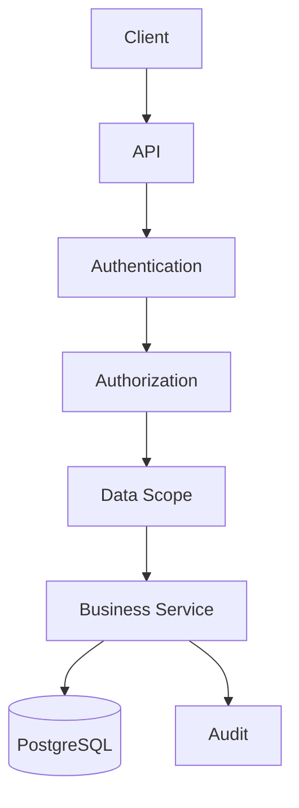

# MahaSkills Security, RBAC, Authentication & Data Flow Pipeline Master Prompt

You are a Principal Security Architect, IAM Architect, Backend Architect, Frontend Architect, Database Architect, and Distributed Systems Engineer.

Design and implement the complete:

RBAC + Authentication + Authorization + Organization Scoping + Data Access + Audit + Session + Data Flow Pipeline

for the MahaSkills platform.

The goal is NOT merely to create a login page.

The goal is to establish a secure end-to-end identity and data-access architecture connecting:

USER
↓
LOGIN
↓
AUTHENTICATION
↓
IDENTITY
↓
ORGANIZATION
↓
ROLE
↓
PERMISSIONS
↓
DATA SCOPE
↓
AUTHORIZATION
↓
API
↓
BUSINESS SERVICE
↓
DATABASE
↓
RESPONSE FILTERING
↓
AUDIT
↓
FRONTEND

The system must ensure that a user can access only the actions and data they are legitimately authorized to access.

============================================================
1. SOURCE OF TRUTH
============================================================

Before implementation, inspect:

- PRD.md
- appflow.md
- uiux.md
- backend architecture
- frontend architecture
- database schema
- API documentation
- existing authentication code
- existing user/organization models
- existing Playwright tests
- environment/configuration files

Extract:

- stakeholders
- roles
- permissions
- organizations
- organization hierarchy
- data ownership
- data visibility
- authentication requirements
- workflow permissions
- administrative permissions
- audit requirements
- security requirements

Do not invent major authorization rules if they already exist in the project documentation.

If there are conflicts:

1. identify the conflict
2. determine the authoritative source
3. document the decision
4. implement consistently

============================================================
2. SECURITY OBJECTIVE
============================================================

Design the system around:

AUTHENTICATION
=
“Who are you?”

AUTHORIZATION
=
“What are you allowed to do?”

DATA SCOPING
=
“What data are you allowed to see?”

ACTION AUTHORIZATION
=
“What operations are you allowed to perform on that data?”

AUDITING
=
“What did you do, when, and under which identity/context?”

Never treat frontend visibility as a security mechanism.

The backend must always enforce authorization.

============================================================
3. HIGH-LEVEL IDENTITY PIPELINE
============================================================

Implement this conceptual pipeline:

User
 ↓
Login Request
 ↓
Credential Validation
 ↓
Identity Verification
 ↓
Account Status Check
 ↓
Organization Resolution
 ↓
Role Resolution
 ↓
Permission Resolution
 ↓
Data Scope Resolution
 ↓
Authentication Token / Session
 ↓
Authenticated Request
 ↓
Authentication Middleware
 ↓
Authorization Middleware
 ↓
Data Scope Enforcement
 ↓
Business Logic
 ↓
Database Query
 ↓
Response Filtering
 ↓
Audit Event
 ↓
Frontend

Document and implement every step.

============================================================
4. AUTHENTICATION
============================================================

Implement a secure authentication flow.

Potential flow:

POST /api/v1/auth/login

Request
↓
Validate input
↓
Find user
↓
Verify password/hash
↓
Check account status
↓
Check organization membership
↓
Resolve authentication context
↓
Issue access token
↓
Issue refresh token
↓
Create session metadata
↓
Return authenticated context

Use the actual API architecture of the project.

Do not place authentication logic inside controllers.

Create a dedicated authentication service.

============================================================
5. CREDENTIAL SECURITY
============================================================

Use industry-standard password hashing.

Never:

- store plaintext passwords
- log passwords
- return password hashes
- expose authentication internals
- place secrets in frontend code

Use appropriate password policy.

Handle:

- invalid credentials
- locked account
- disabled account
- expired credentials if applicable
- suspicious/repeated attempts where required

Do not reveal whether a specific account exists when doing so would create account-enumeration risk.

============================================================
6. SESSION ARCHITECTURE
============================================================

Define clearly whether the application uses:

- JWT
- opaque session tokens
- access + refresh tokens
- secure cookies
- a hybrid model

Use the project's existing architecture where already established.

If JWT is used:

Access Token
+
Refresh Token

Define:

- expiration
- rotation
- revocation
- refresh behavior
- logout
- invalidation
- compromised-token handling

Do not make access tokens unnecessarily long-lived.

============================================================
7. AUTHENTICATION CONTEXT
============================================================

After login, resolve an AuthenticationContext.

Conceptually:

AuthenticationContext {

  userId
  organizationId
  organizationType
  roles[]
  permissions[]
  dataScopes[]
  sessionId
}

Do not blindly trust client-supplied role or organization information.

Resolve authoritative values server-side.

============================================================
8. RBAC MODEL
============================================================

Implement:

User
↓
UserRole
↓
Role
↓
RolePermission
↓
Permission

Use permissions as the lowest meaningful authorization unit.

Example:

ROLE_EMPLOYER

may contain:

JOB_READ
JOB_CREATE
JOB_UPDATE
JOB_PUBLISH
CANDIDATE_SEARCH
CANDIDATE_VIEW
MATCH_VIEW

Do not scatter role-string checks throughout the code.

Avoid:

if role == "ADMIN"

throughout controllers and services.

Prefer:

AuthorizationPolicy
PermissionEvaluator
SecurityService
or equivalent centralized mechanisms.

============================================================
9. PERMISSION MODEL
============================================================

Define permissions using:

RESOURCE + ACTION

Examples:

CANDIDATE_READ
CANDIDATE_CREATE
CANDIDATE_UPDATE
CANDIDATE_DELETE

JOB_READ
JOB_CREATE
JOB_UPDATE
JOB_PUBLISH

CURRICULUM_READ
CURRICULUM_UPDATE
CURRICULUM_APPROVE

TRAINING_READ
TRAINING_CREATE
TRAINING_UPDATE

PLACEMENT_READ
PLACEMENT_CREATE
PLACEMENT_UPDATE

REPORT_GENERATE
REPORT_VIEW

USER_MANAGE
ROLE_MANAGE
PERMISSION_MANAGE

The actual permission matrix must come from the PRD/project requirements.

============================================================
10. ROLE HIERARCHY
============================================================

Determine whether the project requires hierarchical roles.

Possible conceptual hierarchy:

Platform Administrator
    ↓
Organization Administrator
    ↓
Organization Manager
    ↓
Standard User

Do not implement inheritance unless the project requires it.

If hierarchy exists, document:

- inherited permissions
- overrides
- restrictions
- precedence rules

============================================================
11. ORGANIZATION SCOPING
============================================================

This is critical.

A user may have:

User
→ Organization
→ Role
→ Permissions
→ Data Scope

Example:

Employer A

can access:

Employer A's jobs
Employer A's hiring pipeline
Candidates that employer is authorized to view

but cannot automatically access:

Employer B's candidates
Employer B's jobs
Institution-private information

Authorization must therefore have TWO dimensions:

WHAT can the user do?

AND

WHERE / WHICH DATA can the user do it to?

============================================================
12. RBAC + DATA SCOPE
============================================================

Do NOT stop at:

ROLE → PERMISSION

Implement:

ROLE
+
PERMISSION
+
ORGANIZATION
+
RESOURCE OWNERSHIP
+
DATA SCOPE

Example:

Candidate:
candidateId = 123

Request:
GET /api/v1/candidates/123

System evaluates:

1. Is user authenticated?
2. Does user have CANDIDATE_READ?
3. Is candidate 123 visible to this organization?
4. Does the user have access to this specific candidate?
5. Are there field-level restrictions?
6. Return allowed representation.

============================================================
13. DATA-SCOPE TYPES
============================================================

Define which scope mechanisms the product requires.

Possible scopes:

GLOBAL
ORGANIZATION
SUB_ORGANIZATION
INSTITUTION
EMPLOYER
SELF
REGION
DISTRICT
PROJECT
RESOURCE_OWNER

Example:

GLOBAL
→ administrator/policy-level access

ORGANIZATION
→ organization's own records

SELF
→ only the user's own candidate profile

RESOURCE_OWNER
→ objects owned by the user's organization

DISTRICT
→ records within authorized geography

Only implement scopes required by the actual product.

============================================================
14. ATTRIBUTE-BASED CONDITIONS
============================================================

RBAC may not be sufficient for all decisions.

Where required support contextual authorization using attributes such as:

user.organizationId
resource.organizationId
user.region
resource.region
user.role
resource.ownerId
resource.status

Example:

Employer user
+
JOB_UPDATE
+
job.organizationId == user.organizationId
+
job.status != ARCHIVED

→ ALLOW

Otherwise:

→ DENY

Do not turn every rule into an attribute-based rule unnecessarily.

Use RBAC first, then scoped authorization when required.

============================================================
15. REQUEST AUTHORIZATION PIPELINE
============================================================

Every protected API request should conceptually follow:

HTTP Request
↓
Request ID
↓
Authentication
↓
Token/session validation
↓
User lookup/context
↓
Account status
↓
Organization context
↓
Role resolution
↓
Permission check
↓
Resource/data-scope check
↓
Business rule check
↓
Controller
↓
Service
↓
Repository
↓
Database
↓
Response
↓
Audit event where applicable

No important step should be bypassed casually.

============================================================
16. FRONTEND AUTH FLOW
============================================================

Implement:

Application Startup
↓
Check authentication state
↓
Validate session/token
↓
Fetch current user
↓
Fetch organization context
↓
Fetch roles/permissions
↓
Build client authorization state
↓
Render authorized navigation
↓
Protect routes
↓
Protect actions
↓
Call backend

Frontend permission checks are for UX only.

Backend checks remain authoritative.

============================================================
17. FRONTEND AUTH STATE
============================================================

Create a centralized authentication state.

Conceptually:

AuthState {

  status:
    loading
    authenticated
    unauthenticated

  user
  organization
  roles
  permissions
  scopes
  session
}

Avoid spreading authentication logic across components.

Provide reusable hooks/helpers such as:

useAuth()
useCurrentUser()
usePermissions()
useCan()
useOrganization()

Use actual project conventions where available.

============================================================
18. ROUTE AUTHORIZATION
============================================================

Define route-level authorization.

Example:

/admin/*
requires:
USER_MANAGE

/candidates/*
requires:
CANDIDATE_READ

/jobs/create
requires:
JOB_CREATE

/curriculum/approve
requires:
CURRICULUM_APPROVE

Do not rely only on route hiding.

Unauthorized deep links must still be rejected.

============================================================
19. COMPONENT AUTHORIZATION
============================================================

Build permission-aware UI primitives.

For example:

<Can permission="JOB_CREATE">
  <CreateJobButton />
</Can>

But remember:

This only controls the UI.

The API must independently enforce:

JOB_CREATE

============================================================
20. LOGIN → DASHBOARD FLOW
============================================================

Define the complete stakeholder flow.

Example:

User opens /login
↓
Select stakeholder if needed
↓
Enter credentials
↓
Submit
↓
Loading
↓
Authentication
↓
Resolve organization
↓
Resolve role
↓
Resolve permissions
↓
Resolve default dashboard
↓
Create authenticated client state
↓
Redirect
↓
Load dashboard data

If role/organization selection is required:

Login
↓
Account has multiple organizations
↓
Organization Selector
↓
Role Context
↓
Dashboard

============================================================
21. MULTI-ORGANIZATION USERS
============================================================

If users can belong to multiple organizations, support:

Login
→ Organization Selection
→ Active Organization Context
→ Role/Permissions
→ Data Scope

When organization context changes:

1. invalidate organization-scoped cached data
2. update authorization context
3. refresh navigation if necessary
4. refresh dashboard
5. prevent stale data from previous organization
6. create audit event if required

Never allow a frontend-only organization switch that changes access.

============================================================
22. LOGOUT FLOW
============================================================

Logout should:

- invalidate session/refresh token
- clear local authenticated state
- clear sensitive cached data
- clear organization context
- prevent accidental reuse
- redirect to login

If token revocation is implemented, define it explicitly.

============================================================
23. TOKEN REFRESH FLOW
============================================================

Define:

Access token valid
→ request succeeds

Access token expired
→ refresh token validation
→ rotate/issue new token
→ retry request safely

Refresh token invalid
→ clear authentication
→ redirect to login

Prevent infinite refresh loops.

============================================================
24. SESSION EXPIRY UX
============================================================

When the session expires:

Do not abruptly destroy the user's experience.

Use appropriate behavior:

Session expired
→ inform user
→ attempt refresh where valid
→ otherwise reauthenticate
→ preserve non-sensitive navigation context where possible

Do not preserve passwords or secrets.

============================================================
25. DATA QUERY AUTHORIZATION
============================================================

This is one of the most important requirements.

Do NOT implement:

SELECT * FROM candidates

and then filter unauthorized data in the frontend.

Instead enforce scope as close to the database query as practical.

Example:

organization_id = authenticatedOrganizationId

or equivalent policy.

The database/service query should return only authorized records.

============================================================
26. RESOURCE-LEVEL AUTHORIZATION
============================================================

For detail endpoints:

GET /candidates/{id}

GET /jobs/{id}

GET /curricula/{id}

GET /placements/{id}

Do NOT assume:

“User has READ permission, therefore they can read every record.”

Evaluate:

permission
+
resource scope
+
organization
+
ownership
+
business state

where applicable.

============================================================
27. FIELD-LEVEL AUTHORIZATION
============================================================

Some roles may have access to an entity but not every field.

Example:

Candidate profile may contain:

Public professional information
+
private personal information
+
internal assessment information

Different roles may see different representations.

Do not simply serialize the full entity.

Use role/scope-aware DTOs.

============================================================
28. WRITE AUTHORIZATION
============================================================

For:

POST
PUT
PATCH
DELETE

check:

1. authenticated?
2. correct permission?
3. correct organization?
4. allowed resource?
5. allowed state transition?
6. business rule satisfied?

Example:

JOB_PUBLISH

should not automatically mean:

“publish any job in the entire system.”

============================================================
29. STATE-BASED AUTHORIZATION
============================================================

Some permissions depend on object state.

Example:

Draft Job
→ editable

Published Job
→ limited edits

Closed Job
→ read-only

Archived Job
→ restricted

Define state + permission rules explicitly.

============================================================
30. ADMINISTRATIVE PRIVILEGES
============================================================

Treat highly privileged actions separately.

Examples:

- role management
- permission management
- organization management
- user deletion
- audit access
- data export
- system configuration

Consider additional safeguards where the product requires them:

- reauthentication
- confirmation
- audit log
- elevated role
- dual approval

Do not make “ADMIN” a magic bypass for everything without documenting it.

============================================================
31. AUDIT PIPELINE
============================================================

For security-sensitive actions:

User
↓
Authenticated Context
↓
Authorized Action
↓
Business Operation
↓
Audit Event

Audit event should contain, where appropriate:

actorId
organizationId
action
resourceType
resourceId
timestamp
requestId
oldState
newState
result

Never record:

- passwords
- access tokens
- refresh tokens
- secrets

============================================================
32. SECURITY EVENTS
============================================================

Track meaningful events such as:

LOGIN_SUCCESS
LOGIN_FAILURE
LOGOUT
TOKEN_REFRESH
SESSION_REVOKED
PASSWORD_CHANGED
ROLE_ASSIGNED
ROLE_REMOVED
PERMISSION_CHANGED
ORGANIZATION_CHANGED
ACCESS_DENIED
SENSITIVE_DATA_VIEWED
DATA_EXPORTED
ADMIN_ACTION

Only implement events required by the project.

============================================================
33. ACCESS DENIED FLOW
============================================================

Unauthorized request:

Request
↓
Authenticate
↓
Authorization check
↓
DENY

Return a controlled response.

Examples:

401
Unauthenticated

403
Authenticated but unauthorized

404
Resource intentionally hidden where appropriate to prevent disclosure

Do not leak internal security rules.

The frontend should translate these into appropriate UX.

============================================================
34. ERROR FLOW
============================================================

Handle separately:

Invalid credentials
Expired token
Invalid refresh token
Account disabled
Insufficient permission
Wrong organization
Resource out of scope
Resource deleted
Concurrent modification
Backend failure

Do not collapse all errors into:

“Something went wrong.”

============================================================
35. CACHE SECURITY
============================================================

This is critical.

Authorization-aware cache keys must include relevant scope.

Bad:

candidate:123

Potentially unsafe.

Better conceptual structure:

candidate:{organizationId}:{candidateId}

or equivalent based on the actual authorization model.

When organization context changes:

Invalidate organization-scoped cached queries.

Never serve cached data from another security context.

============================================================
36. DATABASE SECURITY
============================================================

Where appropriate, enforce protections at multiple layers.

Application layer:
Authorization policies

Service layer:
Business rules

Repository/query layer:
Data scope

Database:
Constraints / row-level security where justified

Do not rely on only one protection layer for highly sensitive datasets.

============================================================
37. DATA FLOW PIPELINE
============================================================

Create a canonical data pipeline.

Example:

USER INPUT
↓
Frontend Form
↓
Client Validation
↓
HTTPS
↓
API Gateway / Backend
↓
Authentication Middleware
↓
Authorization Middleware
↓
DTO Validation
↓
Application Service
↓
Domain Rules
↓
Repository
↓
PostgreSQL
↓
Domain Event
↓
Audit
↓
Cache Invalidation
↓
Notification / Async Job
↓
API Response
↓
Frontend State Update

Document which steps are synchronous and asynchronous.

============================================================
38. READ PIPELINE
============================================================

Standard read flow:

User
↓
Frontend
↓
GET API
↓
Authentication
↓
Permission
↓
Data Scope
↓
Authorized Query
↓
Database
↓
DTO Mapping
↓
Response Filtering
↓
Audit if required
↓
Frontend
↓
UI

============================================================
39. WRITE PIPELINE
============================================================

Standard write flow:

User
↓
Frontend
↓
POST/PATCH/DELETE
↓
Authentication
↓
Permission
↓
Organization Scope
↓
Validation
↓
Business Rules
↓
Transaction
↓
Database
↓
Audit
↓
Domain Event
↓
Cache Invalidation
↓
Notification / Async Job
↓
Response
↓
Frontend Update

============================================================
40. ASYNC DATA FLOW
============================================================

For asynchronous tasks:

User
↓
API
↓
Authorization
↓
Create Job
↓
Queue
↓
Worker
↓
Processing
↓
Database / ML / External Service
↓
Result
↓
Status Update
↓
Notification
↓
Frontend Refresh

Implement idempotency and retry behavior where necessary.

============================================================
41. ML / AI AUTHORIZATION
============================================================

ML services must NOT independently decide who may access data.

Java/backend authorization should happen BEFORE sending data to an ML service.

Correct:

User
↓
Authorization
↓
Data Scope
↓
Prepare permitted data
↓
ML Service

Not:

User
↓
ML Service
↓
ML decides access

The ML service should receive only the minimum permitted data.

============================================================
42. DATA MINIMIZATION
============================================================

For every downstream service ask:

“What is the minimum data this service needs?”

Do not send entire candidate records to a service that only needs skill information.

Example:

Candidate record
→ Authorization
→ Skill subset
→ ML service

rather than:

Candidate record
→ Entire PII profile
→ ML service

============================================================
43. PII PIPELINE
============================================================

Identify sensitive fields.

Define:

- who can read them
- who can edit them
- where they are stored
- whether they can be exported
- whether they can be sent to external services
- whether they should appear in logs

Never expose PII through broad response DTOs.

============================================================
44. EXPORT AUTHORIZATION
============================================================

Treat exports as sensitive operations.

Before allowing:

CSV
PDF
Excel
Bulk API
Reports

check:

- export permission
- organization scope
- record scope
- field visibility
- volume limits
- audit

Log export events where appropriate.

============================================================
45. API GATEWAY / REVERSE PROXY
============================================================

If the architecture includes a gateway/reverse proxy:

Document:

Client
↓
Gateway
↓
Authentication propagation
↓
Backend services

Ensure the backend remains capable of enforcing authorization independently.

Do not blindly trust headers such as:

X-User-Role
X-Organization-Id

unless they are securely established by trusted infrastructure.

============================================================
46. RATE LIMITING
============================================================

Apply appropriate protection to:

- login
- password reset
- token refresh
- sensitive endpoints
- bulk exports

Do not apply one arbitrary rate limit to every endpoint.

Document expected behavior when limits are exceeded.

============================================================
47. FRONTEND DATA CACHE
============================================================

The frontend must avoid retaining data longer than necessary.

When:

- logout
- organization switch
- role change
- permission change
- session expiration

occurs:

invalidate sensitive authorization-dependent cached queries.

Prevent stale restricted information from remaining visible.

============================================================
48. PLAYWRIGHT AUTH TESTING
============================================================

Use Playwright to verify real authentication and authorization flows.

Create tests for:

1. Login success
2. Login failure
3. Logout
4. Session expiry
5. Token refresh
6. Role-based dashboard
7. Unauthorized route
8. Unauthorized action
9. Organization switching
10. Organization data isolation
11. Candidate access rules
12. Employer access rules
13. Institution access rules
14. Administrator access
15. Data export permission
16. Permission-denied UX
17. Direct URL authorization
18. Mobile authentication flow
19. Theme persistence if authentication UI includes theme
20. Cache invalidation after logout

Do NOT merely test that buttons disappear.

Test actual unauthorized requests.

============================================================
49. SECURITY TEST MATRIX
============================================================

Create a matrix:

| Actor | Resource | Action | Same Org | Other Org | Expected |
|------|----------|--------|----------|-----------|----------|

Examples:

Employer A
Job A
UPDATE
→ ALLOW

Employer A
Job B
UPDATE
→ DENY

Candidate A
Candidate A
UPDATE PROFILE
→ ALLOW

Candidate A
Candidate B
UPDATE
→ DENY

Institution A
Institution B data
READ
→ DENY

Administrator
Global report
READ
→ according to configured permission

Use actual project rules.

============================================================
50. RBAC MATRIX
============================================================

Create:

| Role | Permission | Resource | Scope | Create | Read | Update | Delete | Approve | Export |

Populate it from the actual PRD.

Do not arbitrarily grant:

ADMIN = everything

without explicitly documenting the policy.

============================================================
51. DATA FLOW MATRIX
============================================================

Create:

| Source | Data | Consumer | Authorization | Transformation | Storage | Output |

Examples:

Candidate
→ Skills
→ Matching Engine
→ Candidate + Job Scope
→ Skill Features
→ Match Result
→ Recommendation

Employer
→ Job
→ Matching Engine
→ Employer Scope
→ Job Features
→ Match Result

Labour Dataset
→ Skill Demand
→ Analytics
→ Trusted Ingestion Role
→ Normalization
→ PostgreSQL
→ Dashboard

============================================================
52. SECURITY BOUNDARY DIAGRAMS
============================================================

Use Mermaid diagrams.

At minimum create:

1. Authentication architecture
2. Authorization architecture
3. Request pipeline
4. Data-read pipeline
5. Data-write pipeline
6. Organization isolation
7. ML data boundary
8. Audit pipeline

Example:

